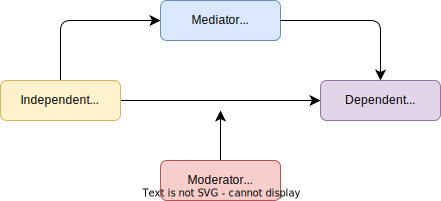
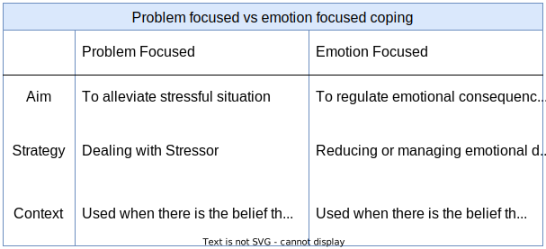

```{r setup, include=FALSE}
knitr::opts_chunk$set(echo=FALSE)
library(jmv)
library(kableExtra)
```

### Week 1: What Is Health? {.well .tabset .tabset-fade .tabset-pills}

#### Topic 1

##### Explain key perspectives on health, illness and disability, including the biomedical and biopsychosocial models.

Health is a term that has held different meanings for different cultures, people, times in history, social classes and members of the same family. The linguistic root of the word "Health" can be loosely translated to mean "wholeness" in Anglo Saxon, suggesting an emphasis on both physical and mental aspects.

**Mind-body relationships**

-   Stone Age: focus on <a href="https://www-sciencedirect-com.ezproxy-f.deakin.edu.au/topics/medicine-and-dentistry/trephination">trephination</a>, where evil spirits are given an outlet from the body by making small holes in the skull to alleviate illness.
-   Ancient Greece: Good health is attributed to the balance of bodily fluids or "humours":
  - Yellow bile (summer / hot-dry)
  - phlegm (winter / cold-wet)
  - blood (spring / wet-hot)
  - black bile (autumn / dry-cold)
    
Hippocrates considered the mind and body as one unit attributing an imbalance of the levels of humours in the body to illness.
      
- Yellow bile (choleric / angry temperament)
- phlegm (calm / phlegmatic)
- blood (optimistic / sanguine)
- black bile (sadness / melancholic)
      
Healing involved the balance of these fluids through bleeding, starvation, or diet/medicines, and the moderation of illness through balance of body and mind.
    
- Ancient Rome: Galen also believed these fluids formed the basis of physical and pathological health, linking the mind and body through temperament and susceptibility to specific disease. For example: black bile $\rightarrow$ melancholic $\rightarrow$ breast cancer.

- Middle Ages: Health in this era was attributed to spirituality, with illness seen as punishment for misdeeds, or resulting from evil spirits entering the soul. Priests were perceived to be in control of people's health, rather than the individual, having the ability to drive out demons / illness.

- Renaissance: The advent of scholastic and scientific discovery driving a more sophisticated understanding of physiology with little to no exploration of psychological understanding.

- 17th Century: saw the advent of <abbr title="mind and body were considered separate entities having little to no relationship with each other">dualism</abbr>. The body was viewed as a machine (investigated by physicians), with material purpose and functions that comprised of the brain, heart and cells. The mind was seen as non-material (investigated by theologians), and was comprised of thoughts and feelings, which were considered unable to be investigated and understood. Autopsy was deemed acceptable by the church as the soul had left the body after death, opening he way for anatomical research and medical understanding. This period is further characterised by the <abbr title="views of the body as a machine, with illness understood as a response to biological and physiological processes">mechanistic</abbr> viewpoint due to the growth in understanding of knowledge of cells rather than the humours.

**Biomedical model of illness (Reductionism / Dualism)**

- Assumes that all illness is a result of an underlying physical cause, curable through medical intervention.
- Removal of the underlying cause will restore health as a result of medical intervention.
- Assumes that mind, body and behaviour can all be explained through cell, neural and biochemical activity.
- Ignores the differences of individuals in reacting to disease through the influence of personality, cognition, social support or cultural beliefs.
- Indigenous Australian cultures generally attribute the cause of illness as a resultof social and spiritual dysfunction (i.e. - not meeting one's obligations to society or land).

**Biopsychosocial models of health and illness**

- Recognises the connection of the objective and subjective, or the relationship between underlying organic causes of disease and the individual responses determined by the mind. Examples of this connection includes such things as the placebo effect, and phantom limb pain in amputees.

>biopsychsocial model $=$ biomedical \ model $+$ social, cultural \ and \ psychological \ factors

**Challenging Dualism: Psychosocial Models of Health & Illness**

- The discovery and exploration of the Biopsychosocial Model weakened the Descartian theory of dualism
- The Biopsychosocial model reinforced the theories of Freud in his exploration of the conscious and unconscious mind concepts.
- Freud's theories leading to the development of psychosomatic medicine.
- Mind $\Leftrightarrow$ Body relationships
- The biopsychosocial model offers a multivariate and comprehensive model to explain illness and its effects on us.

#### Topic 2

##### Classify factors that influence health status.

Rene Dubos (1968) defined wellness as:

> "A quality of life, involving social, emotional, mental, spiritual and biological fitness on the part of the individual, which result from adaptations to the environment"

The concept of wellness later extended Dubos' definition of health and the continuum beyond the neutral point.


<details>
<symmary>**Physical**</summary>
- Size and shape of our bodies
- Responsive and acuteness of senses
- Functional through sleep and rest
- Ability to heal from, manage or avoid injuries
- <abbr title="fundamental skills typically needed to manage basic physical needs, comprised the following areas: grooming/personal hygiene, dressing, toileting/continence, transferring/ambulating, and eating">Activities of Daily Living (ADLs)</abbr>
</details>
<details>
<summary>**Social**</summary>
- Maintain satisfying relationships
- Successful communication
- Adapting to various social situations
- Ability to give/receive love
</details>
<details>
<summary>**Intellectual**</summary>
- Think clearly
- Reason objectively
- Analyse critically
- Effective use of brain power
- Learning from mistakes and successes
- Making sound decisions
- Having a healthy curiosity about life
</details>
<details>
<summary>**Emotional**</summary>
- Express or control emotions as necessary
- Self esteem, trust, love, self-confidence
</details>
<details>
<summary>**Spiritual**</summary>
- Creating/expressing meaning and purpose in life
- Religious rules and customs
- Being part of a system greater than the self
- Value in life's experiences
- Respect all living things
</details>
<details>
<summary>**Environmental**</summary>
- Understanding the health effects of our environment
- Protecting yourself from environmental hazards
- Preserve / Protect / Improve our environment
</details>        
Achieving an optimal level of wellbeing is subjectively relevant to the individual considering their circumstances (such as disability) and balance.


##### What Influences Your Health?

<abbr title="The range of personal, social, economic and environmental factors that influence our health">Determinants of Health</abbr>: family habits, genetics, local amenities, local environment and societal behaviours.

<abbr title="Differences in the incidence, prevalence, mortality and burden of diseases and other health conditions among specific population groups">Health Disparities</abbr>: racial or ethnic background, sex and gender, income and education, health insurance status, geographic location, sexual orientation, and disability.

<details>
<summary>**Individual Behaviour**
-   help attain, maintain or regain good health OR undermine health and promote disease
-   Modifiable determinants are responsible for 7 out of 10 deaths in the U.S.
-   The 4 primary modifiable determinants of health responsible for chronic disease are:
  -   Physical Activity
  -   Nutrition
  -   Excessive Alcohol Consumption
  -   Tobacco use
-   Other modifiable behaviours impacting health and chronic disease are: use of prescription drugs, stress levels, exposure to toxic chemicals at work and at home, over the counter medications, sexual behaviours and contraceptives, sleep habits and simple infection control measures.
</details>
<details>
<summary>**Biology and Genetics**</summary>
- Biology and genetics are considered **non-modifiable determinants of health**
- Include genetic diseases or predispositions to certain conditions that are linked to multiple gene variants as well as environmental factors.
- **Epigenetics** is a field of study that looks at the influence our diet, physical activity and behavioural choices might have on our ability to influence genetic predispositions.
- These determinants also include our age, gender, race, ethnicity, metabolic rate and body structure.
- Our own histories of illness and injury.
</details>
<details>
<summary>**Social Factors**</summary>
- Economic Factors
- Access to quality education
- Access to quality of housing / accommodation.
- Ability to pay for adequate food, clothes, heat, medications, transport, counselling, etc.
- The Built Environment
  - Buildings, roads, electricity, recreation areas, telecommunications, etc.
- Pollutants and Infectious Agents
  - Air, land, food, water quality.
</details>
<details>
<summary>**Policy Making**</summary>
- Government interventions promoting community health
- Vaccinations, smoking bans, bike helmets, mobile phone use while driving.
- Access to high quality, low cost healthcare (Medicare)
</details>
<details>
<summary>**Behaviour and Health**</summary>
- Advances and study of medicine and health have lead to increased longevity in Western cultures from 55 years in 1900 to 80.3 (male) and 85.2 (female) in 2014.
- Indigenous Australian life expectancy is around 10 years lower, generally as a result of lifestyle and diet.
- Deaths 100 years ago were primarily influenced by disease and infection, while currently are mostly attributed to lifestyle behaviours and habits.
- The <abbr title="Refers to the number of new cases of a particular disease in a given period of time">incidence</abbr> of deaths through these behavioural contingencies is slowly diminishing as a result of public health campaigns and education.
- The incidence of diabetes, however, has nearly doubled since 1981, growing faster than any other cause.
- The <abbr title="The number of established cases of a particular disease within the population at a given time.">prevalence</abbr> of HIV/AIDS and other diseases have dropped as a result of improved diagnosis/treatment methods.
- Doctors were once considered advisors to the wealthy in moderating health behaviours, as well as our "fitness to work".
- The unintended harm of some Western treatments has also given rise to the popularity of alternate treatment/medicines.
</details>
<details>
<summary>**Cross-cultural Perspectives on Health**</summary>
-   What is considered to be ‘normal’ (health belief systems, health attributions and health practices) varies across cultures and is a result of the economic, political and cultural climate of the era in which a person lives.
-   The stigma associated with some illnesses in South Asian regions can effect the families social standing, or a sibling's suitability for marriage.
-   Excessive alcohol consumption and abuse is no longer seen as a deviant behaviour, but an illness requiring treatment
-   Smoking is no longer seen as glamorous or desirable.
-   Western cultures tend to have allocated professionals who look after the mind, body and soul, whereas some Indigenous Australian and Eastern cultures have a more holistic view of all facets of our lives.
-   Some sections of Indian culture view illness as punishment for past sins, having profound effect on the ability to care for these individuals and arrange appropriate treatments
-   This <abbr title="Cultural philosophy that emphasises the individual as part of a wider unit and places emphasis on actions motivated by collective, rather than individual, needs and wants">collectivist</abbr> approach to staying healthy and avoiding illness is far different from our <abbr title="cultural philosophy that places
responsibility at the feet of the individual; thus behaviour is often driven by individual needs and wants rather than by community needs or wants.">individualistic</abbr> approach to health (consider how long the passive smoking evidence was ignored).
</details>

#### Topic 3

##### Describe the influence of life stage, culture and health status on health.

**Developmental Theories**

The developmental process is a function of the interaction between three factors:
1.   Learning: a relatively permanent change in knowledge, skill or ability as a result of experience; 
2.   Experience: what we do, see, hear, feel, think; 
3.   Maturation: thought, behaviour or physical growth, attributed to a genetically determined sequence of development and ageing rather than to experience.

**Erikson**

Erik Erikson described eight major life stages which varied across different dimensions, including:

-   cognitive and intellectual functioning
-   language and communication skills
-   the understanding of illness
-   healthcare and maintenance behaviour.

Individual perceptions of health or illness may differ depending on the developmental stage of the individual and their specific needs. The ability of the individual (in the case of children, for example) to have their basic needs met can also be impaired as a result of age, accident, or illness.

**Piaget**

Piaget proposed a staged structure to which, he considered, all individuals follow in sequence as below:

1.   **Sensorimotor** (birth–2 years): an infant understands the world through sensations and movement, but lacks symbolic thought and moves from reflexive to voluntary action.
egocentric
2.   **Pre-operational** (2–7 years): symbolic thought develops by around age 2, thereafter simple logical thinking and language develop, generally <abbr title="self-centred, such as in the pre-operational stage (age 2–7 years) of children, when they see things only from their own perspective">egocentric</abbr>.
3.   **Concrete operational** (7–11 years): abstract thought and logic develop hugely; can perform mental operations (e.g. mental arithmetic) and manipulate objects.
4.   **Formal operational** (age 12 to adulthood): abstract thought and imagination develop as does deductive reasoning. Not everyone may attain this level.

**Sensorimotor and Pre-Operational Stage Children**

- Possessing an undeveloped ability to empathise with others who are unwell
- Inability to understand their effect on the world around them through imitation and learning
- Illness and health is considered black and white (no in between)

Under-7s generally explain illness on a ‘magical’ level, with explanations based on association:

- **Incomprehension**: child gives irrelevant answers or evades the question (e.g. sun causes heart attacks).
- **Phenomenonism**: illness is usually a sign or sound that the child has at some time associated with the illness, but with little grasp of cause and effect (e.g. a cold is when you sniff a lot).
- **Contagion**: illness is usually from a person or object that is close by, but not necessarily touching the child; or it can be attributed to an activity that occurred before the illness (e.g.: ‘You get measles from people’. If asked how? ‘Just by walking near them’).

**Concrete Operational Stage Children**

Children over 7 are described by Piaget as capable of thinking logically about objects and events, although they are still unable to distinguish between mind and body until around age 11, when adolescence begins.

The concept of illness at around 8 to 11 years is more concrete and based on a causal sequence:

- **Contamination**: children at this stage understand that illness can have multiple symptoms, and they recognise that germs, or even their own behaviour, can cause illness (e.g. ‘You get a cold if you get sneezed on, and it gets into your body’).
- **Internalisation**: illness is within the body, and the process by which symptoms occur can be partially understood. The cause of a cold may come from outside germs that are inhaled or swallowed and then enter the bloodstream. These children can differentiate between body organs and function and can understand specific, simple information about their illness. They can also see the role of treatment and/or personal action as returning them to health.
- Medical staff are still seen as having absolute authority, but their actions might be criticised/avoided (e.g. reluctance to give blood, accusations of hurting unnecessarily, etc. may appear as children can now begin to weigh up the pros and cons of actions).
- Children can be encouraged to take some personal control over their illness or treatment at this stage in development which can help the child to cope.
- They also need to be encouraged to express their fears.
- Parents need to strike a balance between monitoring a sick child’s health and behaviour and being overprotective, as this can detrimentally affect a child’s social, cognitive and personal development and may encourage feelings of dependency and disability.

**Adolescence and formal operational thought**

During early adolescence (11–13 years), as individuals prepare for increased autonomy, independence and peers take on more credence than parents, much of life’s health-damaging behaviour commences (e.g. smoking).

Illness concepts at this stage are condsidered as being at an abstract level, based on interactions between the person and their environment:

- **Physiological**: children now reach a stage of physiological understanding where most can define illness in terms of specific bodily organs or functions (e.g. germs cause white blood cells to become active to try and fight them), and begin to appreciate multiple physical causes (e.g. genes plus pollution plus behaviour).
- **Psychophysiological**: in later adolescence (from around 14 years) and in adulthood, many people grasp the idea that the mind and body interact, and understand or accept the role of stress, worry and so on, in the exacerbation and even the cause of illness. However, many people of all ages fail to achieve this level of understanding about illness and continue to use more cognitively simplistic explanations.

**Adulthood 17∕18+**

- Early adulthood blends out of adolescence as the person forges their identity and assumes the roles and responsibility of adulthood—a time of consolidation.
- Adults are less likely than adolescents to adopt new health-risk behaviour and are generally more likely to engage in protective behaviour.
- Marriage was found to benefit health in men, that is they have lower illness scores than men living alone—whereas for women, such results are not comprehensive.
- While early adulthood is generally viewed positively, middle age has been identified as a period of doubts and anxiety, reappraisal and change.

**Ageing and health**

- The United Nations Secretariat (2002) has predicted an increase in those aged over 60 from 10% of the world population to 20% by 2050
- Not all elderly people are ill or infirm, but even among the minority who go on without chronic health problems (physical and/or mental), episodes of acute illness are commonplace.
- Empirical research has shown that <abbr title="conscious thoughts and beliefs about yourself that allow you to feel you are distinct from others and that you exist as a separate person.">self-concept</abbr> is relatively stable through ageing and that changes in self-concept are not an inevitable part of the ageing process.

**Successful ageing**

1.   **Biomedical model**: based on physical and psychiatric functioning, diagnoses and functional ability.
2.   **Broader biomedical model**: as above but includes social engagement and activity.
3.   **Social functioning model**: based on the nature and frequency of social functioning and networks, social support accessed.
4.   **Psychological resources model**: based on personal characteristics of optimism and self-efficacy and on sense of purpose, coping and problem-solving, self-confidence and self-worth.
5.   **Lay model**: based on the above variables plus socioeconomic variables of income and ‘perceived social capital’, which included access to resources and facilities, environmental quality and problems (e.g. crime, traffic, pollution, places to walk, feelings of safety).

**Conclusion**

-   Although each model could independently predict <abbr title="Quality of Life">QoL</abbr>, the strongest prediction was achieved by the lay model.
-   Such findings highlight the importance of multidimensional models of health in that medical or psychological or social variables are all important, but a more holistic model is ‘better’.

#### Topic 4

##### Identify a range of important influences on the domains of health.

Baumann (1961) conducted a study on meaning of being healthy amongst a group of people who had been diagnosed with quite serious illness, gave three types of response:

-   <abbr title="being">feeling (a general sense of wellbeing)</abbr>
-   <abbr title="having">symptom orientation (the absence of symptoms and disease)</abbr>
-   <abbr title="doing">performance (being able to do the things we are able to do when physically fit)</abbr>

-   Our current health status influences our subjective belief of healthy:
      -   Elderly people view their subjective health in terms of physical function and the ability to perform ADLs (doing)
      -   Those in good health tend to express more positive indicators or about health, such as being able to exercise, or being happy) (feelings)
      -   Those in poor health reflect on symptoms and indicators of poor health (having)
      
The Health & Lifestyles Survey (1993) further identified a broader range of characteristics linked to health as follows:

-   Asked participants to reflect on their own health and that of someone else,
-   A small group of young males were unable to describe what it meant to be healthy
-   A smaller group of older women were unable to recall what it felt like to be healthy
-   Identified the following general categories:
      -   Health as not ill (no symptoms, no visits to the doctor)
      -   Health as reserve (having come from a strong family, recovering quickly from illness or surgery)
      -   Health as Physical fitness and vitality (usually applied to observations of others, young men 'feeling fit', young women 'feeling full of vitality')
      -   Health as Psychosocial wellbeing (a person's overall mental state)
      -   Health as function (the ability to fulfill one's normal social roles)
      

### Week 2: Health Behaviour Change {.well .tabset .tabset-fade .tabset-pills}

#### What Is Health Behaviour?

> 'Any activity undertaken by a person believing themselves to be healthy for the purposes of preventing disease, or detecting it at an asymptomatic stage'

-   Definition by Kasl & Cobb (1966) did not account for exercise, weight control, appearance, or maintaining social contacts.
-   Engaging in health behaviours may still prevent disease

> '...behaviour performed by an individual regardless of his/her perceived health status, with the purpose of protecting, promoting, or maintaining his/her health.'

-   Definition by Harris & Guten (1979) includes the behaviours of unhealthy people, such as a person with heart disease exercising to prevent progression of the disease.

**Behavioural Pathogens**: A behavioural practise considered damaging to our health (e.g. smoking).
**Behavioural Immunogen**: A health protective behavioural practise such as exercise.

-   The development of medical understanding has changed our perspectives on health behaviour (e.g. smoking, drinking, exercise, sun exposure)
-   A longitudinal study conducted from 1963 - 1999 has determined the key behavioural factors associated with longevity:
      -   Sleeping 7 - 8 hours a night
      -   Not Smoking
      -   Consuming 1 - 2 alcoholic drinks per week (or less)
      -   Regular Exercise
      -   Not eating between meals
      -   Eating Breakfast
      -   Being no more than 10% overweight.
-   Men and women performing 6 out of the 7 of these behaviours, live an additional 7 and 11 years respectively than those performing less than 6.
-   Not snacking or not eating breakfast was later shown to have no bearing on longevity.
-   To truly understand health behaviours, we also need to understand the psychological and social factors contributing to the adoption or avoidance of health behaviours.

#### Distal Influences on Health Behaviour

-   Distal (away from the body) influences on behaviour (such as culture, environment, ethnicity, socioeconomic status, age, gender and personality) indirectly impact our health behaviours through proximal factors (beliefs, attitudes and goals).



##### Demographic Influences

-   Highest amount of heath behaviour change evident in late teens, early adulthood where we take on the habits of peers (as well as siblings) rather than parents or other adults.
-   Markers if higher risk taking, taking up smoking or drinking, and initiating 'risk' behaviours.
-   Gender can also be a marker of particular health risks or benefits (such as men avoiding seeing their doctor), with men more likely to engage in health risk behaviours than women.
-   Exercise can be a demonstration of increased health promoting behaviours, which can also serve as a way of mitigating the negative judgements of other men while not drinking as much.
-   The topic of men's health continues to be a point of concern over the general absence of support from medical health professionals in encouraging and supporting men in seeking assistance.

##### Personality

**Eyesenck's three factor model**

- **Extroversion**: outgoing, social nature
- **Neuroticism**: anxious, worried, guilt-ridden nature
- **Psychoticism**: egocentric, aggressive, antisocial

**McCrae and Costa's Big 5**

- Openness
- Conscientiousness
- Extroversion
- Agreeableness
- Neuroticism

-   4 of the 5 (except for conscientiousness) personality traits have been validated within different cultures and at different points in the lifespan from age 14 to 50+
-   Health risk taking behaviour has been observed as high in those who test high in extroversion, neuroticism and openness.
-   Health promoting factors are evident in those scoring high on the agreeable and conscientiousness scales.
-   High levels of neuroticism have also been linked to greater use of healthcare. Highly neurotic individuals are more likely to pay greater attention to bodily sensations.

**Other aspects of Personality**

- Locus of Control (LoC)
  - **Internal**: placing responsibility of outcomes on themselves, and consider that their actions effect outcomes.
  - **External**: place responsibility of outcomes on external factors such as luck.
  - A multidimensional health locus of control which identifies three independent dimensions:
  - **Internal**: Strong internal beliefs in which the individual considers themselves as the primary determinant of their health state. Often associated with high levels of health protective behaviours and self-efficacy (Bandura)
  - **External**: Heavily reliant on luck, fate or chance as a health determinant, rather than own behaviour.
  - **Powerful Others**: consider the actions of health professionals to be strong determinants of our own health status.

##### Self Determination Theory

##### Social Influences

##### Goals and self-regulation of Behaviour

#### What factors influence behaviour change?

##### Predisposing Factors
##### Enabling Factors
##### Reinforcing Factors

#### Models of Health Behaviour.

##### Attitudes
##### Practical Strategies: Building Self-Efficacy
##### Risk Perceptions and Unrealistic Optimism
##### Self-Efficacy

#### Sociocognitive models of behaviour change

##### Social Cognitive Theory
##### The Health Belief Model

#### Stage models of behaviour change

##### The Transtheoretical Model (TTM)
##### Issues: How the wording and ordering of questions may influence data obtained.

#### How can you improve your health behaviours?

##### Step 1: Increase your awareness
##### Step 2: Contemplate Change
##### TECH & HEALTH: Surfing for the latest in health
##### Step 3: Prepare for Change
##### Step 4: Take action to change
##### SKILLS FOR BEHAVIOR CHANGE
##### Let's get started!

### Week 3: Stress {.well .tabset .tabset-fade .tabset-pills}

#### Topic 1

##### Define stress and examine the psychological and physiological changes associated with it.

- **Stress** is a mental/physiological response or adaptation to a real or perceived threat to one’s wellbeing.
- Responses can consist of:
    - Tension
    - Discomfort
    - Physical Symptoms
- **Stressor:** a physical, social, or psychological event that upsets homeostasis or strains one’s ability to cope effectively.
- **Homeostasis:** the sustained balance or equilibrium of our nervous system.
- **Trauma:** a severe stressor that can lead to long-term psychological health consequences.
- Numerous factors influence the way an individual perceives and response to a stressful situation, although it is largely subjective.

#### Topic 2

##### Examine the key stress theories.

**Three Approaches to Research on Stress:**

<details>
<summary>**Stressors as stimuli**</summary>
- Stress can be categorised as:
  - Stress that most people find dangerous or unpredictable, and
  - Which people my find these situations more or less stressful. (i.e. A uni student finding a relationship break up more stressful than an older adult).
- Victims of natural disasters and collective trauma that pushes them apart (Black Saturday).
- These types of events can also bring communities together.
</details>
<details>
<summary>**Stress as a Response**</summary>
- The study of <abbr title="Depression, hopelessness and hostility">physical</abbr> and <abbr title="heart rate, blood pressure and the release of stress hormones called corticosteroids">psychological</abbr> responses to a stressful situation.
- Exposure to particular stimuli in order to measure an individual's response.
- *Corticosteroids* activate the body and prepare us for stressful situations
</details>
<details>
<summary>**Stress as a Transaction**</summary>
- Stress is a subjective experience where some may see a relationship break up as devastating, while others look on it as an opportunity to start afresh.
- Our response to stressful events under this paradigm can be viewed differently based on our appraisal.
- *Primary Appraisal* involves deciding whether or not a situation is dangerous or harmful.
- *Secondary Appraisal* involves our review of a situation to determine how well we can cope with it.
- *Problem focused coping* involves a logical review of a situation to optimistically look at a resolution.
- *Emotion-focused coping* involves situations that we are unable to avoid or control.
</details>

#### Topic 3

##### Examine the physical health risks associated with chronic stress.

**Health Impacts of Stress**

- Increased risk of cardiovascular disease (CVD)
  - Increased risk of heart arrhythmias, high blood pressure, hardening of arteries, inflammation in blood vessels, atherosclerosis
- Increased weight
  - Higher cortisol levels in blood leads to increased hunger and fat-storing enzymes.
  - Stress related behaviours: comfort food, less stressful activities (exercise/cooking)
- Hair loss
  - Telogen effluvium: trauma causes hair follicles to shut down (usually temporarily)
  - Alopecia areata: stress triggers white blood cells to attack and destroy hair follicles (can be permanent)
- Diabetes
  - Cortisol may affect blood glucose levels
  - Stress is linked with behavioural risk factors (e.g., diet and exercise).
- Impaired cognitive functioning
  - Thought to be due to glucocorticoids (stress hormones)
- Memory
  - Glucocorticoids may cause hippocampus shrinkage
  - Prolonged exposure may increase risk of developing Alzheimer's disease.
  - Decision-making skills
  - Concentration
- Impaired psychological functioning
  - Prolonged stress can contribute to:
    - Depression (bi-directional)
    - Over-stimulated amygdala (Potential for increase in violent behaviour).

#### Topic 4

##### Examine the intellectual and psychological effects of stress and their impact on health.


#### Topic 5

##### Explore stress management and stress reduction strategies

<details>
<summary>**Problem Focused Strategies**</summary>


</details>
<details>
<summary>**Emotion Focused Strategies**</summary>


</details>
<details>
<summary>**Comparing the Strategies**</summary>



</details>

### Week 4: Addiction {.well .tabset .tabset-fade .tabset-pills}

#### Topic 1

##### Define addiction, identify the signs of addiction, and describe the impact of addiction on friends and family.

<details>
<summary>**Define Addiction**</summary>
- *Addiction* can be defined as the ongoing interaction with a harmful substance or activity, regardless of the ongoing negative effects.
- The APA classifies addiction as a mental disorder.
- Substances or behaviours are considered to be addictive if they have the potential to induce euphoria, mood changes, a reduction in anxiety or reduce pain.
- People with a *physiological dependence* on a substance or behaviour experience greater *tolerance* through ongoing use/exposure, and *withdrawal* in attempting to cease use.
- A *Psychological dependence* can develop with respect to behaviours such as gambling, sex and working. These are said to create a change at the cellular level, along with mood changes.
- All forms of addiction are considered to effect dysfunction of certain biochemical systems in the brain at the synaptic level.
</details>
<details>
<summary>**Signs of Addiction**</summary>
- While our brains are wired to respond to reinforcing behaviours (as well as moderating these) for sustaining our lives, addiction is identified through characteristics that might highlight our inability to moderate:
  - **Compulsion:** An overwhelming compulsion to engage in a behaviour.
  - **Loss of Control:** An inability to predict the harm or benefit of an isolated behaviour.
  - **Negative Consequences:** Physical damage, legal/financial trouble, academic failure or family estrangement.
  - **Denial:** The inability to recognise harm/s caused.
  - **Inability to abstain:** 
- These characteristics are present regardless of whether the addiction is substance or behaviour related.
- A common concept of addiction known as *nurturing through avoidance* is the need to avoid unpleasant feelings or situations through the use of substances or behaviours.
- This maladaptive coping mechanism increasingly damages our bodies and/or relationships to the point where escape becomes a "safe" option.
- *Harmful use* relates to the physical damage (disease) or mental (mood disorders) caused by a substance or behaviour.
- *Dependence Syndrome* refers to a cluster of physiological, behavioural and cognitive phenomena in which the use of a substance takes on a much higher priority for a given individual than other behaviours that once had greater value. Dependence can be both physiological (tolerance and/or withdrawal) and psychological (impaired control over use).
</details>
<details>
<summary>**Impact on Family and Friends**</summary>
- Family members of an addict can often enter into a *codependent* relationship, where they put their own needs aside to aid the addict, operating in crisis mode, unable to set emotional boundaries between themselves and the addicted family member. Therapists often attempt to highlight this relationship to clients as part of treatment.
- *Enablers* unconsciously protect a family member from the consequences of their behaviour and prevent them from seeing the effects of their behaviour. 
</details>

#### Topic 2

##### Describe types of process addictions, such as gambling disorder, exercise addiction, technology addictions, and compulsive buying disorder.

*Process addictions* are behaviours (as opposed to substances) that are known to be addictive as they are mood altering.

<details>
<summary>**Gambling Disorder**</summary>
- Characteristic behaviours include a preoccupation with gambling, unsuccessful efforts to cut back or quit, gambling when feeling distressed, and lying to family members to conceal the extent of gambling.
- A gambling addiction typically progresses through four phases:
  1. The winning phase often begins with a large win, which reinforces the excitement and reward associated with gambling. The gambler begins to feel as though he or she cannot lose.
  2. In the losing phase, gamblers become preoccupied with gambling, trying to win back what they have lost. This often interferes with work and family life.
  3. In the desperate phase, gamblers lose the ability to control their gambling. They feel ashamed and guilty but cannot stop. They may resort to stealing or cheating to continue their gambling.
  4. In the hopeless phase, gamblers give up the hope of quitting. They don’t believe that anyone cares or that help is possible
- Gambling has a biological component, where it is considered a disorder of the dopamine neurotransmitter system coupled with decreased blood flow to a key section of the brain’s reward system.
- Gamblers may compensate for this dysfunctional reward system through the activity, showing elements of tolerance and withdrawal.
</details>
<details>
<summary>**Compulsive Buying Disorder**</summary>
- Compulsive buyers excessively shop and spend, with poor impulse control.
- Symptoms include:
  - a preoccupation with shopping and spending,
  - buying multiples of the same item,
  - shopping for longer than intended,
  - repeatedly buying much more than the person needs or can afford,
  - buying that interferes with social activities/work, and
  - creates financial problems.
- Compulsive buying frequently results in psychological distress as well as conflict with friends and between couples.
</details>
<details>
<summary>**Exercise Addiction**</summary>
- Exercise used as a method of meeting needs for nurturance, intimacy, self-esteem, and self-competency.
- Addictive or compulsive exercise results in alienation, injuries, and a craving for more.
- Warning signs include:
  - Injuring and reinjuring the body
  - Difficulty concentrating
  - Feeling restless
  - Adhering to a rigid workout plan
  - Becoming fixated on burning calories or losing weight
  - Cancelling social plans
  - Skipping work/missing class, and
  - Working out beyond the point of pain
</details>
<details>
<summary>**Technology Addictions**</summary>
- Some online activities, such as gaming, social media and cybersex, seem to be more potentially addictive than others.
- Internet addicts typically exhibit symptoms such as:
  - General disregard for their health
  - Sleep deprivation,
  - Neglecting family and friends
  - Lack of physical activity
  - Euphoria when online
  - Low grades, and
  - Poor job performance.
- May be a compensation for loneliness, marital or work problems, an unsatisfying social life, or financial problems.
</details>

#### Topic 3

##### Identify the six categories of drugs and their routes of administration.

- **Prescription drugs:** Prescription drugs can be obtained only with a prescription from a licensed health practitioner.
- **Over-the-counter drugs:** are available without a prescription, and create substantial savings for the health care system through decreased visits to health care providers and decreased use of prescription medications.
- **Recreational drugs:** Used to relax or socialise. Alcohol, tobacco, and caffeine products are included in this category, and are legal even though they are psychoactive.
- **Herbal preparations:** Herbal preparations include teas and other products of botanical origin, being believed to have medicinal properties.
- **Illicit (illegal) drugs:** Although laws governing their use, possession, cultivation, manufacture, and sale differ from state to state, illicit drugs are generally recognised as harmful. All are psychoactive.
- **Commercial drugs:** Commercial drugs are those found in commercially sold products such as perfumes, cosmetics, house-hold cleaners, paints, glues, inks, dyes, and pesticides.

- **Pleasure Circuit:** Known as the *mesolimbic dopamine system*, the pleasure circuit links the brain stem (motor functions), the limbic system (emotions), and frontal cerebral cortex (memory, perception, thought, and consciousness).
- *Dopamine* is the **neurotransmitter** (chemical used to transmit signals between neurons), with all addictive drugs affecting chemical neurotransmission by enhancing, suppressing, or interfering with it through:
  - Mimicking the effects of natural neurotransmitters.
  - Blocking receptors and thereby prevent neuronal transmission.
  - Blocking the reuptake of neurotransmitters by neurons (which increases the concentration of the neurotransmitters in the synaptic gap).
  - Causing neurotransmitters to be released in greater amounts than normal.
  


</br>

**Routes of Administration**

- Route of administration refers to the way a given drug is taken into the body.
  - **Oral ingestion:** swallowing a tablet, capsule, or liquid. ($\approx$ 30 minutes to reach bloodstream).
  - **Inhalation:** Sniffing, smoking, or inhaling. (Most rapid method of administration).
  - **Injection:** Into the bloodstream (*intra-venous*), a muscle (*Intramuscular*), or just under the skin (*subcutaneous*). IV injection is the most common method of injection due to rapid ingestion speed (within seconds). Also the most dangerous method, due to risk of damage to blood vessels and blood bourne disease (HIV, Hepatitis).
  - **Transdermal:** Absorbed through the skin (i.e. Nicotine patch) or internal tissues. Examples include mucous membranes in the nose (*snorting*), or in the vagina or anus (*suppositories*). Suppositories are typically mixed with a waxy medium that melts at body temperature, releasing the drug into the bloodstream.

#### Topic 4

##### Review problems relating to the misuse and abuse of prescription drugs, including the use of illicit drugs.

<details>
<summary>**Non-medical use or abuse of prescription drugs**</summary>
- The common misconception of lower life expectancy has been attributed to the use of illicit drugs, however, alcohol, smoking or lower rates of physical inactivity has been shown to have more impact on our life expectancy.
- Approximately 40 deaths per million of the population aged between 15 and 64 were attributed to illicit drug use in 2012.
- The illicit use of drugs (some legally obtained, e.g. valium, some not, e.g. heroin) can cause anxiety in teachers, parents, the police, the government and in young people them-selves.
- Stigmatisation of certain drugs in Australia has led to under reporting, which has consequences for epidemiological studies and treatment policies.
- The method of ingestion, has led people to associate some forms of drug use (i.e. injecting drug use) with serious diseases including HIV and Hepatitis C.
- It is estimated that approximately 12.7 million people inject drugs, with around 13% of this group have an HIV diagnosis.
</details>
<details>
<summary>**Use and abuse of illicit drugs**</summary>
- We may use illicit substances ourselves, watch someone we love struggle with drug abuse, or become the victim of a drug-related crime.
- We pay increasing taxes for law enforcement and drug rehabilitation.
- When our co-workers use drugs, the effectiveness of our own work may be diminished.
- Illicit drug use spans all age groups, genders, ethnicities, occupations, and socio-economic groups.
- Illicit drug use peaked around 25 million users between 1979 and 1986, declined until 1992, rose up to around 27 million users per year, and has remained stable over the past several decades.
- Among youth, however, illicit drug use, notably of marijuana and heroin, has been rising in recent years.
- Compared to alcohol and tobacco, illicit drug use is low.
- For all Australians aged 14 and above, 43% had used an illicit drug in their lifetime and approximately 15% had used illicit drugs in the previous 12 months.
- The top four most prevalent were cannabis, ecstasy, meth/amphetamines and cocaine.
- Between 3.5% and 7% of the world’s population will have used an illicit drug in the past year, with regular drug use tending to relate to cannabis use, whereas dependent or problematic use, classed as a drug abuse disorder, tends to correspond to opiate use.
- About 0.25% percent will have injected across the global population.
- Even cannabis, which is ‘top’ of the list of illicit drugs used, has a relatively low prevalence in terms of use ‘in the past year’ (7.6%).
</details>

#### Topic 5

##### Discuss the use and abuse of controlled substances, including stimulants, marijuana and other cannabinoids, depressants, opioids (narcotics), hallucinogens, inhalants, and anabolic steroids.

<details>
<summary>**Stimulant**</summary>
- A stimulant is a drug that increases activity of the central nervous system. Its effects usually involve increased activity, anxiety, and agitation; users often seem jittery or nervous while high. Commonly used illegal stimulants include cocaine, amphetamines, and methamphetamine. Legal stimulants include caffeine and nicotine.
- Although archaeological evidence documents the use of **marijuana** as far back as 6000 years ago, the drug did not become popular in the United States until the 1960s. Recent use of marijuana is also more likely to have occurred for males (13.4%) than females (8.3%). A survey of Australian secondary school students by the Australian Secondary Students’ Alcohol and Drug Survey (ASSAD) reported that in 12 to 17 year old students, 16% reported ever having used marijuana, with 7% using within the previous month.
- Whereas central nervous system stimulants increase muscular and nervous system activity, **depressants** have the opposite effect. These drugs slow down neuromuscular activity and cause sleepiness or calmness. If the dose is high enough, brain function can stop, causing death. Alcohol is the most widely used central nervous system depressant. Other depressants are benzodiazepines, barbiturates, and GHB.
</details>
<details>
<summary>**Narcotics**</summary>
- **Narcotics** cause drowsiness, relieve pain, and produce euphoria.
- Opioids are derived from the parent drug opium, a dark, resinous substance made from the milky juice of the opium poppy seed, and they are all highly addictive.
- Opium and heroin are both illegal in the United States, but some opioids are available by prescription for medical purposes.
- Morphine is sometimes prescribed for severe pain, and codeine is found in prescription cough syrups and other painkillers.
- Several prescription drugs, including Vicodin, Percodan, OxyContin, Demerol, and Dilaudid, contain synthetic opioids.
</details>
<details>
<summary>**Hallucinogens**</summary>
- **Hallucinogens**, or **psychedelics**, are substances that are capable of creating auditory or visual hallucinations and unusual changes in mood, thoughts, and feelings.
- The major receptor sites for most of these drugs are in the reticular formation (located in the brain stem at the upper end of the spinal cord), which is responsible for interpreting outside stimuli before allowing these signals to travel to other parts of the brain.
- When a hallucinogen is present at a reticular formation site, sensory input becomes scrambled, and the user may see wavy walls instead of straight ones or may ‘smell’ colours and ‘hear’ tastes. This mixing of sensory messages is known as **synesthesia**.
- Users may also become less inhibited or may recall events long buried in the subconscious mind.
- The most widely recognised hallucinogens are LSD, ecstasy, PCP, mescaline, psilocybin, and ketamine.
- All are illegal and carry severe penalties for manufacture, possession, transportation, or sale.
</details>
<details>
<summary>**Inhalants**</summary>
- **Inhalants** are chemicals whose vapours, when inhaled, can cause hallucinations and create intoxicating and euphoric effects.
- Not commonly recognised as drugs, inhalants are legal to purchase and widely available but dangerous.
- They generally appeal to young people who can’t afford or obtain illicit substances.
- Some misused products include rubber cement, model glue, paint thinner, aerosol sprays, lighter fluid, varnish, wax, spot removers, and petrol.
- Most of these substances are sniffed or ‘huffed’ by users in search of a quick, cheap high.
- Amyl nitrite, a vasodilator, and nitrous oxide (‘laughing gas’), an anaesthetic, are also sometimes abused.
- Because they are inhaled, the volatile chemicals in these products reach the bloodstream within seconds.
- This characteristic, along with the fact that dosages are extremely difficult to control because everyone has unique lung and breathing capacities, makes inhalants particularly dangerous.
- The effects of inhalants resemble those of central nervous system depressants: dizziness, disorientation, impaired coordination, reduced judgment, and slowed reaction times.
- An overdose of fumes from inhalants can cause unconsciousness and even death.
- Because the effect lasts only a few minutes, users may continue to inhale over several hours; this can lead to loss of consciousness and death.
</details>
<details>
<summary>**Inhalants**</summary>
- **Anabolic steroids** are artificial forms of the male hormone testosterone that promote muscle growth and strength.
- Steroids are available in two forms: injectable solutions and pills.
- Ergogenic drugs are used primarily by people who believe that the drugs will increase their strength, power, bulk (weight), speed, and athletic performance.
- It was once estimated that up to 20 percent of college athletes used steroids.
- Now that the National Collegiate Athletic Association (NCAA) has instituted stricter drug-testing policies, reported use of anabolic steroids among intercollegiate athletes has decreased.
- In 2014, fewer than half of 1 percent of college athletes surveyed reported use of anabolic steroids within the past 12 months.
- Those who reported using anabolic steroids used them less than once per week.
- Of those, half reported that their first experience with anabolic steroids occurred after the age of 18.
- The perceived use of anabolic steroid on college campuses is much higher than reality.
- In a 2014 survey, fewer than 1 percent of students reported using them within the past 30 days.
</details>

</br>


#### Topic 6

##### Discuss treatment and recovery options for addicts, as well as public health approaches to preventing drug abuse and reducing the impact of addiction on our society.

<details>
<summary>**Detoxification**</summary>

Detoxification refers to an early abstinence period during which an addict adjusts physically and cognitively to being free from the addiction’s influence.

Scientific research has shown that treatment can help addicts recover from their addiction. The Surgeon General’s Report on Alcohol, Drugs and Health (2016) identified key findings that support the effectiveness of treatment interventions, therapies, services and medications for substance abuse disorders. Some of these findings are as follows:
- Substance abuse disorders can be treated effectively, with reoccurrence rates no higher than those for other chronic diseases such as diabetes, asthma, and hypertension.
- Substance abuse disorders can be easily identified in clinical settings through brief conversations with a health care provider and other interventions.
- Treatment for substance abuse disorders is less costly in the long run than no treatment.
- Behavioural therapies can be effective in treating substance abuse disorders.
- Medications can be effective in treating serious substance abuse disorders but are often underutilised.
- Treatment recovery programs can include:
  - 12 step programs
  - Recovery coaching
  - Social, recreational and social media support systems
  - Vaccines against addictive drugs
  - Other pharmacological treatments (methadone replacement, Naltrexone (Antagonist), buprenorphine (Temgesic))
</details>


### Week 5: Tobacco and Alcohol {.well .tabset .tabset-fade .tabset-pills}

#### Topic 1

##### Discuss the rate of alcohol use in Australia.

- Evidence of alcohol use throughout history (religious/social gatherings)
- Alcohol use is interwoven with many traditions
- Just under 50% of Australians use alcohol regularly, with 23% refraining completely.
- Men typically drink more than women
- 77% of Australians aged 14 or older report drinking in the last 12 months.

#### Topic 2

##### Explain the physiological and behavioural effects of alcohol, and identify short-term and long-term effects of alcohol consumption.

<details>
<summary>**Chemistry & Potency of Alcohol**</summary>
- The intoxicating substance in beer, wine, etc is ethanol (ethyl alcohol), and is produced through fermentation, where yeast organisms break down plant sugars to produce ethanol and CO$_2$.
- Hard liquor is then distilled where alcohol vapours are condensed and mixed with water.
- The proof of a beverage is a measure of the alcohol content:
  - 80 proof whiskey, 40% alcohol by volume
  - 100 proof vodka, 50% alcohol by volume
  - most wines are 12 - 15% alcohol by volume
  - most beers are 2 - 7% alcohol by volume
- A standard drink is a beverage containing 10% (around 12.4ml) of pure alcohol. (i.e. a 375ml mid-strength beer contains the same amount of alcohol as a 30ml shot of vodka)
</details>
<details>
<summary>**Absorption and Metabolism**</summary>
- Alcohol molecules are small enough to be absorbed through the stomach lining (20%) or small intestine (80%). Food requires breaking down before absorption can take place.
- Factors influencing absorption:
  - Alcoholic concentration in drink,
  - Amount of alcohol consumed
  - Amount of food in stomach (reducing surface area available to absorb alcohol)
  - Your metabolism/weight/mood
  - Carbonated drinks are absorbed more quickly (induced pyloric valve/sphincter to open), as it is released to the small intestine more quickly.
  - In higher concentrations of alcohol the pyloric valve can spasm causing the sphincter to remain closed, extending time for absorption, and in order to induce vomiting.
  - Food in the stomach also extends the time of absorption: the pyloric valve remains closed to aid digestion, and the available surface area of the stomach lining (for absorption) is reduced.
  - Alcohol can be absorbed more readily when stressed or tense as the stomach contents are released to the small intestine more often.
- Once alcohol is absorbed into the bloodstream:
  - It circulates the body until it is metabolised in the liver,
  - Converted by the liver into *acetaldehyde* by *alcohol dehydrogenase* (enzyme produced by liver to break down alcohol).
  - Rapidly oxidised to acetate, then converted to CO$_2$ and H$_2$O
  - A very small portion is unprocessed and excreted via kidneys, lungs and skin.
- Alcohol also contains large amounts of carbohydrates (depending on the mixer), which the body either burns immediately (as with calorie "saving"), or is stored as fat.
- Alcohol is broken down by the body at a rate of 0.015g/hr (reducing your BAC by .0.15g/hr), or 1 standard drink per hour.
- Unmetabolised alcohol travels around the body via the blood stream until it is able to be broken down by the liver.
</details>
<details>
<summary>**Blood Alcohol Concentration (BAC)**</summary>
- Measures the ratio of alcohol to total blood volume in the body.
- Used to measure/guide physiological and behavioural effects of alcohol.
- Can vary between individuals based on their weight and percentage of body fat:
  - Higher ratio of muscle/water = higher rate of diffusal into tissues.
  - Lower ratio of muscle/water (i.e. higher percentage of body fat) = lower rate of diffusal into tissues (i.e. men vs. women)
- Women also have a less active composition of alcohol dehydrogenase than men
- On average, a woman of a similar size and weight to a man will have a 30% higher BAC.
- Certain points of the menstrual cycle and the use of contraceptives further reduce the rate of alcohol metabolism.
- BAC breath tests are more accurate than urine tests.
- Long term use of alcohol also effected by our adaptive nervous systems (increase in tolerance), requiring larger amounts of alcohol to achieve the desired effect.
- *Learned Behavioural Tolerance* explains a person's behaviour modifications to appear sober.


</details>
<details>
<summary>**Short Term Effects of Alcohol Use**</summary>


</br>

- Depress Central Nervous System functions, decreasing respiratory rate, pulse rate and blood pressure.
- Increases urinary output, with fluid drawn from cerebrospinal fluid, rather than other areas of the body (main cause of headache in hangover).
- Causes gastrointestinal irritation such as indigestion and heartburn.
- Increases risk of irregular heartbeat, stroke, high blood pressure, or heart muscle damage.

*Hangover*

- Delayed processing of </abbr title="alcoholic by-products within an alcoholic beverage other than ethanol">congeners</abbr>.
- Upsets the water balance in the body
- Increased production of hydrochloric acid in the body.

*Injuries*

- More prone to injuries (i.e. car accidents, falls, fires).
- Risk taking behaviours
- Impaired reaction time and judgement (sexual decision making)
- Higher risk of suicide (for those contemplating)

*Rape, Sexual Assault, Dating Violence*

- Makes women more susceptible to sexual assault,
- Men at risk of victimisation, or coercive sexual behaviour.

*Alcohol Poisoning*

- Can cause death through CNS and respiratory depression (i.e. Bon Scott)
- BAC levels can continue to rise  during unconsciousness as the body continues to process alcohol.

*Drinking & Driving*

- Leading cause of death for 1 - 14 year olds.
- Second leading cause of death for 15 - 24 year olds.
- Responsible for almost a third of road traffic injuries.
- 1 in 5 crash deaths in Australia.
</details>
<details>
<summary>**Long Term Effects of Alcohol Use**</summary>
*Central Nervous System (CNS)*

- Even moderate drinking can cause brain damage and reduced intellectual ability
- Adolescents are much more prone to damage than first thought through damage to frontal lobes (responsible for impulse control, and decision making)

*Weight Gain*

- An individual can gain up to 5kg in a year through drinking an additional 150 calories a day.

*Cardiovascular*

- Light to moderate consumption of red wine has been linked to a reduced risk in coronary artery disease (as a result of HDLs: "good cholesterol")
- This beneficial effect is also related to the effects on blood clotting, insulin sensitivity and inflammation.
- Heavy drinking responsible for cardiomyopathy, and heart arrhythmias.
- Excess alcohol consumption has also been linked to higher blood pressure, increased risk of stroke and heart attack.
- Alcohol, tobacco and other drugs also increase the risk of damage to the heart.

*Liver Disease*

- Unprocessed alcohol in the liver known as fatty liver (reducing liver function).
- This unprocessed alcohol in the liver can then cause *fibrosis*, where scar tissue forms on damaged part of the liver.
- *Cirrhosis* involves further damage to the liver, causing liver cells to die, introducing permanent damage.
- Chronic inflammation of the liver, or *Alcoholic Hepatitis* may develop through prolonged use of alcohol.

*Cancer*

- Cancer is strongly associated with alcohol use in men and women.
- The risks are significantly higher for women than men, through the total amount consumed in a lifetime, rather than the regularity of consumption.
- Alcohol use has been linked to oesophageal, colon, rectal, breast, stomach, oral cavity and liver cancer.
- The most prevalent form of cancer in men is colorectal, and breast cancer in women.
- The risk of breast cancer is enhanced even when drinking at moderate levels.

*Pregnancy*

- Alcohol is one of 30 known teratogens.
- The 3rd most common cause of birth defects.
- Children are especially susceptible to organ development risks in the first trimester.
- Children are especially susceptible to CNS development risks in the third trimester.
- FASD (Foetal Alcohol Spectrum Disorders) is an umbrella term used to describe a number of alcohol related developmental syndromes:
  - FAS: Foetal Alcohol Syndrome
  - PFAS: Partial Foetal Alcohol Syndrome
  - ARND: Alcohol Related Neuro-Developmental Disorder
- FASD is the most common preventable mental impairment in the Western World.
</details>

#### Topic 3

##### Describe alcohol use patterns of Australians, practical strategies for drinking responsibly, and ways to cope with societal pressures to drink.

<details>
<summary>**Alcohol Use in Young Adults (18 - 24 yr olds)**</summary>
- Binge drinking is defined as 5 or more (men), or 4 or more (women) standard drinks within a 2 hour period.
- Can be considered binge drinking if the above amounts are consumed as little as once a week.
- Nearly 2% of this cohort report sex without consent.
- Members of this age group are more likely to engage in heavier drinking with the following negative impacts:
  - School sporting teams
  - In an abusive relationship
  - Higher stress levels
  - Belonged to a fraternity / sorority
  - were depressed.
- Diminished academic performance (decreased alertness)
- Disrupts sleep, particularly REM sleep in duration, quality, irregularity, bedtime delay, oversleeping, sleep related impairment.
</details>
<details>
<summary>**High Risk Drinking**</summary>
- 18 to 24 year olds are the most likely group to drink in excess of single use guidelines.
- Approximately 30% report being victims of alcohol related violence.
- Alcohol related injuries equate to 5% requiring medical attention, and 2.5% requiring hospitalisation.
</details>
<details>
<summary>**Pregaming**</summary>
- Refers to the act of drinking heavily at home before attending an event or other location.
- Increases potential for passing out, drink driving, aggression, alcohol poisoning and violence.
- Drinking games (beer pong, quarters, flip cup)
- Less likely to monitor drinking, can lead to black outs, regrettable sexual experiences, injury and death.
</details>
<details>
<summary>**Calorie "Saving"**</summary>
- Restricting daily calorie intake so that they can get drunk faster
- More likely to drink more.
- 28% women and 8% men, more common among those who are highly physically active.
- Motivated by preventing weight gain, getting drunk faster, having more money for alcohol.
- Risks include blackouts, forced sexual activity, unintended sexual activity, alcohol poisoning.
</details>
<details>
<summary>**Alcohol Inhalation**</summary>
- Similar to vaping, though $CO_2$ pills in alcohol or pouring alcohol over dry ice and inhaling through a straw.
- Delivery is direct to bloodstream through lungs, bypassing stomach, small intestine and liver.
- Alcohol is not metabolised via this method so there is no loss of potency before alcohol enters bloodstream.
- Gag reflex is also bypassed, preventing the body from being able to expel the alcohol through vomiting.
- Risks involve liver and brain damage.
</details>
<details>
<summary>**Tips for drinking responsibly**</summary>
- Eat before and while you drink.
- Stay with the same group of friends the entire time you drink.
- Don’t drink before the party.
- Avoid drinking if you are angry, anxious, or depressed.
- Have no more than one alcoholic drink per hour.
- Alternate between alcoholic and non-alcoholic drinks.
- Set limits on how much to have before you start drinking.
- Avoid drinking games. 
- Don’t drink and drive.
- Avoid parties where you can expect heavy drinking.
</details>

#### Topic 4

##### Discuss behaviour change options for alcohol reduction.

<details>
<summary>**Definition according to the DSM5**</summary>
- Alcohol Use Disorder (AUD) is experienced by any person who meets 2 or more of the criteria
- Severity can be from mild to severe based on the number of criteria met (i.e. strong desire or craving to use alcohol, high tolerance to alcohol).
</details>
<details>
<summary>**Identifying an Alcoholic**</summary>
- As with other addictions: craving, loss of control, tolerance, psychological dependence, withdrawal.
- Not restricted to specific socio-economic, cultural, professional, geographic, ethnic, religious or racial groups.
- The person may have an extreme difficulty in recognising and admitting to the problem.
- Approximately 7.5% of 18 to 24 year old Australians are thought to be alcoholics.
- *Functional Alcoholics:* Typically educated, hold a steady job, have a family, have reached middle age. Outwardly appear to have their lives in order, however, it catches up with them over time.
</details>
<details>
<summary>**Causes of AUD**</summary>

**Biological / Family factors**
    
- Higher rates among children of alcoholic parents.
- 4 to 8 times more likely among this group than in families with no history of alcohol abuse.
- No specific 'alcoholic gene' found to date, although links have been found with biological parents and adopted children (approx. 60% heritable).
- Promotes the productions of dopamine in the body, with diminished production in alcoholics, which aids in the escalating use of alcohol to achieve the same results.
- Ability to develop addiction is thought to be linked across several genes, rather than just one.

**Social/Cultural Factors**

- Used to dull the pain of an acute loss or emotional social problem, becoming worse over time through repeated exposure to alcohol.
- People exposed to alcohol through the family meal, or religious ceremonies are less prone to addiction.
- More common in communities who see alcohol as a rite of passage to adulthood.

</details>
<details>
  <summary>**AUD in Women**</summary>
  - Women are more susceptible than men to endure damage from drinking.
  - More likely in older women with a lower history of drinking.
  - Greater risk of cirrhosis, heart disease, cancers than male alcoholics.
  - Female death rates from alcoholism are 50% to 100% higher than in men.
</details>
<details>
  <summary>**Alcohol and Prescription Drug Abuse**</summary>
  - When taken together severe medical problems can result.
  - Greatest risks through combination of alcohol and pain killers.
  - Together inhibit the coughing reflex, may stop breathing completely.
  - Falls and unintentional injuries may result from combining with anxiety, antipsychotic, antidepressant, sleep medications and muscle relaxants.
    - Opioids: Vicodin, OxyContin, Percocet
    - Stimulants: Retalin, Adderall, Concerta
    - Sedative/Anxiety: Ativan, Xanax
    - Sleep: Ambien, Halcion
</details>
<details>
  <summary>**Costs to Society**</summary>
  - Approximately AUD$14.35 billion per year
  - Costs are borne through Health Insurance, Criminal Justice (20.6%), treatment, productivity (42.1%).
  - Costs are borne through families as a result of drink driving accidents, violence and abuse.
</details>
<details>
  <summary>**Treatment and Recovery**</summary>
  - Lower than expected numbers of people seek treatment because:
  - Refusal to admit to problem
  - Social Stigma
  - Requirements for abstinence
  - Lower desire to self-help
  - Usually requires a life event or turning point.
</details>
<details>
  <summary>**Detoxification**</summary>
  - Detoxification requires the body to be purged of the substance, and involves hyperexcitability, confusion, agitation, sleep disorders, convulsions, tremors,   depression, headache, seizures.
  - DT (*delirium tremens*) effects a small number of people over and above the symptoms of detoxification, and can cause confusion, delusions, agitation and   hallucinations.
  - Various treatment options available through psychologist/psychiatrist, private rehab centres, community mental health centres and support groups (alcoholics Anonymous).
  - Private treatment involves physical exam to identify any underlying medical issues that may interfere with treatment. Programs can last 3 to 6 weeks, with psychological treatment commencing after detox.
  - Therapy is available (family, group, individual) depending on circumstances of individual or the desired outcomes.
  - Relapse is common in the first year with 30% of clients. Coping mechanisms for triggers are the focus of treatment as well as other techniques to assist in changing behaviours.
</details>

#### Topic 5

##### Discuss the rate of tobacco use in Australia.

- After caffeine and alcohol, nicotine is the next most commonly used psychoactive drug in society today.
- Despite the known health effects related to tobacco use, nicotine is a legal drug, with sale of nicotine-based substances providing many tobacco companies and governments (as a result of tobacco tax) with a vast income.
- Worldwide, smoking accounts for almost 9% of deaths (12% of male deaths, 6% of females).
- Usage rates have declines significantly in the UK, with Approximately 80% of men and 40% of women smoking during the 1950s, compared to 39% of men and 33% of women by 1998.
- In Australia the national prevalence fell below 20% in 2002, and fell further to 16.6% in 2010.
- 21% of those in the areas of most disadvantage smoking compared to only 8% of those in the areas of least disadvantage.
- Annual costs attributed to smoking in Australia are estimated to be $31.49 billion.

#### Topic 6

##### Explain the psychological, social and political issues involved in tobacco use and prevention.

- Smoking delivers a strong dose of nicotine as well as 7000 other chemical substances, including arsenic, form-aldehyde, and ammonia, directly to the lungs.
- More than 70 of these chemicals are known or suspected carcinogens.
- Inhaling irritating chemicals weaken the tissues and contribute to cancers of the mouth, larynx, and throat, with the heat from tobacco smoke is also being harmful to tissues.

<details>
<summary>**Nicotine**</summary>
- Nicotine is a highly addictive chemical stimulant, and the major psychoactive substance in all tobacco products. It's a colourless liquid that turns brown on exposure to air.
- Nicotine is either ingested via the lungs, or the mucous membranes in the mouth (chewing tobacco).
- Nicotine is a powerful CNS stimulant producing a variety of physiological effects:
  - It produces an aroused, alert mental state in the cerebral cortex.
  - Stimulates the adrenal glands, increasing the production of adrenaline.
  - Increases heart and respiratory rates, constricts blood vessels, which increases blood pressure because the heart must work harder to pump blood through the narrowed vessels.
  - *Nicotine Poisoning* can include dizziness, light-headedness, rapid and erratic pulse, clammy skin, nausea and vomiting, and diarrhoea.
  - These effects are present from the first ingestion, but cease with tolerance after around the second or third cigarette.
</details>
<details>
<summary>**Tar and carbon monoxide**</summary>
- Particulate matter from cigarette smoke condenses in the lungs to form a thick, brownish sludge called tar, containing various carcinogenic agents such as benzopyrene and chemical irritants such as phenol.
- Phenol has the potential to combine with other chemicals that contribute to developing lung cancer. 
- The cilia’s cleansing function is impaired in smokers’ lungs by nicotine, which paralyses the cilia for up to 1 hour after a single cigarette, allowing tars and other solids in tobacco smoke to accumulate and irritate sensitive lung tissue.
- Cigarette smoke also contains *carbon monoxide* (as in in car exhaust), which reduces the oxygen-carrying capacity of red blood cells by binding with the receptor sites for oxygen, causing oxygen deprivation in many body tissues.
</details>
<details>
<summary>**Tobacco Use Disorder**</summary>
- Defined as a ‘problematic pattern of tobacco use leading to clinically significant impairment or distress, that is characterised by at least two of the following signs and symptoms in a 12-month period:
  - Use of tobacco in larger amounts or over a longer period of time than intended.
  - Persistent desire and unsuccessful efforts to cut down or quit.
  - Spending a large amount of time getting or using tobacco.
  - Craving tobacco.
  - Tobacco use interfering with work, school, or social obligations.
  - Reoccurring social or personal relationship issues caused by smoking.
  - Giving up or reducing important activities.
  - Persistent tobacco use in physically hazardous situations, such as smoking in bed.
  - Continued tobacco use despite a persistent or reoccurring physical or psychological problem resulting from tobacco use.
  - Increasing tolerance, such as smoking an increasing number of cigarettes to obtain the desired effect.
  - Withdrawal symptoms related to reducing or quitting tobacco use.
</details>
<details>
<summary>**Tobacco Products**</summary>
- Cigarettes
- e-Cigarettes
- Cigars
- Bidis (Generally from India or South East Asia, are small, hand-rolled cigarettes flavoured cigarettes)
- Pipes and hookahs (ritualistic and ceremonial use in many cultures)
- Smokeless tobacco (chewing tobacco)
- Snuff (A powdered form of tobacco that is sniffed and absorbed through the mucous membranes in the nose or placed inside the cheek and sucked)
</details>

#### Topic 7

##### Describe the health risks and physical impacts associated with using tobacco products and with environmental tobacco smoke.

#### Topic 8

##### Explain the process of health behaviour change for smoking cessation.


### Week 6: Unhealthy Eating {.well .tabset .tabset-fade .tabset-pills}

##### What is Nutrition?

- **Food vs. Nutrition:**
  - Food refers to consumed plants and animals, providing essential chemicals for life and health.
  - Nutrition is the scientific study of how food nourishes the body, covering digestion, absorption, and impact on health.
- **Nutrition Scope:**
  - Encompasses eating patterns, nutrient recommendations, food safety, and global food supply issues.
  - A relatively young science compared to chemistry, biology, and physics.
- **Early Nutrition Focus:**
  - Initial research linked dietary deficiencies to diseases.
  - Citrus fruits prevent scurvy; vitamin C deficiency later identified as cause.
  - Pellagra treatment discovered by changing diet; niacin deficiency identified.
- **Shift to Chronic Diseases:**
  - Post-World War II, focus shifted to preventing chronic diseases like obesity, heart disease, diabetes, and cancer.
  - Nutrition's role in chronic diseases still under exploration.
- **Advances in Nutrition Research:**
  - Technological advancements led to emerging areas like nutrigenomics.
  - Nutrigenomics explores connections between genetics, environment, and diet.
  
##### How does nutrition support health?

- **A nutritious diet contributes to wellness:**
  - Traditionally absence of disease, now an active daily process.
  - Nutritious diet contributes to wellness by providing energy, functional chemicals, and supporting daily     activities, concentration, and immunity.
- **Nutrition and Physical Activity:**
  - Interrelated; impact on each other.
  - Nutritious diet enhances strenuous activities and longer performance.
  - Inadequate/excessive intake or activity can lead to health issues.
- **Well-Being and Mental Health:**
  - Healthful nutrition and physical activity linked to well-being and reduced anxiety and depression.
- **Healthy People 2020:**
  - US national health promotion and disease prevention plan.
  - Aims to attain high-quality, longer lives; health equity; favourable environments; and healthy behaviours.
  - Supports by specific goals, including those related to nutrition, physical activity, and weight management.
  
##### A nutritious diet reduces the risk for disease

- **Nutrition's Role in Disease:**
  - Direct cause or mild influence on disease development.
  - Poor nutrition causes deficiency diseases like scurvy and pellagra.
  - Early research identified missing nutrients and established intake guidelines.
  - Fortification and reliable food supply eradicated deficiency diseases in developed countries.
- **Subtle Health Impact:**
  - Poor nutrition contributes to issues like brittle bones (osteoporosis) and some cancers.
- **Chronic Diseases and Poor Nutrition:**
  - Poor nutrition linked to heart disease, stroke, and diabetes.
  - Obesity is a primary link between poor nutrition and early death.
  - Obesity is a risk factor for these diseases and has increased significantly in the US.
- **Obesity and Health:**
  - Obesity results from excess calorie intake.
  - Obesity is a risk factor for heart disease, stroke, and common diabetes.
  - Prevalence of obesity has risen in the US in the past 30 years.

#### Topic 1

##### The five characteristics of a healthful diet

<details>
<summary>**1. Adequate**</summary>
- An adequate diet supplies sufficient energy, nutrients, and fibre for maintaining health.
- Diet adequacy can vary within different aspects, where one area might be sufficient while another lacks.
- Many Americans have enough protein, fat, and carbohydrates but lack fibre and certain micronutrients due to low vegetable intake.
- Some individuals are overweight despite inadequate vegetable intake, as excess energy is consumed.
- Adequacy of a diet differs from person to person; a small, lightly active woman needs 1700 to 2000 kcal/day, while an active male athlete requires over 4000 kcal/day.
- Diverse nutritional needs exist based on activity levels, including fat, carbohydrate, protein, and other nutrients.
</details>
<details>
<summary>**2. Moderate**</summary>
- Food intake should be moderate, avoiding both excessive and insufficient consumption.
- Imbalanced food consumption can negatively impact health goals.
- Overconsumption, like drinking excessive soft drinks (765 kcal from three 600 ml bottles), can lead to weight gain.
- Compensating for high-calorie intake requires reducing overall food consumption, potentially eliminating nutritious foods.
- Choosing water and low-calorie beverages allows for more intake of nourishing foods.
</details>
<details>
<summary>**3. Nutrient Dense**</summary>
- A nutrient-dense diet offers maximum nutrients with minimal Calories.
- Figure 6.1 illustrates a comparison between high and low nutrient density meals.
- A turkey sandwich on whole-grain bread is nutrient-dense, providing fibre, healthy fats, and micronutrients at a low Caloric cost.
- In contrast, a cheeseburger is lower in nutrients, fibre, and higher in Calories.
- Nutrient density comparisons in the figure aid in choosing such foods throughout the day.
- Supermarkets use indicators like numbers or stars on labels to guide healthier choices.
- Higher numbers or stars signify higher nutrient density, helping shoppers.
- The NuVal system is the most common nutritional guidance system in US supermarkets.
</details>
<details>
<summary>**4. Balanced**</summary>
- A balanced diet includes well-proportioned nutrient combinations from different foods.
- Body's health maintenance requires various foods in diverse quantities.
- Fruits and vegetables offer fiber, vitamin C, potassium, and magnesium.
- Meats are rich in protein, iron, zinc, and copper, but lack certain nutrients.
- Maintaining health demands proper nutrient balance from different food groups.
</details>
<details>
<summary>**5. Varied**</summary>
- Variety entails regularly consuming diverse foods from different food groups.
- Exploring thousands of healthy options adds fun and ease to diet diversification.
- Incorporate novelty by trying a new vegetable weekly or swapping ingredients.
- Opting for various foods enhances intake of necessary nutrients.
- A diverse diet prevents monotony and guards against falling into a 'food rut'.
</details>

#### Topic 2

##### Identify the mechanisms that contribute to our sense of hunger.

<details>
<summary>**Why do we feel the urge to eat?**</summary>
- **Appetite vs. Hunger:**
  - *Appetite:* Desire to eat triggered by food's sight, smell, or thought.
  - *Hunger:* Physiological urge for food when the body senses a need.
- **Appetite and Hunger Relationship:**
  - Appetite can exist even when not hungry, like craving dessert after a meal.
  - Hunger corresponds to the body's actual need for food.
- **Anorexia and Physiological Need:**
  - *Anorexia:* Lack of appetite despite the body's requirement for food.
  - Can be due to illnesses, mood disorders, or medication side effects (i.e. chemotherapy for cancer).
</details>
<details>
<summary>**The hypothalamus regulates hunger**</summary>
- **Hunger as Physiological Stimulus:**
  - Hunger compels us to find and eat food but is often perceived as negative.
  - The brain, not the stomach, is the primary organ responsible for this sensation.
- **Role of the Hypothalamus:**
  - Hypothalamus, located above the pituitary gland in the forebrain, drives the urge to eat.
  - It houses a cluster of nerve cells, the feeding centre, triggering hunger.
- **Feeding and Satiety Centres:**
  - Feeding centre signals hunger; satiety centre signals fullness.
  - Satiety centre inhibits feeding centre, causing us to stop eating.
- **Food Intake Regulation:**
  - Feeding and satiety centres coordinate food intake regulation.
  - Signals from gastrointestinal nerves, hormones, and food type/amount are integrated.
</details>
<details>
<summary>**Nerve cells in the gastrointestinal system signal the hypothalamus**</summary>
- **Nerve Cells and Hunger/Satiety:**
  - Nerve cells in stomach and small intestine provide important signals for hunger and fullness.
  - They detect changes in pressure based on organ's empty or food-distended state.
  - Data from these cells are sent to the hypothalamus.
- **Hunger Mechanism:**
  - If stomach and small intestine lack food due to extended fasting, signals to hypothalamus suppress satiety centre.
  - Feeding centre dominates, leading to the sensation of hunger.
- **Mouth, Pharynx, and Oesophagus Involvement:**
  - Nerve cells in these areas contribute to feelings of hunger and fullness.
  - Chewing and swallowing stimulate these nerve cells.
  - Data relayed to the hypothalamus's satiety centre causes a sensation of fullness.
- **Hormones and Functions:**
  - Hormones are proteins or lipids secreted by glands into the bloodstream.
  - Act as messengers, binding to distant target cells to trigger responses.
  - Relative hormone levels regulate various body functions.
- **Insulin vs. Glucagon:**
  - Both of these hormones work in tandem to maintain blood glucose levels, affecting hunger.
  - Low blood glucose leads to decreased insulin and increased glucagon.
  - Hypothalamus detects these changes, prompting hunger.
  - Post-meal, stomach/intestine distention and nutrient absorption raise glucose levels, increasing insulin and reducing glucagon, leading to satiety.
- **Ghrelin, CCK, and Leptin:**
  - *Ghrelin:* Produced by stomach, stimulates hunger.
  - After meals, ghrelin levels drop; time since last meal raises ghrelin, promoting eating.
  - Dieting increases ghrelin levels.
  - *Cholecystokinin (CCK):* Small intestine-produced hormone.
  - Triggers signals to hypothalamus promoting satiety.
  - Regulates meal duration and size.
  - *Leptin:* Produced by fat cells when excess energy is stored.
  - Induces satiety by acting on the hypothalamus.
  - Obesity can lead to leptin resistance, impairing its effects.
</details>
<details>
<summary>The amount and type of food play a role</summary>
- **Satiety and Protein-rich Foods:**
  - Protein-rich foods have the highest satiety value.
  - Ham and egg breakfast induces and maintains satiety better than pancakes with the same Calories.
- **Fibre and Water-rich Meals:**
  - Bulky meals rich in fibre and water stretch stomach/intestine, signalling fullness to the hypothalamus, leading to cessation of eating.
- **Beverages vs. Foods:**
  - Beverages are less satisfying than semi-solid foods.
  - Semi-solid foods have lower satiety than solid foods. (i.e. Eating grapes triggers greater fullness compared to drinking grape juice with the same Calories).
</details>

#### Topic 3

##### Discuss strategies for healthful eating, including how to read food labels and how to eat mindfully.

<details>
<summary>Sensory Data and Food Choices</summary>

- Hunger: Biological urge to eat.
- Appetite: Psychological desire for specific foods.

- **Role of Sensory Data**:
  - Appetite often triggered by sensory cues.
  - Cues stimulate five senses.
  - Examples: Visual appeal of artfully decorated foods.
  - Aroma of foods like coffee and baked goods.
- **Olfaction and Taste**:
  - Olfaction (sense of smell) crucial for stimulating appetite.
  - Much of taste perception comes from smell.
  - Influence of Stuffiness on Appetite.
- **Taste Preferences and Sensations**:
  - Universally appealing tastes (e.g., sweetness).
  - Individual responses to tastes like astringency.
  - Importance of tactile sensation in mouth.
  - Auditory stimulation from foods (e.g., crunching).
- **Sociocultural Influence on Food Choices**:
  - Social events affecting food decisions (holidays, dates).
  - Location, activities, and cultural identity as factors.
  - Influence of dominant American food culture.
  - Campus culture's impact on food choices.
  - Emotional influence on eating (comfort food, rewards).
- **Learning and Food Choices**:
  - Food preferences as learned responses.
  - Cultural upbringing shapes food choices.
  - Introduction to new foods at any life stage.
  - Adaptation of diet in new environments.
- **Changing Preferences**:
  - Conditioned taste aversion due to illness.
  - Development of aversions unrelated to food.
  - Influence of ethical considerations (e.g., vegetarianism).
</details>
<details>
<summary>Importance of Reading Food Labels</summary>

- Reading and understanding food labels aids in designing a healthy diet.

- **Evolution of Food Labelling Regulations**:
  - In the past, no federal regulations for nutrition information on labels.
  - **1973 Regulations**:
    - Initial label regulations established by FDA in 1973.
    - General information, not mandatory for many foods.
  - **1990 Regulations (Nutrition Labelling and Education Act)**:
    - More comprehensive regulations introduced.
    - Specifies foods requiring labels, mandatory information, and exemptions.
    - Certain products exempt (e.g., meat, poultry, fish, fresh produce, spices).
<details>
<summary>**Five Components Must Be Included on Food Labels:**</summary>
1. **Statement of Identity**:
   - Common name or appropriate identification of the food product.
   - Prominently displayed to clearly indicate the product's identity.
2. **Net Contents of the Package**:
   - Accurate description of the quantity of food in the entire package.
   - Measurement in weight (grams), volume (millilitres), or numerical count.
3. **Ingredient List**:
   - Ingredients listed by common names.
   - Ordered by weight in descending order.
   - Useful for identifying predominant ingredients (e.g., sugar content, whole-grain presence).
4. **Name and Address**:
   - Information about food manufacturer, packer, or distributor.
   - Provides details about the product and contact information for queries or concerns.
5. **Nutrition Information**:
   - Nutrition Facts panel with required information by FDA.
   - Primary tool for making informed, healthful food choices.
</details>
<details>
<summary>**Using the Nutrition Facts Panel to Evaluate and Compare Foods**:</summary>
1. **Serving Size and Servings per Container**:
   - Describes the serving size in both household and metric measures.
   - Indicates how many servings are in the package.
   - Consider your portion size when assessing nutrient content.
2. **Calories per Serving**:
   - Displays total Calories in bold print.
   - Information about Calories from fat per serving is removed.
   - Grams of fat, carbohydrate, and protein per serving are given to calculate Caloric content.
3. **Percent Daily Values (%DVs)**:
   - Shows how much a serving contributes to an average person's daily nutrient intake.
   - Based on a 2000-Calorie diet.
   - %DV below 5% indicates low content, while above 20% indicates high content.
   - Helpful for identifying nutrient content and making comparisons.
4. **Footnote**:
   - Offers a simple definition of %DV.
   - Indicates that %DV is based on a 2000-Calorie diet.
</details>
<details>
<summary>**Food Label Claims**</summary>
- **Nutrient Claims**: Regulated by the FDA, must be approved.
 - Based on % Daily Values.
 - For example, "low in sodium" means ≤140 mg of sodium per serving.
- **Health Claims**: FDA-approved claims related to health and disease.
 - May require disclaimers if scientific evidence is inconclusive.
- **Structure–Function Claims**: Generic claims about food's impact on body functions.
 - Can't reference specific diseases or symptoms.
 - Not FDA-approved, may lack scientific proof.
</details>

#### Topic 4

##### Understand what is a portion and what you can do to improve portion control.

<details>
<summary>**Avoid Large Portions**</summary>
   - Many fast-food and sit-down restaurants offer large portion sizes.
   - Example: Regular McDonald’s hamburger has 240 kcal, while a Big Mac has 530 kcal.
   - Combining items can lead to high-calorie meals (e.g., Big Mac, large fries, shake: 1600 kcal).
   - Even sit-down restaurants provide large meals with appetizers and sides, exceeding 2000 kcal.
   - Make informed choices to avoid overeating while eating out.
</details>
<details>
<summary>**Use Nutrition Information**</summary>
   - FDA requires nutrition labelling in chain restaurants and retail food outlets since 2016.
   - Calorie information on menus and menu boards, with daily energy intake suggestions.
   - Additional nutrient information available upon request.
   - Research suggests that simple Calorie labelling hasn't consistently changed food choices.
   - Contextual or interpretive information might impact consumption (e.g., sugar-sweetened beverages study).
   - When eating out, examine menus for lighter options, such as grilled chicken, fish, whole-grain bread, salads, and vegetable sides.
</details>

#### Topic 5

##### Identify strategies for making nutritious food choices.

A Mediterranean-style eating pattern is often considered healthful due to its association with lower rates of cardiovascular disease and potential benefits for cognitive health. Here are the key aspects and benefits of this eating pattern:
<details>
<summary>**Mediterranean-Style Eating Pattern**</summary>
  - **Protein Sources**: Red meat is consumed only monthly, while eggs, poultry, fish, and sweets are eaten weekly, resulting in a diet low in saturated fats and refined sugars.
  - **Fats**: The primary cooking and flavouring fat is olive oil, which is high in monounsaturated fats.
  - **Daily Foods**: The diet includes daily consumption of grains (bread, pasta, couscous, bulgur), fruits, beans, legumes, nuts, vegetables, cheese, and yogurt. These choices provide vitamins, minerals, fibre, phytochemicals, probiotics, and prebiotics.
  - **Moderation**: Wine is included in moderation.
  - **Health Benefits of Mediterranean-Style Eating Pattern**:
    - **Cardiovascular Health**: Studies show that this eating pattern can reduce the risk of cardiovascular disease even without calorie restriction.
    - **Cognitive Health**: Some evidence suggests it may reduce the risk of cognitive decline and Alzheimer’s disease.
</details>

<details>
<summary>**Other healthful eating patterns**</summary>
- The **Exchange System** is a tool used to follow a healthful eating pattern, initially designed for people with diabetes. Foods are categorised into lists based on carbohydrate, protein, fat, and calorie content. This system helps individuals plan their meals and manage their nutrient intake.
- **Healthy Eating Plate** (Harvard School of Public Health) and **Power Plate** (Physicians Committee for Responsible Medicine) are alternative eating patterns:
  - **Healthy Eating Plate**:
    - Recommends plant oils, whole grains, more vegetables, lean protein sources, and water, tea, or coffee with little added sugar.
    - Emphasises daily physical activity.
  - **Power Plate**:
    - Emphasises fruits, legumes, vegetables, and whole grains as the primary food groups.
    - Allows nuts and seeds.
    - Low in added sugars, saturated fats, and sodium; high in fiber.
- **Physical Activity** is crucial for overall health and well-being.
- **Recommendation**: Adults should engage in at least 150 minutes per week of moderate-intensity physical activity, and perform muscle-strengthening exercises on 2 or more days per week.
- **Benefits of Physical Activity:**
  - Helps maintain a healthy body weight.
  - Reduces the risk of cardiovascular disease, type 2 diabetes, cancers, and osteoporosis.
  - Supports digestion, improves sleep, enhances mood, and promotes longevity.
</details>
<details>
<summary>**Trustworthy Sources of Nutrition Advice**</summary>
- **Registered Dietitian (RD):**
   - RDs have completed a bachelor's degree, a supervised clinical experience, and a national examination.
   - They are registered with the Academy of Nutrition and Dietetics.
   - They can provide nutrition counselling in various settings and are qualified to offer evidence-based advice on dietary choices.
   - For a list of RDs in your area, you can contact the Academy of Nutrition and Dietetics.
- **Licensed Dietitian:**
   - A licensed dietitian has met the credential requirements of their state to practice dietetics.
   - State laws regulate licensure or registration for nutrition professionals.
   - Individuals without the required license or registration may face legal consequences for providing nutrition advice.
- **Professionals with Advanced Degrees in Nutrition:**
   - Individuals with a master's (MA or MS) or doctoral degree (PhD) in nutrition and years of experience in the field can be reliable sources of nutrition information.
   - They may work in academia, fitness, healthcare, or related fields.
   - However, if they are not licensed or registered dietitians, they may not be certified to provide clinical dietary counseling.
- **Physician:**
   - Medical doctors (MDs) generally have limited training in nutrition during their medical education.
   - Some MDs who have a background in nutrition or dietetics may offer reliable information, but many will refer patients to RDs for specific dietary plans.
   - Osteopathic physicians (DOs) or naturopathic physicians may have more extensive training in nutrition, but it's important to determine the individual's expertise.
- **Be Cautious with the Term "Nutritionist":**
   - The term "nutritionist" has no universal definition or regulation.
   - Some nutritionists may hold academic credentials and be RDs, while others may lack formal education and expertise in the field.
   - Research the credentials and experience of individuals using the term "nutritionist" to ensure their reliability.

Government health agencies and professional organizations play a vital role in providing reliable and evidence-based nutrition information. Here are some notable government agencies and professional organizations in the United States that offer trustworthy nutrition advice:
</details>
<details>
<summary>**Government Agencies**</summary>
- **National Institutes of Health (NIH):**
  - Focuses on medical research and health improvement.
  - Houses various institutes that conduct research into nutrition-related health issues.
  - Institutes within NIH, such as the National Cancer Institute (NCI) and the National Heart, Lung, and Blood Institute (NHLBI), contribute to nutrition research.
- **Centres for Disease Control and Prevention (CDC):**
  - A federal agency responsible for protecting public health and safety.
  - Conducts national surveys, including the National Health and Nutrition Examination Survey (NHANES) and the Behavioral Risk Factor Surveillance System (BRFSS), to gather health and nutrition information.
</details>
<details>
<summary>**Professional Organizations**</summary>
- **Academy of Nutrition and Dietetics:**
  - The largest organization of food and nutrition professionals in the world.
  - Publishes the Journal of the Academy of Nutrition and Dietetics (formerly the Journal of the American Dietetic Association).
- **American Society for Nutrition (ASN):**
  - Dedicated to improving quality of life through the science of nutrition.
  - Supports nutrition-related research and publishes the American Journal of Clinical Nutrition.
- **American College of Sports Medicine (ACSM):**
  - A leading organization in sports medicine and exercise science.
  - Many members are nutrition professionals who combine nutrition and exercise expertise to promote health and athletic performance.
  - Publishes Medicine and Science in Sports and Exercise.
- **Obesity Society (TOS):**
  - Focuses on the study of obesity, aiming to improve the lives of individuals with obesity.
  - Promotes interdisciplinary obesity research, management, and education.
  - Publishes the Obesity Journal.
</details>


### Week 7: Overweight and Obesity {.well .tabset .tabset-fade .tabset-pills}

#### Topic 1

##### Describe the current epidemic of overweight and obesity in Australia and globally and the health risks associated with excess weight.

<details>
<summary>**The terms "overweight" and "obesity"**</summary>
- The terms **overweight** and **obesity** are used to categorize individuals based on their body weight and body mass index (BMI), which is a measure of body weight relative to height.
- Overweight refers to a condition in which a person's body weight is more than 10 percent above the recommended levels for health. It is often characterised by a BMI between 25 and 29.
- Being overweight carries health risks, including an increased likelihood of developing certain medical conditions, such as heart disease and type 2 diabetes.
- Obesity is a more severe condition characterised by a body weight that is more than 20 percent above the recommended levels for health or a BMI over 30.
- Obesity is associated with a higher risk of various health problems, including cardiovascular diseases, hypertension, certain cancers, and musculoskeletal disorders.

Obesity can be further classified into different classes based on BMI:
- Class 1 Obesity: Individuals with a BMI greater than 30 but less than 35.
- Class 2 Obesity: Individuals with a BMI greater than 35 but less than 40.
- Class 3 Obesity: This category includes individuals with a BMI greater than 40, often referred to as "morbidly obese." Class 3 obesity is associated with the highest health risks among the obesity classes.
</details>
<details>
<summary>**Overweight and Obesity in Australia**</summary>
- The rates of overweight and obesity among children and adolescents remained relatively stable from 2007-2008 to 2014-2015.
- During this period, approximately 26 percent of Australian children aged 2-17 years were classified as overweight or obese.
- It's important to note that socio-economic factors play a significant role in obesity risk, with children from low-income, low-education, and higher-unemployment households being at greater risk.
- Addressing the issue of overweight and obesity requires a comprehensive approach that includes understanding the factors influencing food choices, food intake, and overeating behaviour.
- Interventions should be tailored to specific population groups and consider the effectiveness of health promotion campaigns, especially among children who may have varying levels of understanding of health messages.
</details>
<details>
<summary>**Obesity Worldwide**</summary>
- Global obesity rates have more than doubled since 1980.
- Over 1.9 billion adults worldwide are classified as overweight, and 600 million are obese.
- Obesity was once primarily seen in high-income countries but is now a problem in low- and middle-income nations as well.
- This global issue is commonly referred to as "globesity."
- Factors contributing to the rise in obesity include sedentary jobs, widespread marketing of high-fat and high-carb foods, and increased global food distribution.
</details>
<details>
<summary>**Health risks of excess weight**</summary>
- While smoking as the leading cause of preventable death in the US, obesity is gaining ground.
- Obesity is linked to various health problems, including cardiovascular disease, stroke, cancer, hypertension, diabetes, depression, digestive issues, gallstones, sleep apnoea, osteoarthritis, decreased mobility, and loss of independence.
- Obese individuals face specific risks compared to non-obese individuals, such as a 104 percent increase in the risk of heart failure.
- BMI greater than 30 reduces life expectancy by 2 to 4 years, while BMI greater than 40 can cost 8 to 10 years of life expectancy, similar to the impact of long-term smoking.
- Obesity often persists from childhood into adolescence and adulthood, with a high percentage of obese children becoming obese adults.
- Diabetes, particularly type 2 diabetes, is strongly associated with overweight and obesity and is a significant concern.
- Other health risks related to obesity include pregnancy complications, inflammation, asthma, elevated blood lipids, musculoskeletal problems, increased fall and disability risks, fatty liver and gall bladder issues, polycystic ovary syndrome, depression, reproductive health problems, sexual dysfunction, and social consequences like isolation, bullying, stigmatisation, discrimination, and reduced quality of life.
</details>
#### Topic 2

##### Describe factors that put people at risk for problems with obesity, distinguishing between controllable and uncontrollable factors.

***Factors Putting People At Risk of Obesity***

<details>
<summary>**Genetic and Hormonal Factors**</summary>
- Genetics plays a role in appetite regulation, with some individuals inheriting a lower sensitivity to feeling full, potentially leading to overeating.
- The FTO gene is highlighted as having importance in regulating ghrelin, a hormone that affects appetite and metabolism, and leptin, which signals fullness.
- Leptin, produced by fat cells, increases as fat tissue increases, signalling fullness and reducing appetite.
- Obese individuals may have excess ghrelin production and faulty leptin receptors.
- Genetic variations may influence eating patterns, calorie consumption, and food preferences, particularly during adolescence.
- Clusters of genes may impact food intake regulation, affecting the central nervous system and fat cell function.
- While genetics can play a role in obesity tendencies, a healthy lifestyle and physical activity can help counteract genetic influences.
</details>
<details>
<summary>**Individual Biology and Weight Loss**</summary>
- Some individuals may have a "thrifty metabolism" that slows down significantly in response to calorie restriction, making weight loss challenging.
- Others with a "spendthrift metabolism" maintain metabolic rate even with reduced calorie intake, resulting in more successful weight loss.
- It's uncertain whether these metabolic responses have a genetic basis or develop over time.
- Fasting and extreme low-calorie diets can slow metabolism, hindering weight loss.
- Adaptive thermogenesis is a mechanism where the body slows metabolic activity in response to weight loss, leading to increased hunger and weight regain.
</details>
<details>
<summary>**Metabolic Rates**</summary>
- Basal metabolic rate (BMR) is the minimum energy expenditure required for basic bodily functions. It typically ranges from 1200 to 1800 calories per day in healthy adults.
- Resting metabolic rate (RMR) includes BMR plus energy expended during daily sedentary activities.
- Exercise metabolic rate (EMR) accounts for calories burned during physical activity.
- BMR and RMR decrease with age, contributing to weight gain in middle-aged individuals.
- Adaptive thermogenesis can further slow metabolism during weight loss, making it challenging to maintain weight loss.
- Yo-yo dieting, where individuals repeatedly lose and regain weight, can result in lower BMR after each cycle.
- Set point theory suggests the body maintains a narrow weight range, making long-term weight loss difficult but not impossible.
</details>
<details>
<summary>**Fat Cells and Predisposition to Fatness**</summary>
- Some obese individuals may have an excessive number of fat cells, known as hyperplastic obesity.
- Hyperplastic obesity often develops in early childhood, influenced possibly by maternal dietary habits and critical developmental periods.
- While the number of fat cells does not significantly increase in adulthood, their ability to swell or shrink persists.
- Weight gain can be linked to both the number of fat cells and the size of individual cells.
</details>
</details>

</br>

***Environmental Factors***

<details>
<summary>**Greater Access to High-Calorie Foods**</summary>
- The environment today offers a multitude of high-calorie, low-nutrient foods.
- Constant advertising bombards individuals with messages promoting consumption, often prioritising flavour over nutrition.
- Super-sized portions have become the norm, leading to increased calorie and fat intake.
- High-calorie coffee and sugary drinks are readily available, enticing people to consume additional calories between meals.
- Misleading food labels can confuse consumers regarding appropriate serving sizes.
</details>
<details>
<summary>**Changes in Food Consumption**</summary>
- While Americans have increased their daily calorie consumption by about 500 calories since 1970, there have been shifts in the types of foods consumed.
- Access to commercially grown vegetables, fruits, meat, fish, eggs, nuts, sugar, sweeteners, fats, and oils has all changed.
- Despite increased access to healthier foods, obesity rates have not seen significant declines.
</details>
<details>
<summary>**Lack of Physical Activity**</summary>
- In addition to genetics, metabolism, and environment, lifestyle choices play a significant role in weight management.
- Sedentary lifestyles have become increasingly common.
- Many individuals are eating more while simultaneously engaging in less physical activity.
- In Australia, a substantial portion of adults did not meet recommended guidelines for physical activity, with less than 150 minutes of physical activity in the previous week.
</details>

</br>

***Other Factors***

<details>
<summary>**Psychosocial Factors**</summary>
- Eating often serves as a social ritual associated with companionship, celebration, and enjoyment.
- Comfort food is used to cope with emotional insecurities and life challenges.
- Friends and loved ones can significantly influence eating behaviours.
- Research suggests that overweight and obese individuals tend to associate with others who have similar weight statuses.
- Social support for weight loss and social undermining of weight loss efforts both play roles in gaining or losing weight.
- External factors, including social influences, may have an equal or greater impact on the obesity epidemic than individual factors.
</details>
<details>
  <summary>**Socio-economic Factors**</summary>
- People in poverty may have limited access to fresh, nutrient-dense foods, opting for less expensive, high-calorie processed foods.
- Individuals with demanding work schedules and long commutes may struggle to find time for cooking nutritious meals.
- Barriers like expensive gym memberships or inconveniently located fitness facilities can limit physical activity.
- Environmental factors, such as a lack of well-lit foot paths and safe places to exercise, can also hinder physical activity.
</details>
<details>
  <summary>**Emerging Theories on Obesity Risks**</summary>
- Some studies investigate the **role of pathogens**, including viruses and bacteria, in altering intestinal flora, metabolism, and insulin sensitivity.
- **Chemical exposure**, such as from paints, pesticides, and other products, is being examined for its potential link to obesity.
- The influence of certain prescription **drugs** on weight gain and fluctuations is also under scrutiny.
- **Sleep deprivation** may lead to drops in leptin levels, disrupting circadian rhythms and increasing the risk of obesity.
</details>

#### Topic 3

##### Discuss reliable options for determining a healthy weight and body fat percentage.

***Body Mass Index (BMI)***

<details>
<summary>**BMI Calculation**</summary>
- BMI is a measure of body weight relative to height.
- where $kg$ = weight and $m$ = height:
- $BMI = \frac{kg}{m^2}$
- There are online calculators available to determine BMI, such as the one provided by the [National Heart, Lung, and Blood Institute](https://www.nhlbi.nih.gov/health/educational/lose_wt/BMI/bmicalc.htm).
</details>
<details>
<summary>**BMI Categories**</summary>
- Healthy weight is typically defined as having a BMI between 18.5 and 24.9, which is considered the range with the lowest statistical health risk.
- A BMI of 25 to 29.9 indicates overweight and potentially significant health risks.
- A BMI of 30 to 39.9 is classified as obese.
- A BMI of 40 to 49.9 is categorised as morbidly obese.
- A new category of BMI of 50 or higher, known as "super obese," has been identified and is increasing in numbers.
</details>
<details>
<summary>**Limitations of BMI**</summary>
- BMI has some limitations, as it does not account for factors such as water, muscle mass, and bone mass.
- It doesn't consider that muscle weighs more than fat.
- BMI levels may not be accurate for individuals who are very short, highly muscled, or older with little muscle mass.
- Despite its limitations, BMI remains a quick, inexpensive, and useful tool for developing basic health recommendations.
</details>
<details>
<summary>**Youth and BMI**</summary>
- Obesity among youth is a concern, with approximately 7 percent of youth in Australia being obese.
- There is growing concern about the use of labels like "obese" and "morbidly obese" for youth, as they may increase bias and stigma.
- BMI ranges for children and teens are labeled differently, such as "at risk of overweight" and "overweight," to avoid causing shame.
- Specific guidelines for calculating BMI in youth take into account normal differences in body fat between boys and girls and the variations in body fat at different ages.
</details>

</br>

***Waist Circumference and Ratio Measurements***

<details>
<summary>**Fat Distribution Differences**</summary>
- Men and post-menopausal women tend to store fat in the upper regions of the body, particularly the abdominal area.
- Pre-menopausal women typically store fat in the lower regions of their bodies, such as the hips, buttocks, and thighs.
</details>
<details>
<summary>**Measurement of Abdominal Fat**</summary>
- Various measurements are used to assess abdominal fat as an indicator of obesity and health risk.
- Waist circumference, waist circumference-to-hip ratio, and waist circumference-to-height ratio are commonly used metrics.
- A waistline greater than 40 inches (102 cm) in men and greater than 35 inches (88 cm) in women may indicate a higher health risk.
- For individuals who are very short (less than 5 feet tall) or have a high BMI (35 or above), standard waist circumference measurements for the general population might not be applicable.
</details>
<details>
<summary>**Waist-to-Hip Ratio**</summary>
- The waist-to-hip ratio is a measure of regional fat distribution.
- A higher waist-to-hip ratio is associated with an increased likelihood of health risks.
</details>
<details>
<summary>**Waist Circumference-to-Height Ratio:**</summary>
- This ratio is a simple screening tool that suggests that a person's waist circumference should be approximately half of their height.
- For example, if a person is 180 cm tall, their waist shouldn't be more than 90 cm.
- Newer research suggests that waist-to-hip ratio may be more effective than waist circumference alone or BMI in measuring body fat in children and adolescents.
</details>

</br>

***Measures of Body Fat***

<details>
<summary>**Underwater (Hydrostatic) Weighing**</summary>
- Measures the amount of water a person displaces when completely submerged.
- Fat tissue is less dense than muscle or bone, so body fat can be computed within a 2%–3% margin of error by comparing weight underwater and out of water.
</details>
<details>
<summary>**Skinfolds**</summary>
- Involves “pinching” a person’s fold of skin (with its underlying layer of fat) at various locations of the body.
- The fold is measured using a specially designed caliper.
- When performed by a skilled technician, it can estimate body fat with an error of 3%–4%.
</details>
<details>
<summary>**Bioelectrical impedance analysis (BIA)**</summary>
- Involves sending a very low level of electrical current through a person’s body.
- As lean body mass is made up of mostly water, the rate at which the electricity is conducted gives an indication of a person’s lean body mass and body fat.
- Under the best circumstances, BIA can estimate body fat with an error of 3%–4%.
</details>
<details>
<summary>**Dual-energy X-ray absorptiometry (DXA)**</summary>
- The technology is based on using very-low-level X ray to differentiate between bone tissue, soft (or lean) tissue, and fat (or adipose) tissue.
- The margin of error for predicting body fat is 2%–4%.
</details>
<details>
<summary>**Bod Pod**</summary>
- Uses air displacement to measure body composition in a large, egg-shaped chamber made from fibreglass.
- The person being measured sits in the machine wearing a swimsuit. the door is closed and the machine measures how much air is displaced.
- That value is used to calculate body fat, with a 2%–3% margin of error.
</details>

#### Topic 4

##### Explain the effectiveness and potential pros and cons of various weight control strategies, including exercise, diet, lifestyle modification, supplements and diet drugs, surgery, and other options.

***Understanding Calories and Energy Balance***

- **Definition of a Calorie:** A calorie is a unit of measurement that represents the amount of energy obtained from food or expended through physical activity.
- **Calories and Weight Gain/Loss:** The passage discusses how the balance of calories consumed and calories expended is related to weight gain or loss. Specifically, it mentions the following:
   - To gain one pound (about half a kilogram) of storage fat, an individual needs to consume approximately 3500 calories more than their body requires to maintain its current weight.
   - Conversely, to lose one pound of fat, a person needs to expend an extra 3500 calories through physical activity or reduce their calorie intake.
- **Caloric Surplus and Deficit Example:** The passage provides practical examples to illustrate the concept of calorie balance:
   - If a person consumes 140 calories more than their body needs every day without making any other dietary or activity changes, they would gain half a kilogram in 25 days.
   - On the other hand, if a person engages in a daily 30-minute walk, burning 172 calories (in addition to their regular activities), they would lose half a kilogram in approximately 20.3 days.

</br>

***Diet and Eating Behaviours***

<details>
<summary>**Mindless Eating**</summary>
- Many people engage in mindless eating, where they eat quickly, without awareness, and often in front of the TV or computer.
- This behaviour can lead to overeating and excess calorie consumption, contributing to weight gain.
</details>
<details>
<summary>**Eating Mindfully**</summary>
- Eating mindfully means being aware of:
    - why you're eating (are you truly hungry or is it a trigger?),
    - what you're eating (is it a healthy choice?), and
    - how much you're eating (portion control).
  - It encourages savouring the flavours and textures of food.
</details>
<details>
<summary>**Identifying Eating Triggers**</summary>
- To change unhealthy eating habits, it's crucial to identify what triggers you to eat.
- Keeping a log of when, what, where, and how much you eat for a few days can help pinpoint these triggers.
</details>
<details>
<summary>**Common Dietary Triggers**</summary>
- Dietary triggers are often related to emotions and situations rather than genuine hunger.
- Stress, boredom, and mind wandering can lead to compulsive eating.
- Recognising whether you're truly hungry or eating for comfort and distraction is essential.
</details>
<details>
<summary>**Tips for Improved Eating**</summary>
- The passage offers practical tips for improving eating habits, such as limiting food intake while working or watching TV, and eating slowly to savour the food.
</details>
<details>
<summary>**Choosing a Diet Plan**</summary>
- Once you've identified your triggers, the next step is to create a plan for better eating.
- The passage advises seeking assistance from reputable sources, such as registered dietitians, physicians, or health educators.
- It also warns against weight-loss programs that promise quick or unrealistic results and suggests assessing the nutrient value and suitability of any prescribed diet.
</details>
<details>
<summary>**Successful Diet Plans**</summary>
- Effective diet plans should allow you to make food choices in real-life situations and not require radical behaviour changes or extreme restrictions.
- They should align with your tastes, budget, and lifestyle.
- The passage suggests checking the Academy of Nutrition and Dietetics' website for reviews of various diet plans.
</details>

</br>

***Weight Control Strategies***

<details>
<summary>**Exercise and Weight Loss**</summary>
- Exercise, when combined with a healthy diet, can aid in weight loss by increasing muscle mass and metabolism.
- Muscle tissue burns more calories than fat tissue, so having more muscle can help you burn more calories even at rest.
</details>
<details>
<summary>**Factors Affecting Calorie Expenditure**</summary>
- The number of calories burned through physical activity depends on the muscles used, the amount of weight moved, and the duration of the activity.
- Activities that involve both the arms and legs tend to burn more calories.
</details>
<details>
<summary>**Gradual Weight Loss**</summary>
- Rapid, drastic weight loss is neither realistic nor sustainable.
- It's recommended to aim for a gradual weight loss of about 0.5 to 1 kilogram per week, achieved through a combination of exercise and calorie reduction.
</details>
<details>
<summary>**Very-Low-Calorie Diets (VLCDs)**</summary>
- In severe cases of obesity, medically supervised VLCDs with daily calorie values of 400 to 700 calories may be used.
- These diets should only be undertaken with strict medical supervision due to potential health risks.
- VLCDs can lead to various complications, including blood sugar imbalances and ketoacidosis.
</details>
<details>
<summary>**Weight-Loss Supplements and Over-the-Counter Drugs**</summary>
- There are many over-the-counter supplements and drugs claiming to promote weight loss.
- However, most lack FDA approval, and their effectiveness is largely unproven.
- They often contain stimulants or diuretics and can be ineffective or result in temporary weight loss followed by regain.
</details>
<details>
<summary>**Prescription Weight-Loss Drugs**</summary>
- Prescription weight-loss drugs work in various ways, such as suppressing appetite or reducing the absorption of dietary fats.
- However, they come with side effects, warnings, and restrictions, and their effectiveness may vary among individuals.
</details>
<details>
<summary>**Newer Weight-Loss Drugs**</summary>
- There are newer prescription weight-loss drugs on the market, such as Belviq, Qsymia, and Contrave.
- These drugs may combine various mechanisms to aid weight loss, but they also have potential side effects and restrictions.
</details>

</br>

***Types of Weight-Loss Surgeries***

<details>
<summary>**Gastric Banding:**</summary>
- In this procedure, an inflatable band is placed around a portion of the stomach to create a smaller upper stomach pouch.
- This restricts food intake and prolongs the feeling of fullness.
</details>
<details>
<summary>**Sleeve Gastrectomy**</summary>
- About 75% of the stomach is removed, leaving a sleeve-shaped portion.
- This procedure is often used in severely obese or ill patients who need an interim step before more invasive surgery.
</details>
<details>
<summary>**Gastric Bypass**</summary>
- Gastric bypass combines both restrictive and malabsorption elements.
- A portion of the stomach is sealed off, and the remaining pouch is connected directly to the small intestine.
- This leads to significant weight loss and improvement in obesity-related health issues.
</details>
<details>
<summary>**Biliopancreatic Diversion or Duodenal Switch**</summary>
- This procedure combines elements of both restrictive and malabsorption surgeries.
- It involves reducing the stomach size while bypassing less of the small intestine.
- It has a higher risk profile compared to other options.
</details>
<details>
<summary>**Weight-Loss Surgery Categories**</summary>
- Weight-loss surgeries can be broadly categorised into two types:
  - **Restrictive surgeries:** which limit food intake, and
  - **Malabsorption surgeries:**, which decrease the absorption of food into the body.
</details>
<details>
<summary>**Liposuction**</summary>
- Unlike other weight-loss surgeries, liposuction is a cosmetic procedure that involves the removal of fat cells from specific areas of the body.
- It is not considered a true weight-loss surgery and carries its own set of risks.
</details>

</br>

***In Consideration of Surgery***

<details>
<summary>**Criteria for Surgery:**</summary>
- The decision to undergo weight-loss surgery is based on factors such as a patient's BMI, eating behaviours, obesity-related health conditions, age, mental history, dietary history, and previous surgeries.
</details>
<details>
<summary>**Risks and Benefits**</summary>
- Like weight-loss drugs, surgical interventions for obesity have risks and benefits.
- Patients and physicians must carefully consider these factors before proceeding with surgery.
- Some potential risks include nutritional deficiencies, blood clots, leaks in surgical sites, infections, and other complications.
</details>
<details>
<summary>**Benefits Beyond Weight Loss**</summary>
- Gastric surgeries have shown to have unexpected benefits, including the remission of type 2 diabetes even before significant weight loss.
- However, some patients may experience relapse of diabetic symptoms within a few years after surgery.
</details>
<details>
<summary>**New Non-surgical Alternatives**</summary>
- Bariatric arterial embolisation is a non-surgical option that targets blood vessels producing the "hunger hormone" ghrelin.
- Early trials have shown promising results in reducing hunger, but further research is needed.
</details>

</br>

***Trying to Gain Weight***

<details>
<summary>**Identifying the Reason for Difficulty Gaining Weight**</summary>
- The first step in addressing weight gain challenges is to identify the underlying reasons.
- Several factors can contribute to difficulty gaining weight, including high physical activity levels, stress, decreased appetite due to aging, sensory issues, visual impairments, disabilities affecting meal preparation, and dental problems.
</details>
<details>
<summary>**Athletes and Caloric Needs**</summary>
- Athletes, in particular, may struggle with gaining weight because they burn a significant number of calories during training and competition.
- It's essential for them to balance their calorie expenditure with their calorie intake to achieve and maintain a healthy weight.
</details>
<details>
<summary>**Nutritional Deficiencies**</summary>
- Extreme physical activity and exercise routines can lead to caloric and nutritional deficiencies.
- These deficiencies can result in weight loss, weaken the immune system, affect organ function, increase the risk of falls and fractures, delay recovery from diseases, and cause other health problems.
</details>
<details>
<summary>**Importance of a Healthy Weight**</summary>
- Achieving and maintaining a healthy weight is crucial for overall health and well-being.
- Underweight individuals should evaluate their dietary and exercise habits and take steps to address any imbalances to promote a healthy weight.
</details>

#### Topic 5

##### Explain trends in diabetes, describe the effect of diabetes on the body, and differentiate among types of diabetes and their risk factors.

***Trends in Diabetes***

<details>
<summary>**Definition of Diabetes**</summary>
- **Diabetes mellitus** is a group of diseases characterised by persistently high levels of glucose (sugar) in the blood.
- The term "diabetes" originates from a Greek word meaning "to flow through," reflecting the excess glucose excreted in the urine.
- "Mellitus" is Latin for "sweet," referring to the sweet taste of glucose.
</details>
<details>
<summary>**Glucose in the Body**</summary>
- In a healthy individual, carbohydrates from the diet are broken down into glucose, which serves as a primary energy source for the body.
- Glucose is released into the bloodstream for use by various cells, including red blood cells and nerve cells.
</details>
<details>
<summary>**Role of Insulin**</summary>
- To enter cells and be used for energy, glucose requires the assistance of insulin, a hormone produced by the pancreas.
- When there is an increase in blood glucose levels after eating, the pancreas secretes insulin.
- Insulin signals cells to uptake glucose from the bloodstream and use it for immediate energy.
- It also promotes the conversion of excess glucose into glycogen, which is stored in the liver and muscles for future energy needs.
</details>
<details>
<summary>**Glucose Regulation**</summary>
- The pancreas continuously monitors blood glucose levels.
- When glucose levels drop, insulin secretion decreases.
- Conversely, when glucose levels rise, the pancreas secretes more insulin to facilitate glucose uptake by cells.
</details>

</br>

***Types of Diabetes and Their Risk Factors***

<details>
<summary>**Type 1 Diabetes (T1D)**</summary>
- Type 1 diabetes is a less prevalent but more severe form of diabetes.
- It is classified as an autoimmune disease in which the individual's immune system mistakenly attacks and destroys the insulin-producing cells in the pancreas.
- This destruction of insulin-producing cells leads to a significant reduction or cessation of insulin production.
- Without insulin, cells cannot effectively take up glucose, resulting in permanently elevated blood glucose levels.
- People with Type 1 diabetes require daily insulin injections or infusions, as well as careful monitoring of their diet and exercise.
</details>
<details>
<summary>**Type 2 Diabetes (T2D)**</summary>
- Type 2 diabetes accounts for the majority of diabetes cases, approximately 90 to 95 percent.
- It is characterised by either insufficient insulin production by the pancreas or resistance of body cells to insulin's effects, known as insulin resistance.
- The development of Type 2 diabetes is typically gradual.
- In the early stages, body cells become resistant to insulin, and over time, the pancreas may not produce enough insulin.
- Factors such as excess free fatty acids, obesity, and genetic predisposition can contribute to insulin resistance and impaired glucose regulation.
- As insulin resistance and dysfunction of insulin-producing cells progress, blood glucose levels gradually rise, leading to a diagnosis of Type 2 diabetes.
</details>
<details>
<summary>**Non-Modifiable Risk Factors for Type 2 Diabetes**</summary>
- Type 2 diabetes is associated with non-modifiable risk factors, including age, ethnicity, family history, and genetic and biological factors.
- The prevalence of Type 2 diabetes increases with age, with a significant percentage of adults over 65 having some form of diabetes.
- While it was previously referred to as adult-onset diabetes, Type 2 diabetes is now increasingly diagnosed among children and teenagers, primarily due to rising rates of obesity.
- Genetic susceptibility plays a role in Type 2 diabetes risk, and having a close relative with the condition is a significant risk factor.
- Various genes have been identified as potential contributors to increased risk, although the precise mechanisms of inherited diabetes are not fully understood.
- Environmental factors, lifestyle choices, and societal policies can also impact the development and prevalence of Type 2 diabetes.
</details>
<details>
<summary>**Prediabetes**</summary>
- Prediabetes is a condition characterized by higher than normal blood glucose levels, which are not yet high enough to be classified as full-fledged diabetes (type 2 diabetes).
- Prediabetes is strongly linked to lifestyle factors, particularly overweight and obesity.
- Individuals with prediabetes may also exhibit metabolic syndrome, which is a cluster of risk factors that increase the likelihood of developing various health problems.
- **Metabolic syndrome** is associated with a fivefold higher risk of developing type 2 diabetes compared to individuals without these risk factors.
- Certain demographic groups, such as Mexican Americans, white Americans, African Americans, and women with uterine fibroids or ovarian cysts, are at increased risk of metabolic syndrome.
- Without weight loss and an increase in moderate physical activity, 15 to 30 percent of individuals with prediabetes are at risk of developing type 2 diabetes within five years.
- More than 90% of people with prediabetes are unaware of their condition, and less than 14 percent of the overall healthy population understands what prediabetes is.
- A prediabetes diagnosis represents an opportunity for individuals to make positive lifestyle changes.
- Increasing physical activity, in particular, can help reduce the risk of type 2 diabetes, hypertension (high blood pressure), and other complications associated with diabetes.
</details>
<details>
<summary>**Gestational Diabetes**</summary>
- Gestational diabetes is a temporary state of elevated blood glucose levels that occurs during pregnancy, believed to be linked to metabolic stresses that result from hormonal changes during pregnancy.
- Approximately 18 percent of pregnancies are affected by gestational diabetes.
- Women who develop gestational diabetes are at an increased risk of developing type 2 diabetes within a decade after the initial diagnosis if they do not make lifestyle changes.
- Maintaining excess weight after pregnancy can further elevate the risk of progressing to type 2 diabetes with subsequent pregnancies.
- Women with gestational diabetes are at a higher risk of developing high blood pressure, high blood acidity, increased susceptibility to infections, and a higher risk of mortality.
- Excess fat accumulation in pregnant women can lead to the birth of large babies, increasing the likelihood of birth injuries and the need for caesarean sections.
- High blood glucose levels and excess weight in pregnant women can result in high insulin levels and blood glucose fluctuations in newborns.
- Babies born to women with gestational diabetes are at risk for various health issues, including heart malformations, nervous system abnormalities, bone deformities, respiratory distress, and fetal death.
</details>

#### Topic 6 {-}

##### Explain how diabetes can be prevented and treated.

***Prevention***

<details>
<summary>**Lifestyle Changes for Diabetes Prevention**</summary>
- Studies have shown that lifestyle changes can reduce the risk of developing type 2 diabetes by up to 58 percent.
- For individuals with type 2 diabetes, lifestyle changes can sometimes delay or reduce the need for medication or insulin injections.
</details>
<details>
<summary>**Losing Weight**</summary>
- The Diabetes Prevention Program (DPP) study demonstrated that regular exercise and losing as little as 5 to 7% of body weight can significantly reduce the risk of people with prediabetes progressing to type 2 diabetes.
- Weight loss and exercise can lead to improvements in blood glucose levels and overall health.
</details>
<details>
<summary>**Adopting a Healthy Diet**</summary>
- People with diabetes need to pay attention to the glycemic index and glycemic load of the foods they consume to manage blood sugar levels.
- The glycemic index measures the potential of foods to raise blood glucose, while the glycemic load considers both the quality and quantity of carbohydrates in a meal.
- Combining high and low glycemic index foods can help control average blood glucose levels.
- Certain foods, such as low-fat dairy, nuts, whole grains, high fibre foods like berries and vegetables, and fatty fish rich in omega-3 fatty acids, may reduce the risk of type 2 diabetes.
</details>
<details>
<summary>**Increasing Physical Fitness**</summary>
- The American Diabetes Association recommends at least 3 minutes of light activity every 30 minutes during long periods of sitting.
- This change in exercise recommendations emphasizes the importance of regular physical activity throughout the day for glucose control.
- Exercise increases insulin sensitivity, and having more muscle mass and using muscles regularly can lead to more efficient glucose utilization by cells, reducing blood glucose levels.
</details>

</br>

***Medical Intervention***

<details>
<summary>**Oral Medications**</summary>
- When lifestyle changes are not sufficient to control T2D, healthcare providers may prescribe oral medications.
- These medications work in different ways, such as reducing liver glucose production, slowing carbohydrate absorption, increasing insulin production, or improving insulin sensitivity.
- Some medications, like SGLT2 inhibitors, promote glucose excretion through the kidneys.
- Medications cannot be used as a substitute for lifestyle changes, as over time, medications may become less effective.
</details>
<details>
<summary>**Metformin for Prediabetes**</summary>
- While there are potential benefits, metformin also carries risks, especially for individuals with a history of gastrointestinal, cardiovascular, or kidney problems.
</details>
<details>
<summary>**Weight Loss Surgery**</summary>
- Gastric or bariatric surgery has been shown to lead to significant reductions in blood glucose levels and diabetes symptoms in individuals with T2D.
- Some patients can reduce or eliminate the need for diabetes medications after surgery.
- There is a growing consensus on the potential short and long-term benefits of these surgical interventions.
</details>
<details>
<summary>**Insulin Injections**</summary>
- People with type 1 diabetes (T1D) and some individuals with T2D who cannot control their blood glucose with other treatments require insulin injections.
- Insulin cannot be taken orally because it would be digested in the gastrointestinal tract.
- Insulin is injected into the fat layer under the skin and absorbed into the bloodstream.
- Some T1D patients use insulin infusion pumps for continuous insulin delivery throughout the day.
</details>
<details>
<summary>**Artificial Pancreas**</summary>
- Researchers are working on developing an artificial pancreas that can mimic the function of a healthy pancreas.
- The artificial pancreas would detect changes in blood glucose levels and automatically release the appropriate amount of insulin.
- While prototype devices have received approval, they may not be widely available until the future.
</details>
<details>
<summary>**New Research on a Potential Cure for T2D**</summary>
- A new drug, when administered to mice with insulin resistance, showed promising results in cancelling out insulin resistance and maintaining normal blood glucose levels.
- The drug targets an enzyme in the liver, making insulin receptors more effective.
- Clinical trials in humans will determine whether this approach could lead to a cure for T2D.
</details>

### Week 8: Improving Your Physical Activity {.well .tabset .tabset-fade .tabset-pills}

<details>
<summary>**Definition of Physical Activity**</summary>
- Physical activity refers to all body movements produced by skeletal muscles that result in a significant increase in energy expenditure.
- Physical activities can vary in intensity, with examples including light activities (e.g., casual walking), moderate activities (e.g., brisk walking), and vigorous activities (e.g., jogging or running).
</details>
<details>
<summary>**Categories of Physical Activity**</summary>
- Physical activity can be categorized into three main types based on their purpose: leisure-time physical activity, occupational physical activity, and lifestyle physical activity.
- Exercise is a subset of physical activity and is defined as planned, repetitive, and structured bodily movement undertaken to maintain or improve health or specific physical fitness components.
</details>
<details>
<summary>**Benefits of Physical Activity**</summary>
- Adding more physical activity to one's daily routine can have significant health benefits.
- Physical activity is known to promote health and reduce the risk of various negative health outcomes.
- Physical inactivity, which is defined as not meeting minimum activity recommendations for health, is associated with an increased risk of conditions like heart disease, diabetes, and certain types of cancer.
</details>
<details>
<summary>**Sedentary Time**</summary>
- Sedentary time refers to the time spent sitting or reclining during activities that do not substantially increase energy expenditure (less than 1.5 times the resting metabolic rate).
- Common sedentary activities include screen time, reading, and driving.
- It's important to note that sedentary time is distinct from physical inactivity.
- Some individuals who engage in regular exercise may still have high levels of sedentary behaviour.
</details>
<details>
<summary>**Impact of Sedentary Time**</summary>
- Research indicates that sedentary time has an independent effect on disease risk and mortality.
- High amounts of sitting time are associated with an increased risk of cardiovascular disease, certain cancers, and type 2 diabetes.
- Regular participation in physical activity offers various physiological, metabolic, and psychological health-related benefits.
</details>


#### Topic 1

##### Describe the health benefits of being physically active.

<details>
<summary>**Reduced Risk of Cardiovascular Diseases**</summary>

**Benefits of Aerobic Activity**:
- Aerobic activity is beneficial for the cardiovascular system, which includes the heart, lungs, and blood vessels.
- Engaging in regular aerobic activity can reduce the risk of heart-related diseases and premature death.

**Conditions Prevented or Improved by Physical Activity**:
- Regular aerobic activity can prevent or improve various cardiovascular conditions, including:
  - High blood pressure (hypertension): Aerobic activity can help reduce chronic high blood pressure, which is a significant risk factor for other cardiovascular diseases and stroke.

**Improvements in Blood Lipid Profile**:
- Regular aerobic activity has a positive impact on the blood lipid profile.
- It typically increases high-density lipoproteins (HDLs), often referred to as "good" cholesterol. HDLs play a role in removing plaque build up in the arteries, reducing the risk of coronary artery disease.
- Aerobic activity can lead to a decrease in triglycerides, which are a type of blood fat.
- It also tends to improve levels of low-density lipoproteins (LDLs), often referred to as "bad" cholesterol, as well as total cholesterol.
</details>
<details>
<summary>**Reduced Risk of Metabolic Syndrome and Type 2 Diabetes**</summary>
- **Components of Metabolic Syndrome**: Metabolic syndrome comprises several risk factors, including:
  - High blood pressure
  - Abdominal obesity
  - Low levels of high-density lipoproteins (HDLs or "good" cholesterol)
  - High levels of triglycerides (a type of blood fat)
  - Impaired glucose tolerance
- **Benefits of Regular Physical Activity for Metabolic Syndrome**: - Regular participation in moderate-intensity physical activities can help reduce the risk of each of these risk factors individually and when combined as part of metabolic syndrome.
- **Prevention of Type 2 Diabetes**: Healthy dietary intake combined with sufficient physical activity can potentially prevent many cases of type 2 diabetes. This highlights the importance of lifestyle choices, including both diet and exercise, in diabetes prevention.
- **Management of Diabetes**: Meeting the recommended guideline of 150 minutes of moderate-to-vigorous-intensity aerobic activity per week can improve glucose tolerance and insulin sensitivity, making it an effective strategy for managing diabetes.
</details>
<details>
<summary>**Improved bone mass and reduced risk of osteoporosis**</summary>
- **Osteoporosis**: Osteoporosis is a disease characterised by low bone mass and the deterioration of bone tissue, which increases the risk of fractures in affected individuals.
- **Recommendation for Bone Health**: Regular weight-bearing and strength-building physical activities are recommended to maintain bone health and reduce the risk of osteoporotic fractures.
- **Factors for Achieving Bone-Related Benefits of Physical Activity**: The passage suggests that to fully reap the bone-related benefits of physical activity, several factors need to be considered:
  - Hormone levels: Sufficient hormone levels, such as oestrogen in women and testosterone in men, are necessary.
  - Adequate intake of calcium and vitamin D: These nutrients are crucial for bone health.
  - Sufficient total caloric intake: Meeting overall energy and nutritional needs is important.
</details>
<details>
<summary>**Reduced Cancer Risk**</summary>
- **Cancer Prevention through Lifestyle Choices**:
  - According to most cancer epidemiologists, 25 to 37 percent of cancers can be avoided through healthier lifestyle and environmental choices.
  - These choices include factors such as diet, physical activity, and other environmental factors.
- **Sedentary Time and Cancer Risk**: Recent research suggests that high levels of sedentary time are associated with an increased risk of several types of cancer.
- **Contributions of Physical Inactivity and Diet**:
  - The American Cancer Society reports that approximately 20 percent of cancers are linked to physical inactivity and dietary choices.
  - Research indicates that regular physical activity and healthy diet choices can prevent up to 30 percent of some cancers, with the specific percentage varying depending on the type of cancer.
</details>
<details>
<summary>**Improved Weight Management**</summary>
- **Primary Reason for Physical Activity**: For many individuals, the primary motivation for engaging in physical activity is weight loss or maintaining a healthy weight.
- **Calorie Expenditure**:
  - Physical activity requires the body to expend calories for energy.
  - When the number of calories expended through physical activity exceeds the number of calories consumed over time, it results in weight loss.
- **Elevated Metabolic Rate**:
  - Engaging in physical activity, especially vigorous activities, leads to an increase in metabolic rate.
  - This elevated metabolic rate can persist for several hours after exercise and contributes to favorable changes in body composition that support weight management.
- **Weight Maintenance and Prevention**:
  - Regular physical activity is beneficial not only for losing weight but also for maintaining weight loss.
  - For individuals at a healthy body weight, ongoing physical activity can help prevent significant weight gain.
</details>
<details>
<summary>**Improved Immunity**</summary>
- **Immune System Enhancement**: Regular moderate-intensity physical activity has been shown to enhance the body's ability to fight infections. This means that individuals who engage in regular exercise are less susceptible to diseases.
- **Reduction in Inflammation**: Regular exercise can reduce inflammation in the body, which is associated with a higher risk of chronic conditions like cardiovascular disease and cancer. Inflammation is a key factor in the development of these conditions.
- **J-Shaped Curve**:
- The relationship between physical activity and disease susceptibility is often described as a J-shaped curve. It suggests that moderate activity decreases susceptibility to disease.
- However, susceptibility to disease may increase at extreme levels of physical activity or exercise, or when exercise is performed without adequate recovery time and dietary intake.
- **Athletes and Infections**: Athletes participating in marathon-type events or very intense physical training programs may be at a greater risk of upper respiratory tract infections in the immediate hours after intense exercise sessions.
</details>
<details>
<summary>**The Psychological Benefits of Physical Activity**</summary>
**Psychological Benefits for Clinical Populations**:
- Physical activity has been associated with elevated mood among clinical populations, such as those suffering from depression.
- It is recommended as a treatment for depression in various guidelines and frameworks.

**Evidence from Randomized Controlled Trials**:
- A meta-analysis of data from randomized controlled trials found a significant reduction in depressive symptomatology among individuals with depression who engaged in physical activity.
- However, the effect size reduced when analysing the most robust studies, suggesting that well-controlled prospective studies are needed for more conclusive results.

**Psychological Benefits for Non-Clinical Populations**:
- Regular physical activity is associated with reduced anxiety and depression and improved self-esteem and body image among non-clinical populations.
- Single episodes or limited-frequency aerobic exercise can also elevate mood, boost self-esteem, and promote prosocial behaviour.

**Biological Mechanisms for Psychological Benefits**:
- The psychological benefits of physical activity are attributed to biological mechanisms, including the release of endorphins, catecholamines (noradrenaline and adrenaline), and muscle relaxation.
- These mechanisms contribute to reducing pain, stress, and tension while enhancing mood.

**Benefits for Children and Adolescents**:
- Qualitative research among children and adolescents in Australia found that physical activity provides various benefits, including social, cognitive, and coping benefits.
- Social benefits include fun, socializing, and team work, while cognitive benefits encompass improved concentration and stress reduction.
- Physical activity also serves as an outlet for frustration.

**Complex Relationship with Exercise Intensity**:
- There's evidence of an inverse relationship between exercise intensity and adherence, suggesting that intense exercise may be perceived as aversive and less likely to be maintained.
- Some studies suggest that intense exercise can lead to negative mood, but the timing of mood assessments (pre- vs. post-exercise) can significantly influence the findings.
- Timing and methodological factors should be considered when studying the relationship between exercise and mood.

**Factors Influencing Affective Experience**:
- Several factors, including cognitive distraction, social support, and the physical activity environment, can influence a person's affective experience during physical activity.
- These factors may contribute to stress coping, distraction from problems, and overall mood outcomes associated with physical activity.
</details>
<details>
<summary>**Physical Activity and Cognitive Function**</summary>
**Cognitive Benefits of Physical Activity**:
- Physical activity may have psychological benefits for individuals with cognitive decline, including those with mild cognitive impairment (MCI) and dementia.
- It is suggested that physical activity can improve certain aspects of cognitive function relevant to daily living tasks.

**Neuroprotective Effects**:
- Physical activity is believed to have neuroprotective effects, possibly through mechanisms like increased cerebral blood flow.
- Anatomical studies using MRI brain scans have provided some evidence supporting these neurobiological and vascular processes associated with exercise.

**Review of Evidence**:
- Barber, Clegg, and Young (2012) conducted a review of evidence regarding the effects of exercise on individuals with mild cognitive impairment (MCI). MCI is characterized by atypical cognitive decline for a person's age and education level and is a risk factor for dementia.
- The review found reasonable evidence from general population studies that compared cognitive decline in physically active versus inactive individuals.
- Limited evidence from randomized controlled trials of physical activity interventions also showed encouraging results.

**Resistance Training and Cognitive Function**:
- A randomized controlled trial in Sydney (Singh et al., 2014) demonstrated that resistance training significantly improved global cognitive function in adults with mild cognitive impairment.
- Interestingly, this study found that resistance training was superior to cognitive training in terms of cognitive function improvement.

**Moderation in Physical Activity**:
- While regular physical activity is generally considered beneficial for physical and psychological health, it's suggested that moderation may be required, as with many behaviours.
</details>
<details>
<summary>**Longer Lifespan**</summary>
**Physical Activity and Longevity**:
- The relationship between physical activity and longevity has been a topic of debate among experts.
- Several studies suggest that physical activity can lead to significant decreases in long-term health risks and an increase in the number of years lived.
- These benefits are particularly evident among individuals who have multiple risk factors for health issues and use physical activity as a means of reducing those risks.

**Benefits of Physical Activity**:
- The greatest benefits from physical activity are observed in sedentary individuals who incorporate even a small amount of physical activity into their lives.
- As levels of physical activity increase, additional health benefits are realized.

**Impact on Daily Living**:
- A sedentary lifestyle is associated with a reduced ability to perform activities of daily living.
- The more time adults spend in sedentary activities, the greater the reduction in their ability to carry out everyday tasks.

**Importance of Movement**: It's emphasized that it's not only structured exercise that matters but also the importance of moving as much as possible and reducing the amount of time spent sitting.

**Dose-Response Relationship**:
- There is a dose-response relationship between physical activity and reduced risk of various health issues, including cardiovascular disease, type 2 diabetes, and some forms of cancer.
- This means that the greater the frequency and intensity of physical activity, the greater the health benefits.

**Example of Vigorous Activity**: In a cohort study of middle-aged and older Australian adults, engaging in vigorous activity was associated with a 9% to 13% reduction in the risk of mortality, even after adjusting for the total amount of activity.
</details>

#### Topic 2

##### Distinguish between the types of physical activity required for health, physical fitness, and performance.

<details>
<summary>**Cardiorespiratory Fitness**</summary>
- Cardiorespiratory fitness relates to the efficiency of the heart, lungs, and blood vessels in supplying oxygen to the body.
- Aerobic exercise is the primary way to improve cardiorespiratory fitness, involving activities like swimming, cycling, and jogging.
- Aerobic exercise relies on oxygen to produce energy for sustained physical activity.
- Cardiorespiratory fitness is measured by aerobic capacity, which determines the volume of oxygen muscles consume during exercise.
- Maximal aerobic power, or VO$^2$max, represents the maximum oxygen consumption per minute during intense exercise.
- Maximal aerobic capacity is typically assessed through treadmill walk or run tests in a specialized lab.
- Precise equipment and trained technicians measure oxygen levels during these tests.
- Submaximal tests in classroom or field settings can provide estimations of cardiorespiratory fitness for general assessment.
</details>
<details>
<summary>**Muscular Strength**</summary>
- Muscular strength is the force a muscle or group of muscles can generate in a single contraction.
- It's typically measured by determining the maximum weight a person can lift for a single repetition (1 RM).
</details>
<details>
<summary>**Muscular Endurance**</summary>
- Muscular endurance is the ability of muscles to repeatedly exert force without getting fatigued.
- It's assessed by the number of successful repetitions or the duration a muscle can hold a contraction.
</details>
<details>
<summary>**Flexibility**</summary>
- Flexibility relates to the range of motion at specific joints.
- Greater flexibility means a wider range of movement is possible.
- Tests are used to measure joint flexibility.
</details>
<details>
<summary>**Body Composition**</summary>
- Body composition refers to the distribution of fat and fat-free tissues (muscle, bone, water, organs) in the body.
- It's important for overall health and can be measured using various methods.
</details>
<details>
<summary>**Skill-Related Components of Physical Fitness:**</summary>
These components improve athletic performance and overall fitness:

1. **Agility:** The ability to change direction quickly and control body movement.
2. **Balance:** Maintaining equilibrium, especially important for older adults to prevent falls.
3. **Coordination:** The skill to synchronize movements effectively.
4. **Power:** The capability to exert force rapidly or forcefully, often seen in explosive movements.
5. **Speed:** The capacity to move quickly over a short distance.
6. **Reaction Time:** The ability to respond swiftly to stimuli or cues, vital in various activities and sports.
</details>

#### Topic 3

##### Identify lifestyle obstacles to physical activity, describe ways to surmount them, and make a commitment to getting physically fit.

<details>
<summary>**Getting Active After Inactivity**</summary>
If you've been inactive for a while, follow these steps to start exercising safely:

1. **Consult a Healthcare Provider:** Get clearance from your healthcare provider before beginning any exercise program.
2. **Consider a Trainer:** Consider working with a personal trainer or fitness instructor to help you start.
3. **Initial Conditioning Stage:** During this phase, start at lower levels than recommended for fitness.
4. **Gradual Progression:** Begin by moving more each day and reducing sedentary time.
5. **Assess Your Environment:** Evaluate how your physical and social environments either support or hinder physical activity.
6. **Make Small Changes:** Incorporate small changes like taking the stairs, walking more, and planning short daily walks.
7. **Start Muscle Fitness:** Begin muscle fitness with bodyweight exercises, focusing on proper technique and alignment before adding resistance.
</details>


#### Topic 4

##### Understand and be able to use the FITT (frequency, intensity, time, and type) principles for the health-related components of physical fitness.

To improve your health-related physical fitness (or performance-related physical fitness), use the FITT (frequency, intensity, time, and type) principle to define your exercise program.

- **Frequency:** refers to the number of times per week you need to engage in particular exercises to achieve the desired level of physical fitness in a particular component.
- **Intensity:** refers to how hard your workout must be to achieve the desired level of physical fitness. 
- **Time:** or duration, refers to how many minutes or repetitions of an exercise are required at a specified intensity during any one session to attain the desired level of physical fitness for each component.
- **Type:** refers to what kind of exercises should be performed to improve the specific component of physical fitness.

<details>
<summary>**FITT Principle for Cardiorespiratory Fitness:**</summary>

**Frequency:**

- For moderate-intensity exercises: At least 5 days per week.
- For vigorous-intensity activities: At least 3 days per week.
- Beginners can start with less-intense exercise but do it more days each week.

**Intensity:**

- Improve cardiorespiratory endurance: Maintain a heart rate between 64% and 96% of your maximum heart rate.
- Estimate maximal heart rate with the formula [207 − 0.7(age)].
  - 207 − 0.7(50) = maximal heart rate for a 50-year old
  - 207 − 35 = 172 (maximal heart rate)
  - 172(0.64) = 110.08 (lower target limit)
  - 172(0.94) = 161.68 (upper target limit)
  - Target range = 111 to 162 beats per minute
- Calculate the target heart rate range by multiplying your estimated maximal heart rate by 0.64 and 0.94.
- Use target heart rate, rating of perceived exertion (RPE), or the talk test to gauge intensity.
- RPE scale: 6 (no exertion) to 20 (maximal exertion), with 12 to 16 recommended for cardiorespiratory training.

**Time:**

- For cardiorespiratory fitness benefits:
  - Vigorous activities: At least 20 minutes per session.
  - Moderate activities: At least 30 minutes per session.
- Minimum session duration: 10 minutes.
- Total weekly goal: 150 minutes of moderate-intensity or 75 minutes of vigorous-intensity exercise.
- Can combine moderate and vigorous activity.

**Type:**

- Any rhythmic, continuous, and physical activity lasting 20 minutes or more improves cardiorespiratory fitness.
- Examples: brisk walking, cycling, jogging, fitness classes, swimming.
</details>
<details>
<summary>**FITT Principle for Muscular Strength and Endurance:**</summary>
**Frequency:**

- Train major muscle groups 2 to 3 days a week.
- Allow at least 1 day of rest between workouts targeting the same muscle groups to allow for muscle recovery.
- Avoid too much time between workouts to prevent deconditioning.

**Intensity:**

- Muscular strength is improved with resistance loads greater than 60% of your 1 repetition max (1 RM).
- Muscular endurance improves with loads less than 50% of your 1 RM.
- To improve, overload muscles by creating tension greater than they are accustomed to without causing injury or excessive fatigue.

**Time:**

- Measured in repetitions and sets.
- For strength: Perform 8 to 12 repetitions per set with 2 to 4 sets for general health and strength.
- For endurance: Perform 15 to 25 repetitions per set with 1 to 2 sets using resistance less than 50% of your 1 RM.
- Rest periods of 2 to 3 minutes between exercises are recommended for general health benefits.
- Rest periods vary when working on strength or endurance.

**Type:**

- Use the body's weight or devices with fixed or variable resistance.
- Select exercises for all major muscle groups to improve total body strength.
- Choose 8 to 10 exercises targeting all major muscle groups.
- Pay attention to exercise order:
  - Large muscle group exercises before small muscle group exercises.
  - Multiple-joint exercises before single-joint exercises.
  - High-intensity exercises before lower-intensity exercises.
</details>
<details>
<summary>**FITT principle for flexibility**</summary>
- **Frequency:** Flexibility training should be done a minimum of 2 to 3 days per week.
- **Intensity:** Stretching should be performed at a "point of mild tension" individually determined. Stretching should cause tension or mild discomfort but not pain.
- **Time:** Hold each stretching position for 10 to 30 seconds. Repeat stretches 2 to 4 times in succession.
- **Type:**
  - Stretch major muscle groups when the body is warm, ideally after cardiorespiratory exercise.
  - Use static stretching, repeatedly stretching muscles and tendons to increase range of motion.
  - Regular stretching leads to improved range of motion and flexibility.
</details>

#### Topic 5

##### Discuss the relationship between psychological disorders and physical activity

????

### Week 9: Improving your Sleep {.well .tabset .tabset-fade .tabset-pills}

#### Topic 1

##### Explain Why we need sleep and what happens if we don't get enough sleep, including potential physical, emotional, social and safety threats to health

Sleep serves to maintain your physical health, affects your ability to function effectively, and enhances your intellectual, social, emotional, and psychological health in several ways:

- **Sleep restores you both physically and mentally:** Certain reparative chemicals are released while you sleep. There is also evidence that during sleep, the brain is cleared of daily minutiae, learning is synthesised, and memories are consolidated.
- **Sleep conserves body energy:** When you sleep, your core body temperature and the rate at which you burn calories drop. This leaves you with more energy to perform activities throughout your waking hours.
- **Sleep helps you cope with life’s challenges:**
  - Sleep helps you consolidate cognitive, physiological, and emotional processes and autonomic functions.
  - Well-rested individuals tend to be happier, have more vigour in their lives, and have a more positive outlook than do those who are sleep deprived.
  - People who get enough rest are also more likely to control their emotions and have more positive social interactions.

<details>
<summary>**Sleep and health**</summary>
- **Sleep helps to maintain your immune system:**
  - The common cold, strep throat, flu, mononucleosis, cold sores, and a variety of other ailments are more common when your immune system is depressed.
  - Lack of sleep weakens the immune system.
  - Adolescents getting more than 9 hours of sleep per night showed improvements in markers of immune functioning.
- **Sleep helps to reduce your risk for cardiovascular disease:**
  - Recent studies have found links between increased risk of coronary artery disease, risk of stroke, hypertension, metabolic syndrome, obesity, and decreases in <abbr title="HDL or ‘good cholesterol’">high-density lipoprotein</abbr> levels and other disruptions in cholesterol metabolism, as well as increases in other cardiovascular risks.
  - People with untreated sleep apnoea and night-time oxygen deprivation, autonomic nervous system dysfunction, heart arrhythmias, and heart failure risks increase dramatically in all age groups—even among those who have otherwise healthy hearts.
- **Sleep contributes to a healthy metabolism:**
  - **Metabolism* refers to the various chemical processes in our cells that break down food and to obtain the compounds needed, with sleep aiding these processes.
  - People who sleep less than 5 hours per night have a 40% higher risk of developing obesity than do those who sleep 7 to 8 hours per night.
- **Short sleep increases the risk of type 2 diabetes:** Sleep disorders such as sleep apnoea can increase the risk of T2D (a disorder of glucose metabolism).
- **Sleep may be a factor in male reproductive health:**
  - Young males who suffered from chronic sleep deficits were shown to have reduced semen concentration, reduced sperm quality and motility, and smaller testicular size than men with higher sleep levels, while women have increased issues with conception and overall fertility.
- **Sleep contributes to neurological/mental/cognitive functioning:** 
  - Restricting sleep can cause a wide range of neurological problems, including lapses of attention, slowed or poor memory, reduced cognitive ability, difficulty concentrating, and a tendency for thinking to get ‘stuck in a rut’.
  - Sleep before and after a task improves performance and is important to memory consolidation and retention.
  - Chronic lack of sleep may lead to early dementia and set the stage for Alzheimer’s disease.
  - If you are awake, the brain is busy with other activity, and toxins that cause problems may increase, while during deep sleep, the brain is working to remove toxins.
- **Sleep improves motor tasks, particularly driving:**
  - Sleep has been shown to have a restorative effect on motor function (shooting a basket, playing a musical instrument, or driving a car).
  - Motor function is affected by sleep throughout the life span among otherwise healthy individuals.
  - Accident rates are 4 to 5 times higher in drivers after only 4 to 5 hours sleep, compared to those who get 7 to 8 hours (similar rates to drunk drivers).
  - Drivers who get only 5 to 6 hours of sleep (compared to those who get the recommended 7 to 8 hours) have over twice the risk of a crash.
  - Drivers under the age of 26 are the most likely of any age group to report falling asleep at the wheel within the last year, and men of all ages are more likely to fall asleep than are women.
- **Sleep plays a role in stress management and mental health:**
  - Stress can cause or contribute to sleep problems, and sleep problems can cause or increase your level of stress.
  - Reduced or poor-quality sleep can trigger depression and anxiety disorders, but it’s also a common symptom resulting from them.
  - Individuals who suffer from chronic insomnia have over twice the risk of developing depression.
</details>

#### Topic 2

##### Explain the processes of sleep, including the two-stage model, circadian rhythm, and the sleep-wake cycle, as well as how they work and their importance of restful sleep.

**Circadian Rhythm:** refers to our biological clock or 24 hour cycle that monitors our sleep/wake patterns. Things like jet lag can effect this process, disrupting our sleep patterns.
**Melatonin:** The chemical produced by the hypothalamus and pineal gland used to regulate our circadian rhythm.

<details>
<summary>**Parts of the brain involved in sleep**</summary>
  1. *Pineal Body:* Responsible for releasing the drowsiness-inducing hormone called melatonin as light dims and the sun goes down. During the day, the pineal gland is inactive and you remain awake.
  2. *Retina:* Light travels through the retina and triggers regulation of melatonin, slowing its production in daylight and promoting production in darkness.
  3. *Pons:* The pons is a major message transmitter and is responsible for much of what happens in our sleep-wake cycle. Unless disrupted, the pons helps you enter REM sleep and keeps you down and out, with muscles essentially immobilised.
  4. *Hypothalamus:* With parts that function as your body’s clock, regulating your circadian rhythm, the hypothalamus stimulates the pineal gland to secrete melatonin.
  5. *Pituitary Gland:* After being stimulated by the hypothalamus, the pituitary gland releases human growth hormone, signalling the body to repair worn tissues.
</details>

<details>
<summary>**The Two Stages of, and cycles of sleep**</summary>
1. *REM sleep:* Rapid eye movement and dreams occur, and brain-wave activity appears similar to that when you are awake.
2. *Non-REM (NREM) sleep:*  the period of restful sleep with slowed brain activity that does *not* include rapid eye movement.

- During the night, you alternate between periods of NREM and REM sleep, repeating one full cycle about once every 90 minutes.
- Overall, you spend about 75 percent of each night in NREM sleep and 25 percent in REM sleep.


</details>

<details>
<summary>**Non-REM Sleep is restorative**</summary>
- During non-REM (slow-wave) sleep:
  - Both your body temperature and your energy use drop; sensation is dulled; and your brain waves, heart rate, and breathing slow.
  - In contrast, digestive processes speed up, and your body stores nutrients, you do not typically dream.
  - Four distinct stages of NREM sleep have been distinguished by their characteristic brain-wave patterns as shown on an electroencephalogram (EEG):
    - *Stage 1:* is the lightest stage of sleep, lasts only a few minutes, and involves the transition between waking and sleep.
      - Your brain begins to produces theta waves (slow brain waves), and you may experience sensations of falling with quick, jerky muscle reactions.
    - *Stage 2:* Your eyes close, body movement slows, and you disengage from your environment.
    - *Stages 3 and 4:*
      - Your brain generates slow, large-amplitude delta waves, blood pressure drops, heart rate and respiration slow considerably, and you enter deep sleep.
      - The hypothalamus stimulates the pituitary gland to release human growth hormone, signalling the body to repair worn tissues.
      - Speech and movement are rare during stage 4 (but sometimes people sleepwalk, cook, clean, or drive during this stage).
</details>
<details>
<summary>**REM Sleep Energises**</summary>
- Dreaming takes place primarily during REM sleep.
- On an EEG, a REM sleeper’s brain-wave activity is almost indistinguishable from that of someone who is wide awake, and the brain’s energy use is higher than that of a person performing a difficult maths problem.
- The pons, one of the smallest areas of the brain, is a major message transmitter and is responsible for much of what happens in the sleep-wake cycle.
- Unless disrupted, the pons helps you enter REM sleep and keeps you down and out, with muscles essentially immobilised.
- You may dream that you’re rock climbing, but your body is incapable of movement.
- Almost the only exceptions are your respiratory muscles, which allow you to breathe, and the tiny muscles of your eyes, which move your eyes rapidly as if you were following the scenario of your dream.
- Research indicates that deep phases of slow-wave sleep consolidate and organise the day’s information, while REM sleep stabilises consolidated memory.
- Inappropriate levels of slow-wave sleep and REM sleep may cause your short-term memory may suffer.
</details>
<details>
<summary>**Sleep Needs**</summary>
- Adults should sleep 7 or more hours each night to promote optimal health.
- Getting fewer than 7 hours of sleep per night on a regular basis increases risks of adverse health outcomes.
- Regularly getting more than 9 hours of sleep may be appropriate for young adults, people trying to recover from sleep debt, and those recovering from illness. For others, it’s not clear whether getting that much sleep is associated with health risks.
- Your gender, health, and lifestyle will also affect how much rest your body demands.
-  *Sleep patterns change over the lifespan:*
  - Newborns need 16 to 18 hours of sleep daily.
  - Teens and younger adults need 8 to 9 hours per night, slightly more than the adult average.
  - Older adults may experience sleep difficulties owing to health conditions, pain, and the need to use the bathroom more frequently.
</details>
<details>
<summary>**Sleep Debt**</summary>
- Sleep debt refers to the total number of hours of missed sleep you’re carrying around with you.
- Accruing several days of sleep deprivation can make you sleepy, affect your performance over a wide range of activities, lead to inflammation, and negatively affect the immune system.
- People with chronic sleep debt may have up to four times the risk of catching the common cold or other illnesses.
- Trying to catch up may make you feel more wide awake, as well as reducing those dark circles and eye bags.
- It also may reduce stress-related cortisol levels that shoot up while you are sleep deprived.
- Catch-up sleep is not likely to make much difference in your performance levels, won’t restore your functioning, and is likely to disrupt your circadian rhythm.
- It’s best to work on establishing good sleep hygiene to help ensure that you get a healthy amount of sleep throughout the week.
- *DEC2 gene:* Around 1% of individuals with this gene sleep less and seem to experience few adverse affects, as they do not accrue the negative consequences of typical sleep debt.
</details>
<details>
<summary>**Napping**</summary>
- Naps can’t entirely cancel out a significant sleep debt, they can improve your mood, alertness, and possibly performance if your sleep debt is more an occasional deficit than a chronic problem.
- It’s best to nap in the early to mid afternoon, when the pineal body in your brain releases a small amount of melatonin and your body experiences a natural dip in its circadian rhythm.
- Napping in the late afternoon could interfere with your ability to fall asleep that night.
- Keep your naps short, because a nap of more than 30 minutes can leave you in a state of *sleep inertia*, which is characterised by cognitive impairment, grogginess, queasiness, and a disoriented feeling.
</details>

#### Topic 3

##### Describe some common sleep disorders, including risk factors and what can be done to prevent or treat them.

- Sleep disorders (also known as *somnipathy* or *dyssomnia*) are any medical disorders with a negative effect on sleep patterns.
- While millions of people don’t get enough sleep on any given night, as many as 70 million people suffer from an actual sleep-related disorder.
- Over 61% of US college students aged 18 to 29 years report staying awake late and getting up early—a recipe for sleep deprivation.
- Although more than 4% of college students report having been treated for insomnia, the vast majority go it alone when trying to get enough sleep.
- Nearly 2.5% of students report having sleep disorders other than insomnia.
- Nearly 29% of students say that they have had sleep difficulties in the last year that were traumatic or difficult to handle.
- In conjunction with a sleep diary, an overnight clinical sleep study involves the use of sensors and electrodes to record data that will be reviewed by a sleep specialist, who will work with you and your doctor to diagnose and treat your sleep problem.
- The American Academy of Sleep Medicine identifies more than 80 sleep disorders.
- The most common sleep disorders in adults are:

<details>
<summary>**Insomnia**</summary>
- Insomnia is characterised by difficulty in falling asleep, frequent arousals during sleep, or early morning awakening, and is the most common sleep complaint.
- Young adults aged 18 to 29 years experience the most insomnia (around 68% reporting symptoms) often relating to depression, stress, and anxiety.
- Around 59% of adults aged 30 to 64 years experience regular symptoms, with 44% of those over age 65 having symptoms.
- Adults with children in the household tend to report more insomnia symptoms than do those without children.
- Approximately 10% to 15% of Americans have experienced chronic insomnia that lasts longer than a month.
- Nearly twice as many women as men experience symptoms of insomnia.
- Nearly 21% of students report that sleep difficulties are affecting their academic performance, only about 5% of them report seeking treatment.

**Symptoms and Causes**

- Symptoms include:
  - Difficulty falling asleep,
  - Waking up frequently during the night,
  - Difficulty returning to sleep,
  - Waking up too early in the morning,
  - Unrefreshing sleep,
  - Daytime sleepiness,
  - Trouble focusing, and
  - Irritability.
  - Hormonal changes or issues with the gastrointestinal tract or bladder.
- Often caused by:
  - Stress and worry,
  - Disrupted circadian rhythms (through travel across time zones, shift work, and major schedule changes).
  - Excess stress can also be a key factor.

**Effects: ** Left untreated, long-term insomnia may be associated with depression, drug and alcohol use, and heart disease.

**Treatment**

- Cognitive-behavioural therapy for insomnia (CBT-I) is one of the best first-line defences for people experiencing insomnia.
- CBT-I helps people better understand the thoughts and feelings that influence their behaviours and focuses on changing the habits that disrupt sleep.
- Strategies such as:
  - thought blocking,
  - thought refocusing,
  - learning to meditate,
  - listening to relaxing music,
  - biofeedback,
  - deep breathing.
- Better sleep hygiene (environmental factors)
- Relaxation strategies (yoga and meditation)
- Regular exercise.

</details>
<details>
<summary>**Sleep Apnoea**</summary>

- A disorder in which breathing is briefly and repeatedly interrupted during sleep.
- Apnoea refers to a breathing pause that lasts at least 10 seconds.
- Sleep apnoea affects more than 18 million Americans, or 1 in every 15 people.

**Symptoms and Causes**

- There are two major types of sleep apnoea:
  - **Central Sleep Apnoea: ** occurs when the brain fails to tell the respiratory muscles to initiate breathing. Consumption of alcohol, certain illegal drugs, and certain medications can contribute to central sleep apnoea.
  - **Obstructive Sleep Apnoea: ** is more common and occurs when air cannot move into and out of a person’s nose or mouth.
    - Throat muscles and tongue relax during sleep and block the airway, causing snorting, snoring, and gagging.
    - Falling oxygen saturation levels in the blood stimulate the body’s autonomic nervous system to trigger inhalation, often via a sudden gasp of breath.
    - This response may wake the person, preventing deep sleep and causing the person to awaken in the morning feeling as though he or she hasn’t slept.
    - Most common in people who are overweight and/or have sagging internal throat tissue, which puts them at higher risk for sleep apnoea.
    - Other risk factors include smoking and alcohol use, being 40 years of age or older, and ethnicity occurring at higher rates in African Americans, Pacific Islanders, and Hispanics.
    - Anatomical risk factors for OSA can include a small upper airway (or large tongue, tonsils, or uvula), a recessed chin, a small jaw or a large overbite, and a large neck size.
    - Because OSA runs in some families, genetics may also play a role.

**Effects:** Higher risks for:

  - Chronic high blood pressure,
  - Irregular heartbeat,
  - Heart attack,
  - Stroke,
  - Increase the risk of type 2 diabetes,
  - Immune system deficiencies.
  
**Treatments**

- The most effective method for preventing and treating sleep apnoea is to lose weight, along with avoiding some of the factors that appear to increase risk.
- The most commonly prescribed therapy for OSA is continuous positive airway pressure (CPAP).
- CPAP involves the use of a machine consisting of an airflow device, a long flexible tube, and a mask.
- The mask is worn during sleep with air forced into the nose to keep the airway open.
- The FDA recently approved an implantable upper airway stimulator (UAS) called Inspire for use by people who cannot tolerate CPAP devices.
- Implanted under the skin in the upper chest, Inspire is a small pulsing device that stimulates airway muscle action and improved breathing and can be programmed remotely by a doctor.
- It is turned on before bed each night and turned off in the morning (as with the CPAP).
- Other methods for treating OSA include dental appliances (which reposition the lower jaw and tongue, and surgery to remove tissue in the upper airway).
- In general, these approaches are most helpful for mild disease or snoring; they may not be as effective with severe sleep apnoea.
</details>
<details>
<summary>**Restless Legs Syndrome**</summary>

- Restless legs syndrome (RLS) is a neurological disorder characterised by unpleasant sensations in the legs when at rest combined with an uncontrollable urge to move in an effort to relieve these feelings.
- The sensations range in severity from mildly uncomfortable to painful.
- Some researchers estimate that RLS affects over 10 percent of the U.S. population, with increasing diagnosis in all age groups.

**Symptoms and Causes**

- RLS is often described as burning, creeping, or tugging or like insects crawling inside the legs.
- Symptoms are generally more pronounced in the evening or at night.
- Lying down or trying to relax activates the symptoms, and moving the legs relieves the discomfort, so people with RLS often have difficulty falling and staying asleep.
- While the cause of RLS is unknown, a family history of the condition is seen in approximately 50 percent of cases, suggesting some genetic link.
- RLS can be related to other conditions, including Parkinson’s disease, kidney failure, diabetes, peripheral neuropathy, and anaemia.
- Pregnancy or hormonal changes can worsen symptoms.

**Treatment**

- If there is an underlying condition, treatment of that condition may provide relief.
- Other treatment options include use of prescribed medications, decreasing tobacco and alcohol use, applying heat to the legs, and relaxation techniques or stretching exercises can alleviate symptoms.
</details>
<details>
<summary>**Narcolepsy**</summary>

- Narcolepsy is a neurological disorder caused by the brain’s inability to properly regulate sleep-wake cycles.
- The result is excessive, intrusive sleepiness and daytime sleep attacks.
- Narcolepsy occurs in about 1 of every 3000 people.
- Narcolepsy is not rare, but it is under recognised and under diagnosed.

**Symptoms and Causes**

- Narcolepsy is characterised by overwhelming and uncontrollable sleepiness during the day.
- Narcoleptics are prone to falling asleep at inappropriate times and places (in class, at work, while driving or eating, or even in the middle of a conversation).
- Sleep attacks can last from a few seconds to several minutes.
- Other symptoms include:
  - Cataplexy (the sudden loss of voluntary muscle tone, often triggered by emotional stimuli),
  - Hallucinations during sleep onset or on awakening, and
  - Brief episodes of paralysis during sleep-wake transitions.
- In most cases, narcolepsy appears to be caused by a deficiency of sleep-regulating chemicals in the brain, with genetics potentially playing a role.
- Other possible factors include having another sleep disorder, using certain medications, or having a mental disorder or substance abuse disorder.

**Treatment**

- Narcolepsy is commonly treated with medications that improve alertness, and antidepressants may be prescribed to treat cataplexy, hallucinations, and sleep paralysis.
- Behavioural therapy can help narcoleptics cope with their condition.
- Some lifestyle changes, such as scheduling brief naps during the day or eating smaller meals on a regular schedule may be helpful.
</details>
<details>
<summary>**Other Parasomnias**</summary>

- *Circadian Rhythm Disorder:* Abnormalities in the sleep-wake cycle due to jet lag and adjustments to shift work;
- *Sleep Phase Disorder:* The person either wakes up or goes to sleep too early;
- *Sleep-related Eating Disorder:* The person may be found munching away in the kitchen but later has no memory of eating an entire cake or bucket of ice cream;
- *Sleepwalking:* The individual may wander around the house or even go for a drive and not remember it;
- *Night Terrors:*, in which the person wakes up frightened and screaming, often without knowing why (probably because this often occurs in non-REM sleep cycles);
- *Sexsomnia:*, in which the person may have sex while asleep and have no recollection of the event;
- *Bedwetting or Enuresis:*, in which the person wets the bed without being aware of it; and
- *Snoring:*, in which inhaled air passes over loose tissue in the back of the throat or nasal passages and causes a rattling sound.
  
- Prescription sleep aids and other drugs can contribute to some of these parasomnias.
- Trauma, underlying illnesses, or other neurological conditions may also be factors.
- With many sleep disorders, the family or person living or sleeping with the sufferer may not be reported in overall sleep deficiency statistics.
</details>

#### Topic 4

##### Explore ways to improve your sleep through changing daily habits, modifying your environment, avoiding sleep disruptors, adopting mindfulness sleep strategies, and using other sound sleep hygiene approaches.

**Sleep hygiene** refers to the wide range of practices that can help you create and maintain normal, good quality night time sleep and full daytime alertness.

<details>
<summary>**Create a sleep-promoting environment**</summary>

**Chill**

- The best sleep occurs in a cool bedroom, at around 18 degrees.
- Normally, as you get sleepy, your body temperature starts to drop, and the body conserves energy through most of the sleeping hours, gradually increasing your temperature just before dawn.
- As light hits your room, your body temperature goes up along with your energy levels as part of normal circadian rhythms.
- Higher temperatures may interfere with your natural body rhythms, making it harder to enter or remain in deep sleep, with resultant insomnia and other problems.
- Everyone has an ideal sleep temperature based on percent body fat and other metabolic differences; finding out what seems to work best for you in different temperature and humidity situations is key to the environmental regulation of sleep.
- If you and your partner or room-mate run hot and cold in ideal sleep temperatures, finding a good compromise temperature can help you both maintain sleep.

**Create a sleep ‘cave’**

- As bedtime approaches, keep your bedroom quiet, calm, and dark with sensory stimuli at a minimum.
- Avoid exposure to bright light, particularly blue light, by turning off electronic devices or wearing an eye mask.
- Blue light is a key factor in our secretion of melatonin, a sleep hormone.
- If you get a lot of blue-light exposure from that glowing phone or tablet screen or from a computer monitor or TV in your room, your melatonin production will drop, and you may find it hard to fall asleep or stay asleep.

**Associate bed with sleep**

- Make your bed a place for comfort and relaxation. A place for you to get the sleep you need to be productive and healthy; it shouldn’t serve as your office or your social media centre.
- You should spend a third of your time sleeping, so invest in a good mattress, and buy sheets that are smooth, cool, and relaxing and pillows that are right for you.
- Wash your bedding weekly or biweekly, and keep your bedroom clean and smelling fresh.
- Get rid of clutter, and keep things organised.
- Free yourself from intrusions by turning off the ringer on your phone, and charge your mobile phone or tablet in a place that is out of reach so that you aren’t tempted to look at it during sleep time.
- If you must have a TV in your bedroom, set it to turn off after an hour, and put the remote far from your bed so you aren’t tempted to turn the TV back on.
- Go to bed only when you are tired.
- If you get in bed and can’t sleep within 20 to 30 minutes, get up, keep the lights dim, and listen to relaxing music or meditate.
- Don’t get into heavy studying on your computer or try to memorise complex details for an exam, and don’t watch TV or grab your phone.

**Establish bedtime and waking rituals**

- Go to bed and get up at the same times each day.
- Establishing a bedtime ritual signals to your body that it’s time for sleep.
- Listen to a quiet song, practise meditation and deep-breathing exercises, take a warm shower, or read something that lets you quietly wind down.
- On awakening, make your bed and air out your room.
</details>
<details>
<summary>**Adjust Your Daytime Habits**</summary>

**Get adequate daytime light exposure**

- Light is the best tool for controlling your internal clock. Light travels through the retina and regulates melatonin, slowing its production in daylight and encouraging it in darkness, helping to regulate the sleep-wake cycle.
If you want to stay awake in the daytime and sleep at night, get as much exposure to natural light outdoors during the day as you can.
- Open your blinds.
- Look for lamps and light bulbs that are recommended as therapy for seasonal affective disorder to help with daytime alertness.
- Increase your exposure to light and can help protect against other problems on dark winter days, where daylight is in short supply.

**Exercise in the morning or afternoon**

- Exercise 3 to 4 hours before you go to bed.
- Exercise accelerates your metabolism, makes you more alert, and depletes energy stores while raising body temperature, however, it takes hours to bring physiological changes down.
- Set a cut off time for relaxing and cooling off the body for optimum sleep.
- Take time out for yourself.
- If you must walk the dog or want to go for a walk before bed or in the evening, keep it to a slow, mindful stroll.
- Don’t allow your mind to wander to problems you face or get worked up over assignments or upcoming tests.
- Focus on you and the moment and the sights and sounds around you.

**Watch your diet, particularly in the hours before bed**

- Avoid eating heavy meals within 2 to 3 hours of bedtime.
- Foods containing Tryptophan (an amino acid):
  - Encourages sleepiness, particularly on an empty stomach.
  - Found in nut butters, bananas, tuna, eggs, chicken, turkey, yoghurt, milk, and pork.
  - Also found in high-carbohydrate foods such as bread and pastries.
- Foods that are high in protein and contain tyramine (such as sausage, eggplant, bacon, raspberries, chocolate, avocado, nuts, soy, and red wine) and greasy or spicy foods may keep you awake.
</details>
<details>
<summary>**Common sleep disruptors**</summary>
- *Caffeine:* Can be bad news for your sleep, particularly when consumed in the late afternoon or evening.
- *Nicotine, Alcohol, and Liquids:* will increase the likelihood of sleep disturbances. Alcohol effects the deep levels of sleep, while heavy consumption of any liquids late in the day, can lead to *nocturia* (over-active bladder).
- *Screen Time:* keep your mind alert and expose you to blue light, decreasing melatonin production.
- *Sources of Conflict:* Avoid late-night phone calls, texts, or e-mails that can end up in arguments, dis-appointments, and other emotional stressors.
</details>

### Week 10: Infectious Disease and Sexual Health {.well .tabset .tabset-fade .tabset-pills}

#### Topic 1

##### Describe the process of infection and the factors that increase your risk for infectious diseases.

- Most infectious diseases are *multifactorial*, that is, caused by the interaction of several factors inside and outside the person.
- For an infection to occur, three key conditions known as the *epidemiological triad* of disease must be met.
- First, the host (the person) must come into contact with a pathogen (infectious agent) that is virulent enough to overcome the body’s elaborate defences.
- The pathogen must also be capable of sustaining itself long enough to cause an infection in a healthy person, or, in an opportunistic infection, a normal pathogen overcomes an immunocompromised (weakened or non-functional) immune system.
- Second, the host must be susceptible, or in some way vulnerable to infection.
- As an example, a person on antirejection drugs after an organ transplant may be severely immunocompromised and would be vulnerable to any number of pathogens, be they lurking in a hospital room or carried in on well-wishing visitors.
- Third, the environment must be hospitable to the pathogen in terms of temperature, light, moisture, and other requirements.
- Although pathogens pose a threat if they gain entry and begin to grow in your body, the chances that they will do serious, long-term harm are normally quite small.

<details>
<summary>**Routes of transmission**</summary>
- Pathogens may enter the body by direct contact between infected persons or by indirect contact, such as touching an object an infected person has touched.
- You may also auto inoculate yourself, or transmit a pathogen from one part of your body to another (i.e by touching a herpes sore on your lip with a finger and then touching your eye with that finger.
- Dogs, cats, livestock, and wild animals can directly or indirectly spread infections to each other and to humans, known as animal-borne (zoonotic) infections.
- Companion animals such as cats and dogs can carry fleas and ticks into homes; when these insects bite humans, diseases such as Lyme disease can occur.
- Untreated puppies and dogs can be infested with worms that can be transmitted to humans via saliva or through faecal residue on bedding, household carpets, or furniture.
Every year, pet outbreaks send thousands of people to their veterinarian, worried about their pet and about whether they themselves might get a disease from their animals.
- Although you can get some illnesses from your pet, such as certain forms of influenza, salmonellosis, leptospirosis, and rabies, interspecies transmission is fairly rare, owing to vaccination of pets, basic hygiene, and using care in contacting animal fluids.
- Washing your hands after contact with pets, keeping your pets off your pillow, and not letting your dog share your ice cream cone are important examples of prevention.
</details>
<details>
<summary>**Risk Factors of Disease**</summary>

**Risk factors you can control**

- The risk of contracting many diseases is governed by:
  - Too much stress,
  - poor diet,
  - low fitness level,
  - lack of sleep,
  - misuse or abuse of drugs,
  - poor personal hygiene,
  - unprotected sex,
  - Close living conditions (university students),
  - Isolating yourself when you are sick,
- The skills for behaviour change box lists some actions you can take to minimise your risk of infection.

**Hard to Control Risk Factors**

<details>
<summary>**Heredity**</summary>
- It is often unclear whether hereditary diseases are due to inherited genetic traits or to inherited insufficiencies in the immune system.
- If we inherit the quality of our immune system, some people are naturally more resistant or more susceptible to infection and disease.
</details>
<details>
<summary>**Age**</summary>
- Thinning of the skin, reduced sweating, and other physical changes can make people more susceptible to disease as they age.
- Older adults and very young children are particularly vulnerable.
</details>
<details>
<summary>**Environmental conditions**</summary>
- A growing body of research points to climate change as a major contributor to infectious diseases.
- As temperatures rise, insect populations may rise, potentially increasing cases of mosquito-borne diseases such as West Nile virus, malaria, dengue fever, chikungunya virus, and others.
- Dwindling water supplies where there is little water turnover or flow contribute to an environment that fosters pathogen growth.
- When animals move to new environments in search of water and congregate near water sources, they are exposed to new species of animals with a new set of pathogens. In these environments, disease spreads quickly.
- Scientists argue that changing environmental conditions such as drought, flooding, fires, and other natural and human-caused events may increase disease spread and hasten the chances of interspecies transmission in humans.
- Chronic exposure to toxic chemicals in pesticides, herbicides, mercury, and lead and other threats such as radiation exposure can damage the immune system and increase disease susceptibility.
</details>
<details>
<summary>**Organism virulence and resistance**</summary>
- A highly virulent organism can outlast our immune systems at their strongest.
- Other organisms have mutated and become resistant to medical treatments (COVID-19).
- This kind of *drug resistance* (in a similar way to an addict building a drug tolerance) occurs when pathogens grow and proliferate in the presence of chemicals that would normally slow their growth or kill them.
</details>

#### Topic 2

##### Explain how your immune system protects you, factors that diminish its effectiveness, and what you can do to boost its effectiveness.

<details>
<summary>**Physical and chemical defences**</summary>
- Our skin is an intricate web of barriers (our most critical early defence system), allowing few pathogens to enter.
- Body secretions such as sweat produce enzymes, destroying micro-organisms on skin surfaces to create inhospitable pH levels.
- Pathogens can only gain access to our bodies through cracks or breaks in the skin.
- The are a number of internal linings, structures, and secretions of the body providing further protection:
  - Mucous membranes in the respiratory tract, for example, trap and engulf invading organisms.
  - Cilia, hair-like projections in the lungs and respiratory tract, sweep invaders toward body openings, where they are expelled.
  - Nose hairs trap airborne invaders with a sticky film.
  - Tears, earwax, and other secretions contain enzymes that destroy or neutralise pathogens.
</details>
<details>
<summary>**The Immune System**</summary>
- Immunity is a condition of being able to resist a particular disease by counteracting the substance that produces the disease.
- An *antigen* is any substance that is capable of triggering an immune response: a virus, bacterium, fungus, parasite, toxin, tissue or cell from another organism, or even chemicals from the environment).
- When a pathogen breaches the initial external defences, the body first analyses the antigen, verifying that it isn’t part of the body itself.
- It then responds by forming antibodies specific to that antigen, much as a key is matched to a lock.
- These antibodies are designed to destroy or weaken the antigen. This process is part of a system called humoural immune responses.

**Humoural Immune Responses**

1. In cell-mediated immunity, specialised white blood cells called lymphocytes attack and destroy the foreign invader.
2. Lymphocytes constitute the body’s main defence against viruses, fungi, parasites, and some bacteria; they are found in the blood, lymph nodes, bone marrow, and certain glands.
3. Another key player in this immune response are macrophages (a type of phagocytic, or cell-eating, white blood cell).
4. Two forms of lymphocytes in particular, the B lymphocytes (B cells) and T lymphocytes (T cells), are involved in the immune response.
5. Helper T cells are essential for activating B cells to produce antibodies.
6. They also activate other T cells and macrophages.
7. Killer T cells directly attack infected or malignant cells.
8. Suppressor T cells turn off or suppress the activity of B cells, killer T cells, and macrophages.
9. After a successful attack on a pathogen, some attacker T and B cells are preserved as memory T and B cells, enabling the body to recognise and respond quickly to subsequent attacks by the same kind of organism.
10. Once having survived certain infectious diseases, a person will likely not develop these diseases again.
</details>
<details>
<summary>**Autoimmune Diseases**</summary>
- An autoimmune disease is where the process for recognising and ignoring the body’s own cells goes awry, and the immune system targets its own tissues (auto means ‘self’).
- There are over 80 different types of autoimmune diseases that affect humans, and millions of new cases occur each year.
- The presence of auto antibodies can indicate autoimmunity, in many cases well before the symptoms of autoimmune diseases actually begin.
- Rheumatoid arthritis, lupus erythematosus, type 1 diabetes, and multiple sclerosis are some common autoimmune disorders.
</details>
<details>
<summary>**Inflammatory Response, Pain and Fever**</summary>
- If an infection is localised, pus formation, redness, swelling, and irritation often occur. These symptoms are components of the body’s inflammatory response and indicate that the invading organisms are being fought.
- The four cardinal signs of inflammation are:
  - redness,
  - swelling,
  - pain, and
  - heat.
- Pathogens kill or injure tissue at the site of infection, causing swelling that puts pressure on nerve endings in the area, resulting in pain.
- Pain causes a person to avoid activity that may aggravate the injury and cause additional damage.
- Fever (body temperature above 37$^\text{o}$ C), stimulates the body to produce more white blood cells In addition to inflammation, another frequent indicator of infection is fever, or a .
- Toxins secreted by pathogens interfere with the control of body temperature, as a measure to kill some disease causing organisms. As fever increases, more pathogens are destroyed.
- A mild fever is protective; raising the body temperature by one or two degrees provides an environment that destroys some disease-causing organisms.
- For babies and small children, when a fever goes higher than 38.3° attention should be sought.
- In adults, when fevers rise above 39.5$^\text{o}$ C, medical attention is warranted.
</details>
<details>
<summary>**Vaccines Bolster Immunity**</summary>
- Vaccination is based on the principle that our bodies will be able to fight off a pathogen once our immune system has responded to the pathogen successfully.
- A vaccine is a dead or less virulent instance of a disease, introducing a microorganism or an antigen that is similar to, but less dangerous than the disease antigen.
- The dose given produces antibodies against future attacks—without actually causing the disease (or by causing a very minor case of it).
- Immunity can be referred to as either active or passive:
  - *Artificially acquired active immunity:* Vaccines given orally or by injection.
  - *Naturally acquired active immunity:* which is obtained by exposure to antigens in the normal course of daily life.
  - *Naturally acquired passive immunity:* Occurs when a mother passes immunity to her foetus via their shared blood supply or to an infant via breast milk.
- Concern about the safety of vaccines has led to a drop in vaccination rates, and an increase in serious diseases such as the measles and pertussis. 
- Australian childhood vaccine schedules are available at the Australian Government Department of Health website under the National Immunisation Program Schedule. - Vaccines that should be a *high priority* among 20-somethings include:
  - tetanus-diphtheria-pertussis vaccine (dTpa),
  - meningococcal conjugate vaccine (MenACWY),
  - vaccine against the human papillo-mavirus (HPV), and
  - the influenza vaccine.
</details>

#### Topic 3

##### Describe the most common pathogens infecting humans today, key diseases caused by each as well as strategies for prevention and control of infectious diseases.

<details>
<summary>**Bacteria**</summary>
- Bacteria (singular: bacterium) are simple, single-celled organisms.
- There are three major types of bacteria, classified by shape: cocci, bacilli, and spirilla.
- Although there are several thousand known species of bacteria, they (and the toxins they produce) cause just over 100 human diseases.
- Alexander Fleming's discovery of penicillin in 1928, bacteria were in a losing battle with their enemy: antibiotics.
- With each decade thereafter, newer, more potent, and more specialised antibiotics decimated generation after generation of bacterial diseases.
- Doctors prescribe antibiotics for conditions they were not designed to treat and many patients do not take even necessary antibiotics as instructed.
- As a result of this generations of bacteria survived, mutated, changed, and developed into ‘superbugs’, able to overcome many of the antibiotics intended to treat them.
- *Antibiotic/antimicrobial resistance:* the ability of microbes to resist the effects of drugs, to grow and proliferate, even in the face of our best weapons—is one of the world’s most pressing problems, with over 2 million people infected and 23 000 deaths per year in the United States alone.

<details>
<summary>**Staphylococcal infections**</summary>
- Staphylococci are present on the skin or in the nostrils of 20 to 30 percent of us at any given time.
- The presence of bacteria on or in a person without infection is called colonisation, and they usually cause no problems for otherwise healthy people.
- A colonised person may spread the bacteria to other people, some of whom may develop infections, yet the colonised person may never develop the disease.
- Colonised individuals can inadvertently touch their noses and spread bacteria from the nose onto a door handle, causing people who touch the handle to get sick.
- Infection develops via a cut or break in the skin, allowing the bacteria to enter the body.
- If you have ever suffered from acne, boils, styes (infections of the eyelids), or infected wounds, you have probably had a ‘staph’ infection.
- If you pick at pimples and don’t wash your hands, you can transmit those same bacteria to your eyes or to other people.
- The simple act of washing your hands after flossing or using the toilet can prevent transmission of the same bacteria to other people.

**Methicillin-Resistant Staphylococcus Aureus (MRSA)**

- As the name implies, this bacteria has grown resistant to the class of drugs normally used to treat staph infections.
- Symptoms of MRSA infection often start with a rash or a pimple-like skin irritation.
- Within hours, early symptoms may progress to redness, inflammation, pain, and deeper wounds.
- If untreated, MRSA may invade the blood, bones, joints, surgical wounds, heart valves, and lungs, and it can be fatal. 
- Community-acquired MRSA (CA-MRSA) is on the rise in homes, workplaces, and other places in the communities where we live.
- Although the exact number of people with CA-MRSA is not known, studies show that 1 in 3 people harbour staph bacteria in their nose, most of the time without any signs of illness.
- Two percent of people carry MRSA.
- Often, CA-MRSA appears as a skin infection that becomes red, inflamed, and painful and may be filled with pus or fluids.
- The initial irritated spot may be mistaken for a spider bite or boil or an infection due to a cut or other injury.
- Although it can occur anywhere, irritation often appears in the groin area, beard, buttocks, underarm, or scalp.
- Because the initial site of infection may mimic other things, many people with CA-MRSA delay treatment and unknowingly infect other people.
- Prevention of CA-MRSA involves keeping the hands away from the nose (since the nose often harbours the staph organism); good personal hygiene; and not sharing razors, towels, pillows, or other personal products.
- Careful attention to unusual sores on the body is key to risk reduction.
- A type of MRSA that appears to spread among people who work closely with livestock in other countries is known as livestock-associated MRSA, or LA-MRSA.
</details>
<details>
<summary>**Clostridium difficile (C-diff)**</summary>
- Symptoms include:
  - major inflammation of the colon,
  - watery diarrhoea,
  - fever,
  - pain,
  - bloating, and
  - nausea.
- Ironically, the antibiotics used to treat bacterial infection are the major cause of C. difficile development.
- With long-term antibiotic use, some of the good bacteria that help keep the system running smoothly may be killed.
</details>
<details>
<summary>**Streptococcal infections**</summary>
- At least five types of the Streptococcus microorganism are known to cause bacterial infections.
  - *Group A streptococci (GAS)* cause streptococcal pharyngitis (‘strep throat’) and scarlet fever, (One particularly virulent group of GAS can lead to a rare but serious disease called necrotising fasciitis OR ‘flesh-eating strep’).
  - *Group B streptococci* can cause illness in newborn babies, pregnant women, older adults, and adults with illnesses such as diabetes or liver disease.
    - Because about 1 in 4 pregnant women have group B strep in their rectum or vagina, the CDC recommends testing for it in the last weeks of pregnancy.
    - Expectant mothers who are group B positive can be treated with antibiotics to prevent problems in their newborn.
  - The species Streptococcus pneumoniae is responsible for thousands of cases of bacterial meningitis and pneumonia each year and is the primary culprit in most ear infections.
  - Although antibiotic treatments are still effective, an increasing number of cases are becoming resistant.
</details>
<details>
<summary>**Meningitis**</summary>
Meningitis is an inflammation of the meninges, the protective membranes that surround the brain and spinal cord.
There are a variety of causes, including bacterial, viral, parasitic, and fungal infections, as well as non-infectious causes such as trauma to the brain, cancer, lupus, drugs, or brain surgery.
One virulent form of bacterial meningitis that is prevalent on university campuses, meningococcal meningitis is among the most serious.
Spread through contact with saliva, nasal discharge, faeces, or respiratory and throat secretions, it is highly contagious.
Sharing eating utensils, drinking glasses, cigarettes, and vaping devices, kissing, and not covering your mouth and nose when you cough or sneeze are common ways of infecting others.
Globally, meningococcal meningitis results in death within 24 to 48 hours for between 5 and 10 percent of those infected, despite treatment.
Up to 20 percent of infected individuals are left with neurological issues.
In Australia in 2016 there were 248 hospital admissions for meningococcal disease.
In 2003, the Meningococcal C vaccine was introduced into the Australian National Immunisation Program (NIP).
In 2016, there were 13 deaths due to meningococcal disease in Australia.
Children, adolescents, and young adults between 16 and 23 years old are among the most likely to be infected and to have serious complications.

Bacterial meningitis progresses rapidly; can cause brain dam-age, hearing loss, and death; and needs immediate medical attention. Viral meningitis is much less dangerous, and symptoms usually diminish in 3 to 5 days in otherwise healthy people. There is no vaccine or treatment for viral meningitis. Fortunately, vaccines exist for pneumococcal meningitis, the most common form of bacterial meningitis, and meningococcal meningitis. The other vaccine-preventable form of bacterial meningitis is Haemophilus influenzae type b (Hib). Most campuses require vaccinations against four forms of the disease; however, requirements vary by state. The strain of organism present on your campus might not be one you are vaccinated against. Check with your health centre for more information, and see your immunisation table for more information about vaccines. 

Typical signs of meningitis are sudden fever, severe headache, and a stiff neck, particularly stiffness that causes difficulty touching your chin to your chest. People who are suspected of having meningitis should receive immediate, aggressive medical treatment. Talk to the professionals at your student health centre to learn what vaccine may protect people in your area.

Prevention of meningitis involves universal infection control behaviours:
  - Frequent hand washing;
  - Sneezing into your arm;
  - Using disposable tissues rather than reusable handkerchiefs;
  - Keeping your hands away from your nose; and
  - Keeping ‘high touch’ surfaces (phones, door-knobs, etc.).
</details>

</details>

#### Topic 4

##### Explain the risk factors for sexually transmitted infections and actions that can prevent their spread.

#### Topic 5

##### Describe common types of sexually transmitted infections, (including their symptoms and treatment methods), trends in infection and treatment, and the impact of these diseases.


### Week 11: Health Inequalities {.well .tabset .tabset-fade .tabset-pills}

#### Topic 1

##### Identify the causes of variations in health between and within communities

- Where we live can impact on our risk for disease as much, if not more, than how we live.
- The bio-medical model and health psychology have focused on individual risk factors such as personality, diet and levels of exercise as risk factors for poor health.
- There is evidence that environmental and social factors may have an equal, or greater, influence on our health; The better-off live longer than the less well off.
- People who occupy minority roles in society as a result of ethnic or other factors may experience more illness or die earlier than the majority population; even findings that women live longer than men now appear to have psychosocial as well as biological explanations.
- People in various groups in society may experience differences in health and longevity as a result of their SES, ethnicity, gender and working conditions.
- While each factor is separate, each of them may be intimately intertwined.
- People in ethnic minorities tend to be less well off than the majority population and may suffer adverse health effects as a result of both their ethnicity and SES (although both may exert an influence through the common pathway of stress).
- Many individuals face multiple advantages or disadvantages as a result of occupying several social contexts.

<details>
<summary>**Evidence of health differentials**</summary>
- The 2016 report from the WHO, reports that almost all the countries whose populations experience the shortest life expectancy are in Africa.
- Children in developing countries are 10 times more likely to die before the age of 5 than children in developed countries.
- The countries with the best health are scattered around the world:
  1. Spain
  2. Singapore
  3. Switzerland
  4. Japan
  5. Australia (life expectancy of 82.8 years)
  6. USA (31$^{st}$ at 79.3 years)
- It is generally, but not universally true that the populations of rich nations live longer than those of the poor nations.
- Of note is that the richest country in the world, the USA, fared rather badly in the WHO rankings, at only 31st place, with a life expectancy of 79.3 years.
- A number of explanations for this apparent anomaly include the following, some of which are considered in more depth later in the chapter:
  - Some social groups within the USA have health that is more characteristic of developing countries rather than rich industrialised ones.
  - HIV has contributed to a higher proportion of death and disability to young and middle-aged Americans than in most other industrialised countries.
  - The USA is one of the leading countries for cancers relating to tobacco use, especially lung cancer and chronic lung disease.
  - The USA has high levels of violence, especially homicides, compared to other industrialised countries.

- The factors that contribute to these differences are economic, environmental and social:
  - Developing countries experience lack of safe water, poor sanitation, inadequate diet, indoor smoke from solid fuels and poor access to healthcare.
  - 52% of all deaths in low-income countries in 2015 were caused by:
    - Communicable diseases,
    - Maternal causes (i.e. conditions arising during pregnancy and childbirth), and
    - Nutritional deficiencies.
- Less than 7% of deaths in high-income countries were due to such causes.
- The WHO estimates that poverty causes around 12 million deaths each year in *children* under 5 living in the developing world, with the most common causes of death being:
  - diarrhoea,
  - dysentery and
  - lower respiratory tract infections.
- Major killers among the *adult* population include:
  - being underweight,
  - tuberculosis and
  - malaria.
- Death through infection contrasts with *industrialised nations*, where the key causes of death are:
  - chronic disease and
  - abuse of drugs such as tobacco and alcohol. 
- Swaziland, Lesotho and Botswana have HIV infection rates of 22% or higher.
- An estimated 13.4 million children and adolescents (0–17 years) worldwide had lost one or both parents to AIDS as of 2015.
- More than 80% of these children (10.9 million) live in sub-Saharan Africa.
- War is also a significant contributor to early mortality in many developing countries.
</details>
<details>
<summary>**Even the ‘haves’ experience health differentials**</summary>
- There are gradients of wealth within the western countries, and differentials in health that match them.
- The richer people within most industrialised countries are likely to live longer than the less well-off and be healthier while alive.
- Life expectancy in the lowest socio-economic areas of Australia is about 3 years less, with multiple chronic health conditions about 1.6 times more likely, and are three times as likely to smoke.
- Avoidable deaths attributable to smoking, alcohol consumption, diet and exercise are 1.8 times higher in the lowest socio-economic areas than in the highest.
- Researchers suggest that if all Australians were considered part of the same SES localities, the mortality of 23 000 deaths could have been avoided between 1998 and 2000.
- In the case of 68,686 men diagnosed with prostate cancer from 1982 to 2007 death was 34–40% higher for men living in lower SES areas than in higher ones.
- The life expectancy of individuals living in 8797 specified areas of the UK based on measured levels of household overcrowding, male unemployment, low social class and car ownership estimated a 13.2 year difference between those in the least and most deprived areas.
- The relationship between social deprivation and health is linear, indicating that the very poor die earlier than the rich, and modest differences in wealth can influence health throughout society.
- Middle-class UK executives who owned one car were more likely to die earlier than their peers who had two cars.
</details>

#### Topic 2

##### Discuss the impact of socio-economic deprivation on health and theories of why this occurs

<details>
<summary>**Social causation versus social drift**</summary>
- Explanations for socio-economic health differentials pit social explanations against more individual ones:
  - The **social causation model** suggests that there is something about occupying a low socio-economic group that adversely influences the health of individuals.
    - A recent report found that families in which the main earner was experiencing poor health were more likely to be in poverty in comparison to families not experiencing poor health.
  - The **social drift model** suggests that developing a health problem, may prevent us from holding a job or the work rate required to maintain their standard of living, drifting down the socio-economic scale.
    - - The head of families who were experiencing poverty this year more likely to experience ill health in the next year, compared to a family head whose family was not in poverty.
- Baseline measures of SES predict subsequent health status, while health status is less able to predict SES.
- SES is generally seen as a cause of differences in health status rather than a consequence.
- *Social causation Model:* As people move from employment to unemployment as a result of factors unrelated to their health, many people's health deteriorates and mortality among older individuals increases.
- Childhood factors continue to exert their influence well into adulthood.
- Kittleson et al. (2006): doctors who came from low SES backgrounds were more than twice as likely to develop coronary heart disease (CHD) before the age of 50 years than those from more affluent backgrounds, even after adjusting for other risk factors including body mass index, cholesterol level, amount of exercise, smoking, hypertension, diabetes mellitus and parental history of heart disease.
</details>
<details>
<summary>**Different Health Behaviours**</summary>
- Ill health and premature mortality in the lower socio-economic groups is engaging in more health-damaging and less health-promoting behaviours than those in the higher socio-economic groups.
- The incidence of smoking, drinking, a less healthy diet and less exercise is more prevalent in those of lower SES than higher SES.
- In Australia the most socially disadvantaged people are twice as likely to smoke, eat a less healthy diet and do less exercise than those who are better off.
- A smaller proportion of children from families experiencing financial stress had an adequate fruit and vegetable intake, as compared to those from families without financial stress.

- However, there is consistent evidence that while differences in health-related behaviours account for some of the socio-economic differences in health, they do not provide the full story.
- People in lower SES groups were nearly three times more likely to die over a period of 10 years.
- Two thirds of this variance was accounted for by diet, smoking and so on.
- The other third was directly attributable to their SES.
- Low SES appears to exert an influence on health both by its association with less healthy eating habits and behaviours, and also independently of them.

- Graham (1994):
  - Rather than a lack of knowledge about health behaviours, health compromising behaviours may be a deliberate choice based on a calculation of the costs and benefits of such behaviours.
  - For Example: working-class women smokers were well aware of the adverse health consequences
  - They continued to do so as it helped them cope with the day-to-day stresses of running a family with low economic resources.
  - In another study priority in food choice was often based on taste, being filling, hot and appetite satisfying.
  - Their meals acted as a form of emotional support that could improve other aspects of family wellbeing.

- Social context in which we live:
  - Healthy food can be more difficult to access and afford than unhealthy food.
  - Researchers found that healthy foods had risen in cost more than unhealthy foods, relative to inflation.
  - Milk, bread, eggs and some meats had risen in cost to 20% above inflation, while soft drinks, edible fats and oils, and cakes and biscuits had dropped below inflation.
</details>
<details>
<summary>**Access to Health Care**</summary>
- Access to healthcare can differ according to personal characteristics and the healthcare system the individual is interacting with.
- Access to the US health care system is predicated on substantial financial barriers to healthcare following a myocardial infarction (MI).
  - 18% of their large sample (who had health insurance) reported that financial barriers prevented access to appropriate care:
  - 13% reported financial barriers to accessing appropriate medication.
  - Poor access to healthcare or medication was associated with poorer quality of life, more hospitalisation and higher levels of angina.

- The universal health insurance system (Medicare) in Australia was introduced in 1984, funded from general taxation.
- Free access to hospital services is available to all residents, and 85% of the fee for out-of-hospital services (including optometry) is covered.
- Lower SES groups in Australia access Medicare more frequently than those in the higher SES groups.
- Despite most people being covered by Medicare in Australia, access to healthcare services is still mediated by:
  - Availability of services (especially in rural and outer urban areas),
  - The cost of health-care services (especially services to which patients are referred from primary care),
  - Waiting times (especially allied health services),
  - Outpatient medical specialist services, and
  - Elective procedures.
- People from lower socio-economic groups may also be less likely to seek appropriate medical care, even when it is available.
- While individuals from more lower SES areas are more likely to visit a GP, they are less likely to have visited a specialist or seen a dentist.
- Females from more disadvantaged areas were also less likely to report ever having had a Pap smear. 

- Socio-economic status also appears to influence treatment options offered to, and considered by, patients.
- Differences in the way in which GPs responded to patients with anxiety or depression.
- They were more likely to prescribe to, and less likely to refer or offer non-pharmacological interventions for, unemployed patients.
- Australian patients from high SES groups were more likely to be prescribed statins than people with the equivalent levels of cholesterol from low-income groups.

- Women from higher SES groups were more likely to have a breast reconstruction after breast cancer surgery, as they were more likely to afford the surgery.
- A report on health inequalities in Scotland revealed considerable differences between the rates of:
  - hip replacements,
  - hernia repairs and
  - varicose vein surgery
- A greater prevalence of these surgeries was noted for the well off than the lower SES population.
  
- Lower SES individuals are more likely to require a coronary artery bypass graft for CHD than those in the higher SES groups.
- The relative difference was not as great as the differences in the prevalence of CHD between the groups.
- While more people received surgery, the poorer population remained relatively deprived of healthcare in comparison to those in the higher SES groups.
- Thus increased use of healthcare resources may not be sufficient to counter the additional levels of poor health associated with low SES.

- Health inequities can be difficult to remedy.
- The UK government established a high-priority program to reduce health inequalities across England via social and health service interventions, including:
  - Improvements in health service delivery in deprived areas,
  - Improving housing and reducing child poverty.
- A 2007 report (Department of Health, 2007) identified an increase in inequalities in life expectancy over this time.
- There was also mixed evidence of the impact of this initiative on cancer and heart disease rates in the UK.
- Cancer rates over the social groups did lessen, but the differences in rates of heart disease actually increased.
- In addition, the gap between the quality of primary care services in middle-class and working-class areas increased.

- Even in contexts where treatment may be available without prescription, there may be inequalities in access.
- In the USA nicotine replacement therapy (a central element of any smoking cessation program), was less available and more expensive in pharmacies in the poorer suburbs of New York than the more affluent ones. Cigarettes were equally accessible throughout the city.
</details>
<details>
<summary>**Environmental Factors**</summary>
- People in lower socio-economic groups are exposed to more health-damaging environments such as building sites, and have more accidents than those in the higher socio-economic groups.
- In New South Wales, the highest burden of premature deaths is due to accidents, injury and poisoning in the bottom two quintiles of socio-economic status.

**Housing**
- People from lower socio-economic groups may experience home conditions of low-quality housing, and higher levels of air pollution than those in higher socio-economic groups.
- First Nations people experience poor housing, overcrowding and poor water quality more frequently than non-indigenous Australians.
- Low SES groups are likely to live closer to main roads carrying high levels of traffic, airports, polluting industry, rubbish dumps and power stations.
- Negative impacts on children as a consequence of their physical status and their chronic exposure to such pollutants.
- Adults and children living in poor housing are more likely to suffer from poor respiratory health and asthma.
- Excessive exposure to adverse environments, poor health behaviours and health status may interact in a multiplicative risk to health.

**Social and Psychological Pathways**
- Distance from exercise facilities, poor traffic safety or poor environmental conditions may reduce incidence and quality of exercise for children and adults.
- A secondary pathway may be a direct or indirect consequence of poor living conditions.
- A direct pathway may be via poor hygiene.
- The overcrowding associated with poor housing is associated with high levels of stress hormones and, in animals, accelerated development of atheroma and CHD.

**Other Affects**
- Householders who rent were significantly more likely to report poor or only fair health status, in comparison to home-owners.
- Renters also reported a higher number of serious health conditions than home owners.
- In Britain, premature mortality rates are about 25% higher among tenants than owner-occupiers.
- Tenants also report higher rates of long-term illness than owner-occupiers.
- After adjusting for age, male renters were 1.5 times more at risk of developing CHD than male owner-occupiers, and women renters were over twice as likely to develop CHD as their owner-occupier counterparts.
- There are a number of explanations for these differentials:
  - Renters may experience poor ventilation, dampness, overcrowding and so on.
  - Renters earn less than people who own their house.
  - Rented occupation may be further away from amenities, making access to leisure facilities or good-quality shops more difficult.
  - The psychological consequences of living in differing types of accommodation may directly impact on health.
- A range of mental and physical health measures were significantly associated with housing tenure even after controlling for the quality of housing, and the age, sex, income and self-esteem of their occupiers.
- The type of tenure itself is directly associated with health.
- The degree of control we have over our living environment may influence mood, levels of stress and perceived control over a wider set of health behaviours.
- Negative social comparisons appear to have a direct effect on self-esteem, anxiety and depression, which may in turn influence health.
</details>

#### Topic 3

##### Explain the relationship between stress from work status and health

- Stress differences across social groups contribute to health disparities.
- Lower SES groups experience more stress and have fewer coping resources, impacting health.
- Stressors more prevalent in lower SES groups include issues during childhood, adolescence, adulthood, and older age.
- Wilkinson (1990) linked income disparity and life expectancy, emphasizing the impact of income distribution.
- Longitudinal studies in Glasgow showed increased income disparities associated with higher mortality rates in lower-income groups.
- Wilkinson's 'hierarchy-health hypothesis' suggests that awareness of one's position in the social hierarchy affects health.
- Subjective SES is a better health predictor than measured SES (Singh-Manoux, Marmot, & Adler, 2005).
- Wider wealth disparities lead to lower social capital and cohesion, impacting perceived safety and causing stress (Wilkinson & Pickett, 2010).
- Low social capital is associated with individual distrust, dissatisfaction, and mental health issues (Taylor et al., 2011).
- High community-level social capital is linked to lower coronary events, especially for lower-income individuals (Scheffler et al., 2008).
- Social capital and SES independently influence health (Aida et al., 2011).
- Social support availability can buffer against the adverse effects of stress; however, it's less available in lower social groups (1950s vs. present) where social mobility is high (1950s vs. present).

<details>
<summary>**Work Status and Stress**</summary>

- **Excess Mortality and Low SES:**
  - Excess mortality in low SES linked to different work environments.
  - Physical risks associated with certain jobs contribute to this disparity.
  
- **Work-Related Factors Influencing Behaviour:**
  - Work factors like job alienation and stress associated with binge drinking.
  - Long work hours, lack of control, and poor social support linked to high smoking rates among blue-collar workers.

- **Karasek and Theorell's Model:**
  - Three factors contributing to work stress: job demands, job autonomy, and available social support.
  - High job strain occurs with high demand and low autonomy, leading to stress and health risks.
  - Health outcomes align with this model, with certain work elements posing higher risk for diseases like coronary heart disease.

- **Siegrist et al.'s Model:**
  - Work stress is an imbalance between perceived efforts and rewards.
  - High effort with low rewards leads to emotional distress and adverse health effects.
  - Studies mainly focus on the impact on well-being, but also some evidence of impact on physical health.

- **Supporting Studies:**
  - Various studies validate Karasek and Siegrist's theories, linking work stress factors to physical and mental health outcomes.
  - Job strain associated with higher ambulatory blood pressure and lower mental health benefits.
  - High work stress associated with impaired immune function and considered to contribute to immunological aging.
</details>
<details>
<summary>**Work/Life balance and stress**</summary>
- Different working conditions can affect health differently.
- Understanding how work-related risks combine with other factors outside of work to influence health.
- Study by Kuper, Marmot, and Hemingway (2002) examined high-strain or high-reward imbalance jobs in relation to low or higher SES.
- Synergy between low SES and high-stress job increases the risk of developing coronary heart disease (CHD) more than having a high-stress job and being in a higher SES.
- Work-home spill over: continuation of responsibilities from work into home life.
- More pronounced in women than men (Krantz & Lundberg 2006).
- Adversely impacts health, causing poor health, anxiety, depression, lack of energy, etc. (Hämmig and Bauer, 2009).
- Influence extends to the wider family's health (Devine et al., 2006).
- Adjusting work practices to reduce spill over can lead to positive changes in health-related behaviours.
- Reduces smoking and excess drinking, increases exercise and healthy eating, and improves sleep (Moen, Fan & Kelly, 2013).
</details>
<details>
<summary>**Unemployment and stress**</summary>
- Stressful jobs negatively affect health.
- Unemployment has adverse health consequences, impacting both young and old individuals.
- Involuntary job loss increases health risks, especially for 51-61 year olds.
- Individuals with little savings or financial security face worse health impacts due to unemployment.
- The threat of unemployment can adversely influence health.
- Combination of work stress and threat of redundancy significantly increases self-reported poor health prevalence.
- Social support mitigates the impact of unemployment on mental health.
- High levels of social support improve mental health for unemployed individuals.
</details>

#### Topic 4

##### Recognise the health impact of having a minority status in society

- Majority or minority status in the population is a discriminating factor in society.
- Language, skin colour, and cultural practices can identify minority groups.
- Some families from minority groups may have lived in a country for generations but still remain identifiable.
- Minority groups, such as Hispanic and African American populations in the USA, often experience poorer health outcomes.
- Similar health disparities exist between migrants to Australia and those born in Australia.
- For instance, Greek and Italian migrants to Australia have a three times higher incidence of type 2 diabetes compared to the Australian-born population.
- The starkest health disparities are observed between Aboriginal and Torres Strait Islander people and non-indigenous Australians.

<details>
<summary>**Aboriginal health in Australia**</summary>
- Life expectancy at birth is about 10 years less for Aboriginal and Torres Strait Islander people compared to other Australians (ABS, 2015).
- Higher infant mortality rates, unemployment rates, and lower weekly income for Aboriginal and Torres Strait Islander people.
- Extensive inequalities between indigenous and non-indigenous Australians, including housing circumstances and access to education.
- Overall disease burden significantly higher for indigenous Australians, 2.7 times for fatal diseases and 2 times for non-fatal conditions, compared to non-indigenous Australians.
- Majority of this burden attributed to chronic diseases: cardiovascular diseases, mental and substance use disorders, cancer, chronic kidney disease, diabetes, etc.
- Higher mortality rate among indigenous Australians for cancer-related deaths compared to non-indigenous Australians (Cancer Australia, 2017).
- Indigenous people aged 18 years or older are twice as likely to experience high levels of psychological distress compared to their non-indigenous counterparts (Data from the 2004–2005 National Aboriginal and Torres Strait Islander Health Survey, ABS, 2006).
- Limited evidence of improvement in these disparities over time from 2003 to 2011; modest improvements offset by slight worsening in some areas.
</details>
<details>
<summary>**Reasons for disparities**</summary>
- Ethnicity encompasses various factors such as language, religion, migration, culture, ancestry, and identity.
- Significant variations in health outcomes exist between different ethnic groups.
- Variations in causes of death and disease rates among different ethnic groups in Australia.
- Migrants to Australia may have better health outcomes compared to native-born Australians.
- Migrants to Australia have lower cardiovascular mortality rates, attributed to a "healthy migrant effect."
- This effect could be due to healthier lifestyle choices or a selection effect where healthier individuals migrate.
- A significant number of individuals in ethnic minorities are in low socio-economic groups.
- SES significantly influences health outcomes, both in the general population and within ethnic minorities.
- Studies indicate a reduction in health disparities after adjusting for socio-economic factors.
- SES influences health behaviours, longevity, and overall health within ethnic minorities.
- Health disparities attributed to differences in health-related behaviours, stress levels, and access to healthcare.
- Ethnicity plays a role in these disparities, influencing how individuals approach health and healthcare.
- General consensus that ethnicity impacts health outcomes.
- Proposed explanations for these differences include health-related behaviours, stress, and healthcare accessibility.

<details>
<summary>**Differential Health Behaviours**</summary>
- **Behavioural Hypothesis:** Variations in health outcomes attributed to differences in behaviour across ethnic groups.
- **Modifiable Behaviours in Indigenous Population:**
  - Over one-third of diseases occurring at higher rates in the Australian indigenous population are associated with modifiable behaviours.
  - Modifiable behaviours include tobacco use, alcohol consumption, high body mass, physical inactivity, high blood pressure, high blood plasma glucose, and dietary factors (AIHW, 2016).
- **Specific Health Behaviour Disparities:**
  - Higher smoking rates among Aboriginal and Torres Strait Islander people and those born outside Australia.
  - Lower levels of exercise among indigenous groups compared to other Australians (ABS, 2005; AIHW, 2002).
- **Physical Activity Disparities:**
  - Data from the 2004–2005 National Aboriginal and Torres Strait Islander Health Survey (NATSIHS) showed that 75% of indigenous people reported sedentary or low levels of physical activity, 1.5 times higher than non-indigenous people.
  - Health behaviours influenced by social and cultural beliefs, behavioural norms, and differences in access to facilities like gyms and other socio-economic factors across ethnic groups.
</details>
<details>
<summary>**Stress**</summary>
- Health disadvantages in minority groups can be attributed to the psychosocial impact of occupying minority status.
- Ethnic minorities experience wider sources of stress due to discrimination, racial harassment, and cultural demands.
- Clark's studies on African American women showed that experiencing racism led to increased blood pressure and stronger emotional reactions during stressful tasks.
- Individuals subject to racism and responding negatively, such as becoming angry, had higher blood pressure.
- A study in Australia on Aboriginal and Torres Strait Islander people supported the link between experiencing racism and worse mental health, emphasizing the importance of reducing racism to improve mental health.
- **John Henryism** suggests that successful individuals from minority groups may experience higher stress due to the extra effort needed to achieve success, potentially leading to higher blood pressure.
- Discrimination towards Puerto Ricans in the USA was linked to higher levels of various diseases through pathways involving depression.
</details>
<details>
<summary>**Access to Healthcare**</summary>
- Ethnic minorities may face challenges in accessing healthcare and receiving equitable treatments within the hospital system.
- African Americans and Hispanics tend to receive lower quality of care for various diseases in the USA.
- Disparities exist even when clinical factors like disease severity are considered.
- Disparities in care are associated with higher mortality among minorities.
- Similar disparities in access to healthcare exist in Australia and the UK for indigenous populations and ethnic minorities, respectively.
- Lower access to healthcare services and procedures in public hospitals has been observed for indigenous and minority populations.
- Choice to access healthcare services is at the discretion of potential patients, influenced by various factors such as language barriers, cultural preferences, access to alternative medicine, and lack of information.
- Communities at higher risk of ill health tend to experience the least access to preventive services, known as the 'inverse prevention law.'
- Women from ethnic minorities may face barriers to cervical cancer screening, including lack of awareness, cultural attitudes, language barriers, and access to female doctors.
- Differential use of healthcare resources by ethnic minorities results from a complex interaction between available healthcare options and individual choices related to accessing them.
</details>
</details>

#### Topic 5

##### Discuss the impact of gender on health

- Women in most industrialized countries have a significantly greater life expectancy compared to men (84.5 years for women and 80.4 years for men).
- Earlier onset of coronary heart disease (CHD) in men is a significant contributor to the difference in life expectancy.
- Men are three and a half times more likely than women to die from a myocardial infarction (MI) between the ages of 25 and 64.
- Despite the higher risk of CHD in men, women who survive to age 65 tend to live longer than men.
- Men in Australia are more likely to die from accidents (3.5 times more likely) compared to women.
- In industrializing countries, differences in life expectancy between men and women are smaller or even reversed.
- Women may experience higher rates of premature illness and mortality due to pregnancy-related health risks and inadequate health services in these countries.

<details>
<summary>**Biological Differences**</summary>
- Biological differences between men and women may contribute to variations in health and longevity.
- Women tend to have greater resistance to infections throughout their lifespan.
- Initial theories suggested that high levels of oestrogen in women might delay the onset of coronary heart disease (CHD) by reducing blood clot tendency and maintaining low blood cholesterol levels.
- However, research did not find a significant reduction in CHD risk before menopause or an increase following it.
- Testosterone, once believed to increase atheroma risk and MI risk, is now viewed as protective against CHD due to its impact on blood lipids (high testosterone associated with low HDL cholesterol).
- Men generally demonstrate a greater physiological response to stress, including higher stress hormone levels and increased blood pressure.
- However, recent evidence suggests that these differences may not be solely biologically determined.
- Blood pressure reactivity varies based on the type and perception of stress rather than gender.
- Psychological response and long-term exposure to different stresses may play a more significant role in gender differences in stress reactivity than biological factors.
</details>
<details>
<summary>**Behavioural Differences**</summary>
- Women generally consume less alcohol, smoke less, and engage in healthier dietary habits compared to men.
- Men are more likely to engage in risky health behaviours, such as heavy alcohol consumption and smoking, and eat more meat.
- Men tend to engage more in work or leisure related exercise compared to women.
- Men visit doctors less frequently than women and are less likely to seek medical help when needed.
- Women are statistically more likely than men to participate in health screenings, such as bowel cancer screening.
- Socially disadvantaged men are less likely to consult a doctor compared to women, and high-earning men in the USA are even less likely to do so.
- Differences in health-related behaviours between men and women may be socially influenced.
- Traditional masculine beliefs contribute to men engaging in health-risking behaviours and avoiding seeking help, aligning with notions of masculinity and power.
- Traditional masculine beliefs are strong predictors of risky health behaviours like smoking and alcohol abuse.
- Gender inequalities and power dynamics may negatively impact women's health, particularly in sexual behaviours.
- Coerced sexual behaviour due to pressure from sexual partners can lead to inconsistent condom use, increasing the risk of sexually transmitted diseases.
- Gender-based violence and restrictions imposed by partners can affect women's ability to make safer choices regarding sexual health.
</details>
<details>
<summary>**Economic and Social Factors**</summary>
- **Socio-economic Gender Disparities:**
  - Workforce participation rate: Women 59.3%, Men 70.4% (Australia).
  - Women are more represented in part-time jobs than men (Australia).
  - Full-time average weekly earnings: Women earn 16.2% less than men (Australia).

- **Gender Disparities in the UK:**
  - Nearly 30% of women are economically inactive in the UK.
  - Women predominantly employed in clerical, personal, and retail sectors with low-paid work in the UK.
  - About two-thirds of adults in the poorest households in the UK are women.
  - Women make up 60% of adults in households dependent on income support (indicator of low income).

- **Social Isolation and Networks:**
  - Social isolation is more frequent among women than men.
  - Women are less likely to drive or have access to a car, making them more vulnerable to social isolation.
  - Older women are more likely to be widowed and live alone.
  - Irregular social contact or dissatisfaction with social networks is linked to subjective health and mortality.
  - Lack of regular contact with close relatives may impact women's longevity negatively.
</details>