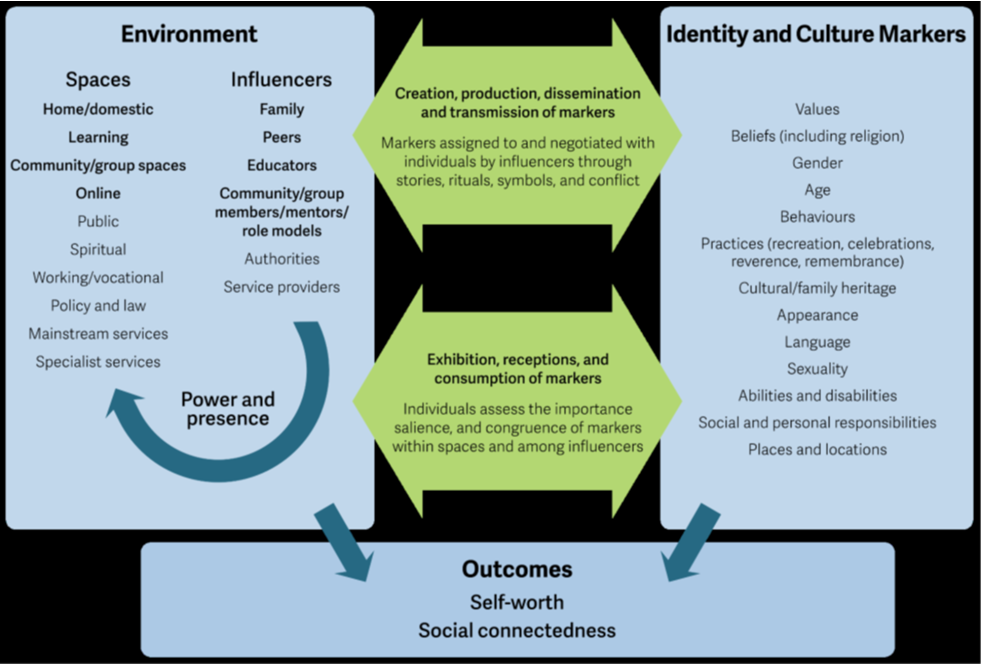
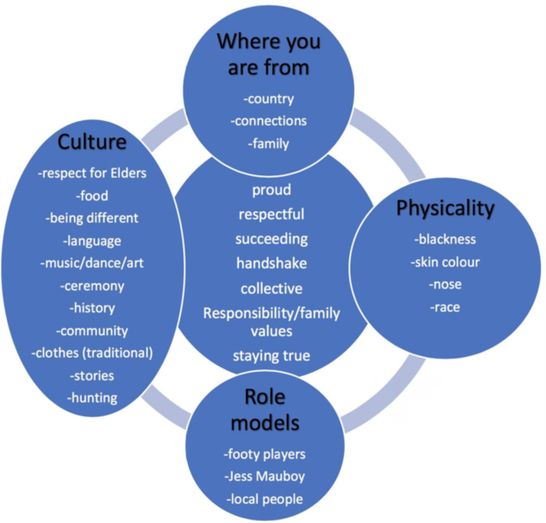

```{r setup, include=FALSE}
knitr::opts_chunk$set(echo = TRUE)
```

## Week 1: Identity Development {.well .tabset .tabset-fade .tabset-pills}

### LO1

##### Demonstrate knowledge of Erikson's basic conflicts in childhood and adolescence, and how the outcomes of these conflicts shape identity development.

<details>
<summary>Erikson's Theory of Conflict</summary>
In contrast to Freud's theory, Erikson focused more on:

-   the social impact of development rather than sexual,
-   rational development rather than selfish and irrational,
-   activity and the ability for people to adapt to, or overcome damaging early experiences, and
-   the notion that development continued after adolescence.

::: {.table .table-striped}
| Stage | Conflict | Approximate age | Virtue |
| :----: | :---- | :---- | :---- |
| Stage 1 | Trust vs Mistrust | Birth to 18 months | [Hope]( . "Focus on oral–sensory activity; development of trusting relationships with caregivers and of self-trust (hope) and confidence. Mistrust occurs when infants are handled harshly and have to wait too long for comfort and for their basic needs to be met.") |
| Stage 2 | Autonomy vs Shame and Doubt | 1 to 2 years | [Will]( . "Focus on muscular–anal activity; development of control over bodily functions and activities (will). With the development of motor and mental skills, children wish to make choices and decisions for themselves. Autonomy can be fostered by parents by permitting reasonable free choice. It can also be fostered by parents not forcing or shaming the child — which will result in the child doubting themselves, their abilities and skills.") |
| Stage 3 | Initiative vs Guilt | 3 to 5 years | [Purpose]( . "Focus on locomotor–genital activity; testing limits of self-assertion and purposefulness (purpose). Children are exploring and experimenting with the kind of person that they can become. They are developing initiative, a sense of responsibility and purpose. The demand by parents for too much self-control can lead to over-control, and the child can feel guilty for displaying their initiative.") |
| Stage 4 | Industry vs Inferiority | 6 to 11 years | [Confidence]( . "Focus on mastery, competence, and productivity (competence). With the advent of school, children develop the capacity to cooperate and work with others and are industrious in cognitive, physical and emotional ways. When children encounter negative experiences at school and at home with siblings and peers, feelings of incompetence can arise.") |
| Stage 5 | Identity vs Role Confusion | 12 to 18 years | [Fidelity]( . "Focus on formation of identity and coherent self-concept (fidelity). Questions such as ‘Who am I?’, ‘Where am I going’ and ‘Where do I fit in?’ challenge the adolescent. Through searching for meaning and exploring vocational goals and self-values, the adolescent forms a personal identity. Confusion about identity, roles, responsibilities and adult values mark this psychosocial stage.") |
| Stage 6 | Intimacy vs Isolation | 18 to 40 years | [Love]( . "Focus on achievement of an intimate relationship (love) and career direction. Some individuals experience difficulty in forming close relationships because of earlier disappointments, which leads to isolation.") |
| Stage 7 | Generativity vs Stagnation | 40 to 65 years | [Care]( . "Focus on fulfilment through creative, productive activity that contributes to future generations (care). Failure to achieve this results in an absence of meaningful accomplishment.") |
| Stage 8 | Integrity vs Despair | 65 years to death | [Wisdom]( . "Focus on belief in integrity of life, including successes and failures (wisdom). Individuals reflect on the kind of person they have been, if life has been worth living and if they have accomplished their goals. Dissatisfaction with life results in a fear of death.") |
:::
</details>
<details>
<summary>Limitations of Erikson's theory</summary>

While Erikson’s theory has garnered support for providing a broad framework that covers the entire lifespan and emphasises the importance of social interactions and how relationships shape personal development, critics have suggested the theory is not well described, particularly in relation to the exact mechanisms used for resolving conflicts.
</details>


### LO2

##### Understand how the 4 Identity statuses’ proposed by Marcia contribute to adolescents' identity development through combinations of the dimensions of commitment and exploration.

<details>
<summary>The basis of Marcia's theory</summary>

</br>
  <table class="table table-striped">
    <tr>
      <th>&nbsp;</th>
      <th>Present</th>
      <th>Absent</th>
    </tr>
    <tr>
      <th>Present</th>
      <td>[Identity</br>Achievement]( . "characterised by a period of exploration in the different areas of identity development, and a subsequent commitment to a reasonably coherent and stable identity. These individuals have questioned different aspects of their identity and self-chosen roles for themselves.")</td>
      <td>[Identity</br>Foreclosure]( . "characterised by a commitment to an identity in the absence of questioning or exploring alternatives. This is more likely for individuals who have a predetermined or expected role they must take on, oftentimes to please their parents.")</td>
    </tr>
    <tr>
      <th>Absent</th>
      <td>[Identity</br>Moratorium]( . "refers to exploring one’s identity through engaging in many varied experiences, but not committing to a coherent and consistent role. Individuals are considered in the crisis phase. Life circumstances or personality traits can influence this phase, potentially leading to feelings of disorientation or an uncertainty of their personal identity if left unresolved.")</td>
      <td>[Identity</br>Diffusion]( . "relates to individuals who have not explored and have not committed to an identity. This is more commonly seen in children and early adolescence, before beginning to explore different experiences and roles. Individuals who remain in identity diffusion are more likely to be easily influenced by peers, demonstrate less commitment, have lower self-esteem, less connection to others, and a lower sense of purpose.")</td>
    </tr>
  </table>
</br>

- Influenced by Erikson’s work...
- Marcia (1980) determined that rather than a ‘sense’ or ‘attitude’ about oneself, personal identity was a self-structure, or “An internal, self-constructed, dynamic organisation of drives. abilities, beliefs, and individual history”.
- He believed that the more well-developed this structure is, the more an individual would have a greater idea about their uniqueness and difference to others, and an understanding of their strengths and weaknesses.
- In contrast, those individuals who are less self-aware become confused and rely on external evaluation from others.
- Marcia proposed that identity is dynamic and could change over time.
- Decisions in life are not singular events but rather recurring processes.
- While potentially considered trivial, choices such as relationships, sexual activity, substance use, education, career paths, leisure activities, and political engagement all contribute to the formation of individual identity.
- Over time, these decisions and the underlying motivations coalesce into a consistent framework. However, individuals may circumvent the decision-making process by adhering to familial values, succumbing to external pressures, or experiencing indecisiveness.
- Marcia operationalised Erikson's theory and proposed 4 types of identity status:
  - identity achievement,
  - identity foreclosure,
  - identity moratorium, and
  - identity diffusion.
- Each identity status involves the presence or absence of a crisis and the presence or absence of a commitment to that identity.  
</details>
<details>
<summary>Identity in Adolescence according to Marcia</summary>
- The transition through adolescence toward adulthood it is common to move from diffusion into moratorium (incorporating the exploration of options).
- This transition subsequently moves into identity achievement after options have been explored.
- Different aspects of an individual's identity may be in different phases.
  - For example, a young person may be committed to a vocation but may be exploring their sexuality (we will explore this further in the topic: Gender & Sexuality).
- Ideally, young people in adolescence should be exposed to various positive experiences and role models to support their journey and positive identity development.
</details>

### LO3

##### Understand self-concept, how it develops, whether it can change and self-concept theories.

<details>
<summary>Self-Concept Definition</summary>

- **Definition**: Self-concept is the image we have of ourselves, influenced by interactions with important people in our lives.
  
- **Components of Self-Concept**:
  - **Self-Perception**: How we view our behaviors, abilities, and unique characteristics.
  - **Beliefs**: Statements like "I am a good friend" or "I am a kind person" contribute to our self-concept.

- **Examples of Self-Concept**:
  - **Personality Traits**: Identification as an extrovert or introvert.
  - **Life Roles**: Importance of roles such as parent, sibling, friend, and partner.
  - **Hobbies and Passions**: Interests that shape identity, like sports enthusiasm or political/religious affiliations.
  - **Social Contribution**: Feelings about one's impact on society.

- **Importance of Self-Perception**:
  - Affects motivations, attitudes, and behaviors.
  - Influences feelings of competence and self-worth.

- **Development of Self-Concept**:
  - More malleable during youth, as individuals explore self-discovery and identity formation.
  - Becomes more detailed and organised with age and experience.
</details>

<details>
<summary>Carl Rogers' Theory of Self-Concept</summary>

**Three Components of Self-Concept:**
1. **Ideal Self**:
   - The person you aspire to be
   - Attributes or qualities you're working towards
   - Your vision of your perfect self
2. **Self-Image**:
   - How you currently perceive yourself
   - Influenced by physical characteristics, personality traits, and social roles
3. **Self-Esteem**:
   - How much you like, accept, and value yourself
   - Affected by others' perceptions, self-comparisons, and societal roles

**Congruence vs. Incongruence:**
- **Congruence**:
  - Alignment between self-concept and reality
  - Leads to a positive self-concept
- **Incongruence**:
  - Mismatch between self-image and ideal self
  - Can negatively impact self-esteem

**Origins and Influences:**
- **Childhood Experiences**:
  - Incongruence often rooted in childhood
  - Conditional parental affection can lead to distorted self-perception
- **Unconditional Love**:
  - Fosters congruence
  - Helps children accept themselves without distorting memories

**Impact:**
- Congruence or incongruence significantly affects overall self-concept
- Shapes how individuals perceive and interact with their environment
</details>

<details>
<summary>How Self-Concept Develops</summary>

- **Influences on Self-Concept Development**:
  - Interaction and observation of others
  - Family members and close friends
  - Community members
  - Media representations
- **Impact of Others' Beliefs**:
  - Teacher's belief in high-performing students' abilities can positively affect their self-concept
  - No similar effect observed for lower-performing students
- **Identification with Characters**:
  - Stories and characters we relate to can shape our self-concept
  - Example: Female readers deeply engaged with traditional gender role stories may develop a more feminist self-concept
- **Media Influence**:
  - Both mass media and social media play significant roles
  - Promotion of certain ideals can shape personal ideals
  - Frequency of exposure to these ideals affects self-identity and self-perception
- **Continuous Development**:
  - Self-concept is not static but evolves through various experiences and influences
  - Interactions with different sources contribute to ongoing self-concept formation
</details>

<details>
<summary>Can Self-Concept Be Changed?</summary>
- **Dynamic Nature of Self-Concept**:
  - Self-concept is not static and can change over time
- **Environmental Influence**:
  - Physical environments play a role in shaping self-concept
  - Places with personal significance contribute to future self-concept
  - Societal perceptions of these environments also impact self-concept
- **Social Interactions**:
  - People we interact with can alter our self-concept
  - Leaders and authority figures have significant influence
- **Impact on Different Aspects of Self**:
  - Collective self (identity in social groups) can be affected
  - Relational self (identity in relationships) can also change
- **Medical Diagnoses**:
  - Can lead to shifts in self-concept
  - Example: Late-life autism diagnosis providing clarity and understanding
- **Continuous Process**:
  - Self-concept evolution is ongoing throughout life
  - Influenced by new experiences, relationships, and understanding of oneself
- **Potential for Intentional Change**:
  - Awareness of these factors can allow for deliberate efforts to modify self-concept
</details>

<details>
<summary>Other Self-Concept Theories</summary>
**Social Identity Theory (Henri Tajfel)**

- **Two essential parts of self-concept**:
  1. **Personal identity:** Unique traits and characteristics
  2. **Social identity:** Based on membership in social groups
     - Examples: sports teams, religions, political parties, social class
- **Impact of social identity**:
  - Influences self-concept
  - Affects emotions and behaviours
  - Example: Feeling sad or acting out after a team loss

**Multidimensional Self-Concept Theory (Bruce A. Bracken)**

- **Six independent traits**:
  1. **Academic:** Success or failure in school
  2. **Affect:** Awareness of emotional states
  3. **Competence:** Ability to meet basic needs
  4. **Family:** Functioning within family unit
  5. **Physical:** Feelings about appearance, health, and physical condition
  6. **Social:** Ability to interact with others
- **Key aspect**: Self-concept viewed as multidimensional rather than unitary
</details>


### LO4

##### Demonstrate knowledge of contemporary perspectives of how processes and mechanisms shape identity in adolescence.

<details>
<summary>Contemporary Research on Adolescent Identity Development</summary>

**Intraindividual Processes and Differences**

- **Dual Cycle Model**
  - Focus on exploration and commitment in identity formation and maintenance.
  - Identity processes generally mature systematically with limited changes.
  - Longitudinal studies show stability in identity processes during adolescence and young adulthood.
  - Research has shifted to examining intraindividual processes of identity development over time.
  - Daily measures reveal associations between commitment-making, exploration, and reconsideration.
  - Micro-level processes, including daily emotions and narrative constructions, influence identity development.
- **Dynamic System Approach**
  - Daily fluctuations characterise identity micro-processes.
  - Developmental changes often occur during transitions or significant life events.
  - Transitions marked by temporary increases in intra-individual variability, followed by stabilisation.
  - Life events can shape identity by creating high points, low points, or turning points.
  - Normative and non-normative transitions can prompt identity reconsideration.

**Identity and Psychosocial Adjustment**

- Stable and strong identity commitments associated with better psychosocial adjustment.
- Weaker identity commitments linked to increased risk for various issues (e.g., aggression, substance use, anxiety).
- Positive identity processes lead to better adjustment outcomes.
- Bidirectional relationships exist between identity development and psychosocial adjustment.
- Content of adolescents' identities and cultural contexts are important considerations.

**Identity and Relationships**

- Social and personal identity are interconnected; relationships crucial for identity development.
- Supportive relationships provide a secure base for identity exploration.
- Narrative sharing with family and friends helps create coherent identity narratives.
- Autonomy support from parents and peers is important for identity development.
- Parental support and relationship quality positively influence identity exploration and commitment.
- Peer relationships play a significant role, though to a lesser extent than parents.
- Clearer identity may serve as a protective factor against negative peer pressure.
- Various relationships, including romantic partners and teachers, influence identity development.
</details>


### LO5

##### Understand the role that culture plays in shaping, interacting with, and promoting a positive socio-cultural identity in an Australian context.

<details>
<summary>Culture Definition</summary>
- No single definition fits all experiences.
- UNESCO defines culture as encompassing spiritual, material, intellectual, and emotional features of society.
- ABS identifies culture as:
  - A shared approach to understanding existence.
  - Intangible paradigms in collective beliefs, stories, behaviours, and practices.
  - Generationally shared and dynamic.

**Benefits for Minority Groups:**
- Positive cultural identification leads to better academic and psychosocial outcomes and lower anti-social behaviour risks.

**Identity:**
- Multidimensional concept, encompassing:
  - Self-concept, self-esteem, self-efficacy.
  - Identity exploration and commitment.
  - Social and narrative identity.
  - Situational, place, and national identity.

**Formation and Connection:**
- Influenced by family, social supports, formal learning environments, and online interactions.
- Positive identity and culture formation benefit from:
  - Caring home environments and supportive relationships.
  - Opportunities to explore identity.
  - Positive community perceptions and cultural engagement.

**Risks and Protective Factors:**
- Risks: Lack of exposure to cultural heritage, social support, and experiences of oppression.
- Protective factors: Stable home environment, safe identity exploration, supportive peer relationships, and positive community engagement.

**Measurement:**
- Various scales exist, often validated with American cohorts.
- Australian data on youth identity and culture is limited, mostly parent-reported.
- International frameworks highlight identity and culture's importance but lack policy implementation.

**Developing Indicators:**
- Indicators should reflect theory and a conceptual framework, encompassing:
  - Academic and youth perspectives on identity and culture.
  - Multi-dimensional, context-dependent nature.
  - Multiple identity formation sites.
  - Gender-specific and age-related factors.
  - Cultural identity's protective role for minorities.
- Consistent with the Convention on the Rights of the Child.
- Indicators should emphasise adult responsibility, stakeholder engagement, outcome focus, and relevance for change.

**Institutional Sites for Change:**
- Education and child protection systems are crucial for enhancing youth identity and culture.
- Actions include:
  - Education sectors providing positive feedback and addressing discrimination.
  - Child protection services facilitating family and cultural connections, holistic support, and community engagement.

**Conceptual Framework:**
- **Identity markers:** Labels and self-described identity aspects.
- **Processes:** Creation, transmission, and exhibition of markers.
- **Environment:** Context for processes, with key influencers.
- **Outcomes:** Self-worth and social connectedness, including self-efficacy, self-esteem, aspirations, access, participation, and perceptions of belonging and safety.



</details>

<details>
<summary>How do identity and culture relate for First Nations Adolescents? </summary>



</details>

## Week 2: Physical Development {.well .tabset .tabset-fade .tabset-pills}

### LO1

##### Understand the principles of hereditary transmission.

<details>
  <summary>The Genetic Material</summary>
  - Understanding heredity begins at conception.
  - **Conception** occurs when an ovum from a woman's ovary is fertilised by a man's sperm.
  - This fertilised ovum travels to the uterus via the fallopian tube.
  - Inherited traits are determined at conception.
  - After establishing what is inherited, we can explore how genes influence our characteristics.
  - After conception, a biochemical reaction repels additional sperm upon penetration of the ovum.
  - The sperm cell disintegrates within hours, releasing its genetic material, the ovum also releases its genetic material.
  - A new cell nucleus forms around the genetic material from both the sperm and ovum, creating a **zygote**.
  - A zygote is 1/20th the size of a pinhead but contains all the material needed to develop into a complete human.
  - The human zygote's nucleus contains **46 chromosomes**, which consist of thousands of genes.
  - Chromosomes come in matching pairs, one from the mother’s ovum and one from the father’s sperm.
  - Each parent contributes 23 chromosomes to their child.
  - Genes on each chromosome pair are located at corresponding sites.
  - Genes are stretches of DNA, a double-helix molecule that resembles a twisted ladder.
  - DNA can duplicate itself, enabling the zygote to develop into a complex human being.
</details>

<details>
  <summary>Growth of the Zygote and Production of Body Cells</summary>
    - The zygote begins to replicate through mitosis while moving to the uterus.
    - Initial divisions: 1 cell becomes 2, 2 become 4, 4 become 8, and so on.
    - Before each division, the cell duplicates its 46 chromosomes.
    - Each new cell has 23 pairs of chromosomes, identical to the original cell.
    - By birth, the child consists of billions of cells formed through mitosis.
    - Mitosis creates new cells for growth and replaces damaged cells throughout life.
    - Every new cell contains an exact copy of the 46 chromosomes inherited at conception.
</details>
<details>
  <summary>The Germ (or Sex) Cells</summary>
  - In addition to body cells, human beings have germ cells that solely produce gametes (sperm in males and ova in females).
  - Gametes are produced through the process of meiosis:
    - Meiosis shares some of the characteristics of mitosis, but it differs in ways that make the resulting cells able to join with gametes to create a unique cell that will become a unique individual. Only the germ cells reproduce in this way.
</details>

<details>
  <summary>Production of Gametes Through Meiosis</summary>
  - Male germ cells in the testes and female germ cells in the ovaries produce sperm and ova through a process called meiosis.
  - The germ cell first duplicates its 46 chromosomes.
  - Then an event called crossing-over often takes place: adjacent duplicated chromosomes cross and break at one or more points along their length, exchanging segments of genetic material.
  - This transfer of genes during crossing-over creates new and unique hereditary combinations.
  - Next, pairs of duplicated chromosomes (some of which have been altered by crossing-over) segregate into two new cells, each of which contains 46 chromosomes.
  - Finally, the new cells divide so that each of the resulting gametes contains 23 single, or unpaired, chromosomes.
</details>
<details>
  <summary>Hereditary Uniqueness</summary>
  - At conception, a sperm with 23 chromosomes unites with an ovum with 23 chromosomes, producing a zygote with a full set of 46 chromosomes.
  - Siblings with both the same parents have inherited 23 chromosomes from each, however, the process of meiosis ensures genetic uniqueness between siblings.
  - During meiosis, the segregation of chromosome pairs into new cells is random.
  - Human germ cells have 23 chromosome pairs, allowing for over 8 million combinations per parent.
  - As a result of the crossing over process, a couple could theoretically produce 64 trillion unique genetic combinations in their offspring.
</details>
<details>
  <summary>Multiple Births</summary>
  - A zygote will split into separate but identical cells, which then become two individuals.
  - **Monozygotic (identical) twins** occur in about 1 of every 250 births around the world, and develop from a single zygote and have identical genes.
  - Monozygotic twins should show very similar developmental progress.
  - **Dizygotic (fraternal) twins** occur in approximately 1 of every 125 births, and occur when a mother releases two ova at the same time and each is fertilised by a different sperm.
  - **Autosomes:** The 22 pairs of human chromosomes that are identical in males and females.
</details>
<details>
  <summary>Male or Female?</summary>
  - 22 of 23 pairs are similar in males and females (autosomes), with the 23rd pair, the sex chromosomes, determining sex.
  - Males have one X and one Y chromosome, while females have two X chromosomes.
  - Fathers determine the sex of their children, with sperm carrying either an X or a Y chromosome, and ova always carrying an X chromosome.
  - The child's sex is determined by whether an X-bearing or a Y-bearing sperm fertilises the ovum.
</details>
<details>
  <summary>What do genes do?</summary>
  - Produce amino acids, forming enzymes and proteins necessary for new cells.
  - Regulate melanin production, affecting eye color.
  - Guide cell differentiation, determining cell roles (e.g., brain, skin).
  - Are influenced by their biochemical environment during development.
  - Regulatory genes control the timing and pace of development, turning other genes on and off.
  - Environmental factors influence gene function, affecting traits like height despite genetic potential.
  - Gene expression can be affected at multiple levels: nuclear environment, cellular surroundings, and external environment.
  - Environmental effects can be experience-expectant (universal) or experience-dependent (individual-specific).
  - Genes interact with the environment to produce proteins that influence human characteristics, not just "code" for traits.
</details>
<details>
  <summary>How Are Genes Expressed?</summary>
  - There are four main patterns of genetic expression:
    - **Simple dominant-recessive inheritance:**
      - Gregor Mendel discovered patterns in inheritance by cross-breeding peas, identifying dominant and recessive traits.
      - Dominant traits appear more often in offspring, while recessive traits are less common.
      - In simple dominant-recessive inheritance, the dominant allele's trait is expressed over the recessive allele.
      - Example: Normal vision (dominant allele) vs. nearsightedness (recessive allele).
      - Three possible genotypes for vision:
        - Homozygous normal vision (NN)
        - Homozygous nearsightedness (nn)
        - Heterozygous (Nn) with normal vision
      - NN individuals pass only normal vision genes; nn individuals pass nearsightedness genes.
      - Nn individuals have normal vision but can pass either normal vision or nearsightedness genes to offspring.
      - Two heterozygous (Nn) parents can produce a nearsighted child.
      - Punnett Squares represent the possible combinations of parents' alleles and their outcomes.
      - The normal-vision/nearsightedness trait is one example of many human attributes determined by single gene pairs where one allele is dominant.
    - **Codominance:**
      - Codominance occurs when alternative gene forms produce a phenotype that is a compromise between the two.
      - Blood type example: Alleles for blood types A and B are equally expressive, resulting in AB blood type.
      - Another type of codominance is incomplete dominance, where one allele is stronger but doesn't fully mask the other's effects.
      - Sickle-cell trait is an example of incomplete dominance.
      - About 8% of African Americans are heterozygous for the sickle-cell trait, carrying one sickle-cell allele.
      - Carriers may have some red blood cells in a sickle shape, leading to potential circulatory issues under stress.
      - Individuals with two recessive sickle-cell alleles develop sickle-cell anemia.
      - Sickle-cell anemia results in severe blood disorder, poor oxygen distribution, and can lead to early death from heart, kidney, or respiratory issues.
    - **Sex-linked inheritance:**
      - Sex-linked characteristics are determined by genes on the sex chromosomes.
      - Most sex-linked traits are produced by recessive genes on the X chromosome.
      - Males (XY) are more likely to inherit these traits because they have only one X chromosome.
      - Example: Red/green color blindness is caused by a recessive gene on the X chromosome.
      - A male with this gene on his X chromosome will be color-blind, as there is no corresponding gene on the Y chromosome.
      - Females (XX) are not color-blind unless both X chromosomes carry the recessive gene.
      - More males are color-blind (8 in 100) compared to females (1 in 144).
      - Over 100 sex-linked characteristics exist, many of which are disabling (e.g., hemophilia, muscular dystrophy, optic nerve degeneration).
      - Males are more likely to suffer from these disorders due to the recessive genes on the X chromosome.
    - **Polygenic (or multiple-gene) inheritance:**
      - Polygenic traits are influenced by many pairs of alleles, such as height, weight, intelligence, skin color, temperament, and cancer susceptibility.
      - More genes contributing to a trait increase the number of possible genotypes and phenotypes.
      - Polygenic traits show continuous variation, typically following a normal bell-curve distribution.
      - Few individuals have extreme traits; most are in the middle of the distribution.
      - Polygenic characteristics can involve complex inheritance patterns, including co-dominance, incomplete dominance, or sex-linked inheritance.
      - These traits are more complex than single-gene traits.
      - Most traits of interest to psychologists (e.g., intelligence, personality, mental health) are influenced by many genes.
      - A simple formula (one gene = one trait) is insufficient for understanding these traits.
      - The exact number of allele pairs influencing traits like height or intelligence is unknown.
      - Genes interact with environmental influences to create individual differences in important human attributes.
      - Many human characteristics are influenced by a single pair of genes (alleles), one from each parent.
</details>

### LO2

##### Understand the stages of prenatal development and the influence of teratogens.

<details>
  <summary>The Period of the Zygote</summary>
  - **Movement and Division:**
    - The zygote moves down the fallopian tube towards the uterus, dividing by mitosis into two cells.
    - These cells continue to divide, forming a blastocyst with 60 to 80 cells within 4 days.
    - The inner layer of the blastocyst becomes the embryo; the outer layer forms protective tissues.

  - **Implantation:**
    - 6 to 10 days after conception, the blastocyst develops tendrils that burrow into the uterine wall, initiating implantation.
    - This process involves the blastocyst attaching to and penetrating the uterine wall within a 48-hour window, completing around 10 to 14 days after ovulation.
    - About half of fertilised ova fail to implant, and many that do may be genetically abnormal or improperly situated.

  - **Development of Support Systems:**
    - After implantation, the blastocyst forms four support structures:
      - **Amnion:** Watertight sac that cushions the embryo, regulates temperature, and provides a weightless environment.
      - **Yolk Sac:** Produces blood cells until the embryo can produce its own.
      - **Chorion:** Surrounds the amnion and becomes the placenta's lining.
      - **Allantois:** Forms the umbilical cord.

  - **Purpose of the Placenta:**
    - The placenta, fed by maternal and embryonic blood vessels, has a semi-permeable barrier allowing gases, salts, and nutrients to pass through.
    - It delivers oxygen and nutrients to the embryo and removes carbon dioxide and metabolic wastes via the umbilical cord.
    - The placenta is essential for sustaining the embryo through metabolic transactions.
</details>
<details>
  <summary>The Period of the Embryo</summary>
  - **Duration:**
    - Lasts from implantation (around the 3rd week) through the 8th week of pregnancy.

  - **Early Development:**
    - By the 3rd week, the embryonic disk differentiates into three cell layers:
      - **Ectoderm:** Becomes the nervous system, skin, and hair.
      - **Mesoderm:** Develops into muscles, bones, and the circulatory system.
      - **Endoderm:** Forms the digestive system, lungs, urinary tract, pancreas, and liver.
    - The neural tube forms from the ectoderm and will become the brain and spinal cord.
    - By the end of the 4th week, the heart is formed and begins to beat; eyes, ears, nose, mouth, and limb buds appear.
    - The embryo is about 1/4 inch long and 10,000 times the size of the original zygote.

  - **2nd Month Development:**
    - The embryo grows approximately 1/30 inch per day and develops more human features.
    - A primitive tail forms and later becomes the coccyx (tip of the backbone).
    - By the 5th week, the eyes have corneas and lenses; by the 7th week, ears are well-formed and a rudimentary skeleton appears.
    - Limbs develop from the body outward, with arms and legs forming in a similar sequence.
    - The brain develops rapidly and directs the first muscular contractions.

  - **Sexual Development:**
    - By the 7th and 8th weeks, the embryo shows sexual development with the formation of the indifferent gonad.
    - In males, a gene on the Y chromosome causes the indifferent gonad to develop into testes.
    - In females, the gonad develops into ovaries without additional instructions.
    - The embryo's circulatory system functions independently as the liver and spleen start producing blood cells.

  - **End of 2nd Month:**
    - The embryo is slightly more than an inch long and weighs less than 1/4 ounce.
    - Major structures are formed, and the embryo begins to look more human.
</details>
<details>
  <summary>The Period of the Fetus</summary>
  - **Duration:**
    - Lasts from 8 weeks of pregnancy until birth, characterised by rapid growth and refinement of organ systems.
    - Development stages do not align with trimesters; the fetus becomes recognisable as such around 8 weeks post-conception, and early stages of development (zygotic and embryonic) often occur before pregnancy is recognised.

  - **Third Month:**
    - Organ systems formed earlier continue to grow and interconnect.
    - Fetus performs subtle movements (kicking, making fists) that are not yet felt by the mother.
    - Digestive and excretory systems become functional, allowing swallowing, digesting, and urinating.
    - Sexual differentiation occurs; male fetuses secrete testosterone, leading to the development of the penis and scrotum, while female genitalia form in the absence of testosterone.
    - By the end of the 3rd month, the fetus is about 3 inches long and weighs less than an ounce.

  - **Fourth to Sixth Months:**
    - Fetus grows rapidly; by 16 weeks, it is 8-10 inches long and weighs about 6 ounces.
    - Increased complexity in movements (sucking, swallowing, breathing) prepares the fetus for life outside the womb.
    - The fetus starts kicking strongly enough to be felt by the mother, and its heartbeat can be heard with a stethoscope.
    - Nails harden, skin thickens, and hair appears. Vernix and lanugo cover the fetus.
    - By the end of the 6th month, the fetus's senses (visual and auditory) are functional, with responses to sound and light.

  - **Seventh through Ninth Months:**
    - Final "finishing phase" of rapid organ system maturation.
    - By 22-28 weeks, fetuses reach the age of viability, showing more organised heart rate and motor activity.
    - By the end of the 7th month, the fetus weighs about 4 pounds and is 16-17 inches long; by 8 months, it grows to 18 inches and gains another 1-2 pounds.
    - Fat deposits under the skin help insulate the newborn.
    - Fetal activity slows, and sleep increases by the 9th month; the fetus assumes a head-down position for birth.
    - Uterine contractions prepare the mother for labor and delivery.
</details>
<details>
<summary>Potential Problems in Prenatal Development</summary>

- **Teratogens**:
  - **Definition**: Any disease, drug, or environmental agent that can harm a developing embryo or fetus.
  - **Principles**:
    - Sensitive-period principle: Effects are worst when an organ or body part is forming.
    - Individual-difference principle: Susceptibility varies based on genetics and prenatal environment.
    - Multiple teratogens can cause the same defect; one teratogen can cause various defects.
    - Longer or higher exposure increases harm (dosage principle).
    - Both parents’ exposures can affect the fetus.
    - Long-term effects depend on the postnatal environment.
    - Sleeper effects may not be apparent until later in life.

- **Diseases Suffered by the Pregnant Woman**:
  - **Rubella**: Can cause blindness, deafness, and heart defects, especially if contracted early in pregnancy.
  - **Toxoplasmosis**: Caused by a parasite; can lead to severe damage or miscarriage.
  - **Sexually Transmitted Diseases**:
    - **Syphilis**: Harmful in later stages of pregnancy; can cause serious defects or miscarriage.
    - **Genital Herpes**: Can lead to severe disabilities or death; cesarean delivery is often recommended.
    - **AIDS**: Transmitted prenatally, during birth, or through breastfeeding; antiviral drugs can reduce transmission and improve outcomes.

- **Drugs**:
  - **Thalidomide**: Caused severe birth defects when used in the first two months of pregnancy, including limb abnormalities.
  - **Other Common Drugs**:
    - Heavy use of aspirin and ibuprofen can lead to growth retardation and complications.
    - Excessive caffeine linked to miscarriage and low birth weight.
    - Some prescription drugs, like antidepressants containing lithium, can cause heart defects.
    - **Diethylstilbestrol (DES)**: Used to prevent miscarriages; linked to reproductive organ abnormalities and cancer in later life.

- **Alcohol:**
  - Affects fetal development directly and indirectly by impairing placenta function.
  - Fetal Alcohol Syndrome (FAS) includes microcephaly, heart malformations, and growth delays.
  - FAS babies often have irritability, hyperactivity, and learning disabilities.
  - Moderate drinking can cause Fetal Alcohol Effects (FAE), such as growth retardation and learning deficits.
  - No amount of alcohol is considered safe; risks include miscarriage and developmental delays.
  - Drinking in any trimester can be harmful; affects both fetal and male reproductive systems.

- **Cigarette Smoking:**
  - Linked to cleft lip/palate, abnormal lung function, hypertension, miscarriage, and low birth weight.
  - Increases risks of ectopic pregnancy and sudden infant death syndrome (SIDS).
  - Smoking impairs placenta function, affecting oxygen and nutrient exchange.
  - Long-term effects include smaller size, respiratory infections, and cognitive issues.
  - Smoking interacts with other drugs, exacerbating teratogenic effects.
  - Strongly advised to avoid smoking during pregnancy.

- **Illicit Drugs:**
  - Widespread exposure, including marijuana, cocaine, and heroin, leads to various defects.
  - Marijuana use affects emotional regulation and can cause developmental issues like poor academic performance.
  - Heroin and methadone use are linked to higher miscarriage rates, preterm delivery, and withdrawal symptoms in newborns.
  - Cocaine use constricts blood vessels, leading to prematurity and developmental deficits such as lower IQ and language issues.
  - Prenatal cocaine exposure can also affect emotional bonding and intellectual development.
  - General advice is to avoid all drugs unless absolutely necessary and approved by a physician.
</details>
<details>
<summary>Environmental Hazards</summary>
- **Radiation:**
  - Teratogenic effects observed from the 1945 atomic blasts in Japan; severe outcomes included high rates of infant mortality and mental retardation in survivors.
  - The exact radiation threshold for harm is unclear, but potential long-term complications are a concern.
  - Pregnant women are advised to avoid non-essential X-rays, especially of the pelvis and abdomen.

- **Chemicals and Pollutants:**
  - Pregnant women may encounter toxic substances like dyes, additives, and pesticides, some of which are teratogenic in animals.
  - Exposure to pollutants such as lead, zinc, and mercury can impair health and cause physical and mental developmental issues in embryos and fetuses.
  - The highest damage occurs with exposure during both pregnancy and breastfeeding.
  - Environmental toxins can also affect the reproductive health of fathers, leading to increased risks of miscarriage and genetic defects in children.
  - Both parents should limit exposure to known teratogens to reduce risks to their offspring.

</details>
<details>
<summary>Characteristics of the Pregnant Woman</summary>
- **Nutrition:**
  - Historical advice recommended minimal weight gain; current guidelines suggest a gain of 25-35 pounds with a high-protein, high-calorie diet.
  - Severe malnutrition during pregnancy can lead to small, underweight babies and increased risk of cognitive deficits.
  - Malnutrition impacts vary by trimester: early malnutrition can disrupt spinal cord formation and induce miscarriages, while later malnutrition may result in low-birth-weight babies with small heads.
  - Dietary supplements and responsive caregiving can mitigate long-term effects of prenatal malnutrition.
  - Adequate intake of vitamins and minerals is crucial: magnesium and zinc improve placenta function, and folic acid helps prevent neural tube defects like Down syndrome and spina bifida.
  - Recommended daily allowance of folic acid is 0.4 to 1.0 milligrams, especially critical during early pregnancy. However, excessive intake, particularly of vitamin A, should be avoided.
</details>
<details>
<summary>The Pregnant Woman’s Emotional Well-Being</summary>

- **Impact of Stress on Fetus:**
  - Emotional arousal in pregnant women leads to hormone secretion (e.g., adrenaline) that can affect fetal motor activity and heart rate.
  - Temporary stress (e.g., a fall or argument) generally has minimal impact, but prolonged severe stress is linked to issues like stunted growth, premature delivery, low birth weight, and birth complications.
  - High maternal stress is associated with increased fetal motor activity and irregularities in infant behavior such as irritability and difficulty with feeding and sleeping.
  - Studies show infants of mothers with high cortisol levels (stress hormone) tend to be more irritable and have difficult temperaments.
  - Long-term effects of prenatal stress include an increased risk of ADHD, externalising behaviors, and anxiety, especially when stress occurs between weeks 12 and 22 of gestation.
  - Stress may impair fetal growth by diverting blood flow away from the fetus, weakening the immune system, and leading to poor maternal health behaviors (e.g., poor diet, smoking, alcohol use).
  - Emotional stress can affect maternal caregiving, potentially perpetuating infant behavioral issues.
  - Not all stressed mothers experience complications. Effective stress management and social support play crucial roles in mitigating negative outcomes.
  - Counseling and support for stressed pregnant women can improve birth outcomes, such as higher birth weights.
  - Moderate maternal stress may be beneficial for fetal development, promoting neurological integration and developmental progress, as stress hormones can aid in organ maturation.
</details>
<details>
<summary>The Pregnant Woman’s Age</summary>

- **Optimal Age for Childbearing:**
  - Ideal age for pregnancy is between 16 and 35 years.
  - Risks for fetal and neonatal death increase significantly for mothers aged 15 or younger.
  - Teen mothers (under 16) face higher chances of birth complications, premature delivery, and low-birth-weight babies compared to mothers in their 20s.

- **Challenges for Younger Mothers:**
  - Younger mothers often come from economically disadvantaged backgrounds, leading to poor nutrition, high stress, and limited access to prenatal care.
  - Good prenatal care and medical supervision can mitigate these risks.

- **Risks for Older Mothers:**
  - Women over 35 face higher risks of miscarriage and pregnancy complications due to increased likelihood of chromosomal abnormalities.
  - Older mothers may experience more complications during pregnancy and delivery, though many have normal pregnancies and healthy babies, especially if they are healthy and well-nourished.

</details>
<details>
<summary>Prevention of Birth Defects</summary>

- **Perception vs. Reality:** Although concerns about birth defects and potential hazards are common, the majority of embryos do not encounter significant issues and many that do are either not carried to term or have minor, correctable problems.
- **Statistics:** Over 95% of newborns are perfectly normal, with the remaining 5% risk having congenital issues that are temporary or easily correctable.
- **Prevention Strategies:**
  - Parents can reduce the risk of birth defects by following recommended guidelines.
  - Every pregnancy is unique, and efforts to ensure a healthy pregnancy are valuable.
- **Encouragement:** Despite potential hazards, significant efforts to ensure a healthy prenatal environment can greatly improve the chances of a normal, healthy baby.
</details>


### LO3

##### Understand neural development and plasticity.

<details>
<summary>Brain Development</summary>
- **Early Brain Growth:**
  - The brain grows rapidly in early life, reaching 75% of adult weight by age 2.
  - Significant brain growth occurs in the last 3 prenatal months and the first 2 years post-birth.

- **Neural Development and Plasticity:**
  - The brain consists of over a trillion specialised cells (neurons) connected by synapses.
  - Most neurons are formed by the end of the second trimester, but new neurons continue to form in the hippocampus throughout life.
  - Brain growth spurt is driven by the development of glial cells, which support and insulate neurons with myelin.

- **Neural Development:**
  - Neurons differentiate and specialise based on their location.
  - Synaptogenesis occurs rapidly, leading to an initial excess of neurons and connections, with unused ones being pruned.

- **Role of Experience:**
  - Early experience significantly influences brain development.
  - Studies show that sensory deprivation and enriched environments affect neural development.
  - Higher socioeconomic status and maternal education are associated with larger brain size in children.
</details>


### LO4

##### Understand how the brain differentiates and grows.

- **Brain Differentiation and Growth:**
  - At birth, subcortical brain centers are most developed; higher cortical areas mature later.
  - Myelinisation enhances neural communication and continues into late adolescence, affecting motor and cognitive functions.

- **Cerebral Lateralisation:**
  - The brain has two hemispheres with specialised functions: the left for language and positive emotions, and the right for visual-spatial processing and negative emotions.
  - Lateralisation begins prenatally and becomes more pronounced with age, influencing handedness and cognitive functions.

- **Adolescent Brain Development:**
  - Myelinisation of higher brain centers continues into adolescence, improving attention spans and processing speed.
  - Brain plasticity persists beyond puberty, with ongoing reorganisation of the prefrontal cortex and synaptic pruning.

### LO5

##### Understand the factors that influence physical development.

<details>
<summary>Causes and Correlates of Physical Development</summary>

- **Biological Mechanisms**
  - Physical development results from the interplay between nature and nurture.
  - Genetic factors significantly influence growth patterns, such as height and maturation rates.
  - Growth hormone (GH) is crucial for normal growth and is regulated by the pituitary gland.

- **Hormonal Influences**
  - Hormones like testosterone and oestrogen play key roles in adolescent growth spurts and sexual maturation.
  - GH and sex hormones are involved in the development of secondary sexual characteristics.
  - The precise triggers for hormonal changes during adolescence are not fully understood.

- **Environmental Influences**
  - **Nutrition**
    - Adequate nutrition is essential for proper growth; malnutrition leads to slow or stunted growth.
    - Short-term undernutrition may result in catch-up growth when the diet improves.
    - Prolonged undernutrition, especially in early years, can cause significant growth and developmental delays.
    - Common nutritional diseases include marasmus (insufficient protein and calories) and kwashiorkor (insufficient protein with adequate calories).
    - Overnutrition, particularly in Western societies, leads to obesity and associated health risks like diabetes and heart disease.
    - Poor eating habits and lack of exercise contribute to obesity; sedentary activities like excessive TV watching are linked to higher obesity rates.

  - **Illnesses**
    - Common childhood illnesses have minimal long-term effects on growth if the child is well-nourished.
    - Major illnesses in undernourished children can stunt growth due to weakened immune systems and poor nutrient absorption.

  - **Emotional Stress and Lack of Affection**
    - Nonorganic failure to thrive and deprivation dwarfism are growth disorders linked to emotional neglect and lack of affection.
    - Nonorganic failure to thrive is characterized by poor growth despite adequate nutrition and is often due to emotional neglect.
    - Deprivation dwarfism results from emotional deprivation and impacts growth rates, despite proper nutrition.
    - Early intervention and improved caregiving can reverse these conditions and support catch-up growth.
</details>

## Week 3: Emotional Development {.well .tabset .tabset-fade .tabset-pills}

### LO1

##### Understand the sequencing of discrete emotions.

<details>
<summary>Emotional Development</summary>

- **Infant Emotions**
  - Infants display a range of emotions such as interest, joy, anger, and fear from a young age.
  - Studies show that even very young babies have recognizable emotional expressions, which become clearer with age.

- **Development of Emotional Expressions**
  - Different emotions appear at different stages during the first two years of life:
    - **At birth**: Interest, distress, disgust, and contentment.
    - **By 2 months**: Social smiles and basic emotions like anger, sadness, joy, surprise, and fear.
    - **Later in the 2nd year**: Complex emotions such as embarrassment, shame, guilt, envy, and pride emerge.

- **Self-Conscious Emotions**
  - **Embarrassment**: Emerges with self-recognition in mirrors or photos.
  - **Self-Evaluative Emotions**: Require both self-recognition and understanding of rules or standards (e.g., pride, shame, guilt).

- **Impact of Parental Reactions**
  - **Pride and Shame**:
    - Children's expressions of pride or shame are influenced by parental feedback.
    - Positive reinforcement leads to more pride and less shame.
    - Negative reinforcement can increase feelings of shame and decrease pride.
  - **Guilt vs. Shame**:
    - Parental reactions affect whether a child feels guilt or shame in response to misbehavior.
    - Critical reactions lead to shame.
    - Constructive criticism and encouragement lead to guilt and attempts to make amends.

- **Developmental Aspects**
  - Toddlers and young preschoolers often display self-evaluative emotions in the presence of adults.
  - True internalisation of evaluative standards and emotions typically develops later in elementary school.
</details>

### LO2

##### Understand emotional display rules, self-regulation, and competence.

<details>
<summary>Socialization of Emotions and Emotional Self-Regulation</summary>

- **Emotional Display Rules**
  - Societies have rules specifying when and how emotions should be expressed.
  - Children learn these rules early, often modeled by their parents.
  - Different cultures have different norms for acceptable emotional expressions.

- **Regulating Emotions**
  - Early emotional regulation is managed by caregivers through soothing techniques.
  - By six months, infants start to self-regulate using actions like thumb sucking or turning away.
  - By the end of the first year, infants develop strategies like rocking or moving away from distressing stimuli.
  - By 18-24 months, toddlers try to control people or objects that upset them and distract themselves from disappointments.
  - Young children use distraction and reinterpretation to cope with negative emotions.
  - Effective emotional regulation involves suppressing, maintaining, or intensifying emotions as needed.

- **Parental Influence**
  - Parents help children deal with emotions through distraction and constructive discussion.
  - Children exposed to frequent negative emotions at home may struggle with emotional regulation.
  - Parental responses to emotions can encourage children to feel sympathy, guilt, or pride.

- **Acquiring Emotional Display Rules**
  - By age three, children begin to disguise their true feelings.
  - Preschool children gradually improve in masking emotions and lying convincingly.
  - School-aged children become more aware of and compliant with emotional display rules.
  - Girls generally are better at complying with display rules due to stronger social pressures.
  - Older adolescents who manage their emotions well have better social outcomes.

- **Cultural Variations**
  - Communal cultures emphasize social harmony and compliance with emotional display rules.
  - Compliance with display rules is motivated by a desire for social harmony and acceptance.
  - Children who master emotional display rules are viewed as more likable and competent.

</details>
<details>
<summary>Emotions and Early Social Development</summary>

- **Role of Emotions in Early Social Development**
  - Emotions serve a communicative function affecting caregiver behavior.
  - Infant emotions like distress, joy, and anger communicate needs and desires to caregivers.
  - Emotional expressions help infants and caregivers understand each other and foster social contact.

- **Recognition and Interpretation of Emotions**
  - Infants develop the ability to recognize and interpret others' emotions.
  - Social referencing helps infants learn from others' emotional reactions.
  - Caregivers' emotional displays contribute significantly to a child's understanding of their environment.

- **Emotional Competence and Social Competence**
  - Emotional competence is crucial for achieving personal goals in social interactions while maintaining positive relationships.
  - Emotional Intelligence (EQ) involves perceiving, facilitating, understanding, and managing emotions.
  - Emotional competence has three components:
    - **Competent Emotional Expressivity**: Frequent positive emotions, infrequent negative emotions.
    - **Competent Emotional Knowledge**: Correctly identifying others' feelings and their causes.
    - **Competent Emotional Regulation**: Adjusting emotional arousal to appropriate levels to achieve goals.
  - Each component is related to social competence, influencing how children are perceived by teachers and peers.

- **Impact of Emotional Competence**
  - Children who express positive emotions and regulate their emotions well are viewed more favorably.
  - High emotional understanding correlates with high social competence and positive relationships.
  - Poor emotional regulation, especially of anger, can lead to rejection by peers and adjustment problems.

- **Emotional Competence and Personality Development**
  - Emotional competence contributes to the development of children's personalities.
  - Emotions and their expression influence self-perception and personality.
</details>

### LO3

##### Understand temperament, including the factors that influence it and its stability.

<details>
<summary>Temperament and Development</summary>

- **Infant Temperament**
  - Infants have distinct personalities, described in terms of temperament.
  - Defined by individual differences in emotional, motor, and attentional reactivity and self-regulation.
  - Thomas and Chess classified infants as "easy," "difficult," or "slow to warm up."
  - Six dimensions of temperament:
    - Fearful distress: wariness, distress, and withdrawal in new situations.
    - Irritable distress: fussiness and distress when desires are frustrated.
    - Positive affect: frequency of smiling, laughing, and willingness to approach others.
    - Activity level: amount of gross motor activity.
    - Attention span/persistence: length of time focusing on objects or events.
    - Rhythmicity: regularity of bodily functions.

- **Hereditary and Environmental Influences**
  - Temperament has a biological foundation and is genetically influenced.
  - Identical twins show more similarity in temperament than fraternal twins.
  - Home environment influences positive aspects of temperament, while nonshared environments shape negative aspects.
  - Parenting styles and early behavioral differences impact temperament.

- **Cultural Influences**
  - Cultural values shape the desirability of certain temperamental traits.
  - Shyness is viewed negatively in the U.S. but positively in some Asian cultures.
  - Cultural changes can alter the social desirability of traits like shyness over time.

- **Stability of Temperament**
  - Components like activity level, irritability, sociability, and fearfulness are moderately stable through infancy to adulthood.
  - Behavioral inhibition (withdrawal from unfamiliar people or situations) is a stable attribute with biological roots.
  - Environmental factors, such as parenting styles, can influence the stability of inhibition.

- **Long-Term Impact**
  - Temperament forms the cornerstone of adult personality.
  - Early temperamental traits can predict future behaviors and social outcomes.

</details>

### LO4

##### Understand attachment, including the phases and theories.

<details>
  <summary>Attachment and Development</summary>

  - **Personal Experience:**
    - Stayed home for first 2 years of daughters' lives.
    - Daughters initially cried when left at daycare, but adapted quickly.
    - Cried at pickup after a few weeks, indicating secure attachments.

  - **Emotional Attachments:**
    - Described by John Bowlby as strong affectional ties.
    - Provide comfort and pleasure in interactions.
    - Example: 10-month-old showing attachment to mother by seeking her when upset.

  - **Reciprocal Relationships:**
    - Attachments are mutual between parents and infants.
    - Parents begin forming attachments before birth through positive anticipation and early interactions.
    - Emotional attachments build over time through regular interactions.

  - **Interactional Synchrony:**
    - Synchronized routines between caregivers and infants contribute to attachment growth.
    - Infants develop expectancies for social interactions.
    - Examples include gazing, smiling, and face-to-face play.

  - **Phases of Attachment Development:**
    - Asocial Phase (birth to 6 weeks): Infants react favorably to social and nonsocial stimuli.
    - Indiscriminate Attachments (6 weeks to 7 months): Preference for people, enjoyment from any human interaction.
    - Specific Attachment Phase (7 to 9 months): Attachment to a specific person, usually the mother.
    - Multiple Attachments (9 to 18 months): Formation of attachments to several people.

  - **Theories of Attachment:**
    - Psychoanalytic Theory: Attachment due to feeding and oral satisfaction.
    - Learning Theory: Attachment through association with comfort and positive responses.
    - Cognitive-Developmental Theory: Attachment linked to cognitive abilities like object permanence.

  - **Contemporary Theories:**
    - Ethological Theory: Innate behaviors promote attachment for survival.
    - Bowlby's Perspective: Secure attachments develop through responsive interactions and are crucial for survival.

  - **Attachment-Related Fears:**
    - Stranger Anxiety: Wary reactions to unfamiliar people, peaking at 8 to 10 months.
    - Separation Anxiety: Discomfort when separated from primary attachment figures, peaking at 14 to 18 months.
</details>

### LO5

##### Understand differences in attachment, including how it is measured, the types, and the influence of caregiving quality and infant characteristics.

<details>
  <summary>Individual Differences in Attachment Quality</summary>

  - **Differences in Attachment Quality**:
    - Home-reared infants establish varying quality of attachment with caregivers.
    - Some infants are secure and relaxed; others are anxious and uncertain.
    - Researchers aimed to measure attachment quality to understand these differences and their impact on later development.
  
  - **Assessing Attachment Security**:
    - **Strange Situation**:
      - Developed by Mary Ainsworth.
      - Involves eight episodes simulating caregiver-infant interactions, separations, and reunions.
      - Measures infant's exploratory activities, reactions to strangers, separations, and behaviors during reunions.
      - Classifications:
        - **Secure attachment** (65%): Infants explore, greet mother warmly, seek contact if distressed, outgoing with strangers when mother is present.
        - **Resistant attachment** (10%): Infants stay close to mother, distressed by separation, ambivalent on reunion, wary of strangers.
        - **Avoidant attachment** (20%): Infants show little distress on separation, ignore mother on reunion, sociable or avoidant with strangers.
        - **Disorganized/disoriented attachment** (5%): Infants exhibit confused behavior, act dazed, may approach and avoid mother simultaneously.
    - **Attachment Q-set (AQS)**:
      - Used for children aged 1-5.
      - Observer sorts 90 descriptors of attachment-related behaviors.
      - Provides a profile of attachment security.
      - Versatile for older preschool children in natural environments.

  - **Cultural Variations in Attachment Classifications**:
    - Attachment classifications differ across cultures reflecting child-rearing practices.
    - Example: Northern German parents encourage independence, leading to more avoidant behaviors.
    - Example: Japanese mothers' close contact and focus on amae leads to behaviors classified as insecure in the Strange Situation but valued in their culture.
    - Western researchers often view attachment security as culturally universal but recognize variations in caregiving patterns and their outcomes.
    - Importance of understanding secure attachment may vary, reflecting cultural values and practices.

  - **Father’s Role in Attachment**:
    - Early research focused mainly on mothers.
    - Increasing focus on fathers and whole families as attachment figures.
    - Exploration of fathers' contributions to infants' social and emotional development.
</details>
<details>
  <summary>Fathers as Caregivers</summary>

  - **Historical Context**:
    - Fathers were once seen as minor contributors to child development.
    - They spend less time interacting with babies compared to mothers.
    - Despite this, fathers are fascinated with their newborns and increase involvement over the first year.
  
  - **Attachment**:
    - Infants often form secure attachments to fathers if the father has a positive attitude, spends time with them, and is a sensitive caregiver.
    - Fathers tend to engage in playful physical stimulation and unusual games.
    - Infants prefer mothers when upset but often prefer fathers as playmates.
    - Fathers can become skillful caregivers and serve as a secure base for exploration.
  
  - **Emotional Security and Social Competence**:
    - Children securely attached to both parents are less anxious, socially withdrawn, and adjust better to school.
    - Secure attachment with fathers leads to better emotional self-regulation, social competencies, and lower levels of problem behaviors and delinquency.
    - Benefits of secure attachment with fathers are evident even if the father does not reside in the home.
    - Secure attachment with both parents contributes the most to a child's development.
</details>
<details>
  <summary>Factors That Influence Attachment Security</summary>

  - **Influencing Factors**:
    - Quality of caregiving
    - Emotional climate of the home
    - Health conditions and temperaments of infants

  - **Quality of Caregiving**:
    - Secure attachments: Sensitive, responsive caregiving from the beginning.
    - Resistant attachments: Inconsistent caregiving.
    - Avoidant attachments: Impatient, unresponsive, or overzealous caregiving.
    - Disorganized/disoriented attachments: History of neglect or abuse.

  - **At-Risk Insensitive Caregivers**:
    - Clinically depressed parents
    - Parents who were neglected or abused as children
    - Parents of unwanted pregnancies
    - Caregivers with health, legal, or financial problems
    - Unhappily married parents

  - **Intervention and Assistance**:
    - Infant mental health (IMH) interventions
    - Programs improving caregiver sensitivity and responsiveness

  - **Infant Characteristics**:
    - Jerome Kagan’s temperament hypothesis: Attachment behaviors reflect infant temperament.
    - Evidence against the extreme temperament hypothesis: Secure and insecure attachments can vary between caregivers.
    - Studies show environmental influences and caregiving are more predictive of attachment quality than genetics or temperament alone.

  - **Combined Influences of Caregiving and Temperament**:
    - Quality of caregiving predicts secure vs. insecure attachments.
    - Infant temperament predicts type of insecurity.
    - Goodness-of-fit model: Secure attachments from a good fit between caregiving and infant temperament.
</details>

## Week 4: Social Development {.well .tabset .tabset-fade .tabset-pills}

### LO1

##### Understand different types of play and their functions.

<details>
  <summary>Types of Play and Their Functions</summary>
  
  - Play is essential for healthy development and is emphasized in educational curricula and various child-focused professions.
  - The UN Convention on the Rights of the Child recognizes the right to play.
  - Parten's categories reflect the complexity of social interactions in play but do not capture all variations.
  - Parten's (1932) observational study identified **six types of play** in preschool children:
    - **Cooperative play:** Most complex, involves formal games, social pretend play, and constructive play. Rare before age 3.
    - **Associative play:** Children talk and share materials without taking different roles or completing joint projects. Most common among 4-year-olds.
    - **Parallel play:** Children play beside others using the same toys but do not interact. Most common among 2-year-olds.
    - **Onlooker behavior:** Watching others play without joining in.
    - **Unoccupied play:** Watching whatever interests them without playing.
    - **Solitary play:** Playing alone in a way different from those around them.
  
  - Subsequent research supports these categories but offers different conclusions.
  - Modern research has expanded on Parten’s work by focusing on types of play and their developmental contributions:
    - **Physical play:** Enjoyable whole or part body movements, common in early years.
    - **Rough and tumble play:** Play fighting and chasing, common during school years.
    - **Play with objects:** Begins around 5 months, progresses from exploration to functional use and pretend play.
    - **Pretend play:** Involving drawing others into pretend activities and using objects symbolically. Develops in several sequences:
      - **Decentration:** where the child draws others into pretend activities, which can include parents but also objects such as stuffed toys and dolls,
      - **Decontextualisation:** where the child can use one object to represent another, such as using a stick as a sword, and
      - **Integration:** where individual acts of pretend play becoming ‘joined up’ into patterns of connected activities, such as making a doll run, climb up a tower of blocks and jump off.
    - **Sociodramatic play:** Pretend play with others, increases in preschool and school years.
  
  - **Functions of play:**
    - **Classical theories:** Play as exercise for future skills, adaptive for survival.
    - **Piagetian theory:** Social interactions in play drive cognitive development.
    - **Vygotskian theory:** Play builds mental structures using cultural tools (e.g., language, concepts).
    - Promotes social development and competence.
    - Benefits problem-solving, creativity, theory of mind, and self-control.
    - Potential stress release function.

</details>

### LO2

##### Parenting Styles: Demonstrate knowledge of how parents impact social development.

<details>
<summary>Parenting styles</summary>

- **Baumrind’s Typology (1971)**
  - Developed from observations and interviews
  - Template for childrearing practices in many Western countries
  - Extended by Maccoby and Martin (1983)

- **Four Basic Parenting Styles**
  - Based on: control, clarity of communication, maturity demands, nurturance

- **Authoritative Parenting**
  - High control, communication, maturity demands, nurturance
  - Firm but flexible, child-centered, emotionally supportive
  - Positive outcomes: independence, self-reliance, high self-esteem, academic success
  - Example: Empathetic and nurturing handling of Miley’s behavior

- **Authoritarian Parenting**
  - High control and maturity demands, low communication and nurturance
  - Inflexible, undemocratic, relies on power and punishment
  - Negative outcomes: anxiety, low self-esteem, lack of sociability
  - Example: Punitive reaction to child’s tantrum, instilling fear

- **Permissive Parenting**
  - Low control and maturity demands, high nurturance, inconsistent communication
  - Child-centered, few demands, inconsistent limits
  - Negative outcomes: impulsiveness, disobedience, dependency
  - Example: Little attempt to control child’s behavior in a game scenario

- **Uninvolved Parenting**
  - Low control, communication, maturity demands, and nurturance
  - Emotionally detached, prioritizes own concerns
  - Negative Outcomes: Severe maladjustment, poor self-control, low self-esteem, social alienation
  - Example: Ignoring child’s demands and behavior during social interactions


| Parenting</br>Style | Control | Clarity of</br>Communication | Maturity</br>Demands | Nurturance |
|:-------------------:|:-------:|:----------------------------:|:--------------------:|:----------:|
| Authoritative       | <abbr title="Firm, consistent and age appropriate control over their children's behaviour, while also being responsive to their children's thoughts and feelings"><i class="fa-solid fa-arrow-up"></i></abbr>   | <abbr title="Firm yet flexible in allowing their children to participate in decision making"><i class="fa-solid fa-arrow-up"></i></abbr> | <abbr title="Generally use rewards over punishments, explaining behavioural rules and expectations"><i class="fa-solid fa-arrow-up"></i></abbr> | <abbr title="Child centred in their approach to parenting"><i class="fa-solid fa-arrow-up"></i></abbr> |
| Authoritarian       | <i class="fa-solid fa-arrow-up"></i>   | <i class="fa-solid fa-arrow-down"></i> | <i class="fa-solid fa-arrow-up"></i> | <i class="fa-solid fa-arrow-down"></i> |
| Permissive          | <i class="fa-solid fa-arrow-down"></i> | <i class="fa-solid fa-arrows-up-down"></i> | <i class="fa-solid fa-arrow-down"></i> | <i class="fa-solid fa-arrow-up"></i> |
| Uninvolved          | <i class="fa-solid fa-arrow-down"></i> | <i class="fa-solid fa-arrow-down"></i> | <i class="fa-solid fa-arrow-down"></i>| <i class="fa-solid fa-arrow-down"></i> |
</details>
<details>
<summary>Variations in parenting styles and practices</summary>

- **General Overview**
  - Baumrind’s typology gives a general picture of parenting
  - Reflects observations of many parents, but individual and cultural variations exist

- **Individual Variations in Parenting Styles**
  - Parents may display different parenting styles in different situations (Eisenberg & Valiente, 2002; Merz et al., 2016)
  - Influencing factors: duration of parenthood, birth order, family changes (separation, divorce, remarriage), stress levels, child temperament
  - Baumrind’s typology should apply to behaviors, not to parents as individuals
  - Variations between parents of the same children can cause parental conflict and confusion for children

- **Cultural Variations in Parenting Styles**
  - Baumrind’s typology based on North American families
  - Cultural differences: 
    - Asian-American parents show more authoritarian behaviors termed as chiao shun (Chao, 1994, 2001)
    - Chinese parents balance authoritative and authoritarian styles (Schwalb et al., 2004)
    - African-American and Hispanic parenting includes elements of authoritarian styles with positive outcomes (Cabrera & Garcia-Coll, 2004; Cabrera et al., 2017)
  - Sorkhabi (2005) notes similar functions of parenting styles across cultures, but more research needed

- **Importance of Recognizing Variations**
  - Baumrind’s styles reflect average patterns, not unique parent-child interactions
  - Parenting styles do not solely determine child development
  - Other influences: siblings, family members, community

- **Example: S.K.I.P Program in New Zealand**
  - Assists Sudanese parents to adopt positive parenting in a new cultural context
  - Focuses on integrating traditional and New Zealand parenting practices
  - Addresses challenges like changes in family power structures, disciplinary practices, and intergenerational conflict
  - Community-based, culturally respectful workshops helped parents learn positive discipline
  - Parents reported practical benefits and appreciation for the program’s cultural sensitivity
</details>

### LO3

##### Demonstrate knowledge of how peers impact social development.

<details>
  <summary>Theories of Social Development</summary>

- **Piaget (1932)**:
  - Children's relationships with adults are vertical (asymmetrical) and involve power and dominance.
  - Children's relationships with peers are horizontal (egalitarian) and allow exploration of ideas and compromises.
- **Sullivan (1953)**:
  - Friendships play a crucial role in children's development.
  - Children move from being insensitive to peers to forming complex, reciprocal relationships.
- **Ethological theories**:
  - Focus on the biological and evolutionary bases of behaviour.
  - Use naturalistic observation methods to study behaviour.
  - Behaviours are limited by biological constraints related to their adaptive evolutionary function.
- **Social learning theories**:
  - Children learn social behaviour through interactions with peers (Bandura & Walters, 1963).
  - Learning occurs directly (teaching) and indirectly (observation).
  - Children act as agents of behavioural control, reinforcing or punishing behaviours.
- **Research on children's social learning**:
  - Shows developmental progression in copying actions for similar outcomes (Nielson, 2006).
  - Older children more likely to copy model's actions when model is sociable.
  - Children's receptiveness to learning depends on model's communicative cues and child's age.
- **Cultural context**:
  - Shapes children's socialization and relationships.
  - Western cultures emphasize individualism; collectivist cultures emphasize cooperation and group harmony.
  - Play and social behaviours vary by cultural context (e.g., Gaskins, 2000).
- **Group socialization theory (Judith Harris, 1998)**:
  - Children learn primarily from peer groups, not parents.
  - Interactions with peer culture explain socialization.
  - One‐on‐one interactions with adults are situation-specific and do not generalize.
  - Non‐shared environmental factors encountered away from parents have lasting effects.
- **Criticism of group socialization theory**:
  - Parents' role is still significant in socialization (Vandell, 2000).
  - Even within the same family, children may receive different parenting (non‐shared influence).
- **Siblings' influence**:
  - Older siblings teach socialization rules to younger siblings.
  - They can provide both negative (e.g., encouraging delinquency) and positive (e.g., responsible role models) influences.

</details>
<details>
<summary>Milestones in Children's Development</summary>
<br>
<table border="1">
  <thead>
    <tr>
      <th>Age</th>
      <th>Milestone</th>
    </tr>
  </thead>
  <tbody>
    <tr>
      <td>Birth - 6mths</td>
      <td>
        Infants are aware of, and take an interest in other infants<br>Increase in rates of vocalisation and smiling around peers
      </td>
    </tr>
    <tr>
      <td>6 - 12 mths</td>
      <td>
        Infants show a clear interest in their peers<br>Displays emotional expressions to peers and responds to peers in a contingent fashion
      </td>
    </tr>
    <tr>
      <td>12 - 24 mths</td>
      <td>
        Mainly engages in parallel play<br>
        Social interactions increase in length and complexity and involve the use of language<br>
        Development of self-understanding around 18 mths, as evidenced by success on the rouge test<br>
        Understanding of the rules of social exchange<br>
        First evidence of prosocial behaviours such as empathy<br>
        Child operates according to a desire psychology
      </td>
    </tr>
    <tr>
      <td>3 yrs</td>
      <td>
        Begins to engage in cooperative play<br>
        Child operates according to a belief-desire psychology<br>
        Dominance hierarchies observed in children's relationships
      </td>
    </tr>
    <tr>
      <td>4 yrs</td>
      <td>
        Most commonly observed in associative play<br>
        Has acquired a representational theory of mind indicated by performance on the false belief task<br>
        Conflict is observed in children's relationships
      </td>
    </tr>
    <tr>
      <td>6 yrs</td>
      <td>
        Sharp increase in time spent with peers. Peer groups increase in size. Peer interactions take place in a wider range of settings and are less under the control of adults<br>
        The goal of friendships is typically defined by shared interests and the maintenance of coordinated and successful play<br>
        Child can understand second-order mental states
      </td>
    </tr>
    <tr>
      <td>7 - 9 yrs</td>
      <td>
        The goal of friendships is gaining peer acceptance
      </td>
    </tr>
    <tr>
      <td>Early<br>Adolescence</td>
      <td>
        Friendships are centred on intimacy and self-disclosure<br>
        Peer groups become organised around cliques and crowds<br>
        First appearance of adolescent egocentrism
      </td>
    </tr>
    <tr>
      <td>Late<br>Adolescence</td>
      <td>
        Friends are increasingly seen as a source of emotional and social support<br>
        Adolescent egocentrism declines
      </td>
    </tr>
  </tbody>
</table>
<br>
</details>
<details>
  <summary>The Developmental Course of Peer Interaction</summary>
  
  - **Infancy (birth to 1 year)**
    - Early researchers noted significant social limitations in infants.
    - Infants start to gaze at one another at 2 months.
    - By 6 months, infants show increased smiling, vocalizations, and gaze towards other infants.
    - By 9 months, infants demonstrate a clear interest in peers.
    - By the end of the first year, infants:
      - Intentionally display smiles, frowns, and gestures.
      - Attend carefully to play partners’ behaviors.
      - Respond contingently to interaction partners.
    - Interactions are rudimentary due to cognitive, motoric, and linguistic limitations.
    - Sensitive interactions with adults pave the way for later peer interaction skills.

  - **Early childhood (2 to 5 years)**
    - Increased locomotor, physical, cognitive, and language skills enable new forms of social interaction.
    - Social interactions become more complex, reciprocal, and sustained.
    - Toddlers show an elementary understanding of social exchange rules.
    - Emergence of pretend play and prosocial behaviours (sharing, helping) by age 3.
    - Preschoolers develop theory of mind and the ability to take another’s perspective.
    - Conflicts and dominance hierarchies emerge, with dominant children often winning conflicts.
    - Dominance hierarchies reduce aggression and allocate resources within groups.
    - Social participation is largely controlled by parents and influenced by the child's social ecology.

  - **Middle to late childhood (6 to 12 years)**
    - Increasing contact with peers, rising from 10% of interactions at age 2 to 30% in middle childhood.
    - Peer groups become larger, more diverse, and less supervised.
    - Changes in social settings due to formal schooling and group activities.
    - Shift from physical to verbal aggression and play involving rules.
    - Social dominance hierarchies become more stable and agreed upon.

  - **Adolescence (12 to 18 years)**
    - Continued increase in time spent with peers as family relationships are restructured.
    - Peer relationships become more intense and primary sources of social support.
    - Two primary social structures: cliques and crowds.
      - **Cliques**:
        - Close-knit groups of 3-9 friends held together by mutual acceptance and common interests.
        - Initially same-sex, later build ties with opposite-sex cliques.
        - Dissolve into smaller groups as members pair off in dating relationships.
        - Important for psychological wellbeing and adaptive coping abilities.
      - **Crowds**:
        - Groups organized by reputation and shared stereotypes.
        - Examples include jocks, punks, brains, and druggies.
        - Less cohesive but bring together a wider set of adolescents.
        - Shift in perception from behaviours to dispositions and values.
        - Expose adolescents to a wider range of activities and social functions.
</details>
<details>
  <summary>Peer status</summary>
  
  - Adults, such as coaches or teachers, who are familiar with a group of children generally have good insights into which children are well liked or popular.
  - Even very young children understand which peers are popular or unpopular.
  - Researchers use sociometric techniques to assess peer status by asking children to nominate peers who fit specific criteria (e.g., name three classmates you really like).
  - Sociometric nominations provide a picture of an individual’s status within the group, with several strengths:
    - Peers have information about other children that adults cannot access.
    - Peers have a broader range of experiences with other children in the group.
    - Peer nominations and ratings represent a group perspective, not reliant on a single source.
  - Sociometric nominations allow researchers to classify children into sociometric categories:
    - **Popular:** high on "most liked" and low on "least liked"; socially competent.
    - **Controversial:** high on both "most liked" and "least liked"; both liked and disliked.
    - **Neglected:** low on both "liked most" and "liked least"; friendless but not actively disliked.
    - **Average:** some positive and some negative evaluations.
    - **Rejected:** low on "liked most" and high on "liked least"; includes:
      - **Aggressive rejected:** high levels of behaviour problems, poor self-control, high aggression.
      - **Non-aggressive rejected:** socially unskilled, withdrawn, socially anxious.
  - Rejected children feel lonelier and more isolated than popular peers.
  - Popular and rejected categorizations are stable over time.
  - Recently, a new way of measuring popularity emerged:
    - **Sociometric popularity:** how much students are liked and not disliked by classmates.
    - **Perceived popularity:** measure of social visibility and perceived social dominance.
</details>


### LO4

##### Understand the development of prosocial and antisocial behaviours.

<details>
  <summary>Prosocial behaviour</summary>
  
  - Prosocial behaviour refers to positive social actions that benefit others.
  - Three strands of prosocial behaviour in early childhood:
    - Feeling for another (e.g., friendliness, empathic concern)
    - Working with another (e.g., helping with a task)
    - Ministering to another (e.g., nurturing, comforting)
  - Altruistic behaviours are solely aimed at supporting others without expectation of reward.
  - Motivations for altruistic acts can include reciprocity, future reward, social recognition, and relief of guilt.
  - Empathy is key in developing prosocial behaviour, consisting of:
    - Emotional empathy: experiencing others' feelings
    - Behavioural empathy: assisting someone in distress
    - Cognitive empathy: understanding distressing situations and others' emotional states
  - Empathy develops early; babies and toddlers share feelings of those around them.
  - Preschoolers can convert empathy into sympathy, leading to prosocial actions.
  - Individual differences in empathy and sympathy are influenced by genetics, environment, familiarity with peers, and temperament.
  - Parenting style and active instruction about kindness enhance prosocial behaviours.
  - General helpfulness is a common prosocial behaviour in preschoolers.
  - Motivations for helpfulness evolve from self-oriented to other-oriented with age.
  - Prosocial behaviours increase with cognitive and social skill development.
  - Factors affecting prosocial behaviour:
    - Gender (girls generally more prosocial)
    - Birth order (first-borns tend to be more prosocial)
    - Temperament (outgoing, emotionally expressive children are more prosocial)
  - Environmental influences:
    - Parental opportunities and modelling
    - Warm authoritative parenting style encourages prosocial behaviour
  - Practical steps to maximize prosocial behaviour:
    - Verbal approval and encouragement for empathy, respect, and helpfulness
    - Regular play opportunities supporting sharing, cooperation, and helping
</details>
<details>
  <summary>Antisocial behaviour</summary>
  
  - **Definition**: Intentional negative actions harming others, e.g., stealing, lying, physical assault, property damage, verbal abuse, shaming, and undermining relationships.
  - **Aggression Types**:
    - **Instrumental aggression**: Negative acts to secure something, e.g., pushing to get in line or grabbing a toy.
    - **Hostile aggression**: Aimed at harming others, including:
      - **Physical aggression**: Biting, hitting, kicking, property destruction.
      - **Verbal aggression**: Threats, teasing, name-calling.
      - **Relational aggression**: Undermining relationships through rumors, insinuations.
  - **Development**:
    - High levels of instrumental aggression in early preschool years.
    - Decrease in instrumental aggression with age; increase in hostile aggression.
    - Shift from physical to verbal aggression towards end of early childhood.
  - **Aggression Classification**:
    - **Reactive aggression**: Defensive response due to frustration or deprivation, characterized by loss of control and disorganized lashing out.
    - **Proactive aggression**: Premeditated acts of meanness.
  - **Sex Differences**:
    - Boys display more physical aggression; girls show a slight preference for verbal and relational aggression.
    - Sex differences may be due to social goals, learning theory, and group dynamics.
  - **Harmful Effects**:
    - Physical and verbal aggression cause immediate harm.
    - Relational aggression can be long-lasting and particularly damaging, especially in bullying contexts.
  - **Impact on Perpetrators**:
    - Aggressive behavior linked to future maladjustment, including both externalizing and internalizing behaviors.
    - Boys exhibiting relational aggression face more severe penalties and higher risk of maladjustment.
</details>
<details>
  <summary>Factors affecting the development of aggression</summary>
  
  - **Early Childhood Aggression**:
    - Normal part of development but can vary greatly among children.
    - Persistent high levels may lead to conduct disorders.
  
  - **Temperamental Influences**:
    - Children with difficult temperaments (e.g., emotional intensity, poor self-regulation) more prone to aggression.
    - Ongoing parent-child conflicts can escalate aggression.
    - Longitudinal studies link early temperament issues to later aggression.
    - Effective parenting can mitigate aggression in difficult children.

  - **Parenting Styles**:
    - Permissive, uninvolved, and authoritarian parenting linked to higher aggression levels.
    - Authoritarian and permissive styles differentially impact boys' and girls' aggression.
    - Authoritative parenting helps manage aggression and promotes prosocial behavior.

  - **Media Influences**:
    - Exposure to violent media (TV, movies, video games) linked to increased aggression.
    - Stronger effects on younger children due to less ability to distinguish fantasy from reality.
    - Long-term effects include desensitization to violence and increased tolerance for aggression.
    - Regulatory measures and parental supervision can help manage exposure.

  - **Helping Aggressive Children and Their Parents**:
    - **Early Intervention**: Start early to prevent escalation.
    - **Family-Based Interventions**: Focus on family dynamics and constructive behavior management.
    - **Parenting Training**: Teach authoritative methods and positive reinforcement.
    - **Encouraging Prosocial Behavior**: Reinforce positive actions and manage home environment.
    - **Social Problem-Solving**: Address hostile biases and improve perspective-taking skills.
    - **Assertiveness Training**: Help children understand and practice non-destructive ways to meet their needs.
    - **Addressing Marital Issues**: Improve marital adjustment to enhance intervention effectiveness.
</details>

### LO5

##### Demonstrate knowledge of risk and protective factors associated with bullying in adolescence.

- Bullying is a widespread phenomenon that can have devastating consequences. Bullying may be more overt or implicit and occurs across various settings, including face-to-face and online.
- To provide context, the following definition of bullying, where it can occur, and potential consequences was taken from the 2022 Australian Institute of Health and Welfare (AIHW) Australia’s Children web report.
- Bullying can be physical, verbal or social.
- Physical bullying includes actions that physically harm an individual or their belongings, including stealing from them.
- Verbal bullying includes spoken or written words intended to insult or otherwise cause emotional pain to a person.
- Social bullying includes actions intended to socially isolate another person or otherwise attack their social standing, for example by sharing personal information with others (Australian - Education Authorities 2019; Kids Helpline 2019; Australian Human Rights Commission 2012).
- Bullying-like behaviour includes behaviours related to bullying that may not have occurred repeatedly. In some cases, this section includes data on bullying-like behaviour.
- Children can be exposed to bullying as victims, perpetrators, bystanders or upstanders.
- Upstanders, also known as supportive bystanders, attempt to help the victim of bullying in some way by, for example, taking action to stop the bullying or supporting the victim following an incident (Salmivalli 2014; Australian Education Authorities 2019; NSW Department of Education 2019). 
- Bullying can happen:
  - anywhere (for example, at school, home or in the neighbourhood)
  - in person or online
  - in an obvious or hidden manner (Australian Education Authorities 2019).
- Physical, verbal and social bullying can all occur in person.
- Cyberbullying, also referred to as online bullying, is a subset of verbal and/or social bullying carried out through technology, such as the internet and mobile devices.


## Week 5: Cognitive Development {.well .tabset .tabset-fade .tabset-pills}

### LO1

##### Piaget's Cognitive Development Theory

<details>
<summary>Overview</summary>
::: {.table}
| Stage             | Age (yrs) | Key Features and Emerging Structures |
|-------------------|-----------|--------------------------------------|
| **Sensorimotor Intelligence**  | 0-2       | - Sensory and motor [adaptation]( . "The process of attaining equilibrium between the environment and cognitive components of mental structures, through formation of new schemes and alterations to existing schemes.")<br>- Causal schemes and reasoning.<br>- Understanding of objects including object permanence and categorization of objects. |
| **Preoperational Thought** | 2-7      | - Loose, egocentric logic.<br>- Acquisition of **semiotic (representational) thought** supporting mental manipulation of objects rather than relying on direct behaviour:<br>  - Imitation in the absence of the model<br>  - Mental Images<br>  - Symbolic Drawing<br>  - Symbolic Play<br>  - Language |
| **Concrete Operational Thought** | 7-11 | - Mental operations involving the representation of objects and relationships among objects.<br>- Coordination of mental structures including identity, reversibility, and reciprocity resulting in conservation of mass, number, weight, and volume.<br>- Classification, including structures for class inclusion and class hierarchies. |
| **Formal Operational Thought**   | 12+  | - Mental operations that form a logical system which can be applied to hypothetical as well as to concrete or real-world problems.<br>- Structures that permit coordination of multiple variables; probabilistic thinking; and reflection about one's thoughts and reasoning. |
:::
</details>

<details>
<summary>Key concepts of Piaget's Theory</summary>

::: {.alert .alert-success}
  <h4><i class="fa-solid fa-circle-info"></i> Typical Development</h4>
  <ul>
   <li>An adult's ability to formulate, execute and evaluate the outcome of a plan is dependent on the outcomes of mastery experiences.</li>
   <li>Mastery and a sense of competence are derived from the investigation of our environment, directed problem solving, and persistence toward a goal.</li>
  </ul>
:::

::: {.alert .alert-info}
  <h4><i class="fa-solid fa-circle-info"></i> Schemes</h4>
- A scheme is "the structure or organisation of actions as they are transferred or generalised by repetition in similar circumstances."
- The two primary schemes begin formation in infancy through:
  1. Actions such as grasping and sucking,
  2. Linking actions together (i.e., climbing into a high chair, or crawling to the door to meet Dad).
- Further schemes develop for people, objects, actions, and emotional capacities (i.e., visual abilities to establish who is familiar and who is not, or auditory abilities to express contentment or distress).
- Schemes continue to develop throughout life, although they may be difficult to explain to another.

:::

::: {.alert .alert-info}
  <h4><i class="fa-solid fa-circle-info"></i> Adaptation</h4>
- Adaptation contributes to organised thought which contributes to structured thought
- The context and diversity of experiences stimulate the formation of new schemes.
- Adaptation is the process of employing an existing scheme in an experience, or altering a scheme through new experience:
  - **Assimilation:** Refers to the interpretation of existing schemes through existing schemes (i.e. assuming that someone is a snob), and
  - **Accommodation:** Refers to the alteration of existing schemes based on new information (i.e. gathering more information about a person to discover they are not a snob).
:::

::: {.alert .alert-warning}
<h4><i class="fa-solid fa-triangle-exclamation"></i> Egocentrism in Childhood</h4>
- The beginning of each phase of development is marked by a limited perspective, requiring [decentering]( . "A process allowing the person to approach situations from a more objective and analytical point of view, employing new, relevant behaviours."):
  - **Sensorimotor:** Inability to separate one's own actions from their effects on objects and people.
  - **Preoperational:** Inability to separate one's perspective from that of another, such as the Facetime camera example.
  - **Concrete to Formal Operational:** Inability to recognise that others may not share one's own hypothetical system (cooperation vs. competition).

</br>

<h4><i class="fa-solid fa-triangle-exclamation"></i> Egocentrism in Adolescence</h4>
- Decentring in adolescence requires participation in multiple roles (family member, student, worker, friend) allowing a balance of their own ideas with the expectations of others.
- Addressing egocentrism in adolescence requires decentering around our pluralistic society, and discrepancies between the goals and aspirations of individuals. This process has two characteristics:
  - **Imaginary Audience:** The tendency to assume we are the centre of other's attention, rather than understanding that others have their own concerns and plans.
    - A judgemental and critical imaginary audience can lead to development of anxiety and social alienation.
  - **Personal Fable:** The belief that our experiences and feelings are unique to us, or the "That will never happen to me." mindset.
    - An unchallenged personal fable may lead to a heightened sense of self-importance.

:::
</details>
<details>
<summary>Explanation of Piaget's Stages of Development</summary>

::: {.alert .alert-info}
<h4><i class="fa-solid fa-circle-info"></i> Sensorimotor Intelligence</h4>
::: {.table}
| Stage                           | Approximate Age (yrs) | Characteristic                                 | Example                                       |
|---------------------------------|-----------------------|------------------------------------------------|-----------------------------------------------|
| Reflexes                        | Birth - 1 mth         | Reflexive responses to specific stimuli        | Grasp Reflex                                  |
| Pri. Circular Reactions<br>(First Habits) | 1 - 4 mths           | Use of reflexive responses to explore new stimuli | Grasp rattle                                  |
| Sec. Circular Reactions         | 4 - 10 mths           | Use of familiar actions to achieve new goals   | Grasp rattle and make banging noise on table  |
| Coordination of<br>means and ends | 10 - 12 mths         | Deliberate use of actions to reach goals       | Grasp rattle and shake to play with dog       |
| Experimentation<br>with new means | 12 - 18 mths         | Modifications of actions to reach goals        | Use of rattle to bang a drum                  |
| Insight                         | 18 - 24 mths          | Mental recombination of means and ends         | Use rattle and string to make a new toy       |
:::
:::

::: {.alert .alert-info}
<h4><i class="fa-solid fa-circle-info"></i> Preoperational Thought</h4>
- Children acquire five representational skills at this stage:
  - Imitation in the absence of the model,
  - Mental Images
  - Symbolic Drawing
  - Symbolic Play
  - Language
- This stage of development is characterised by **Representational (semiotic) thinking**, where symbols and signs begin to be interchanged to represent physical objects:
  - Using a matchstick as a symbol to represent a car.
  - Using a cardboard box as a symbol to represent a building.
  - The word dog as a sign referring to the animal.
- Children are unable to pretend prior to this stage, as they are unable to let one object stand for another.
- Children begin to recount events apart from the situation in which they occurred (such as explaining what happened at school that day).
- They also begin to describe imaginary events or describe relationships in both past and present tense, as well as what they are like, and what they would like to change about them.

:::

::: {.alert .alert-info}
<h4><i class="fa-solid fa-circle-info"></i> Concrete Operational Thought</h4>
- The term concrete refers to problem solving in physical space rather than generating hypotheses about philosophical or abstract concepts.
- A child going through this stage can perform mental and physical operations, but not describe them
- They can also perform mental operations around items with two categories (coniferous and deciduous trees), as well as describing features of these categories.
- Deepen their understanding of the logic, order and predictability of the physical world.
- Beginning of application to logic and order to explain social relations in areas of friendships, team play, self-evaluation and game rules.

- **Conservation:** A child develops an understanding in the change of form and its relation to:
  - **Mass:** same weight despite differing shapes between the ball and pancake,
  - **Number:** number of poker chips stacked, strewn across a table, or lined up in a row, and
  - **Volume:** Changing the shape of a clay ball to a pancake of the same mass (differing shapes, same amount of clay).
- By the end of this stage, children are able to use the following concepts to examine physical concepts:
  - **Identity:** The same piece of clay is used to shape the ball and the pancake,
  - **Reversibility:** The malleable object can be shaped and reshaped (ball to pancake to ball)
  - **Reciprocity:** The ball is small and thick, while the pancake is large and thin.
- **Classification:** Refers to the child's ability to identify the properties of categories, relate them to one another, and use categorical information to solve problems.
  - Grouping items together with similar characteristics (i.e. both water and orange juice can be poured)
  - Birds
    - Ducks
      - Breed of duck

:::

::: {.alert .alert-info}
<h4><i class="fa-solid fa-circle-info"></i> Formal Operational Thought</h4>
- This stage of development is characterised by a gradual departure of reliance on sensation based learning.
- Move towards the realisation of logical bases for understanding and analysing experiences.
- A broadening of consciousness is evident through:
  - Greater introspection on thoughts,
  - Greater integration of information from various sources.
  - More focussed planning and control of behaviours with strategy and goals offering guidance.
  - Considering several dimensions at once.
  - Mental separation/distinguish between reality and possibility (identifying/analysing/changing job interests, balancing practicalities (commute to different jobs, full/part time hours).
- **Hypothetico-deductive reasoning** best sums up the development at this stage via the pendulum test:
  - Experiment to identify the sole cause of a swinging pendulum's speed of movement.
  - The variables to be examined are: the mass of the pendulum, the starting height of the pendulum, the speed the pendulum is pushed at, and the length of the string.
  - Concrete operational children have trouble at isolating the four variables, and/or lose track of which are constant or variable.
  - Formal Operational children are capable of developing a matrix of the variables to record results.
</br>

<h4><i class="fa-solid fa-circle-info"></i> Six Characteristics of Formal Operational Thought</h4>

1. Drawing on multiple variables to explain their behaviours as well as that of others, mentally manipulating more than two types of variable at the same time.
2. The changes (to things such as friendships) that may occur in the future.
3. Ability to hypothesise about a logical sequence of possible events, such as planning a career.
4. Anticipation of the consequences of one's actions (i.e. dropping out of school).
5. Detecting logical consistencies and inconsistencies in a statement (i.e. All people are equal before the law vs the reality of rich vs. poor)
6. Acceptance and adoption of behavioural norms within a culture, and the differences in norms of other cultures.

:::
</details>

### LO2

##### Vygotsky’s Sociocultural Theory of Cognitive Development

:::{.alert .alert-info}
<h4><i class="fa-solid fa-circle-info"></i> Overview</h4>
- Vygotsky proposed the concept of the **zone of proximal development** to help explain the relationship of learning and development.
- Each child can be described as functioning at a certain mental age and as having the potential to function at a more advanced mental age.
- The zone of proximal development is “the distance between the actual developmental level as determined by independent problem solving and the level of potential development as determined through problem solving under adult guidance or in collaboration with more capable peers” (the mid blue section).
- A child's abilities and potential can also be viewed as an abstract and unusual shape rather than a circle, as well all develop in a non-uniform fashion.


- We have all experienced a situation in which we were unable to solve a task by ourselves, but with the assistance and advice of someone else we were able to be successful.
- Learning and development within the ZPD is informed by those around us, and can take many forms:
  - The typical efforts of parents to help a child put together a jigsaw puzzle by suggesting strategies (straight-edged pieces to make the border, or sorting with a similar colour),
  - Children watch older children perform a task and they copy the strategy,
  - Children ask their parents or teachers for help when they get stuck in a task,
  - Teachers give children suggestions about how to organize a task or how to use resources that will help them complete an assignment.
  - In these and many other instances, we recognize the variety of ways whereby children expand the level of their independent problem-solving capacities by drawing upon the expertise of others.
- Vygotsky suggested that the level of functioning a child can reach through the guidance of others reflects the functions that are in the process of maturation.
- The experiences and functions the child has been previously assisted with are indicative of functions that have already matured.
- In light of this, learning and cognitive development grows in the direction of the intellectual characteristics of those who populate the child’s world:
  - “Human learning presupposes a specific social nature and a process by which children grow into the intellectual life of those around them”.

</br>

<h4><i class="fa-solid fa-circle-info"></i> Development Lags Behind Learning</h4>
- Development progresses when children are exposed to new ideas, and engage with these new ideas.
- Through everyday function, culture and social context guide progress and direction of learning and development respectively.
- Learning also prompts the reorganisation and internalisation of existing developmental competences, which then become synthesized at a new and higher intramental level.
- Vygotsky used the term “zone of proximal development” to refer to a range of potential performance.
- When trying to assess a child’s developmental level, it is important to understand:
  - What the child already knows and can already perform, and
  - The domains that are emerging as new fields of mastery.
- Adults, parents, teachers, and more advanced peers promote development by engaging children in activities and problem-solving tasks that draw children into the new directions along which their capacities are maturing.
- The interplay between two concurrent developmental levels (baseline level of cognitive functioning, and potential level of functioning) given appropriate instruction, support, and encouragement predict the expansion of the child's overall ZPD.
- Both of these levels exist within the zone for each domain of knowledge, and can be leveraged by education systems.
:::

:::{.alert .alert-info}
<h4><i class="fa-solid fa-circle-info"></i> Cultural Historical Activity Theory (CHAT)</h4>
- Vygotsky's cross-cultural focus was a departure from Piaget's regimented, Westernised stage based theory.
- Comparisons of Piaget's concrete and formal operational stages were not immediately transferable to other cultures, because:
  1. Children not performing well here were observed as capable in other complex activities, and
  2. Variations in schooling influenced a child's approach to tasks, including understanding of Piagetian testing situations, abilities and willingness to engage in Piaget's abstract tasks.
- The focus of CHAT shifted towards Vygotsky's cultural focus, where cognition remains relevant to our cultures.
- CHAT refers to contemporary revisions of Vygotsky's theory, incorporating the influence of education on learning and development.
- Acculturated adults and peers impart the meanings, values and goals of the group (which are gradually internalised) on the child throughout his or her development.
- Culturally relevant activities are the primary vehicle through which individual integration is achieved (rather than Piaget's fixed stages) at differing junctures.
- In the CHAT paradigm, cultural learning is not a generalised process to all.
- Individuals are contextually educated by their given culture, through participation in the relevant cultural activities.
- Over time, generational participation in such cultural activities also imparts influence on the culture.

:::

### LO3

##### Information Processing Perspective of Cognitive Development

:::{.alert .alert-info}
<h4><i class="fa-solid fa-circle-info"></i> Overview</h4>
- Information processing refers to the way we:
  - Collate, synthesise, and store the vast amounts of information our environments offer us,
  - Analyse tasks to ensure effective performance,
  - Translate analysis into plans for action, and
  - Implement such plans.
- The fundamental areas of developmental study are:
  - Attention,
  - Working (Short Term) Memory,
  - Long Term Memory,
  - Processing Speed,
  - Organisational Strategies, and
  - Self-Modification.
- Other aspects under study include:
  - Planning,
  - Decision Making,
  - Goal Setting,
  - Coping, and
  - Motivations towards these.
- Cognitive neuroscience is the primary method of study, using technology to identify the brain centres activated when engaging in these tasks.
:::

:::{.alert .alert-info}
<h4><i class="fa-solid fa-circle-info"></i> Attention</h4>
- In order for something to be processed, it has to be perceived.
- Improvements are detected through aging in:
  - **Selective Attention:** Focus on one kind of information and the blocking of others, and
  - **Divided Attention:** Maintaining focus on two types or sources of information.
- **Attention control** is a foundational control supporting higher order cognitive functions, used to regulate information processing in the service of goal directed behaviour.
- Attention control allows us to focus on small distinctions in stimuli.
- ADHD has become more prevalent in society due to increasing demands on information processing.

:::

:::{.alert .alert-info}
<h4><i class="fa-solid fa-circle-info"></i> Short Term (Working) Memory</h4>


- Adults can keep 5 - 9 units of information in working memory for about 30 seconds, before:
  - linking to other memory in Long Term Memory,
  - Recycling unprocessed data in Working Memory, or
  - Discarding.
  - e.g. Remembering a new acquaintance's name.
- Strategies for transfer to Long Term Memory include:
  - Repetition,
  - Putting items into a familiar context to aid storage, or
  - Connecting to unique context to aid retrieval.
- Working Memory can be used as a work space for combining information, or recalling Long Term Memory for linking and updating to re-store.

:::

:::{.alert .alert-info}
<h4><i class="fa-solid fa-circle-info"></i> Long Term Memory</h4>


- **Semantic:** Basic knowledge such as the meaning of words, which is very resistant to loss.
- **Episodic:** Specific situation and data. Prone to loss unless of specific importance.
- **Prospective:** All about events or actions that will take place in the future, such as an appointment or interview. Requires a future event, and tasks needing completion before or during the event.
- Improves from infancy through to adolescence, with increased encoding and retrieval speed.
- Neural pruning results in stronger neural networks or associations, and more rapid storage/retrieval.
- Short Term Memory remains steady as we age, however, Long Term Memory becomes less efficient with greater context and meaning required to aid storage/retrieval.
- Exposure to different types of memory during development ensures effective use of these.
- Greater attention is needed for adults during encoding and retrieval.
- **Self-Modification:** refers to storage, retrieval and updating of memory, incorporating new experiences.

:::

:::{.alert .alert-info}
<h4><i class="fa-solid fa-circle-info"></i> Organisational Strategies</h4>
- Helps preserve and retrieve information.
- Grouping bits of information together.
- Linking new information with existing.
- Associated with maturation with the pre-frontal cortex, which is responsible for Executive Function.
- Executive Function includes:
  - Working Memory,
  - Planning/Organising,
  - Resistance to distractions, and
  - Inhibits detrimental impulses.
- Individual differences exist due to:
  - Genetics,
  - Prenatal Environment, and
  - Caregiving quality in infancy and toddlerhood.
- Executive Function matures throughout childhood, and is foundational for scientific reasoning, problem solving and planning.

:::

### LO4

##### Theory of Mind

:::{.alert .alert-info}
<h4><i class="fa-solid fa-circle-info"></i> Overview</h4>
- Understanding the behaviours of another, based on logical link between behaviours, beliefs, desires and actions.
- Action comes about through the belief that action will satisfy a desire.
- Beliefs + Desire = Action
- Research on Theory of Mind focuses on a child participant's explanations of the b + d = a "equation". e.g. Hiding chocolate in old vs new location.
- 3yr olds start to consider the desire of others, but other's beliefs are conceptually difficult to separate from their own. The separation starts to present itself at around 5yrs of age.
- ToM helps older children see potential limits of their own points of view.
- ToM helps diminish our self-centred views through interaction with others (Piaget).
- Children readily bargain and compromise, creating opportunity to move away from egocentrism.
- Interacting with more competent peers helps us develop more advanced/flexible approaches to problem solving.

:::

### LO5

##### Factors Affecting Cognitive Development

:::{.alert .alert-info}
<h4><i class="fa-solid fa-circle-info"></i> Nature vs. Nurture</h4>

<h4><i class="fa-solid fa-circle-info"></i> Nativism</h4> 
- Nativists believe that human characteristics are largely (or entirely) determined biologically.
- These researchers position themselves on the "nature" side of the debate, and attribute human development to genetics.
- This perspective assumes that we are born with the blueprint for all of our abilities and characteristics, they are hard-wired into us, and predetermined before we're even born. 
- Under this paradigm, our ability to learn new concepts is limited by our biological make-up, our ability to develop cognitively is capped by a pre-determined set of plans laid out by our genetics. 

<h4><i class="fa-solid fa-circle-info"></i> Empiricism</h4>
- Empiricists believe our environment, experiences, and upbringing (nurture) is the driving force behind human development.
- It can be considered that differences in our individual cognitive development between largely attributes to differences in live experience and interactions with the environment.
- It is learning and our upbringing that governs our cognitive development.

<h4><i class="fa-solid fa-circle-info"></i> Epigenetics</h4> 
- Epigenetics is an emerging field of research that describes the way our experiences (nurture) affect the expression of our genetics (nature).
- This position falls somewhere between nativism and empiricism.
- Our genetics determine what may be possible, but only some genes will be "switched on" based on our environment and experiences. 
:::

:::{.alert .alert-info}
<h4><i class="fa-solid fa-circle-info"></i> Biological factors</h4>

<h4><i class="fa-solid fa-circle-info"></i> Birth Weight</h4>
- There is some evidence to suggest that lower birth weight may be associated with disruptions in cognitive development, however, the research in this domain appears to be mixed.
- Some research shows there is no effect of low birth weight on cognitive development, while other research suggests the effect could be measured by IQ at age 5. 

<h4><i class="fa-solid fa-circle-info"></i> Genetics</h4>
- There is evidence to suggest that, at least in part, genetics may play a role in cognitive development.
- A study of 8-21 year olds showed that the below cognitive abilities are heritable:
  - General Cognition,
  - Executive Function,
  - Memory,
  - Complex Reasoning,
  - Social Cognition, and
  - Sensorimotor Speed.

<h4><i class="fa-solid fa-circle-info"></i> Infectious Diseases</h4>
- Research suggests that some infectious diseases, such as malaria and HIV, have been associated with cognitive deficits/delays in children.

:::

:::{.alert .alert-info}
<h4><i class="fa-solid fa-circle-info"></i> Psychological Factors</h4>
- **Stress:** Many things can be stressful for children, including injuries, illnesses, school/home expectations, and exposure to violence and other traumatic experiences.
- This childhood stress can affect the brain, and thus cognitive development.
- Specifically, some research suggests that stress can dysregulate the hypothalamic–pituitary-adrenocortical system, which can affect cognitive processing.

:::

:::{.alert .alert-info}
<h4><i class="fa-solid fa-circle-info"></i> Social/Environmental Factors</h4>

<h4><i class="fa-solid fa-circle-info"></i> Caregiver Health and Well-being</h4>
- Right from the moment we are born we typically spend most of our time with specific people (our caregivers).
- Research suggests that our interactions with these people may influence our development.
- The quality and quantity of these interactions can be influenced by the health and well-being of our caregivers.
- Caregiver participation in activities that promote language and problem-solving skills/development have been shown to positively influence child cognitive development.

<h4><i class="fa-solid fa-circle-info"></i> Nutrition</h4>
- Reduced access to healthy and nutritious foods may lead to deficiencies in children.
- For example, iron deficiency and anaemia in infancy and early childhood have been associated with poorer cognitive development.

Nutrition may indirectly impact a child via parent nutrition during pregnancy. Some research has shown that infants of undernourished mothers had reduced problem-solving abilities compared to infants of not malnourished mothers. Parental nutrition during pregnancy can also influence an infant's birth weight, which we have already discussed may influence cognitive development.

<h4><i class="fa-solid fa-circle-info"></i> Socio-Economic Status (SES)</h4>
- There are several ways in which socio-economic status can indirectly influence a child's cognitive development.
- Those living in a low socio-economic status often experience reduced access to resources, which can include healthy and nutritious foods.

:::

## Week 6: Language Development {.well .tabset .tabset-fade .tabset-pills}

### LO1

##### Understand the concepts of phonology, morphology, semantics, syntax & pragmatics.

:::{.alert .alert-info}
<h4><i class="fa-solid fa-circle-info"></i> Phonology</h4>
- Refers to the basic units of sound (*phonemes*) and the rules in combining them.
- Different languages are comprised of different phonologies, so they sound foreign to us when we experience them.
- Learning how to construct and interpret these phonemes allows us to understand others and be understood.
- Learning and understanding the basic sounds and combinations which exist in one language, but do not belong to another.

<br>
<h4><i class="fa-solid fa-circle-info"></i> Morphology</h4>
- Looks at the formation of words from sounds.
- Morphology looks at the root of a verb, and altering either a prefix or suffix to convey a tense or plurality, for example.
- The combination of these components also allows us to convey meaningful words.

<br>
<h4><i class="fa-solid fa-circle-info"></i> Semantics</h4>
- Refers to the meaning conveyed in words and sentences.
- The smallest meaningful units of language are called *morphemes*:
- *Free Morphemes* are words which can be expressed on their own, such as 'dog'.
- *Bound Morphemes* are word elements that cannot stand on their own, such as the 's' in 'dogs'.
- The semantics of language allow us to combine free and bound morphemes in order to contextually change the meaning of words, form larger and more complex sentences, and comprehend others and be further understood.

<br>
<h4><i class="fa-solid fa-circle-info"></i> Syntax</h4>
- Refers to how words are combined in order to convey meaning:
  - Garfield Odie bit.
  - Garfield bit Odie.
  - Odie bit Garfield.
- The above sentences demonstrate how the combination and order of just three words can alter the meaning of a sentence. 

<br>
<h4><i class="fa-solid fa-circle-info"></i> Pragmatics</h4>
- Refers to the requirement to adjust our language dependant on the audience or social context, in order to be understood.
- *Sociolinguistic knowledge* refers to an understanding of the styles of language required in particular circumstances:
  - A 6 year old explaining the rules of a game to a 2 year old,
  - A 3 year old asking Grandma for a cookie.

:::

### LO2

##### Understand the theories of language development as they relate to Learning/Empiricist, Nativist, and Interactionist Theories of Language Development.

:::{.alert .alert-info}
<h4><i class="fa-solid fa-circle-info"></i> The Learning/Empiricist Perspective</h4>
- This theory suggests that we learn language through imitation, reinforcement and correction provided by our caregivers.
- Our learning is constructed by our caregivers as we grow, from babbling to the formation of increasingly sophisticated sentences, with reinforcement/validation from adults along the way.
- Caregivers who encourage conversation, use many novel and sophisticated words through play, reading and other supportive interventions are more likely to advance the child's language skills beyond their peers.
- Parents more predictably reinforce or validate a child's semantic language rather than syntax (i.e. <abbr title="Semantically correct on the sight of a cow, but grammatically incorrect">"Him Cow!"</abbr> vs. <abbr title="Grammatically correct, but semantically incorrect on the sighting of a cow.">"There's a dog."</abbr>)
- The primary criticism of this theory is that imitation and reinforcement do not impart grammar or syntax rules, and also that parents provide this feedback to their children in terms of semantics or factually correct statements.
- Further, caregivers tend to reinforce factual correctness over grammatical correctness.

</br>

<h4><i class="fa-solid fa-circle-info"></i> The Nativist Perspective</h4>
- According to Noam Chomsky and other nativists, language is too complex to be taught by parents, or through trial and error, but is learned through a *Language Acquisition Device (LAD)*
- The LAD contains a *universal grammar*, or knowledge about the syntax of all languages, permitting any child to learn any language through a suitably large enough vocabulary.
- Slobin believed that children have an innate *language making capability (LMC)*, providing the cognitive abilities required to learn language.
- These innate abilities allow us to formulate and further develop the rules of language, allowing us to test, hypothesise and adjust them through our own attempts to communicate.


</br>

- Supporting evidence for this perspective includes:
  - Children the world over reach the *linguistic universals* at similar ages regardless of place of origin or culture.
  - The development of language is specific to humans.
  - The language centres of the brain (Broca's Area & Wernicke's Area) are located in the left hemisphere, with damage to one of these resulting in *aphasia*.
  - *Broca's Area* is located in the left hemisphere of the frontal cortex, and is responsible for language production.
  - *Wernicke's Area* is located in the temporal lobe of the left hemisphere, and is responsible for interpreting speech.
- *Brain Specialisation and Language:*
  - These areas of the brain are sensitive to speech from the day of birth.
  - Speech sounds elicit a response from the left hemisphere, while music and non-speech sounds elicit a response from centres in the right hemisphere.
- *The sensitive period Hypothesis*
  - Language/s are most easily acquired between birth and puberty.
  - Child aphasics often recover their function within this period without intervention, while adults require extensive therapies and interventions to recover a portion of these skills.
  - It is thought that the unspecialised centres in the right hemisphere of a child's brain can develop or recover lost function, where an adult's fully developed right hemisphere is unable to assume these duties.
  - This is also evident in the language development of parent and child immigrants to a new country and their ability to communicate as native speakers.
  - Children not offered the opportunity to develop language skills early in life tend to find it most difficult later in life.
  - Learners of a second language tend to find development of these skills later in life. There is evidence to confirm that skills required for communicating in a second language activate different parts of the brain to those utilised in processing their first language.
  
**Criticisms of the Nativist Perspective**

- Infant response to language is also reflected in other species (i.e. rhesus monkeys and chinchillas).
- Knowing that specific areas of the brain are responsible for different aspects of speech and language does not explain how these areas contribute to the development of language abilities.
- The view that language development is biologically programmed does not explain how (i.e. the explanation for physical growth is identified through our understanding of nutrition, hormones, etc).
- The sole focus of biological mechanisms overlooks the impact of environmental factors on the development of our language skills.

</br>

<h4><i class="fa-solid fa-circle-info"></i> The Interactionist Perspective</h4>
- Posits that language development comes from a combination of biological maturation, cognitive development, and the constant change of environment (nature and nurture).


</br>

- Infants and toddlers often express whatever cognitive understandings they are developing at the time.
- Cognitive and language development are intertwined.
- While we are biologically prepared to acquire a language (through a powerful human brain that matures slowly), our development of language and grammar develops out of necessity in our increasingly complex interactions with our environments:
  - Infants are taught how to take turns in conversations with caregivers through repeated opportunities to learn and a supportive learning environment,
  - Parents and older siblings address infants and toddlers with short, simple sentences.
  - Utterances are spoken slowly, in a high-pitched voice with emphasis placed on specific words,
  - The length and complexity of sentences grows over time, in line with the child's stage of development, providing exposure to new semantic and grammatical rules.
  - This exposure is provided by parents and others as they seek to <abbr title="a grammatically correct and embellished version of a child's sentence">expand</abbr>, <abbr title="rephrasing a sentence in an alternately correct arrangement of words">recast</abbr> or <abbr title="Maintaining and extending the conversation without expansion or recasting to demonstrate appropriateness">extend</abbr> conversation.
  - Children must be active participants in the use of language in order to develop a deeper understanding of linguistic nuance.
- While the interactionist perspective is highly favoured over all theories, it still does not explain how language is acquired.

:::

### LO3

##### Understand key events and processes associated with language development in the pre- and early-linguistic period.

:::{.alert .alert-info}
<h4><i class="fa-solid fa-circle-info"></i> Early Reactions to Speech</h4>
- Infants are more responsive to Mother's voice than that of a female stranger.
- Infants are able to discriminate between speech and other sounds within a few days of birth, as well as infer tone and stress.
- By 2 months, infants can also recognise phonemes spoken by different speakers in pitch and intensity.
- Infants can also discriminate a wider variety of phonemes than adults, as we lose the ability to identify phonemes that are outside of our native language.
:::

:::{.alert .alert-info}
<h4><i class="fa-solid fa-circle-info"></i> The Importance of Intonational Cues</h4>
- Adults reliably vary their tone of voice when attempting to deliver different message to their infant.
- Rising intonation is used to regain attention, offer support, or elicit positive affect.
- 2 to 6 month olds often match tone they have just heard.
- Infants become increasingly aware in the first year of sounds, combinations and phrases as well as the rhythms within phrases and pauses between them.
:::

:::{.alert .alert-info}
<h4><i class="fa-solid fa-circle-info"></i> Pre-linguistic Vocalisations</h4>
- The early milestones of <abbr title="vowel-like sounds that young infants repeat over and over during periods of contentment">*cooing*</abbr> and <abbr title="vowel/consonant combinations that infants begin to produce at about 4 to 6 months">*babbling*</abbr> appear at around 2 and 4 months respectively.
- Deaf infants who have deaf parents who use sign language experiment with gestures in a similar fashion to hearing children.
- Within the first 6 months, infants are able to match intonation from others, while deaf infants begin to fall behind in their ability to produce accurate phonemes.
- 10 to 12 month olds begin to differentiate between the different phonemes and their meanings.
- Within the first 6 months, infants begin cooing and babbling in an effort to harmonise with adult phonemes.
- At around 7 to 8 months infants begin to take turns in exchanges with caregivers, modelling conversation.
- Adult caregivers demonstrate the interactional turn taking through "conversations", playing games, and prompting participation when it's the adult's turn.
:::

:::{.alert .alert-info}
<h4><i class="fa-solid fa-circle-info"></i> Gestures & Non-verbal responses</h4>
- 8 to 10 month olds via two types of non-verbal gestures:
  - *Declarative Gestures:* the infant directs the attention of others through either pointing at or touching the object.
  - *Imperative Gestures:* the infant attempts to gain permission through either pointing at an object or through other gestures like tugging at pant leg.
- These are both functional gestures (behaving like words), and are often used in conjunction with words to ensure effective communication.
- Caregiver attention is central at this age, as infants are unable to name an object without the guidance of a caregiver.
- *Receptive language* (comprehension) is ahead of *productive language* (expression) by around 12 to 13 months.

:::

##### Early Linguistic Period

:::{.alert .alert-info}
<h4><i class="fa-solid fa-circle-info"></i> Overview</h4>
- The Early Linguistic (Holophrastic period) is characterised as the first stage of meaningful speech, through the use of single word phrases used to represent an entire sentence.
- *Holophrase:* Words are constructed from a consonant / vowel pairing (i.e. "ta"), or repetitions of these (i.e. "Mama").
- Phonological development accelerates from about 30 months onwards, with motor skill development (vocal tract) taking an individualistic path regarding specific words that they are attentive to within their companions.
:::

:::{.alert .alert-info}
<h4><i class="fa-solid fa-circle-info"></i> Early Semantics & Vocabulary</h4>

- The pace of word learning quickens at 18 to 24 months at around 10 to 20 new words a week.
- This growth is referred to as the *naming explosion*, where toddlers realise that all things have a name, and they want to learn as many of them as possible.
- The average vocabulary of a 2 year old is around 200 words.
- The primary lexical focus is on objects in this period with a focus on objects they can interact with directly (i.e. balls or shoes), and objects that move themselves (i.e. animals or vehicles).
- Infants also talk about actions they have been exposed to through *multimodal motherese*, where understanding is aided by sensorimotor experience.
- Most infants use a *referential style* (first borns in particular) of vocabulary referring to people or objects, while later borns develop an *expressive style* with vocabulary focussing on personal/social words (i.e. please, thank-you, don't, stop it).
- First borns are generally introduced to language centred on objects, while later borns are introduced to language centred on behaviour.
- Referential styles are typically modelled by westernised (individualistic) families, while expressive styles tend to be encouraged through eastern (collectivist) cultures.
:::

:::{.alert .alert-info}
<h4><i class="fa-solid fa-circle-info"></i> Attaching meaning to words</h4>
- **Toddlers and Word Meanings:**
  - Toddlers use fast-mapping to quickly learn word meanings after limited exposure, with the names of objects acquired more easily than names of actions or activities.
  - Even 13-15 month-olds can learn new words through fast-mapping.
- **Development of Fast-Mapping:**
  - Fast-mapping improves with age.
  - 18-20 month-olds learn words when jointly attending to labelled object/activity.
  - By 24-30 months, children can infer meanings from overheard words or amidst competing attention.
- **Word Production and Fast-Mapping:**
  - Despite fast-mapping, young children have limited word production.
  - Study suggests that young toddlers struggle to retrieve known words from memory for speaking.
  - Vocabulary gap between comprehension and production due to difficulty in retrieving words from memory to express.
- **Vocabulary Development Explanation:**
  - Vocabulary explosion occurs later due to inability of 12-15 month-olds to retrieve learned words from memory for speech.
:::

:::{.alert .alert-info}
<h4><i class="fa-solid fa-circle-info"></i> Common Errors in Word Use</h4>

- **Toddlers' Word Meanings:**
  - Toddlers often assign different meanings to words compared to adults.
  - **Overextension:** Using a word for a broader range than adults would.
  - **Underextension:** Using a word for a narrower range than adults would.
- **Fast-Mapping and Errors:**
  - Fast-mapping contributes to overextension and underextension.
  - Children may generalise perceptual features when attaching words.
  - Overextension: Applying "doggie" to all furry, four-legged animals.
  - Underextension: Restricting "doggie" only to the family pet.
- **Word Deciphering Complexity:**
  - Deciphering new word meanings can be complex.
  - Context matters: Determining if a word refers to an object or an action.
  - Ambiguity: Unclear if word refers to an animal's features, actions, sounds, etc.
  - Children must make choices from numerous plausible possibilities.
:::

:::{.alert .alert-info}
<h4><i class="fa-solid fa-circle-info"></i> Strategies for Inferring Word Meanings</h4>

- **Challenges in Word Learning:**
  - How children learn meanings of less obvious words is complex and ongoing.
  - Young children, around 2 years old, sensitive to social and contextual cues for novel speech understanding.
- **Akhter and Associates Study:**
  - Experiment with 2-year-olds and adults using unnamed objects.
  - Absent adult introduced new unnamed object and used the term "gazzer."
  - Many 2-year-olds inferred speaker's referential intent correctly, selecting new object.
- **Cognitive Strategies for Word Inference:**
  - Young children use cognitive strategies to narrow word meaning possibilities.
  - Basic constraints guide inferences about word meanings.
- **Object Scope and Mutual Exclusivity:**
  - Object scope constraint: Children assign words to whole objects, not parts or attributes.
  - Mutual exclusivity: Children rarely call objects by each other's names.
  - Mutual exclusivity becomes challenging when adults use multiple words for one object.
- **Lexical Contrast Constraint:**
  - Used when multiple words refer to the same object.
  - For example, children contrast "doggie" with "cocker spaniel" to understand distinctive features.
- **Hierarchical Linguistic Categories:**
  - Contrasting familiar and novel words aids in forming hierarchical linguistic categories.
  - Helps children understand relations between objects and categories.
- **Word Learning through Syntax:**
  - Young language learners infer word meanings from sentence context.
  - Example: Hearing "zav" as noun ("This is a zav.") refers to the toy; as adjective ("This is a zav one.") refers to a characteristic.
  - Syntactical bootstrapping aids in deciphering the meaning of new verbs.
- **Syntactical Clues in Sentences:**
  - Sentence structure provides clues to word meanings.
  - Syntactical bootstrapping especially helpful in understanding new verbs.
- **Verbs and Sentence Structure:**
  - Verb's syntax helps determine its meaning.
  - Children prefer matching videos based on verb meaning in sentences.
- **Using Familiar Verbs to Infer Nouns:**
  - Children use meaning of familiar verbs to understand the referents of new nouns.
  - For example, "Daddy is eating cabbage" links "cabbage" to the leafy substance being consumed.
- **Proficiency in Syntactical Inference:**
  - By age 3, children are proficient at inferring word meanings from syntactical cues.
  - Trust sentence structure when new word's referent is unclear, even when other constraints differ.
- **Holophrases in Infant Language:**
  - Infants' one-word utterances often called holophrases.
  - Resemble attempts to convey a full sentence's meaning.
  - Serve various functions based on tone and context (Greenfield & Smith, 1976).
- **Example of Holophrases:**
  - Example of 17-month-old Shelley's use of "ghetti" (spaghetti).
  - Used for questioning, naming, requesting, and demanding.
  - Tone and context influence the meaning conveyed.
- **Basic Language Functions:**
  - Infants in holophrastic phase display basic language functions.
  - Functions include naming, questioning, requesting, and demanding.
  - Functions later carried out through different sentence types.
- **Pragmatic Lesson:**
  - Infants learn that one-word messages can be ambiguous.
  - Accompanying gestures or intonational cues may be needed for understanding (Ingram, 1989).
  
:::

### LO4

##### Understand key events and processes associated with language development in the telegraph and pre-school period. 

::: {.alert .alert-info}
<h4><i class="fa-solid fa-circle-info"></i> Overview</h4>
- **Emergence of Simple Sentences:**
  - Around 18 to 24 months, children start forming simple sentences.
  - These sentences are similar across diverse languages (e.g., English, German, Finnish, Samoan).
  - Often referred to as telegraphic speech due to containing key content words.
- **Focus on Nouns and Verbs:**
  - Children stress nouns and verbs in their early sentences.
  - Telegraphic speech omits less critical parts like articles, prepositions, auxiliary verbs.
  - Children still understand full grammatical sentences better than telegraphic versions.
- **Processing and Production Constraints:**
  - Telegraphic speech might be due to children's own processing and production limitations.
  - Shorter utterances emphasise crucial words for effective communication.
- **Variations Across Languages:**
  - Telegraphic speech is not universal; it varies by language.
  - Russian and Turkish children often produce reasonably grammatical sentences.
  - Languages stress different aspects; children acquire what's most noticeable.
- **Language Structure Acquisition:**
  - Children acquire what's most emphasised in a language's structure.
  - Content words and word order rules take precedence in languages like English.
  - Telegraphic utterances prioritise crucial information while omitting less stressed elements.

:::

::: {.alert .alert-info}
<h4><i class="fa-solid fa-circle-info"></i> A Semantic Analysis of Telegraphic Speech</h4>
- **Viewing Child Language as Foreign Language:**
  - Psycholinguists treat early child language as a foreign language to understand its rules.
  - They aim to describe the sentence-forming rules that young children use.
- **Early Syntax in Telegraphic Speech:**
  - Early analyses showed that many two-word sentences in telegraphic speech followed some grammatical rules.
  - English-speaking children tend to use specific word orders for conveying meaning.
- **Limitations of Syntax-Only Analysis:**
  - Focusing solely on syntax underestimated children's linguistic abilities.
  - Same two-word utterance might convey different meanings in different contexts.
- **Context and Semantic Intent:**
  - Interpretation of telegraphic speech requires considering the child's semantic intent.
  - Contexts in which utterances are made are essential to understanding their meaning.
- **Example of Changing Meaning:**
  - Example of "Mommy sock" used in two instances with different meanings.
  - Context helps determine whether it implies possession or an action happening.

:::

::: {.alert .alert-info}
<h4><i class="fa-solid fa-circle-info"></i> The Pragmatics of early speech</h4>
- **Supplementing Words with Gestures:**
  - Incomplete early sentences and ambiguous meanings lead children to use gestures and intonational cues alongside words for better communication.
  - Deaf children can develop sophisticated languages based entirely on non-verbal signs and gestures.
- **Importance of Non-verbal Communication:**
  - Non-verbal gestures play a significant role in effective communication, even though they might seem limited to spoken language experts.
  - Many deaf children use non-verbal signs and gestures to communicate (AUSLAN).
- **Understanding Social and Situational Cues:**
  - Toddlers become sensitive to social and situational factors for effective communication.
  - They learn vocal turn-taking and cues for yielding the floor in conversations.
  - They adjust their distance and voice volume based on the listener's proximity.
- **Considering Partners' Knowledge:**
  - Toddlers choose conversational topics and requests based on their partners' knowledge.
  - They prefer discussing events not known to their partners.
  - Requests for assistance are more elaborate when partners are unaware of the object's location.
- **Monitoring and Clarifying Communication:**
  - Toddlers monitor others' verbal responses and clarify misunderstood utterances.
  - They correct failed messages by rephrasing and adding emphasis.
- **Learning Sociolinguistic Norms:**
  - Young children learn sociolinguistic norms, like politeness in speech.
  - Parents inadvertently teach etiquette through prompts like "What do you say?" or "Say the magic word."

:::

::: {.alert .alert-info}
<h4><i class="fa-solid fa-circle-info"></i> Pre-School Period</h4>

- From $2\frac{1}{2}\ to\ 5$ years of age children begin to produce sentences that are complex and adult-like.
- A much deeper understanding of the pragmatics of language is evident.

</br>

:::{.table}

| 28 mths</br>(Telegraphic Speech) | 35 mths                                      | 38 mths                                                |
|----------------------------------|----------------------------------------------|--------------------------------------------------------|
| Somebody pencil                  | No-I don't know.                             | I like a racing car.                                   |
| Floor.                           | What dat feeled like?                        | I broke my racing car.                                 |
| Where birdie go?                 | Lemme do again.                              | It's broked.                                           |
| Real dat.                        | Don't-don't hold with me.                    | You got some beads.                                    |
| Hit hammer, Mommy.               | I'm going to drop it-inne dump truck.        | Who put dust on my hair.                               |
| Yep, it fit.</br>Have screw      | Why-cracker can't talk?</br>Those are mines. | Mommy don't let me buy some.</br>Why it's not working? |

:::
:::