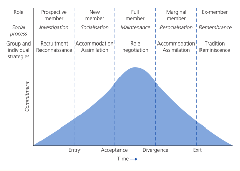
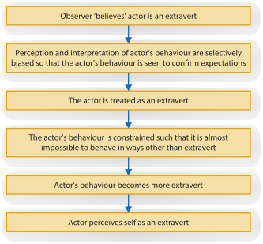

```{r setup, include=FALSE}
knitr::opts_chunk$set(echo = TRUE)
library(DiagrammeR)
```

### Week 1: What is Social Psychology? {.well}

<details>
<summary>LO1: How is social psychology defined, and how is it similar/different to other research areas?</summary>
</br>
**1. Definition of 'social psychology', and its three key components.**

* Social Psychology is: "...the scientific investigation of how the thoughts, feelings and behaviours of individuals are influenced by the actual, imagined and implied presence of others." Allport (1954)
* **Components:**
    * **Scientific Study:** Application of the scientific method (systematic observation, description and measurement) to the study of the human condition.
    * **How individuals think, feel and behave:**
        * Generally, social psychologists seek to establish general principles of attitude formation and change that apply in various social situations.
            * Private/non-conscious beliefs and attitudes.
            * Heroic, cowardly or mundane public behaviours
            * A wide variety/scope of behaviours in comparison to economists or political scientists.
    * **Social Contexts:**
        * Contexts can be observed ideally where feelings or behaviours:
            1. Concern other people (aggression due to hot weather)
            2. Influence over other people (Nike product endorsements)
        * Contexts can also be real or imagined:
            * Imagining a positive or negative reaction from others can have a significant effect on self esteem.
            * Imagining having contact with someone from another country, visiting and meeting the people of that country can be more positive.
            * Living a day in the life of a university professor can improve a student's performance on an analytic test.
            
**2. How can the content within social psychology be applied?**

* Climate scientists and governments apply social psychology findings to facilitate assessments, attitude change, and to shape behaviour (i.e. recycling, EVs, etc.)
* Community groups and local governments use social psychology findings to guide the implementation of group processes and prosocial behaviours.
* Judges and lawyers use social psychology findings to render decisions and refute/support evidence respectively.
* Businesses use social psychology to operate in a global market, as well as provide optimal working conditions for their employees.
* Healthcare providers use social psychology to examine social factors in the treatment and prevention of disease.

**3. Note the similarities and differences between social psychology and other related disciplines in the below table.**

| Field of Study         | Example of how a researcher in the field might study prejudice                                                                                                                           |
|:----------------------:|:-----------------------------------------------------------------------------------------------------------------------------------------------------------------------------------------|
| Sociology              | Measure how prejudice varies as a function of social or economic class.                                                                                                                  |
| Clinical Psychology    | Test various therapies for people with antisocial personalities who exhibit great degrees of prejudice.                                                                                  |
| Personality Psychology | Develop a questionnaire to identify men who are very high or low in degree of prejudice towards women.                                                                                   |
| Cognitive Psychology   | Manipulate exposure to a member of some category of people and measure the thoughts and concepts that are automatically activated. (intersection between cognitive and social psychology |
| Social Psychology      | Manipulate various kinds of contact between individuals of different groups and examine the effect of these manipulations on the degree of prejudice exhibited.                          |

**3a. Identify and note some areas of research in social psychology that share commonalities with disciplines such as sociology, and note which disciplines that are more individualistic in their focus when compared to social psychology.**


**4. Is social psychology just 'common sense'? Why are social psychologists interested in studying what most view as 'common sense'?**

* For many "common sense" notions, there is an equally sensible sounding contradiction: *"Birds of a feather flock together" vs. "Opposites Attract"*
* Common sense and intuition are not reliable ways to answer such questions.
* Social Psychology uses the scientific method to explore such questions.
* Even if not completely wrong, "common sense" or folk wisdom can be misleading in its simplicity.

</details>
<details>
<summary>LO2: What are levels of analysis (or explanation) and why is it important to social psychology?</summary>

*Reductionism* is a key conceptual part of these levels of analysis, suggesting that a social dynamic can be better explained by breaking the phenomenon into smaller, simpler components as in the different elements of a car.

The trouble with reductionism, however, is that by breaking down a phenomenon in this way, the original question remains unanswered.

- *Intrapersonal:* Analysis of how people construct and organise their social experiences (within person).
- *Interpersonal/Situational:* Study of the dynamics of relations between individuals in a particular situation at a particular moment.
- *Positional:* Examines interactions in a specific situation, with the role of status taken into account.
- *Ideological:* A between people analysis including social beliefs and social relationships between groups.

</details>
<details>
<summary>LO3: What is the person-situation interaction, and why is it important to social psychology?</summary>

$$Behaviour = f(person \times situation)$$

- The person/situation interaction is an element of social psychology which looks at the relationship between the two, understanding that they can influence each other.
- The variable characteristics of both the person and situation interact to determine the resulting behaviour.
- An understanding of personality is vital to understanding social behaviour.
- Social Psychologists also identify social context as a key concept in understanding social behaviour.
- The good Samaritan experiment showed that situational barriers can be far more influential than personality in some instances.

</details>
<details>
<summary>LO4: How does social psychology differentiate between cognition, affect, and behaviour?</summary>

- Three human capacities are required to successfully interact with others
- These capacities are interrelated, but are often discussed individually when conducting research.
- The focus of social psychology is on the interactions we have with each other in social situations, while acknowledging the role our ABCs have (both on ourselves and others) within a given situation.


</details>
<details>
<summary>LO5: What is the belonging hypothesis, and what role does it play in social psychology?</summary>

- The belonging hypothesis describes our basic need as humans to establish and maintain lasting, positive and significant relationships.
- The hypothesis is significant for all humans, and is not dependant on race, culture, religion or country of origin (i.e. it is a universal requirement).
- Diener & Seilgman (2002) found in their study that the primary difference in an individual's overall affect was the strength and quality of their social connections or attachments to others.
- People who are rejected, stigmatised or ostracised are more vulnerable to depression and health issues, and are more likely to experience distress.

</details>
<details>
<summary>LO6: How is ostracism defined, and what are the major findings regarding this concept?</summary>

- Ostracism can be described as the permanent or temporary, but deliberate exclusion of an individual from a social group.
- Heightened activation (as shown by fMRI) of the dorsal anterior cingulate cortex and the anterior insula has been observed in response to an ostracism event. These centres of the brain are also activated in the brain in response to physical pain.
- Ostracism can be viewed as a signal to members that their behaviour has been deemed as inappropriate or unacceptable by the group. The group may then exclude the individual completely, or allow sufficient time to pass for reassimilation into the group (overt or covert).
- Ostracism can be viewed as a protective measure for the group as a whole against destructive or damaging behaviour.

</details>
<details>
<summary>LO7: What are currently the major perspectives of social psychology?</summary>

**i. How has emotion and motivation been treated previously, and how have these concepts become integrated into social psychology research?**

- Emotion and motivation ('hot') were previously seen as distinct, and unimportant factors of being with emphasis placed on actions (conscious and unconscious) and cognition ('cold').
- Both 'hot' and 'cold' elements are now considered to influence each other.

**ii. How are evolutionary perspectives used in social psychology?**

- Evolutionary perspectives are investigated in social psychology to try and determine how an emotion such as jealousy has evolved from its ancestral origins.
- Social Psychology investigates gender differences in an emotion such as jealousy and situational differences that may elicit jealousy.

**iii. How is culture defined? What is cross cultural and multicultural research and how do they differ?**

- **Culture** can be defined as a system of perpetual meanings, beliefs, values, assumptions, institutions and practices shared by a large group of people, which is passed from one generation to the next.
- Our view of the world, and our interactions with it, are influenced heavily by our culture.
- **Cross-Cultural** research examines similarities and differences across different cultures.
- **Multi-Cultural** research examines differing racial and ethnic groups within cultures.
    - Collectivist vs. Individualistic cultures
    - 'Hot' and 'cold' and how groups navigate these conflicting (at times) influences.
    
**iv. What is behavioural economics and how is it related to social psychology?**

- Behavioural economics is a sub-discipline of social psychology, focusing on how cognitive and social psychology influence economic decision making.
- Jiang et al. (2015) found that a group of high school students who had experienced rejection became more materialistic.
- Traditional economic models alone do not allow for psychological factors that can influence our behaviour.

**v. What is social neuroscience, and what research has been conducted in the field?**

- **Social Neuroscience** investigates the brain activity activated via differing social activities, or the relationship between neural and social processes.
    - How playing violent video games can affect brain activity and further acts of aggression.
    - How neural activity can influence our perception of different members of a racial group.
- Our sensory input can also influence our perceptions of our world
    - Study found that participants judged a social interaction based on the type of surface they were touching at the time (rough surface - harsh interaction, smooth surface - pleasant interaction).
    - Higher self esteem and lower fear was reported when seated upright, compared to study participants seated in a slumped position.
- Evolution of the human brain can be linked to our social nature:
    - Stronger social bonds with friends and family are known to stave off disease such as heart disease, diabetes, and cancer, while promoting a longer life span.
    - Minority groups (indigenous Australians) are likely to have a stronger attachment to traditional culture and better life outcomes.
    - Positive social interactions stimulate the parts of the brain associated with pleasure and reward and vice versa.
    - A "broken heart" can be linked with the incidence of heart attack for those who have lost a partner.

**vi. Why are social psychologists interested in studying new technologies and the online world?**

- New technologies allow us to unobtrusively explore the brain:
    - Event-related potential (ERP)
    - Transcranial Magnetic Stimulation (TMS)
    - Magnetoencephalography (MEG)
    - Functional Magnetic Resonance Imaging (fMRI)
- Other applications of technology in social psychology include:
    - More efficient methods of recording hormone levels.
    - Presenting visual stimuli to a study participant to measure attention and reaction times.
    - Using Virtual reality to create social situations that would be unethical in real life, such as conformity, group dynamics, aggression/altruism, social support and eye witness testimony.
    - Greater/easier collaboration online between social psychologists all over the world (i18n).
    - Social media prompting research in attraction, prejudice and group dynamics, cyber bullying, isolation, depression, loneliness, and attentional problems.

</details>

### Week 2: Doing Social Psychology {.well}

<details>
<summary>LO1: What is the scientific method and why is it used in social psychology?</summary>

- The scientific method is used within social psychology to test and validate observations in order to avoid the misleading and contradictory nature of folk wisdom, and the "musings" of the naive scientist.
- Our observations of the social world are ambiguous, relative and contradictory.
- The scientific method aims to negate these characteristics through the systematic analysis and collection of observable (empirical) data.


</details>
<details>
<summary>LO2: What are a hypothesis and a theory? What does each attempt to do?</summary>

**i. What are hypotheses?**

- A hypothesis is an explicit, testable prediction surrounding the relationship between two or more elements derived from a theory.
- These predictions are then subjected to rigorous testing and, depending on the outcome, are either supported, refuted or rejected.

**ii. How is a theory different to a hypothesis? What does it add beyond a hypothesis?**

- A theory is an attempt to coherently explain all of the elements of a phenomena and outline its components, while a hypothesis is a test between two or more elements (variables) of a theory.
- A theory outlines the potential factors which can occur, or have been observed, within a phenomenon.

**iii. What action does a researcher take when predictions are either confirmed or disconfirmed? Do you prove hypotheses or not?**

_Confirmed:_

- The confirmation of a hypothesis increases our confidence in the existence of the relationship between the tested variables.
- New hypotheses (extending the theory), further research and better understanding of the phenomenon are attainable through the confirmation of a hypothesis.
- While a hypothesis cannot be proved in the strictest sense, it can be supported.
- This support means that others should be able to replicate the research results.
- Replication of a result (in a subsequent study) confirms that the relationship between tested variables was not accidental or fraudulent.

_Disconfirmed:_

- Reduces the confidence in a theory.
- Promotes modification of a theory and further research into the revised observations and outcomes of particular behaviour/s.
- Disconfirmation of a hypothesis can lead to rejection of a theory as a whole.

</details>
<details>
<summary>LO3: What is an operational definition, and how is it related to the ways we can measure variables?</summary>

**i. What is an operational definition? If you wanted to operationalise a variable you wanted to study, what is the key thing you would need to do?**

- An operational definition of a variable is the way in which the variable is measured or manipulated.
- In a study of aggression and it's variability through intoxication, an operational definition may look at ways of measuring (and manipulating) intoxication and may incorporate:
    - a BAC of 0.10 or more,
    - Self-reporting (Y or N)
    - A field sobriety test
    - Adjusting for gender
- The operational definition looks at how we take a human state from the conceptual or abstract to specific and operational.
- Variables such as aggression pose practical and ethical problems (we cannot let participants attack each other).
- Triplett's "social facilitation" study evidences greater effort when competing against another, rather than acting alone.
- The key thing required of an operational definition is to operationalise the independent variable/s so that it can be measured and manipulated.
    1. Consider an interesting question (theory)
    2. Generate a specific, testable prediction (hypothesis)
    3. Figure out a way to define and measure abstract concepts
- In Triplett's experiment, the variables could be:
    - _IV:_ "in the presence of others" (one vs. two players)
    - _DV:_ "perform better" (measure with a stopwatch)
    
**ii. What is construct validity? Why are social psychologists concerned about this construct when it comes to condicting research on social phenomena?**

- Construct validity refers to:
    - The extent to which the measures used in a study measure the variables they were intended to measure.
    - The extend to which the manipulations in an experiment manipulate the variables they were designed to manipulate.
- Social psychology is primarily the study of individual common experience our social world
- Construct validity is important to social psychologists as it ensures that the study itself is fit for purpose. That is that the cause and effect between variables are reliable:
    - Construct validity does its best to ensure that the conditions and results of an experiment can be replicated.
    - CV impacts the findings and our confidence in them.
    - Ensures the right data is collected for the study. i.e. avoiding mistakes.
    
**iii. What are the ways in which we can measure variables in social psychology and what are their pros/cons?**

**Self-Reports:**

- Participants disclose their thoughts, feelings, desires and actions (through surveys / sets of questions)

| Pros                                                             | Cons                                                                                                                                                                                 |
|------------------------------------------------------------------|--------------------------------------------------------------------------------------------------------------------------------------------------------------------------------------|
| - The use of existing scales and measures can simplify processes | - The desire to look good to ourselves and others can skew results.<br>- Question order or wording can influence responses.<br>- Participant's memory of past events or feelings can be poor |

**Observations:**

- Researchers watch and note participant behaviours, such as which of two items a participant selects, or how long people spend talking to each other.
- More elaborate observations require _interrelater reliability_, where researchers agree on the meaning behind particular, complex behaviours.

| Pros                                                                | Cons                                                                                                                                                                                                             |
|---------------------------------------------------------------------|------------------------------------------------------------------------------------------------------------------------------------------------------------------------------------------------------------------|
| - Avoid faulty recollections<br> - Avoid distorted interpretations. | - May be biased if participants know why they are being watched.<br> - Subtle observations may be required to overcome bias (i.e. seating<br> distance from others noted in studies about minorities and stigma. |

**Technology:**

- Measuring responses electronically, such as heart rate, hormonal levels, degrees of sexual arousal, as well as various types of technology used for imaging.
- The benefits of technology largely revolve around the distinct patterns of brain activity revealed unobtrusively.

**iv. Define the terms "Independent Variable" and "Dependent Variable"**

**IV:** A factor that researchers manipulate to determine the influence it has (i.e. intoxication on aggression).
**DV:** A factor researchers use to determine whether a change in the IV has an effect.

</details>
<details>
<summary>LO4: What are the major types of research methods used in social psychology, and what are their advantages and disadvantages?</summary>

</br>

**What are the non-experimental methods of descriptive research and correlational research?**

| Descriptive                                                                                                                                                                                                                                  | Correlational                                                                                                                                                                                                                                                                                                             |
|----------------------------------------------------------------------------------------------------------------------------------------------------------------------------------------------------------------------------------------------|---------------------------------------------------------------------------------------------------------------------------------------------------------------------------------------------------------------------------------------------------------------------------------------------------------------------------|
| - Used to describe how frequently or commonly people think, feel, or behave in a particular way.<br> - i.e. Do most people support capital punishment? What do men and women report is most likely<br>to make them jealous in a relationship | - Research used to identify the strength and direction of a relationship between variables, or how well one can predict the other.<br> - Cannot Demonstrate cause and effect.<br> - 3 possible relationships (A &rarr; B, A &larr; B, A &rarr; C &rarr; B).<br> - 3 possible relationships (positive, negative, none).<br>- 3 possible strengths (strong, moderate, weak) |

**Why do researchers use non-experimental methods like descriptive and correlational research? What can descriptive research tell us specifically (and can't tell us)? What about correlational research?**

| Descriptive                                                                                                                                                                                                                                                                                  | Correlational                                                                                                                                                                                                                                                  |
|----------------------------------------------------------------------------------------------------------------------------------------------------------------------------------------------------------------------------------------------------------------------------------------------|----------------------------------------------------------------------------------------------------------------------------------------------------------------------------------------------------------------------------------------------------------------|
| - Used to discover trends and tendencies within populations<br> about topics like climate change, jealousy, or capital punishment.<br> - Whom and where rather than how and why.<br> - Cannot tell us about cause and effect. - Demonstrates relationships and describes the world as it is. | - Research used to demonstrate the strength and direction of a relationship,<br> or even that there is no relationship at all.<br> - Cannot tell us about the cause and effect of a relationship.<br> - Only considers the relationship between two variables. |

**Your reading and the lecture identifies many types of non-experimental methods, such as:**

a. **Archival research;**
b. **Case studies;**
c. **Discourse analysis;**
d. **Survey research;**
e. **Field studies;**
f. **Observational studies; and**
g. **Qualitative research.**

**For each method, ensure that you can:**

i. **Describe the method;**
ii. **Provide a research example that might use it;**
iii. **List the advantages of using the method;**
iv. **List the disadvantages of using the method.**

| Non-Experimental<br>Method | Description                                                                                                                      | Research<br>Example                                                                                     | Pros                                                                                                                                                                                                         | Cons                                                                                                                                                                                                                                                  |
|----------------------------|----------------------------------------------------------------------------------------------------------------------------------|---------------------------------------------------------------------------------------------------------|--------------------------------------------------------------------------------------------------------------------------------------------------------------------------------------------------------------|-------------------------------------------------------------------------------------------------------------------------------------------------------------------------------------------------------------------------------------------------------|
| Archival Studies           | Examining existing records of past events and behaviours.                                                                        | - Changes to the rate of violent crime over time.<br> - Differences in homicide rates around the world. | - Influence is avoided as information is obtained after the fact.                                                                                                                                            | - Records are not always complete, or detailed - May have been collected in a non-systematic manner.                                                                                                                                                  |
| Case Study                 | In-depth analysis of a single case (person, group or event)<br> of unusual or rare phenomena that cannot be replicated in a lab. | - Mass murderers, bizarre cults or terrible disasters                                                   | - Can employ a wide variety of information sources.<br>- Useful as a source of hypotheses.<br>                                                                                                               | - Findings can be compromised by researcher bias.<br> - Prone to participant bias and evaluation apprehension.<br> - Findings may not easily be generalised to the population.                                                                        |
| Discourse Analysis         | A variant of the case study focusing on what people actually<br> in conversation with a focus on the underlying themes.          | - Exposing racist attitudes in Western societies.                                                       | - When well executed, can help uncover themes and attitudes<br>that people are careful to hide.                                                                                                              | - Interpretation of discourse relies heavily on the expertise of the facilitator.<br> - Is prone to subjectivity or bias.                                                                                                                             |
| Survey Research            | Involves asking people questions about their attitudes,<br> beliefs and behaviours.                                              | - Best remedy for hiccups.<br> - Political attitudes/preferences.                                       | - Flexible in their delivery (over the phone, via email, via website, in person.<br> - Helpful where observations are unethical (sexual behaviour, optimism about the future).                               | - Require careful design, construction and interpretation so as not to lead participants.<br> - Results can generally be associated with the larger population if a sample size is large enough.<br> -                                                |
| Field Studies              | 'Invisible' researcher observes, codes and records naturally<br>  behaviour. (Similar to a Field Experiment)                     | - Gathering of observational data in a field setting,<br> such as people's preferences when shopping.   | - Non-intrusive.<br>                                                                                                                                                                                         | - Observing spontaneous behaviours in a natural setting.<br> - Prone to bias and unintended impact of researcher's actions.<br> - Lacking objectivity and making poor generalsiations.<br>                                                            |
| Observational Studies      | Similar to field studies where behaviour is recorded from a<br> distance, or via the use of technology.                          | - Patterns of behaviour in the schoolyard around bullying.                                              | - Natural behaviours are witnessed. - Can be useful ins situations (like bullying) where the participants are likely to be<br> uncooperative.                                                                | - Results are prone to bias and misinterpretation (researchers and participants).<br> - Possibility of low objectivity (unseen behaviours or events).<br> - May require "deception" through hidden cameras to negate unintended researcher influence. |
| Qualitative Studies        | A type of study intended to discover the meaning of a behaviour<br> to that individual.                                          |                                                                                                         | - Specific to the individual.<br> - Looks at the quality and texture of an individual's experience/s.<br> - Can involve a number of data sources: diaries, open-ended questions, case studies, focus groups. | - Time consuming data collection process.<br> - High level of expertise required by researcher.<br>                                                                                                                                                   |

**What is a correlation coefficient? What does it show researchers? Be sure that you understand the distinction between correlation and causation, and how correlations demonstrate the nature of relationships between variables.**

$$\rho(X,Y) = \frac{cov(X,Y)}{\sigma_{X}\sigma_{Y}}$$

- Returns a result from -1.0 to +1.0
- Shows the strength and direction of a relationship between two variables.
- Shows the strength (strong, weak, moderate) and direction (positive, negative, none) of this relationship.

**What is an experiment, and why do researchers use the experimental method? What can experimental research tell us specifically (and what can't it tell us)?**

- Seeks to determine the cause and effect between an IV and DV.
- Experimenter can determine this because:
    - Experimenter has control over events, and
    - Participants are randomly assigned to conditions.
- An experiment eliminates the influence of factors outside the manipulation (conducted in a lab), increasing the confidence of results.

**What is random sampling and random assignment, how do they differ, and why are they important to experiments?You may be interested to know that many social psychologists use the web resource: Research Randomiser. It is an interactive tool for random sampling and random assignment. Click the link and have a go at randomising some experiments!**

- _Random Sampling_ involves the selection of participants from a representative section of the population to gather data (i.e. Uni students, mothers, males, cyclists).
- _Random Assignment_ involves allocation of participants (already selected to participate) of a study to a particular condition, preventing results from being impacted by a participant's pre-existing differences.

**Imagine you wish to conduct two experimental studies:**

a. **the laboratory experiment; and**
b. **the field experiment.**

**For each method, ensure that you can:**

i. **describe the method;**
ii. **provide a research example that might use it;**
iii. **list the advantages of using the method;**
iv. **list the disadvantages of using the method.**

| Experimental<br>Method | Description                                                               | Research<br>Example                                                                               | Pros                                                                                                    | Cons                                                                                                                                                                                                                                                                                                                                                   |
|------------------------|---------------------------------------------------------------------------|---------------------------------------------------------------------------------------------------|---------------------------------------------------------------------------------------------------------|--------------------------------------------------------------------------------------------------------------------------------------------------------------------------------------------------------------------------------------------------------------------------------------------------------------------------------------------------------|
| Lab Experiment         | Conducted in a lab to determine the cause and effect the IV has on the DV | - Effect of intoxication on aggression.<br>- Effect of pairing on performance of a physical task. | - Controlled environment to predictable results.<br> - High internal validity and experimental realism. | - May be prone to demand characteristics (evaluation apprehension or social desirability).<br> - May be prone to experimenter effects (Accidental clues given to participants regarding purpose of study or desired results).<br> - Results may not be generalised to the population outside the lab.<br> - Low external validity and mundane realism. |
| Field Experiment       | Conducted outside a lab to observe natural behaviours.                    | - How pedestrians react to traffic light changes                                                  | - People are more likely to behave naturally.<br> - High external validity and mundane realism.         | - Less control of the exposure to events.<br> - Low internal validity and experimental realism.<br> - Random assignment can be difficult.<br> - Subjective behaviours cannot be measured (only overt).                                                                                                                                                 |

**Make sure that you understand that laboratory experiments are intentionally low on external validity (mundane realism) but high on internal validity (experimental realism). Be able to define these terms.**

- Lab experiments are intentionally low on mundane realism and external validity as they are conducted to examine the specific cause/effect relationship between a defined set of variables.
- Lab experiments are high on experimental realism (participant engagement) to try and ensure that the responses received are natural and spontaneous, or free from bias (self-reports).
- **External validity** refers to the extent to which we can be confident that the results of a study can be replicated by other groups of people (i.e. in other situations).
- **Internal validity** refers to the extent to which we can be confident that the IV in an experiment caused the effect obtained on the DV.

**Why does social psychology often use deception in their studies? What can this look like?**

- Deception can increase experimental realism
- Allows the experimenter to create situations difficult to generate in real life.
- Research shows that participants often enjoy experiments where some manipulation is involved.
- Examples of deception include the use of confederates (researchers posing as participants) to introduce misinformation to the group.

</details>
<details>
<summary>LO5: What are the ethical issues that social psychologists need to consider in their research and why?</summary>
</br>

**What ethical principles have received the most attention, and give examples of how each principle can be violated in social psychological research?**

- **Physical Welfare of Participants**
- Physical harm through such actions as electric shocks (operand conditioning) is an example of physical harm, particularly in the case of burn marks.
- Other forms of harm may include advising a participant that they have performed badly on a test.
- **Respect for Privacy:** Participants are often asked to personal questions, can be observed without their knowledge, or have their moods, perceptions and behaviour manipulated.
- Data gathered from participants should be advised that details offered will be handled confidentially, and/or anonymously.
- **Use of deception:** While experimenters often use deception to ensure responses are spontaneous, the risk involved with manipulating the cognition, feelings and behaviour of participants is ever present.
- **Informed Consent:** Researchers cannot lie or withhold information to participants about the nature of a study in order to convince people to participate.
- There should be no pressure to participate, or resistance in the event that a participant no longer wishes to take part.\

**Note when and why deception might be used in social psychological research. Think about whether or when you would be prepared to use deception in research.**

- The primary reason for the use of deception in social psychology research involves the promotion of spontaneous and genuine responses from participants.
- While around 50-75% of studies use some form of manipulation, most are considered minor, and serve to obscure the real reason behind the study to ensure that genuine responses are received.

**What is debriefing?**

- **Debriefing** involves the participants being advised of the conditions of the experiment on completion.
- They are commonly advised of processes used, results, the outcome and why (if any) deception was used.
- May be necessary to resolve any negative feelings that may occur.

</details>
### Week 3: Social Cognition & Perception {.well}

<details>
<summary>LO1: What are the major theoretical perspectives of social cognition, and what assumptions do they hold?</summary>

**Define the terms 'social cognition' and 'social perception', and outline how they differ.**

**Outline the major assumptions of the following broad approaches to social cognition, as found in social psychology:**

a. **cognitive consistency;**
b. **naive scientist;**
c. **cognitive miser; and**
d. **motivated tactician.**

</details>
<details>
<summary>LO2: What is impression formation, and what key factors contribute to impression formation?</summary>

**What are central and peripheral traits? Provide an example of each.**

**What did Asch do to test his ideas and what were his findings?**

**What criticisms have been made regarding the concept of central trait? (Note the role of personal constructs and implicit personality theories).**

**What are the primacy effect and recency effect? Provide an example of each.**

**How do physical cues feed into our impression formations? Provide a summary of a research finding in this area.**

**What are the positivity and negativity biases? Identify a reason why it might be more difficult to change a negative impression, once it is formed, than a positive impression.**

</details>
<details>
<summary>LO3: How are schemas, categories, prototypes, exemplars, and stereotypes defined, how do they differ, and what are some examples of each?</summary>

**Define the term ‘schema’ and identify the type of cognitive processing that a schema facilitates once it is invoked. (Note that the plural is either ‘schemas’ or ‘schemata’.)**

**Define and identify examples of each of the following types of schemas:**

a. **person schemas;**
b. **role schemas;**
c. **event schemas (scripts);**
d. **content-free schemas;**
e. **self-schemas.**

**What is meant by the term ‘family resemblance’?**

**What are ‘prototypes’? (Note that they are used to assess family resemblance.)**

**What sort of relationship between ‘categories’ is thought to exist?**

**Distinguish between prototypes and exemplars and ensure you understand the difference between prototypes and schemas (go back to earlier definition if necessary).**

**Note the definition of stereotypes. Briefly overview five things research has told us about stereotypes.**

**What is Tajfel’s accentuation principle and how does it relate to stereotyping?**

</details>
<details>
<summary>LO4: How are schemas acquired and used, and how do they develop and change over time?</summary>

**What sorts of schemas are especially likely to be used or invoked?**

**What happens when people need to use more accurate schemas? What happens if the costs of indecision are high?**

**Explain the role of experience when it comes to schema acquisition.**

**Briefly describe the processes of schema change as suggested by Rothbart (1981).**

</details>
<details>
<summary>LO5: What is social encoding, and what are the steps involved in this process?</summary>

**What is ‘social encoding’? (Note the various stages of this process.)**

**Social encoding is affected by factors such as stimuli salience. What is ‘salience’? What are the antecedents and consequences of salience?**

**Encoding can also be affected by the accessibility of categories or schemas. What does ‘accessibility’ mean?**

**‘Priming’ is a term that refers to the activation of a cognitive representation to increase its accessibility to make it more likely to be used. What happens once a category is primed?**

</details>
<details>
<summary>LO6: What major biases and shortcuts exist in making social inferences, especially when it comes to heuristics?  </summary>

**What is a social inference? Distinguish between the approaches that have been used to describe the processes of social inference.**

**Define ‘illusory correlation’. Your text discusses two bases for illusory correlation:**

a. **associative meaning; and**
b. **paired distinctiveness.**

**Define each of these terms and explain how they may help to explain stereotyping.**

**Define ‘heuristics’. Your text identifies three main types of heuristics:**

a. **the representativeness heuristic;**
b. **the availability heuristic; and**
c. **the anchoring and adjustment.**

**Write down examples of each of these types of heuristics.**

</details>
<details>
<summary>LO7: What types of attributions exist, and what are the core tenets of major attributional theories?</summary>

**The distinction between dispositional (internal) and situational (external) attribution is important. Define and provide an example of each of these terms.**

**What is Kelley’s (1967, 1973) covariation model? Define and provide examples of consensus information, consistency information, and distinctiveness information and make sure you understand what it means when information is high or low in terms of these dimensions.**

**Identify the dimensions that, according to Weiner, affect our explanations for task performance.**

**Note the eight different types of explanations that people can draw. - (Consult Figure 2.4 on page 47). Identify which particular combinations of dimensions Weiner suggested would result in these different types of explanations of task performance.**

**What is Bem’s self-perception theory?**

**What are attributional styles? Provide examples.**

</details>
<details>
<summary>LO8: How are attributional biases defined, and what are some examples for each?</summary>

**What is meant by the term 'correspondence bias'? What is another term for it?**

**What is meant by the term ‘actor-observer effect’? Think of some personal examples of the actor-observer effect.**

**What are the main explanations for the ‘actor-observer effect’?**

**What is the ‘false consensus effect’? Describe the classic Ross, Greene and House (1977) experiment ("Eat at Joe's" experiment).**

**What are self-serving biases? Note the distinction between self-enhancing biases and self-protecting biases.**

**What explanations exist for self-serving biases?**

</details>
<details>
<summary>LO9: What is inter-group attribution, and how do we define biases that affect inter-group attribution? </summary>

**What are inter-group attributions? Describe their characteristics and provide one example.**

**What is the 'ultimate attribution error'? How is it similar to self-serving biases?**

**How might inter-group attributions serve to maintain prejudice?**

</details>

### Week 4: Emotions and Affect {.well}

<details>
<summary></summary>

</details>
<details>
<summary></summary>

</details>
<details>
<summary></summary>

</details>
<details>
<summary></summary>

</details>
<details>
<summary></summary>

</details>
<details>
<summary></summary>

</details>
<details>
<summary></summary>

</details>

### Week 5: Self and Identity {.well}

<details>
<summary></summary>

</details>
<details>
<summary></summary>

</details>
<details>
<summary></summary>

</details>
<details>
<summary></summary>

</details>
<details>
<summary></summary>

</details>
<details>
<summary></summary>

</details>
<details>
<summary></summary>

</details>

### Week 6: Attitudes and Persuasion {.well}

<details>
<summary></summary>

</details>
<details>
<summary></summary>

</details>
<details>
<summary></summary>

</details>
<details>
<summary></summary>

</details>
<details>
<summary></summary>

</details>
<details>
<summary></summary>

</details>
<details>
<summary></summary>

</details>

### Week 7: Social Influence {.well}

<details>
<summary>LO1: How are the terms 'conformity', 'compliance' and 'obedience' described, and how do these concepts differ?</summary>

- *Conformity:*
  - People change their attitude or behaviour to follow a social norm.
  - We tend to change with positive reference groups, or groups that are significant to us.
- *Compliance:*
  - People change their attitude or behaviour due to:
    - A request from others
    - Coercion, or
    - Group pressure.
  - Tends to be:
    - Superficial,
    - Public (only)
    - Transitory change in behaviour and repressed attitudes.
- *Obedience (to authority):*
  - People change their attitude or behaviour because of a direct order from an authority figure.

</details>
<details>
<summary>LO2: What are norms, and how does Sherif's classic study explain how norms form?</summary>

**i. Define 'norms' and identify how norms are relevant to the topic of social influence.**

- Norms are attitudinal and behavioural standards that are closely held between members of a social group, and which differentiate us from social groups we are not members of.
- 'Is' and 'ought' statements about what is acceptable within a group.
- Norms (in-group) and stereotypes (out-group) share common characteristics.

**ii. What is the difference between explicit and implicit norms?**

- Explicit norms are enforced by legislation (private property, pollution, aggression).
- Implicit norms are unobserved or taken-for-granted rules around everyday life (also labelled as native, instinctive or innate).
- Garfinkel (1967) tested the existence of these norms through ethnomethodology: the deliberate violation of such norms.
- Family members behaving as they were boarders within their own family home, prompting their families to react with astonishment, anger, shock and embarrassment.
- Newcomb (1965) discovered the change in student's political views were quite distinct between first year (conservative) and third year (liberal or socialist).
- Norms are resistant to change sa hey provide a framework for our social lives, however, can become redundant as circumstances change.
- Norms can also be narrow/restrictive (military dress code) or less restrictive (student/lecturer dress code).

**iii. What did Sherif (1936) argue? Describe Sherif's classic experiment and explain it's implications. Also ensure you can define 'frames of reference'.**

- Sherif argued that the formation of norms comes about through group influence above individual perceptions.
- In order to be certain of our thoughts, feelings and actions we use the behaviours of others as an informative guide.
- This 'frame of reference' guides our social comparisons in a specific situation, with norms developing over various encounters with others of our in-group.
- This was further demonstrated by inserting confederates within an experiment group, with an extreme norm formulated.
- The graduates were gradually replaced with new members, until the group contained no original members.
- The introduced norm persisted through all iterations of the group.

</details>
<details>
<summary>LO3: What are the major findings of Asch's studies of conformity, and how do the theoretical approaches to explaining conformity differ?</summary>

**i. What did Asch (1952) argue? and how did this differ from Sherif? Describe his classic experiment and experimental results. Ensure that you can define 'conformity'.**

- Asch's primary argument was that Sherif's norm was ambiguous, and the group constructed the norm from this as the study progressed.
- He argued that the norm should be established so that participant's responses could be measured between/against each other.
- With an established norm, the variations of behaviour from participants would have more of a real world impact and a finite set.
- He also hypothesised that with a defined object of judgement (line lengths), individual responses would not be impacted by the group (line A, B, C vs. Standard)3
- Conformity refers to an individual's attitude or behaviour adjustment in line with the social norm.
- We tend to change our attitudes in order to sync with social groups that are important to us.

**ii. What individual and group characteristics have been found to affect conformity? What 'situational factors' have been found to affect conformity?**

- *Individual:*
  - Low self-esteem.
  - Low intelligence.
  - High need for social support/approval.
  - Need for self-control.
  - Feelings of self-blame and insecurity within a group.
  - The same individual does not confirm in all situations.
  - Feelings of low group status.
  - Authoritarian personality.
  - High anxiety.
- *Gender:*
  - Women are more likely to conform than men, particularly in tasks where familiarity is lower than that of men.
  - Men are generally more conformist in matters that women are more experienced/knowledgeable at.
  - Both groups are more equal on gender neutral items.
- *Culture:*
  - On average people from collectivist cultures are higher in conformity than those from western cultures.
  - Conformity in eastern cultures is viewed more favourably than in western cultures.
  - Western conformity is still quite high, regardless of the negative implications/overtones.
- *Context:*
  - Rates of conformity can level off as the group grows beyond 3 or 4 people.
  - Unanimity is a greater predictor of conformity.
  - Supporters, deviants and dissenters reduce conformity (as the group size grows) and unanimity is reduced.
  
**iii. Define and differentiate between 'informational inference', 'normative inference', and 'referent informational  influence'.**

- *Informational Influence*
  - Brings about change as we need to be sure of our decisions in the presence of social disagreement or ambiguous stimuli.
  - Informational influence brings about true cognitive change as we formulate our attitudes based on information provided by another, or through examination of reality.
  - Informational influence rules in times of certainty, not doubt.
- *Normative Influence:*
  - Cognitive change comes about through our need for social approval, and avoidance of social disapproval.
  - We believe the group has the ability to reward or punish us in these types of scenarios.
  - Creates surface compliance rather than cognitive change.
  - Principle method of conformity in the Asch design.
- *Referent Informational Influence:*
  - Refers to the type of conformity adhered to as a means of identifying or signalling belonging to a social group.
  - This type of influence is modelled by the other members of our in-group and this information is adopted.
  - This type of influence differs from the above so people are identified as members of a group, rather than belonging through avoidance of social disapproval or validating reality.

- We confirm to a norm rather than to other people.
- We also conform to a norm in the absence of rather than the direct influence of others.

</details>
<details>
<summary>LO4: What key tactics are utilised for enhancing compliance, including multiple request tactics?</summary>

**i. How is compliance defined? How does compliance differ from authority?**

- Compliance can be defined as a direct request from another with a behavioural response, whereas conformity refers to a change in behaviour or beliefs as a response to group pressure.

**ii. What are the different types of strategies that people cab adopt to maximise the chances of compliance with a direct request? Make sure you can define the terms 'ingratiation' and reciprocity principle'.**

- Ingratiation is a tactic employed by salespeople to convince others, where agreeing with others or getting them to like us assists in their acceptance of our requests.
- Other examples of this include: appearing to make them feel good, making yourself look attractive, paying compliments, dropping names, and physical touch in a socially acceptable way.
- This method can backfire if insincerity is detected.
- The **Reciprocity Principle** relies on the convention of treating others as they should treat us.
- Guilt arousal is a key feature of this principle:
  - Agreeing to donate blood,
  - Donating to a cause to save trees, or
  - Participating in a university study.

**iii. What are multiple request tactics?**

- Multiple request tactics use a two step process, where a leading question or request opens the door for a second real request.

**iv. Describe the 3 classic techniques for inducing compliance and note the research finding for each.**

- *Foot in the door tactic:*
  - If someone agrees to a small initial request, they are more likely to agree to a larger second (real) request.
  - Freedman and Fraser (1966). Participants approached with a 6 item questionnaire were more likely to agree to a later request of a full house inventory of soap brands. The group that were approached directly with the second, larger request (22% agreement) were less compliant then the group who agreed to the smaller initial request (53% agreement).
  - If the initial request is too small, or the second is too large, this relationship breaks down (Foss and Dempsey, 1979)
  - Saks (1978) found that finely tuned requests can prompt people to agree to such things as organ donation.
  - 'Two feet in the door': Multiple requests that increase in complexity can be more effective than the foot in the door technique (Goldman, Creason and McCall, 1981).
  - Dating is a good example of a graded request.
  - Dolinski (2000) confirmed the FITD paradigm with participants giving directions to a non-existent street, and then minding a big bag so that a confederate could visit a friend.
  - Bem's (1967) Self Perception theory provides the most relevant explanation. Agreeing to the smaller initial request prompts people to view themselves as altruistic, with later requests seen as consistent (allowing them to avoid cognitive dissonance).
  - Cialdini and Trost (1998) suggest that self-consistency or managing our self view is the likely explanation of repeated altruistic acts.
  - Gorassini and Olson (1995) suggest the FITD tactic alters people's interpretation of an event, instead activating compliant attitudes.
- *Door in the face tactic:*
  - When the FITD tactic fails, we can opt for this tactic, to lead with a larger request, and follow up with the smaller request as a route 'in'.
  - Politicians prompting the public with a '30% tax increase' then confirming later it will be 'only' a 10% increase.
  - Cialdini et al. (1970) lead a study requesting volunteers counsel youth offenders for two years with almost no takers. They then reduced the request to a 2 hour chaperone at the zoo (50% agreement).
  - When the zoo visit was requested first, only 17% complied.
  - This tactic is more effective when both requests are posed by the same person.
  - The second request seems more reasonable than the first, larger one, prompting compliance.
- *The low ball tactic:*
  - This technique relies on initial agreement, after which hidden costs are revealed.
  - Once people are committed to an action, they are more likely to remain committed regardless of the sunk costs (Fox and Hoffmann, 2002).
  A common example of this is the leading questions "Can you do me a favour?" before you know what the favour is.
- *Video: The 7 Principles of Persuasion:*
  - Reciprocity
  - Scarcity
  - Authority
  - Consistency
  - Liking
  - Social Proof
  - Unity

</details>
<details>
<summary>LO5: What are the major findings of Milgram's studies of obedience, including what factors influence obedience?</summary>

**i. Describe Milgram's famous obedience experiment.**

- Teacher (participant)
- Student (confederate)
- Researcher
- Apparent electric shocks are delivered at increments of 15v for each wrong answer of paired associates.
- Long episode of preparation (attaching electrodes, "I have a heart condition", etc.)
- Teacher taken to a separate room and introduced to the generator with ominous looking label (15v = slight, 450v = XXX)
- Confederates increasingly complain of pain.
- Researcher assuaged teacher's protests with increasingly authoritative statements through higher voltages.
- Panel of 110 experts (including psychologists) incorrectly predicted the influence of authority.
- 100% of the teachers obeyed until the voltage reached about 200 - 300v.

**ii. What factors did Milgram identify as contributors to the influence of obedience?**

- *Immediacy:*
  - The proximity of the 'victim' impacted the duration of the experiment.
  - If victims were unheard and unseen by the teacher, 100% of the teachers went to the end of the machine's scale.
  - The closer the victim and teacher, the shorter the experiment.
  - Obedience was still as high as 30% where teachers had to hold the victim's hand on the electrode.
- *Immediacy of authority figure:*
  - Obedience dropped to around 20.5% where the AF was relaying commands by telephone.
  - Where no orders were given, the teacher's choice reduced obedience to 2.5% to the end of the machine's scale.
  - Disobedient confederate teachers reduced obedience to 10%.
  - Obedient confederates increased group obedience to 95%.
- *Legitimacy of Authority Figure:*
  - Parking meter study with confederate in various states of appearance (uniform, neat, shabby, etc.) with over 70% of passers by giving money on orders from the uniformed confederate.
- *Setting/Environment:*
  - Obedience dropped (48%) when the experiment was conducted in a run-down building compared to an official looking lab.
  
**iii. What are the ethical issues raised by Milgram's study?**

- The ethical issues of the study included:
  - Informed Consent, lack of debrief afterwards, advice on withdrawal at any stage without penalty, improper use of deception
  - Objective importance of the study.

**iv. How might we carry out research connected to Milgram's study while still conforming to ethical guidelines?**

- Adapting the study to include consent, advising their right to withdraw at any time, giving a full debriefing at the end of the study.
- The study could also be adapted to another type of test including electric shock...for example, the suggestion of electric shock with a debriefing.

**v. Would Milgram's results yield the same results if they were repeated today? Why or why not?**

- Milgram's experiment was a very visceral scenario for the teacher/participant, so being able to replicate this and it's results may not be possible under modern guidelines.
- The deception and cover story would need to be convincing to modern participants while upholding scientific rigour.

</details>
<details>
<summary>LO6: What different processes are involved in majority and minority influence, and what key factors impact how influential a minority can be?</summary>

**i. What is minority influence? List two examples. What does minority influence help to explain?**

- Minority influence refers to the ability an outnumbered social group can have in changing attitudes.
- In Asch's studies a lone deviant was laughed at, while a numerical minority (9 vs 11) was listened to, although individual opinion did not change.
- Examples of minority influence include:
  - Suffragettes and the women's vote,
  - Anti-war rallies of the 60s and the withdrawal from Vietnam,
  - Nuclear disarmament,
  - Greenpeace (high profile and wide publicity)
- Minority influence helps to explain social/attitude changes.

**ii. What alternative explanation for Asch's results was provided by Moscovici and Faucheux?**

- It was suggested that, in part at least, majority views are just accepted by in group members, and that the doubt posed by minority is a chance to re-examine attitudes and beliefs for a better answer or norm.
- The context also plays a part. Moscovici determined that the lone deviate represents:
  - A rather large majority outside the experiment, who would judge the line lengths correctly.
  - The deviate is also then confronted by a minority, being the confederates.
  - The deviate may then be influenced by the minority.

**iii. What are the 3 ways that people respond to social conflict according to Moscovici?**

- Conflict of this nature within groups leads to:
 - *Conformity:* The minority is persuaded by the majority.
 - *Normalising:* compromise leading to convergence.
 - *Innovating:* the minority challenges the majority view to persuade change.

**iv. According to Moscovici et al, what is the most important behavioural style that can be used by a minority group to influence a majority? Why?**

- The most important behavioural style a minority can adopt is consistency, because:
  - It helps foster uncertainty and doubt within the majority,
  - The minority draws attention to itself,
  - The minority conveys an alternative, coherent point of view,
  - The minority also demonstrates certainty and commitment,
  - The only solution to the social conflict is adoption of the minority point of view.
- Effective minorities overall are:
  - Consistent,
  - Hold consensus within the group,
  - Flexible in style,
  - Unmotivated by self interest or external pressures.

**v. Describe and note the major findings of the classic blue-green studies.**

- The consistent minority had greater influence than the inconsistent minority
- Conformity rate is much lower against a consistent minority.
- Moscovici and Lage (1976) compared consistent/inconsistent majorities/minorities.
- The only minority to produce conformity was the consistent one.
- The ONLY participants to change their response from blue to green were those in the consistent minority group.

**vi. According to Moscovici, what are the different sorts of change brought about by majority and minority influence? What is a 'conversion effect'?   **

- *Majority Influence* brings about direct public compliance through normative and informational dependence, and passive acceptance.
- *Minority Influence* brings about indirect or latent private attitude change in line with cognitive dissonance and it's resolution.
- Conversion effect is a sudden and dramatic change in attitude brought about through active consideration of the minority point of view.

**vii. What is the main argument of 'social impact theory' and to what extent can this explain minority influence?**

- The main argument of social impact theory is that as a source of influence grows in size (number of members) it has more influence.
- As the size of the source grows, however, the cumulative impact of the group diminishes.
- For example, turning on lights at home until the change of each additional light is barely noticable.

### Week 8: Group Processes {.well}

<details>
<summary>LO1: What is a group, and what types exist?</summary>

>A group has been identified as two or more people experiencing some common fate, or as a collection of individuals who coexist within some social structure or interact face to face.


</details>
<details>
<summary>LO2: What is the social facilitation effect and what are some of the major explanations for this effect?</summary>

**i. What do social psychologists mean when they discuss 'fuzzy sets' and 'entativity'?**

- *Fuzzy Sets:*
  - These are overlapping and related characteristics shared between people that do not independently identify a group's members.
  - For example, we cannot identify all French speakers as being French due to the numerous regions around the world where French is a commonly spoken language.
- *Entativity:*
  - Refers to the members of a group being more clearly defined and having a greater commonality than that of others.
  - Generally has a clear structure, is relatively homogeneous, and quite distinct from other groups.
  - Might look like a Venn diagram with clearer boundaries (depending on their entativity) than other groups, having blurry outlines, or perhaps a gradient or bleed into grey/white.

**ii. Describe Triplett's (1898) classic study. What is meant by the term 'social facilitation'?**

- Triplett's study measured the performance (over time) of children on completion of a simple physical task when performing both alone and in competition (in front of an audience).
- 'Social facilitation' describes the positive effect that the presence of others has in fuelling improvements in performance.

**iii. What is Zajone's (1965) drive theory of social facilitation?**

- Drive theory describes the possible effect that the presence of others can have on us.
- Performance improvement has been noted with species of animals. There is an advantage to the species through the increase of arousal (alertness and readiness for action).
- Such arousal can 'drive' our performance of well learned or practised skills (dominant response).
- If our dominant response is not suited to the task at hand (for skills not well practised), the effect on performance can be impairment (also known as social inhibition).
- Impairment can also result through the action of difficult (because they may not be practised) tasks.

**iv. What is Cottrell's (1972) evaluation apprehension model? How does this differ from Zajone and Triplett?**

- Cottrell's model suggested that social judgements of reward/punishment were the catalyst for apprehension, and subsequent impaired performance of a given task.
- This theory differs from that of Zajone and Triplett as it is a demotivating/impedance theory, whereas Zajone and Triplett's theories are based around the fuelling of motivation/drive.
- Schmitt et al. (1986) determined that there was a mild decrease in the time taken to complete a simple task alone in mere presence and evaluation apprehension states.
- Difficult tasks were completed relatively slower across the alone, evaluative apprehension and mere presence states respectively.

**v. What did Steiner (1972; 1976) propose? Be sure to use the term 'co-ordination loss' in your answer.**

- Steiner proposed that interactive groups suffer from a *co-ordination loss* or deterioration in group performance due to a lack of coherence (members not pulling their weight) within the group.
- The co-ordination can be negatively impacted where individual members become distracted/lose interest in the group goals, and their contributions are drowned out by the more influential members of the group.
- Lopsided team performance leading to a lack of co-ordination between team members.

</details>
<details>
<summary>LO3: What processes underpin social loafing, and what factors influence how much we engage in social loafing?</summary>

**i. What is social loafing, and what reasons have been given to explain this phenomenon?**

- Social loafing refers to the loss of motivation of team members within a group settings, and can be attributed to:
  - We exert lower effort as we may believe that others are also working on that task.
  - The impact of each additional team member as the group grows in size lessens (i.e. 1 + 1 has a larger impact than 19 + 1).
  - *Output equity:* We believe that others loaf, so we do too.
  - *Evaluation apprehension:* We worry about negative social evaluations, but when anonymous (such as in a larger group) we hang back especially when the task is not interesting.
  - *Matching to Standard:* When we do not have a clear understanding of the group's standards or norms, we tend to hang back.
 
**ii. Sometimes people do work harder in a group. What factors have been found to affect this?**

- *Social compensation:* Increased effort from group members to compensate for the actual, perceived or anticipated lack of effort or ability of others.
- A greater rate of effort usually offered by those from collectivist cultures.
- Members believe that the group's goals are achievable.
- People are in a closely knit or highly cohesive group.

**iii. Briefly describe Steiner's task taxonomy dimensions.**

- *Divisible vs. unitary*
  - Can the task be broken down into subcomponents, or can it only be completed alone?
- *Maximising vs. Optimising*
  - Is the goal of the task to do as much as possible, or is the goal to reach, and not exceed a particular standard?
- *Individual inputs vs. Group Product*
  - *Additive Task:* An individual's input adds to the overall group output (i.e. planting trees).
  - *Compensatory task:* Individual input contributes to an averaged output across team members (i.e. estimating the number of bars across Amsterdam).
- A *disjunctive task* The group selects a task/goal offered from one member (i.e. selecting an advertising campaign through a brainstorming session).
- A *conjunctive task:* The group's progress or success is measured by the slowest member of the group. (i.e. assembly production line).
- A *discretionary task:* A task where individual inputs an group output are not impacted by individual efforts or the end result (i.e. a group deciding to shovel snow together).

</details>
<details>
<summary>LO4: How do we define the key features of groups, what contributes to them, and how do they impact group functioning? This includes group entativity, group cohesion, group socialisation and group structure (roles and states).</summary>

**i. What is group cohesiveness? What distinction was made by Hogg (1992) and why?**

- Group cohesiveness refers to the bond between group members, which is characterised by their uniformity of conduct, solidarity, esprit de corps and morale.
- Entativity is a property of a group as observed from outside (out-group), whereas cohesiveness is observed/felt from within.
- Attributes such as similarity, co-operation, interpersonal acceptance, and shared threat increase mutual liking within the group, and in turn, generally raise cohesiveness.
- Hogg (1992) posits that there is more to group cohesiveness than just group liking, suggesting that cohesiveness has multiple dimensions when examining group morale.
- Hogg suggests that the dimensions of personal attraction and social attraction are more important when examining the cohesiveness of larger groups, as mutual liking within a larger group may be difficult to measure or observe.
- *Personal Attraction:* long term partner, best friend, regular at the local pub.
- *Social Attraction:* members of the wider group such as a fellow football team supporter, neighbours, or a personal trainer.

**ii. What is group socialisation? Briefly describe the five phases of group socialisation proposed by Moreland and Levine (1982).**

- Group socialisation refers to the transitional membership of the individual within it, and is characterised by three stages of transition:
  - *Evaluation:* Comparison by the individual of the current group and the rewards of membership to other groups. The group also evaluates the individual's contributions to the life or longevity of the group, leading to approval if deemed beneficial.
  - *Commitment:* Both the individual and the group are required to set and agree to goals, values, feel positive ties, be willing to exert effort and hold a desire to maintain membership.
  - *Role Transition:* Members move through three central transitions of group life:
    1. *Non-Member:* Prospective and ex-members of the group.
    2. *Quasi-Member:* New members yet to achieve full member status, and marginal members who have lost that status.
    3. *Full-Member:* Those who have gained full membership of the group and are granted access to all the benefits of such membership.
- Initiation rites are a formalised and public process of the function of role transition that serve three main functions:
  1. *Symbolic:* Public promulgation of the role change within the group, and signals acceptance in the change in identity.
  2. *Apprenticeship:* Assisting in the acclimatisation to a new role and it's differing normative standards.
  3. *Loyalty Elicitation:* Pleasant invitations elicit gratitude, hopefully enhancing commitment to the group.
  
- Moreland and Levine (1982) proposed the below model of group socialisation:



**iii. Explain how cognitive dissonance is used here to explain initiation rites in groups.**

- In the case where an initiation rite is negative or aversive, we can use cognitive dissonance to play down the impact of initiation by focusing on the more positive aspects of group membership as group life is usually a mixture of positive and negative aspects.
- The more extreme the initiation, the more favourably we tend to look at the group through greater dissonance.
- Rites have this effect only when viewed as an initiation.

**iv. What are roles and how do they help determine group structure?**

- Roles are similar to a job description, outlining the function of each person within the group.
- Roles can be informal and implicit (as in a group of friends), or formal and explicit (cabin crew performing safety checks on a plane).
- Roles evolve within a group to outline a division of labour, giving members clear boundaries between each other, offering each member a place in the group.
- Rigidity of roles can be detrimental to group function (as in the case of cabin crew safety) if a particular task is forgotten or the team changes.
- Correspondence Bias refers to the attribution of our roles to our personality, with long term implications to our sense of self concept.
- A low status role within a group can be enduring for this reason.

**v. Why did Zimbardo conduct his study? What were the major findings and what explanation was offered?**

- Zimbardo wanted to explain both how people take on a role (and its associated behaviours) as well as whether it is the features of the role itself, or the personality of the participant that governs role performance from an individual.
- It was found that while the participants were psychologically sound prior to the experiment, after five days it was evident that the behaviour of the guards towards the prisoners became increasingly brutal and sadistic.
- Prisoners became passive and docile in response to the methodical harassment, showing severe psychological disturbance.
- The explanation of this was that participants complied fully with the behaviours that were thought to be expected of them.
- Reicher and Haslam (2006) suggest that participants were grappling with uncertainties about themselves and adopted appropriate behaviours to counter this.
- Identification of and conformity to group norms helped to resolve uncertainty around the participants' self concept.

**vi. Define 'status'. What properties tend to be associated with higher status roles?**

- Status refers to a consensual group evaluation of the prestige associated with role/s, enabling the occupants to be more creative and influential.
- Higher status roles (typically a leader) tend to be more creative and influential.

**vii. What is the expectation states theory?**

- EST suggests that there are two sets of characteristics that we attribute to a group member's status:
  1. *Specific Status Characteristics:* directly relate to the person's ability related to the group task.
  2. *Diffuse Status Characteristics:* not directly related to the person's ability in group related tasks.
- For example, casting for a musical may be guided by a singer's known singing ability (specific), while others may be cast based on their appearance (diffuse).
- The role of a jury foreman almost always goes to those in higher occupational status (Strootbeck, et al. 1957).

**viii. What is a communication network? What sort of structure is best for relatively simple tasks? What about more complex tasks?**

- A communication network is a set of rules governing how information is shared between roles in a group.
- For simpler tasks, as centralised control point is best, as it allows for members to focus exclusively on their roles.
- For more complex tasks, it is more expedient to use a peripheral method of communication.

**ix. What effect can centralised networks have on group communication?**

- While a centralised network can have great benefit to groups performing simpler tasks, those performing more complex tasks can overwhelm a centralised network, causing:
  - Delays in communication,
  - Poorer Co-ordination
  - Negative overall group performance
  - Poorer integration and assimilation of messages
  - Lower perceived autonomy for peripheral members, and 
  - Increased group conflict, lower harmony/solidarity.

</details>
<details>
<summary>LO5: What are the reasons for joining and staying in groups?</summary>

**i. Describe Uncertainty-Identity theory and Terror Management theory.**

- *Describe Uncertainty-Identity theory:*
  - Suggests that we join groups as a means of reducing uncertainty about who we are.
  - Groups allow us to define who we are, evaluate who we are and determine how we should behave, interact with and be treated by others.
  - Internalise the group's prototypical attributes which define us and our behaviour.
- *Terror Management theory:*
  - Joining groups is a way of distracting ourselves from our own mortality.
  - Staving off the fear of inevitable death.
  Raise self esteem, maintain positivity and excitement about life.

**ii. Compare these two theories: Which one is more social and which one is more socio-biological? Which do you agree with and why?**

- Uncertainty-Identity Theory = social
- Terror Management Theory = socio-biological
- Uncertainty theory holds more relevance for me as the discomfort of not knowing who we are or having guidance is worse than being afraid of death...fear of death can crop up whether we have friends or not!

</details>
<details>
<summary>LO6: How is leadership defined, and what are the major approaches to leadership? What should be considered when comparing them?</summary>

**i. What is the difference between good/effective leadership for you?**

> Leadership is a process of social influence, through which an individual motivates and elinsts the aid of others in the attainment of a collective goal.

- Effective leadership can be attributed to someone who is able to set new goals and influence others to achieve them.
- Good leadership can be described as a subjective view of our own objectives and goals, and whether a leader belongs to our own or another's group.
- Good leaders are those we share/value the attributes of, use means we approve of, and set/achieve goals we value.

**ii. According to the research, what big 5 personality types are the most predictive of effective leadership?**

- According to correlation (of 73 samples) of +0.58, the best predictors of effective leadership are:
  - extroversion
  - openness to new experience, and 
  - conscientiousness.
- Stable personality traits may not be the best predictors.

**iii. Describe Fiedler's contingency theory and prediction. Note the differences between 'task-oriented' and 'relationship-oriented' leaders.**

- Contingency theories refer to the relevance of a leader's skills to a particular task.
- 'Task-oriented leaders are focussed on completion of the task rather than being liked by the group (authoritarian).
- 'Relationship-oriented leaders are relaxed, friendly, sociable and focused on harmonious team relations.

**iv. According to Fiedler, how does situational control interact with leadership type?**

- Situational control refers to a scale between:
  - *High Control:*
    - Good leader-member relations
    - A clearly defined task
    - High degree of authority vested in leader role
  - *Low Control:*
    - Poor leader-member relations
    - Poorly defined task
    - low authority attached to leadership role
- Fiedler asked participants in their study to rate their leaders in comparison to their least preferred co-worker (LPC)
- Comparisons were made across multiple dimensions (friendly/unfriendly, pleasant/unpleasant, etc.)
- Task-oriented leaders are most effective when:
  - The team needs decisive focus on getting things done (low situational control), and
  - When the team is working fine (high situational control)
- Relationship-oriented leaders are most effective when team morale and situational control lies between the extremes.

**v. How does path-goal theory describe leadership function?**

- PGT views a leader's main function as a motivator through clarifying a member's path towards goal achievement.
- Two classes of leader behaviour:
  - Structuring: where leader directs new, unclear, difficult tasks, and
  - Consideration: Leader considers member's emotional or personal needs.
- Structuring can appear to be micro-managing if overdone.
- Consideration can be distracting where members are already engaged and motivated.

**vi. Compare and contrast transactional leadership with transformational leadership.**


**vii. What is the social identity theory of leadership?**

- Charisma may be a consequence rather than a cause of effective leadership.
- Members attend closely to the leader because:
  - Some members identify strongly with a group
  - The leader exemplifies defining attributes of the group.
  - Correspondence bias means we attribute a demeanour of charismatic personality to the leader.

**viii. What role does prototypicality play in determining effective leadership?**

- Prototypicality refers to the extent to which the leader of a group accurately represents the values and characteristics of the group they represent.
- Prototypicality of a leader leads to greater 'buy in' from members, maintaining or improving the trust bestowed upon them by the group.

**ix. How does leader categorisation theory and social identity theory differ from the earlier theories?**

- *Leader Categorisation Theory* refers to our perceptions of leaders, and our selection and endorsement of them
- This selection and endorsement, therefore, gives them the opportunity and ability to lead.
- Leadership exists in different classes (military, PM. CEOs) that we represent through schemas and prototypes.
- Each leader is judged based on the applicable prototype, and is either followed, or rejected based on their adherence to the schema.
- *Social Identity Theory* refers to the innate characteristics of a member, as they already are, or could be a leader.
- Rather than being given permission to lead, they are seen by the group to be the best fit.
- The primary influence of SIT is salience...is this group one that I strongly identify with, or have we just been lumped together?

</details>
<details>
<summary>LO7: How do groups make decisions?</summary>

**i. What is Davis’ social decisions schemes model? Make sure that you can define and distinguish between the these decision-making rules in Table 6.1.**

- Apply to both institutional groups (parliament) and informal groups (friends deciding on a holiday destination).
- Adaptable to the task at hand such as solving a maths problem, or which colour to paint a room.
- Applied rule differs based on the amount of agreement required: strictness vs. power distribution (respectively).

| Decision                                                                                                                                         | Strictness   | Power Concentration |
|:-------------------------------------------------------------------------------------------------------------------------------------------------|:------------:|:-------------------:|
| [Unanimity]( . "Discussion is aimed at pressurising deviants to conform.")                                                                          | $\uparrow$   | $\downarrow$        |
| [Majority Wins]( . "discussion confirms the majority position, which is then adopted as the group position.")                                       | $\downarrow$ | $\uparrow$          |
| [Truth Wins]( . "discussion reveals the position that can be demonstrated to be correct.")                                                          | $\uparrow$   | $\downarrow$        |
| [$\frac{2}{3}$ Majority]( . "unless there is a two-thirds majority, the group is unable to reach a decision.")                                               | $\uparrow$   | $\downarrow$        |
| [1st Shift]( . "the group ultimately adopts a decision in line with the direction of the first shift in opinion shown by any member of the group.") | $\downarrow$ | $\uparrow$          |

**ii. How might rule strictness and power distribution effect group functioning and satisfaction?**

- Stricter rules may make final agreement more difficult to attain, but can enhance mutual liking and satisfaction with the quality of the decision.
- However, a higher power concentration, and more relaxed rules (what colour to paint a room) may cause less conflict within the group, but coud lead to lower group satisfaction with the final decision.

**iii. What is ‘transactive memory’? Based on the evidence, do groups remember more than individuals?**

- Transactive memory refers to a group's ability to recall events, based on which members recall which events, or event details.
- The members in the group recall particular details salient to them, but also who in the group they can approach individually for information.
- Memory is significantly enhanced through this form of knowledge networking.
- Can be disruptive if a group member leaves as they take their knowledge with them.
- Can have a more lasting effect on individuals (death of a partner/divorce, etc.) forming part of bereavement.
- Groups remember significant parts of their culture (such as norms, allies, enemies, cliques, working conditions, motivation, performance and appraisal, who fits in and who is good at what).

</details>
<details>
<summary>LO8: What are brainstorming and groupthink, and how do they impact group functioning?</summary>

**i. In your experience, do you think ‘brainstorming’ is effective in improving creativity? Now, after reviewing the evidence, list some of the reasons why there is an illusion of productivity when it comes to brainstorming.**

- No! Stroebe and Diehl (1994) found that nominal groups are twice as effective as brainstorming groups.
- Nominal groups come up with ideas individually, without the interaction.
- *Production blocking* refers to the difficulties of brainstorming:
  - Difficult to get ideas out while everyone is talking over the top of each other.
  - Distracting and rowdy.
- To minimise production blocking:
  - Brainstorming electronically is more productive than in a nominal group.
  - Ensure the group is as diverse as possible on their knowledge about the topic being brainstormed.
- The *Illusion of group effectivity* is a concept that makes us think we are being more creative through:
  - Exposure to new ideas, but difficult to remember who came up with what
  - Brainstorming is a fun activity, with people enjoying the social element rather than alone
  - People recognise production blocking, but only see it applying to themselves

**ii. What is ‘groupthink’? Study Figure 6.10 on page 208 and explain the antecedents, symptoms, and consequences of groupthink.**

- Groupthink is a mode of thinking within highly cohesive groups where the desire to reach a unanimous decision overrides the motivation to adopt rational decision making procedures
- It is most commonly fuelled by high stress in conjunction with task complexity.
- *Examples of groupthink:*
  - Bay of Pigs / Cuban Missile Crisis (1961)
  - Defence of Pearl Harbour (1941)
  - Challenger launch (1986)
- *Antecedents:*
  - Excessive group cohesiveness
  - Insulation of the group from external influence
  - Lack of impartial leadership, and of norms encouraging proper procedures
  - High stress from external threat and task complexity
- *Symptoms:*
  - Feelings of unanimity and invulnerability
  - Unquestioning belief that the group must be right
  - Ignorance or discrediting of contrary opinions (from outside the group)
  - Pressuring dissidents to bring them in line
  - Stereotyping of out-group member/s
- *Consequences:*
  - Poor decision making processes

</details>
<details>
<summary>LO9: How is group polarisation defined, what are its consequences, and how do the three main theoretical explanations of group polarisation differ?</summary>

**i. What is ‘group polarisation’? List the major explanations that have been offered for group polarisation.**

- Group polarisation refers to the tendency of a group to make a decision based on a more extreme view of the group's average.
- *Pervasive Arguments Theory:*
  - When we hear a unique take on our currently held view, we may hold those beliefs more closely, or they take a more extreme form.
- *Social Comparison/Cultural Values:*
  - This theory is based on social approval and avoidance of social censure
  - Decisions are made via an understanding of group values and the 'average'
  - The *bandwagon effect* refers to the lean of the group towards a particular outcome, with advocates increasingly defending their position to improve/maintain status.
  - *Pluralistic Ignorance* refers to the public acceptance of a value, while privately rejecting it
  - It is often abandoned through conversation, as the group comes to understand that the value/norm is not accepted by the group
  - Polarisation is an expression of true attitudes here
- *Social Identity Theory:*
  - Identify, construct and conform to a norm
  - Relate to similarities in-group and accentuate differences out-group
  - Elements are assembled to represent the group norm
  - These elements are the positions held by in-group members as compared to the positions held (or otherwise) by out-groups
  - These norms characterise in-group members
  - Generally polarised away from implicit or explicit out-group norms, which further categorises in vs. out.
  - In groups either polarise away from a group norm as a whole, or converge towards the in-group mean.
  
**ii. Note what psychologists have uncovered about the behaviours of juries and understand how psychological research can be applied it inform legal policy.**

- A jury is a group of lay people assembled to reach a criminal decision
- They are prey to group dynamics of decision making, like any other group:
  - Decision Schemes
  - Electing a leader,
  - Delivery of leadership
  - Groupthink, and
  - polarisation
- Physically attractive defendants are more likely to receive a lighter sentence, while blacks are more likely to receive a harder sentence, including the death penalty for the murder of a white.
- Brutal crimes can stir up commentary about a harsher punishment, but juries can be reluctant to do so.
- Recency effect can impact jury decisions, particularly where a long case or large amounts of evidence have been examined.
- Foreman is likely to have diffuse status, higher SES, previous jury experience, or even be in the right seat at the 'wrong' time.
- $\frac{2}{3}$ Majority is most likely to influence the final decision
- A larger jury of 12 members is likely to contain minorities (minority influence), deliberate longer, hang more often and recall trial events better.

</details>
### Week 9: Intergroup Relations {.well}

<details>
<summary>LO1: How are the terms prejudice and discrimination defined, and what is the relationship between prejudice and discrimination?</summary>

**i. Describe the term ‘dehumanisation’ and explain how is associated with prejudice.**

- Dehumanisation is a component of prejudice that involves an outgroup being seen as less than human through the lens of prejudice.

**ii. Remind yourself of the tripartite model of attitude.**

1. Affective: positive or negative feelings about the object
2. Behaviour: a state of readiness to take action
3. Cognitive: beliefs about the object of an attitude

- Attitudes are also:
  - Relatively permanent across time and situations
  - Limited to socially significant events or objects
  - Generalisable and at least somewhat abstract
  - Attitudes consist of:
    - Thoughts and ideas
    - A cluster of feelings
    - Likes and dislikes
    - Behavioural intentions

**iii. What is the difference between prejudice and discrimination?**

- Prejudice is a cognitive attitude based on cognitive biases and stereotypes
- Discrimination refers to the unjust treatment of certain groups of people through behaviours

</details>
<details>
<summary>LO2: What are some of the effects of being a victim of prejudice and discrimination?</summary>

**How can ‘reluctance to help’ be a form of discrimination?**

- Reluctance to help is a form of discrimination as it is a subtle way of withholding assistance to a minority group in improving their position
  - Landlords not renting to a minority
  - Employers not providing flexible conditions to mothers
  - White bystanders not assisting black victims in an emergency (where it is perceived that their failure to help would not be attributed to race)

**Define the terms ‘tokenism’ and ‘reverse discrimination’. Provide examples of each of these forms of discrimination and think about the possible benefits and drawbacks for the target group.**

- **Tokenism:** making small concessions to a minority in order to appear unprejudiced, while avoiding more meaningful acts ("Don't bother me, I've done enough already")
- For example, women hired to management roles as a token employee can suffer self esteem issues, and are often less commited to the role.
- **Reverse discrimination:** Going to greater lengths than tokenistic gestures towards a group we may hold greater prejudice for than other groups
- For example, reverse discrimination can be seen as a set up for failure in some situations
- There is no evidence to date that reverse discrimination reduces or abolishes closely held prejudices.

**After reading about the ‘Two-isms’, think back to the context from Week 2: Attributions. How might such prejudices affect your impression formations and what social cognitive concepts might explain them?**

- **Social Cognitive concepts:**
  - Prejudices affect impression formation through heuristics (top-down social inference), priming of categories, the methods of schema construction, and basic schemas
  - All of which are types of shortcuts we use to make sense of our world, and save time/energy in reconstructing existing or constructing new schemas.
- **Affect on impression formation:**
  - Our impression formation may indirectly be changed through generational change, where children tend to solidify their attitudes and beliefs through interaction with their peers, and partly through the rejection of their parents more troublesome influences and attitudes.
  - While some prejudices are learned, the affect of in-group/out-group judgements may evolve to concepts such as 'new racism', as we learn of the attitudes previously held by older generations.

**Provide an example to explain what is meant by stereotype threat.**

- Stereotype threat is the feeling that we will be treated in terms of negative stereotypes of our group, and that we will also inadvertently confirm the stereotype.
- For example, a female manager performing her job badly, being seen as a bitch, or being too soft and 'motherly' in managing her team.
- The four common stereotypes for women are: housewife, sexy woman, career woman, feminist/athlete/lesbian.

**Describe how victims of prejudice may develop a sense of failure.**

- Tokenism can contribute to a sense of failure through diminished sense of worthiness, lower commitment, not being hired on merit, lack of faith in ability
- Reverse discrimination can impact a sense of achievement through a hard realisation of reality, not seeking future help or an artificially inflated sense of competence, and chronic apathy or lowered motivation.

**What is the effect of attributional ambiguity on stigmatised individuals?**

- Stigmatised individuals play down their success where the cause is unclear.
- Assume it was due to tokenism, affirmative action, or reverse discrimination
- Under attribute negative reactions from others to prejudice
- Ruggiero and Taylor (1995) found that women attributed negative evaluations to their own work unless they were almost 100% certain that their male evaluator was prejudiced.

**Define the self-fulfilling prophecy. How does the self-fulfilling prophecy contribute to the promotion and continuation of prejudice against a particular group? Note whether you think stereotype threat contribute to a self-fulfilling prophecy.**

- A self-fulfilling prophecy is where the expectations and beliefs about a person lead that person to change their behaviour to match our expectations.



- On an individual level of analysis, people tend to judge each other on a personality basis rather than through social stereotypes.
- In a group setting, however, both stereotypes and stereotype threat impact the self-fulfilling prophecy.
- An in-group member may anticipate similar stereotypical behaviours on encounters with multiple members of an out-group
- Stereotype threat has been found to contribute to self fulfilling prophecy within cultures, cumulatively producing higher dropout rates from school with some marginalised groups.

</details>
<details>
<summary>LO3: What are individual theories of prejudice, and what issues arise from using these theories?</summary>

**What is meant by an authoritarian personality? Do you agree with the authoritarian personality theory of prejudice?**

- Authoritarian personality is said to be a personality syndrome originating in childhood (through autocratic and punitive child rearing), and thought to be the cause of a predisposition to prejudice.
- Altemeyer (1998) proposes that authoritarianism varies from person to person, with origins of power within a social hierarchy coming from following social conventions
- Authoritarianism legitimises and maintains the status quo through maintained adherence to (and enforcement of) social conventions.

**Define ethnocentrism.**

- Ethnocentrism refers to an evaluative preference for all aspects of our in-group relative to other groups.

**What are the differences between social dominance theory and system justification theory?**

- **Social Dominance Theory:**
  - SDT refers to a societal system in which dominant groups have higher social status, wealth, political authority and power.
  - Legitimising myths perpetuate the notion that inequality is fair
  - Prejudice is enhanced through hierarchical relations
  - The rich are disproportionately advantaged, and the poor are disproportionately disadvantaged
  - All actions are intended to maintain the power and status of the advantaged, who are ethnocentric, nationalistic, racist, sexist and authoritarian
- **System Justification Theory:**
  - System of political ideology: Liberal --> Conservative
    - **Liberals:**
      - want social change, but reject inequality
      - are progressive, rebellious, chaotic, flexible, feminist, equality
    - **Conservatives:**
      - resist social change, endorse social inequality
      - want conformity, order, stability, traditional values, hierarchy
      - "Better to live in reduced circumstances and be certain of one's place than challenge the status quo and face uncertainty"

</details>
<details>
<summary>LO4: What are relative deprivation theory and realistic conflict theory? How are Sheriff's studies examples of both?</summary>

**Define intergroup behaviour. How does this level of analysis differ from the earlier theories?**

- Intergroup behaviour refers to the way individuals behave towards each other knowing which group they are members of.
- This level of analysis differs to others previously viewed as it suggests that there is more to consider in an encounter than just the individual's personality or temperament.
- The suggestion is that these interactions are judged or shaped by our affiliations.
- This level of analysis can also be applied to more than just the general public in everyday actions as there are implications in politics, revolutions, inter-ethnic relations, corporations and competitive team sports

**What is ‘relative deprivation’ and why has it been suggested that it is a crucial precondition for intergroup aggression? Read ‘Real World 7.4’ on page 241 which provides an example consistent with relative deprivation theories.**

- Relative deprivation refers to the perceived gap between a minority group's expectations and achievements
- It is a critical precondition for aggression as its impact is abrupt as in the case pf the violent beating of Rodney King at the hands of 4 police officers after acquittal from an all white jury.
- The expectation in this case was a guilty verdict as footage of the incident was seen by all on TV

**What is Davies’ (1969) J-curve hypothesis? (Also see Figure 7.8.)**

- The J-curve hypothesis is an illustration of the relative deprivation theory in that it demonstrates:
  - A model on how people construct future expectations from past and current attainments.
  - The significant drop represents when expectations suddenly fall short
  - Collective unrest is anticipated in conjunction with the acute drop

**Define ‘fraternalistic relative deprivation’.**

- FRD refers to a similar drop in expected futures, however, the group comparing CHOOSES the out-group with which the comparison is made.
- For example, After WWII East Germany compared their expectations with the West Germans rather than other Eastern European nations that they were outperforming

**Note the general procedure involved in Sherif’s famous studies and be able to define the term ‘superordinate goal’.**

1. Children arrived at camp and engaged in camp-wide activities, forming friendships
2. Camp was divided into two groups, splitting friendships. Living separately, the groups developed their own norms and markers of status. Basic signs of ethnocentrism were evident
3. Intergroup competitions began, with fierce competition permeating all aspects of their time, with amplified ethnocentrism and food fights at meal times. 2 of the 3 experiments were concluded at this point.
4. In the third experiment, the groups were given **superordinate goals**, that could only be completed through intergroup co-operation.
  - all hands on deck to rescue truck delivering a movie that both groups wanted to watch.

**According to Sherif, what happens when groups compete for scarce resources?**

- Groups competing for scarce resources are headed for conflict. and ethnocentrism
- Shared goals lead to greater interdependence and encouraged harmony.

**Describe the findings of Sherif’s experiments.**

- The nature of the goal relations determines the nature of group relations.
- Individuals with mutually exclusive goals compete, which prevents a group from forming, or causes and existing group to collapse
- Mutually exclusive group goals lead to conflict
- Shared goals (group) lead to interdependence between groups, and encourage harmony (superordinate goals)

**Now define ‘realistic conflict theory’ and explain the basic premise of this theory.**

- RCT serves to explain group relations through the nature of goal relations between groups
- The basic premise is that conflict comes through mutually exclusive goals for scarce resources and intergroup dependence through shared goals

**How has social identity theory developed from Sheriff’s studies.**

- How can we be certain that goal relations determine group relations?
- Other researchers have found that intergroup conflict arises even when shared goals are visible
- What are the specific conditions required to promote intergroup competition and give rise to ethnocentrism?

</details>
<details>
<summary>LO5: How can Tajfel’s minimal group paradigm and associated research findings be described?</summary>

- Research in social psychology using "minimal groups" has shown that individuals tend to discriminate in favour of their in-group over out-groups, even when group membership is arbitrary and lacks historical conflict or competition.
- The *minimal group paradigm* (Tajfel et al, 1971) is a widely used method in social psychology to study the basic elements of intergroup relations, demonstrating in-group favouritism through minimal group induction across three experiments.
- Intergroup behaviour studies have historically examined variables like conflict, competition, and cooperation within social environments that divide people into "us" (in-groups) and "them" (out-groups), suggesting that such divisions are essential for intergroup behaviour.
- However, Tajfel and other psychologists' research addressed the issue of whether the sole act of social categorization isolated from other variables like competition or anticipation of future interaction can lead to discrimination from the in-group toward the out-group.
- Participants favoured their own groups in the distribution of real rewards and penalties in a situation where a fairly irrelevant classification distinguished the in-group and out-group. The results support the theory that social categorization, regardless of the organizing principle, is capable of creating intentional discriminatory behaviour.
- People often make decisions that favor their in-group over maximizing collective utility, leading to the development of Social Identity Theory and Social Categorization Theory, which explain how individuals can activate different social identities based on context; minimal group inductions, shown to sometimes override racial categorizations, have been widely used in social psychology for their simplicity, robust impact, and relevance, influencing fields from political science to social neuroscience.

</details>
<details>
<summary>LO6: How can the major features of social identity theory and self-categorisation theory be defined and described, and what are their implications for intergroup behaviour? </summary>

**What is the minimal group paradigm? What were the main findings?**

- The MGP is an experimental methodology used to demonstrate intergroup discrimination where only one identifier (artist preference groups) was known but trivial
- The main findings of Tajfel et al (1971) was that discrimination was evident even when self interest was removed as well as participant identity
- There was no history or future with other group members

**What is social categorisation? What role does it play in the development of the social identity theory?**

- Social categorisation is a means of classifying members of an outgroup
- The role of social categorisation theory is simply to remove uncertainty about the groups to which we belong
- By identifying with certain groups, we can remove uncertainty about our belonging and simplify the choices we can make and our available options.

**What is the basic premise of social identity theory? Be able to define and explain the role and importance of ‘social identity'**

- Social Categorisation Theory is the cornerstone of social identity theory and group relations.

**Differentiate between personal and social identity.**

- Personal identity is concerned with interpersonal processes, while social identity is concerned with group processes

**Understand how self-categorisation theory and social identity theory are used to explain intergroup processes.**

- Self-categorisation is a means of identifying ourselves as a member of a group, which inherently prompts us to exhibit and receive group and intergroup behaviours.

**Review the ‘meta-contrast principle. Can you think of an example from your own life where you have experienced this in action?**

- Prototypes are a fuzzy set of attributes (perceptions, beliefs, attitudes, feelings, behaviours) that describes a group as distinct to another.
- The meta-contrast principle suggests that our prototypes can be different, but still exist within a category (i.e. chairs can appear to be different, but they look more alike than tables)
- "The differences between categories exceed the differences within them"

**In social identity terms, what is meant by ‘depersonalisation’?**

- When we categorise people we view them as an instance of a prototype rather than as an individual who may not completely resemble that prototype
- We draw on our stereotypes and ethnocentrism
- Categorising ourselves is also a way we depersonalise our selves in an effort to adhere to in-group norms.

**What functions does an individual’s social identity hold?**

1. **Self-enhancement:** Groups strive to be different to each other and achieve positive distinctness. Our membership of a given group provides a positive social identity
2. **Subjective Uncertainty Reduction:** We want to know who we are, how to relate to, and what to expect from others. We want to make life predictable and plan effective action

**What is the difference between the social mobility belief system and the social change belief system?**

- Social mobility refers to our ability to move from a lower status social group to a higher status social group, and therefore improve our position (permeable boundaries)
- Social change refers to challenging the legitimacy of a higher status social group in order to elevate the status of our own group as a whole

**Study Figure 7.10. Match up the specific tactics identified with either social creativity or social competition processes.**


</details>
<details>
<summary>LO7: What are collective behaviour, deindividuation, and emergent norm theory?</summary>

**What is collective behaviour?**

- Collective behaviour refers to:
  - Large numbers of people in the same place at the same time
  - Uniform behaviour
  - are volatile and emotional, and
  - in violation of societal norms
- May also include the study of:
  - Rumours
  - Fads and fashions
  - Social movements and cults
  - Contagions of expression
  - Enthusiasm, anxiety, fear and hostility

**What is LeBon’s theory of collective behaviour? Do you think LeBon’s theory still important nowadays?**

- LeBon's theory is:
  - Members are anonymous and lose personal responsibility for their actions as a result
  - Ideas and sentiments spread rapidly through a crowd through contagion
  - Unconscious antisocial motives ('ancestral savagery') are released through suggestion (similar to hypnosis)
  - LeBon's initial theory still has some merit to it, although we now know that the actions of a crowd are more methodical and organised than LeBon first thought.

**What is ‘deindividuation’? Understand how it might be involved in collective behaviour.**

- Deindividuation refers to our maintenance in upholding strong moral norms against antisocial conduct
- Letting go of our individuality and adherence to these norms in crowds is a relaxation of our adherence to these norms
- Deindividuation is the mediating force between the two
- The opposite of Jung's theory of individuation

**What explanation of collective behaviour is provided by emergent norm theory? (have a look at Figure 7.15.)**

- Emergent norm theory posits that we assemble in groups with no previous connections, and norms are developed or observed from the behaviours of distinctive individuals
- Pressures then impact or restrict behaviours outside these norms (non-conformity)
- Inaction from the majority against these emerging norms is seen as confirmation of the norm, with pressures against non-conformity increasing

**What important feature of crowd behaviour is often ignored?**

- Crowd behaviour is an intergroup phenomenon
- A symbolic or actual confrontation takes place
- People assume their identity from the crowd rather than losing it
- Norms are inherent within the group based on the wider purpose of the group as demonstrated by the group/protest leaders

**How does the social identity model of deindividuation phenomena seek to address this?**

- The Social identity model of deindividuation suggests:
  - Violence, burning and looting are constrained to a given area in dispute, and at relevant symbols/targets of protest
  - The crowd remains within the bounds of its community or area under dispute
  - Both during and after an event, participants are imbued with a strong sense of positive social change

</details>
<details>
<summary>LO8: What strategies have been developed to improve intergroup relations, and how effective are they?</summary>

**Note the different solutions to prejudice and intergroup conflict that follow: a) relative deprivation theory; b) realistic conflict theory; and c) social identity theory.**

- **Relative Deprivation theory:**
  - One group compares their lot with an out-group
    - lowering expectations
    - distractions from realising frustrations
    - Harmless, non-social activities to vent frustrations
    - Minimising aggressive associations among the frustrated.
- **Realistic Conflict Theory:**
  - Find superordinate goals achieved through co-operation
  - Avoid mutually exclusive goals
- **Social Identity Theory:**
  - Reducing polarising and derogatory stereotypes
  - Forms of intergroup competition bypass violence

**Consider your interactions at university versus those you experienced during school. Can you reflect on how your education at school prepared (or perhaps failed to) you for the diversity of interactions experienced in today’s society?**

- They didn't know any better
- Most concepts considered common knowledge today were being researched at the time
- Psychology in general was considered voodoo
- School counsellors were unqualified, and were wives or partners of other staff members

**What is Allport’s (1954) contact hypothesis? What conditions did Allport specify for contact to be effective?**

- Allport's contact hypothesis suggests that contact between groups in the right circumstances can reduce the anxiety around negative consequences for oneself
- These conditions were:
  - Contact should be prolonged and co-operative
  - Contact should occur within a framework outlining official and institutional support for integration
  - Contact should bring together groups from a similar SES so as to reduce the likelihood of confirming or entrenching stereotypes.

**Why might there be problems with the idea that contact causes people to recognise their similarity to others?**

- Contact between cultures may highlight profound differences, rather than reduce them
- Conflict of interest or mutually exclusive goals (competition for jobs)
- Difference in status or power differential (SES mismatch)

**What is Gaertner’s common in-group identity model?**

- Gaertner's CII model posits that where members of opposing groups can categorise themselves as members of the same group, intergroup attitudes will either improve or disappear

**Is the provision of superordinate goals an effective way of improving intergroup relations? Note the qualifications provided in your text. Also, note which type of superordinate goal is particularly effective.**

- Superordinate goals are an effective method of improving intergroup relations, where the goal before opposing groups can be achieved
- If the groups fail, both look to blame each other for the failure
- Simply referring to groups with a superordinate context can help (France + Greece vs. Europe and U.S.)

**Note the definitions and effectiveness of different types of negotiation strategies.**

- **Bargaining:**
  - We bargain more fiercely for our groups than ourselves
  - Impasse is common
  - Groups can be fearful of a sell-out, in which it may be seen that a representative was too quick to reach an agreement or not representing the group effectively
  - While one argument may be resolved, many others remain unchanged
- **Mediation:**
  - A third party can break a deadlock
  - Mediator must be impartial and trustworthy
  - A mediator can also:
    - Reduce tensions in a deadlock
    - Encourage understanding and trust
    - Propose compromise for win-win
    - Assist with graceful retreat
    - Clarify how to reach consensus
- **Arbitration:**
  - A last resort intended to provide a neutral third party the power to impose a mutually binding agreement.

</details>

### Week 10: Close Relationships {.well}

<details>
<summary></summary>

</details>
<details>
<summary></summary>

</details>
<details>
<summary></summary>

</details>
<details>
<summary></summary>

</details>
<details>
<summary></summary>

</details>
<details>
<summary></summary>

</details>
<details>
<summary></summary>

</details>
