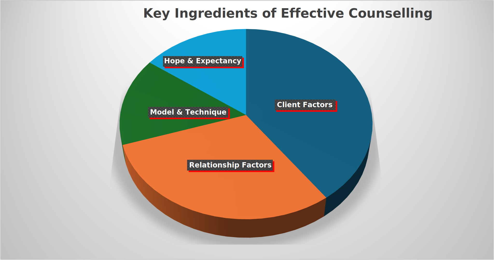
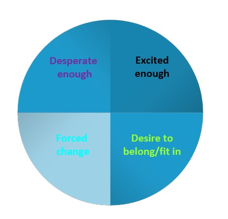
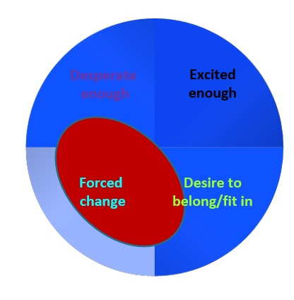
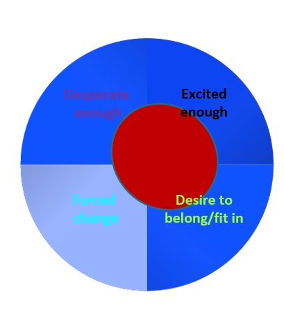

```{r setup, include=FALSE}
knitr::opts_chunk$set(echo = TRUE)
library(knitr)
library(kableExtra)  # For additional styling (optional)
library(ggplot2)
```

## Week 1: Introduction and Research Methods in Adult Development Pt 1  {.tabset .tabset-fade .tabset-pills}

### Lecture 1: Introduction to Counselling

:::{.alert .alert-info}

#### <i class="fas fa-info-circle"></i> How is Counselling Defined?

</br>

##### Professional Organisations

>“Professional counselling is a safe and confidential collaboration between **qualified** counsellors and clients to promote **mental health and wellbeing, enhance self-understanding**, and resolve identified concerns. **Clients are active participants** in the counselling process at every stage”
>
><footer class="pull-right">Psychotherapy and Counselling Federation of Australia (PACFA)</footer>

>Counselling is a professional **relationship** that **empowers** diverse individuals, families, and groups to accomplish **mental health, wellness, education, and career goals**.
>
><footer class="pull-right">American Counselling Association</footer>

>Counselling and psychotherapy are **umbrella terms** that cover a range of talking therapies. They are delivered by **trained practitioners** who work with people over a short or long term to help them bring about **effective change or enhance their wellbeing**.
>
><footer class="pull-right">British Association for Counselling and Psychotherapy</footer>

</br>

##### Textbooks

>"&hellip;a **principled relationship** characterised by the application of one or more psychological **theories and a recognised set of communication skills**, modified by experience, intuition and other interpersonal factors, to **clients’ intimate concerns, problems or aspirations.**”
>
><footer class="pull-right">Feltham and Dryden (1993)</footer>

>“Counselling is an **intimate form of learning**, and it demands a practitioner who is willing to be an authentic person in the **therapeutic relationship.** It is within the context of such a **person-to-person connection** that the client experiences **growth.**”
>
><footer class="pull-right">Corey (2016)</footer>

>“Counselling is [an] **intensive and personal process**&hellip;[it is] about **listening to and understanding** a client’s life challenges and **developing strategies** for change and growth.”
>
><footer class="pull-right">Ivey, Ivey and Zalaquett (2018)</footer>

</br>

##### Key Components of Effective Counselling

| **Concept**                          | **Description** |
|--------------------------------------|--------------------------------------------------------------------------------------------------------------------------------|
| **Relationship**                     | The relationship is built on trust, empathy, privacy and respect, and it allows the client to feel heard and understood.       |
| **Client-centredness**               | Counselling is a purposeful endeavour that arises from and serves the client’s intentions, priorities, needs, hopes and goals. |
| **Understanding and Change**         | Counselling stimulates capacity for understanding and fosters learning of skills/strategies for pursuit of personal goals or mental wellbeing. |
| **Skilful (and qualified) use of techniques** | Effective counselling relies on the mastery of a set of skills and approaches. Accreditation organisations monitor competencies for professional counsellors. |

</br>

##### Key Ingredients of Effective Counselling



##### Professional Counselling vs. Counselling Skills

- Professional Counselling is  :
  - Conducted by Psychologists, counsellors, psychotherapists, social workers, psychiatrists.
  - Uses a therapeutic approach to promote personal development or enhance mental wellbeing.
  - Delivered over a number of sessions (short-term or long-term), each session has limited duration (usually 50 mins).
- Counselling Skills are:
  - Used in a variety of careers, such as people-focused healthcare professionals, coaches, trainers/facilitators, supervisors, managers, tutors and presenters.
  - Aims at enhancing personal development within a particular domain (current employment or group).
  - Delivered more casually on an ad-hoc basis.

##### Counselling Skills vs. Communication/Interpersonal Skills

- Counselling Skills involve:
  - Attentive listening
  - Responding to and focusing on the client’s interests.
  - Confidentiality
  - Application of microskills
  - Goal-focused

##### Comparison Between Counselling and Coaching

- **Counselling**:  
  - Awareness.
  - Assistance with problems or dysfunction.
  - Getting back to ‘normal’ functioning.
  - Has tended until recently to be problem focussed.
- **Coaching**:
  - Awareness;
  - Skill development;
  - Going beyond current capabilities;
  - Building strengths; Often outcome-focussed;
  - Business and sport focus, and within training organisations;
  - Health
- **Similarities** identified (between coaching & counselling):
  - Listening
  - Questioning
  - Non-judgemental (a ‘safe’ space)
  - The process of uncovering (although what was uncovered differed)
- **Differences** identified:
  - Focus and intention (coaching aimed at movement toward desired outcomes; present-future orientated; realising potential)
  - Client base (coaching aimed at business, but can venture beyond).
  

>“Coaching [is] a human development process that involves structured, focused interaction and the use of appropriate strategies, tools and techniques to promote desirable and sustainable change&hellip;”  
><footer class="pull-right">Cox et al, (2014)</footer>  

##### How Can Counselling Help?

- **Insight**: gaining understanding of the origins and development of one’s difficulties and <abbr title="enduring set of behaviours reflecting a pervasive/inflexible response-style, which may at one stage have helped with self-preservation, it but has now become deleterious to well-being.">self-defeating patterns</abbr>.
- **Awareness**: the process of noticing and experiencing one’s thoughts, feelings, and behaviours in real time.
- **Self-acceptance**: development of a positive attitude towards self.
- **Relating with others**: ability to form and maintain satisfying relationships with others.
- **Problem-solving**: a cognitive and behavioural process of finding solutions to problems and includes a series of steps.
- **Psychoeducation**: a collaborative process of information-giving and skills-building to promote changes in thoughts, feelings and behaviours.
- **Cognitive change**: a process of modifying or restructuring the thought patterns and core beliefs underlying psychological distress.
- **Behaviour change**: empowering individuals to adopt positive practices
- **Distress reduction**
- **tolerance and emotion regulation**

</br>

> “Feelings, emotions, and moods constitute a river that continually runs through us – peaceful, meandering, turbulent, or raging, often beneficial, sometimes dangerousm seldom neutral”.
>
><footer class="pull-right">Egan (2014)</footer>

</br>

> “To change in therapy, clients cannot just talk intellectually about themselves and their feelings, they need to viscerally experience what they talk about&hellip;”
>
><footer class="pull-right">Greenberg (2002)</footer>

</br>

##### Working With Feelings

- According to Greenberg (2010) there are three categories or strategies when working with feelings:
  - **Building awareness through research**; putting feelings into words helps decrease amygdala arousal (Lieberman et al 2004).
  - **Expressing feelings**: Feelings are elicited and tolerated in the session; using body awareness to help clients get in touch with their feelings.
  - **Reflection and regulation**.

:::

### Lecture 2: When and Why Do People Change?


##### Extending the Model



##### Case Study

- Joe drinks approx. 10 standard drinks each day.
- He has been given an ultimatum by his partner: either deal with the alcohol problem or she will leave.
- He has also had several friends who have stopped spending time with him because he 'acts like a fool' when he is intoxicated.
- His GP has also told him that his liver functioning has significantly decreased and is at 'a concerning level'. 

With all of this in mind, we might expect Joe to sit in this area, outlined in red, when considering his motivation to change:



- But the factors influencing an individual's motivation to change can themselves change over time.
- For example, perhaps Joe, after joining a support group and gaining some skills and awareness for dealing with his underlying issues, gets excited about his growth and his future.
- Then perhaps his motivation profile might look like this:



### Compulsory Reading

#### The Basic Features of Counselling Relationships

:::{.alert .alert-info}

#### <i class="fas fa-info-circle"></i> Process 1: Counselling

There are 6 stages in the Counselling process:

1. Developing Trust and Engagement
2. Exploring the Problem
3. Helping Clients Set Their Own Goals
4. Empowering Into Action
5. Helping to Maintain Change
6. Ending Counselling

##### 1. Developing Trust and Engagement

- **Trust and engagement** are essential for effective counselling relationships and stages.  
- A client’s **sense of being understood** is crucial; without it, counselling is ineffective.  
- **Building the counselling relationship** is a core skill, as clients often arrive feeling anxious and negative.  
- Counsellors must foster trust to help clients feel:  
  - Heard and understood  
  - Comfortable sharing their thoughts  
  - Willing to return for future sessions  
- Counsellors also experience **self-doubt**, especially when new, including concerns like:  
  - Am I helping effectively?  
  - Am I talking too much or too little?  
  - What does the client think of me?  
- Trust is built through key **counselling skills**, including:  
  - **Active listening** and engagement  
  - **Respect**, allowing space for the client to talk  
  - **Emotional reflection** and clarification  
  - **Silence**, when appropriate  
  - **Non-verbal cues**, such as nods and posture  
  - **Summarising** and confirming understanding  
  - **Clarifying goals** and session structure  
  - **Providing information** about counselling processes  
  - **Reviewing progress** and planning future sessions  

- The **most fundamental qualities** (essential for positive change in a client) for a counsellor are:  
  - **Warmth**:
    - Clients need to perceive counsellors as **open, friendly, and approachable**.  
    - This is conveyed through **open communication**, both verbally and through **body language** (smiling, eye contact, open posture).  
    - **Modelling openness** encourages clients to communicate in the same way.  
    - **Warm greetings** with genuine tone and expression help set a welcoming atmosphere.  
    - **Warmth is both a mindset and a skill**, rooted in mutual learning and respect.  
    - Building relationships fosters **client empowerment** and helps counsellors improve their ability to support others.
  - **Empathy**:
    - **Empathy**, as defined by Carl Rogers, is the ability to understand another person’s world **"as if"** it were one's own, without losing that distinction.  
    - It differs from **sympathy**, which involves offering emotional support, whereas empathy focuses on **understanding and sharing** the client’s experience without judgment.  
    - **Key aspects of empathy in counselling:**  
      - **Reflection of content**: Checking understanding by summarising what the client has said.  
      - **Reflection of feelings**: Recognising and verbalising the underlying emotions behind a client’s words.  
    - Empathy involves not just listening to **words** but also paying attention to **tone of voice, body language, and emotions** to fully understand the client’s experience.
  - **Genuineness**:
    - **Genuineness** is essential for clients to feel safe and empowered.  
    - Clients need to **perceive counsellors as authentic**, genuinely wanting to help and respect them as unique individuals.  
    - Communicating **acceptance** from the start fosters a supportive environment for change.  
    - Like warmth, **genuineness is a choice** in how we relate to others.  
- **Other key aspects of helping:**  
  - **Concreteness**: Encouraging clients to be specific.  
  - **Immediacy**: Focusing on the present rather than the past or future.  
  - **Challenge**: Highlighting discrepancies in a client’s self-perception or worldview.


##### 2. Exploring the Problem

- **Clarifying the Problem:**  
  - Clients often feel confused; counselling helps identify the **true problem** or range of issues.  
  - Understanding key details: **what, when, where, with whom, duration, intensity, and time period**.  
  - Identifying related or underlying problems that may contribute to the issue.  

- **Key Areas of Exploration:**  
  - **Thoughts:** What internal dialogue is shaping the client's perspective?  
  - **Feelings:** What emotions are present, and how do they impact behavior?  
  - **Behavior:** How does the client act in and outside of sessions?  
  - **Body:** Are there physical symptoms related to emotional distress?  
  - **Unconscious elements:** Are past experiences influencing current issues?  
  - **Spiritual elements:** Could there be a deeper meaning to the situation?  
  - **Life events:** External circumstances affecting the client’s experience.  
  - **Life stages:** Transitions like marriage, parenthood, or retirement may be sources of stress.  
  - **External pressures:** Financial issues, family expectations, or workplace constraints.  

- **Skills Used in Exploration:**  
  - **Questioning, listening, and linking** to uncover patterns and themes.  
  - **Providing information** to normalize experiences and offer guidance.  
  - **Deeper empathy** by recognizing unspoken emotions and re-framing issues.  
  - **Encouraging deeper self-reflection** by identifying themes and prompting conclusions.  

- **Challenging the Client When Needed:**  
  - **Addressing self-defeating beliefs** and negative self-talk.  
  - **Expressing discomfort or confusion** to encourage reflection.  
  - **Engaging in mutual reflection** on dynamics within the session.  

- **Moving Forward:**  
  - Once a new perspective is gained, clients must ask, **"What now?"**  
  - The next step is **goal-setting** to create a path for progress.

##### 3. Helping Clients Set Their Own Goals

- **Clarifying and Agreeing on Goals:**  
  - Clients need help distinguishing between **realistic vs. unrealistic** and **self-enhancing vs. self-defeating** goals.  
  - Goals should be:  
    - **S**pecific and clear.
    - **M**easurable and verifiable.
    - **A**dequate to meet the problem.
    - **R**ealistic and achievable.
    - **T**imed with a clear action plan.
    - **In the client’s control**.
    - **Aligned with the client’s values**.

- **Overcoming Mental Barriers:**  
  - **TINA**: ("There is no alternative") clients may feel stuck, believing there is only one unachievable solution.  
  - **TAAA**: ("There are always alternatives") counselling helps clients explore different solutions.  

- **Setting Medium and Short Term Goals:**  
  - **Medium-term goals:** Defined by what the client **wants to achieve in a year** (e.g., "I will feel more confident at work").  
  - **Short-term goals:** Breaking medium term goals into **smaller, specific actions** (e.g., "Reduce arguments with my son by half in two weeks").  

- **Goal-Setting Process:**  
  - **Clarify** medium-term objectives.  
  - **Choose** one goal to work on first.  
  - **Make it specific** and actionable.  

- **Key Skills Used in This Stage:**  
  - Asking questions.
  - Summarizing discussions.
  - Brainstorming alternatives.
  - Offering suggestions as prompts.
  - Weighing pros and cons of different options.

##### 4. Empowering Into Action

- **Moving from Goal-Setting to Action:**  
  - Setting goals creates hope, but action requires **practical steps**.  
  - Clients need **a structured action plan** with **achievable sub-goals**.  
  - Example: If a goal is to **say no to extra requests twice a week**, the first step might be **"only doing what I have already agreed to."**  

- **Planning for Success:**  
  - Create **detailed, realistic strategies** that consider **both opportunities and pitfalls**.  
  - Strategies are about **testing ideas**—if they don’t work, it’s not failure but **valuable learning**.  

- **Ongoing Evaluation:**  
  - Clients assess **what worked and what didn’t**.  
  - If successful → move to the next action step or a new problem.  
  - If unsuccessful → adjust strategies to avoid previous obstacles.  

- **Key Skills in the Action Phase:**  
  - **Brainstorming** alternatives.  
  - **Appraising** different options.  
  - **Strategy planning** for implementation.  
  - **Weighing pros and cons** of actions.  
  - **Evaluating** success and making adjustments.

##### 5. Helping to Maintain Change

- **Change is difficult and requires ongoing support.**
- **Two key factors for maintaining progress:**
  1. **Support Systems:**
     - Clients need **continued support** after taking action.
     - Counsellor support is helpful, but **building personal support networks** is crucial.
  2. **Developing New Skills:**
     - Clients may need **different skills** for long-term maintenance than those used for initial change.
     - Motivation may **decline over time**, so they need strategies to stay committed.

##### 6. Ending Counselling

- **Ideal Ending:**  
  - Counselling concludes when clients have **achieved their goals**, taken action, and maintained changes.  

- **Challenges in Ending Counselling:**  
  - Clients may feel **dependent** on the counsellor.  
  - New goals or problems may arise, making closure difficult.  
  - Some clients may **relapse** or develop issues to maintain the relationship.  
  - Counsellors themselves may struggle with **letting go**.  

- **Supervision Role:**  
  - These challenges should be **addressed in supervision** to ensure a healthy ending for both client and counsellor.

:::
:::{.alert .alert-success}

#### <i class="fa-solid fa-thumbs-up"></i> Summary: The Six Stages of the Counselling Process

```{r, echo=FALSE, results='asis'}

# Data for counselling process table
data <- data.frame(
  `Process of Counselling` = c(
    "Stage 1: Developing trust and engagement, including ‘presence’ and empowerment through relationship change",
    "Stage 2: Exploring the problem",
    "Stage 3: Goal-setting",
    "Stage 4: Empowering action",
    "Stage 5: Maintaining the change",
    "Stage 6: Ending counselling"
  ),
  `Cycle of Change` = c(
    "Pre-contemplation",
    "Contemplation",
    "Preparation",
    "Action",
    "Maintenance",
    "Termination or lapse or relapse"
  ),
  `Process of Maintaining Change` = c(
    "Anticipating and preventing problems",
    "Stopping the triggering of a return to problematic behaviour",
    "Monitoring and analysing high-risk situations",
    "Teaching coping responses",
    "Stopping a lapse become a relapse",
    "Dealing with helplessness; reducing expectations of old patterns of thinking and behaving"
  ),
  check.names = FALSE
)

# Generate HTML table with Bootstrap 3.3.5 styling
kable(data, format = "html", escape = FALSE) %>%
  kable_styling(bootstrap_options = c("striped", "hover", "condensed", "responsive", "bordered")) %>%
  column_spec(1, bold = TRUE)

```

- The six stages are:
  - **Fluid and Cyclical:**  
    - Stages are **not strictly linear**; multiple stages may occur in a single session.  
    - The **action phase** often brings up new information, leading to further exploration and goal revision.  
  - **Content vs. Process:**  
    - **Clients control the content** (what is discussed).  
    - **Counsellors guide the process**, ensuring structure and a safe environment for exploration and progress.  
  - This framework provides a structured yet flexible **approach to counselling**, helping clients navigate their challenges effectively.
:::

:::{.alert .alert-info}
#### <i class="fas fa-info-circle"></i> Process 2: Change

- The **Cycle or Process of Change** model (Prochaska & DiClemente, 1983) describes how individuals progress through **six stages of change**:  
  1. **Pre-contemplation** – Unaware of or unconcerned about the problem.  
  2. **Contemplation** – Recognizing the problem and considering change.  
  3. **Preparation** – Making a serious commitment to change.  
  4. **Action** – Implementing new behaviors and practicing skills.  
  5. **Maintenance** – Sustaining change and integrating it into daily life.  
  6. **Termination/Lapse/Relapse** – Either successfully adopting the new behavior or experiencing setbacks.  
- **Key Takeaways:**  
  - **Change is cyclical, not linear** – relapse is common, and people may re-enter the cycle at different points.  
  - **Motivation fluctuates** – individuals may struggle with **ambivalence** about change.  
  - **Different stages require different counselling techniques.**  
  - **Readiness, importance, and confidence** are crucial for successful change.  
- **Relation to the Six-Stage Counselling Model:**  
  - The **Cycle of Change** describes the **client’s journey**, while the **Six-Stage Counselling Model** outlines the **counsellor’s role** in guiding the process.  
  - Both models complement each other, offering a structured yet flexible approach to **facilitating lasting change.**

:::
:::{.alert .alert-info}

#### <i class="fas fa-info-circle"></i> Process 3: Maintaining Change

Maintaining change is difficult, and clients often feel insecure about their ability to sustain progress. **Lapses** may occur early if motivation and ambivalence were not fully addressed, or later if clients struggle to implement their intentions.  

- **Key Strategies for Preventing Relapse:**  
  - **Anticipating problems early** – Discuss potential relapse triggers and solutions.  
  - **Using the "cliff metaphor"** –  
    - **Railings** prevent lapses (strategies for avoiding high-risk situations).  
    - **Parachutes** help clients recover if they do lapse (coping strategies).  
  - **Identifying high-risk situations** – Helping clients recognize seemingly small decisions that could lead to relapse.  
  - **Challenging helplessness** – Developing coping skills and reducing unrealistic expectations about past behaviors.  
  - **Reframing lapses as learning experiences** – Avoiding an “all-or-nothing” mindset where a small slip leads to full relapse.  
  - **Helping clients recognize early warning signs** and build resilience.  
- Even with preparation, some clients will relapse. **Counsellors must manage their own negative feelings** and support clients in **viewing relapse as an opportunity to learn, not as failure.**

:::

## Week 2: Introduction and Research Methods in Adult Development Pt 2  {.tabset .tabset-fade .tabset-pills}


## Week 3: Ethics and Reflective Practice  {.tabset .tabset-fade .tabset-pills}


### LO1

:::{.alert .alert-info}

#### <i class="fas fa-info-circle"></i> Topic 1

:::

### LO2

:::{.alert .alert-info}

#### <i class="fas fa-info-circle"></i> Topic 2

:::

### LO3

:::{.alert .alert-info}

#### <i class="fas fa-info-circle"></i> Topic 3

:::

### LO4

:::{.alert .alert-info}

#### <i class="fas fa-info-circle"></i> Topic 4

:::

### LO5

:::{.alert .alert-info}

#### <i class="fas fa-info-circle"></i> Topic 5

:::

### LO6

:::{.alert .alert-info}

#### <i class="fas fa-info-circle"></i> Topic 6

:::

### LO7

:::{.alert .alert-info}

#### <i class="fas fa-info-circle"></i> Topic 7

:::
## Week 4: Ethical Decision Making Frameworks and Risk Assessment  {.tabset .tabset-fade .tabset-pills}

### LO1

:::{.alert .alert-info}

#### <i class="fas fa-info-circle"></i> Topic 1

:::

### LO2

:::{.alert .alert-info}

#### <i class="fas fa-info-circle"></i> Topic 2

:::

### LO3

:::{.alert .alert-info}

#### <i class="fas fa-info-circle"></i> Topic 3

:::

### LO4

:::{.alert .alert-info}

#### <i class="fas fa-info-circle"></i> Topic 4

:::

### LO5

:::{.alert .alert-info}

#### <i class="fas fa-info-circle"></i> Topic 5

:::

### LO6

:::{.alert .alert-info}

#### <i class="fas fa-info-circle"></i> Topic 6

:::

### LO7

:::{.alert .alert-info}

#### <i class="fas fa-info-circle"></i> Topic 7

:::
## Week 5: Theories and Frameworks: Introduction, Assessments, and Terminations  {.tabset .tabset-fade .tabset-pills}

### LO1

:::{.alert .alert-info}

#### <i class="fas fa-info-circle"></i> Topic 1

:::

### LO2

:::{.alert .alert-info}

#### <i class="fas fa-info-circle"></i> Topic 2

:::

### LO3

:::{.alert .alert-info}

#### <i class="fas fa-info-circle"></i> Topic 3

:::

### LO4

:::{.alert .alert-info}

#### <i class="fas fa-info-circle"></i> Topic 4

:::

### LO5

:::{.alert .alert-info}

#### <i class="fas fa-info-circle"></i> Topic 5

:::

### LO6

:::{.alert .alert-info}

#### <i class="fas fa-info-circle"></i> Topic 6

:::

### LO7

:::{.alert .alert-info}

#### <i class="fas fa-info-circle"></i> Topic 7

:::
## Week 6: Theories and Frameworks: Person-Centred Approaches  {.tabset .tabset-fade .tabset-pills}

### LO1

:::{.alert .alert-info}

#### <i class="fas fa-info-circle"></i> Topic 1

:::

### LO2

:::{.alert .alert-info}

#### <i class="fas fa-info-circle"></i> Topic 2

:::

### LO3

:::{.alert .alert-info}

#### <i class="fas fa-info-circle"></i> Topic 3

:::

### LO4

:::{.alert .alert-info}

#### <i class="fas fa-info-circle"></i> Topic 4

:::

### LO5

:::{.alert .alert-info}

#### <i class="fas fa-info-circle"></i> Topic 5

:::

### LO6

:::{.alert .alert-info}

#### <i class="fas fa-info-circle"></i> Topic 6

:::

### LO7

:::{.alert .alert-info}

#### <i class="fas fa-info-circle"></i> Topic 7

:::
## Week 7: Theories and Frameworks: Motivational Interviewing  {.tabset .tabset-fade .tabset-pills}

### LO1

:::{.alert .alert-info}

#### <i class="fas fa-info-circle"></i> Topic 1

:::

### LO2

:::{.alert .alert-info}

#### <i class="fas fa-info-circle"></i> Topic 2

:::

### LO3

:::{.alert .alert-info}

#### <i class="fas fa-info-circle"></i> Topic 3

:::

### LO4

:::{.alert .alert-info}

#### <i class="fas fa-info-circle"></i> Topic 4

:::

### LO5

:::{.alert .alert-info}

#### <i class="fas fa-info-circle"></i> Topic 5

:::

### LO6

:::{.alert .alert-info}

#### <i class="fas fa-info-circle"></i> Topic 6

:::

### LO7

:::{.alert .alert-info}

#### <i class="fas fa-info-circle"></i> Topic 7

:::
## Week 8: Theories and Frameworks - Solution Focused Approaches  {.tabset .tabset-fade .tabset-pills}

### LO1

:::{.alert .alert-info}

#### <i class="fas fa-info-circle"></i> Topic 1

:::

### LO2

:::{.alert .alert-info}

#### <i class="fas fa-info-circle"></i> Topic 2

:::

### LO3

:::{.alert .alert-info}

#### <i class="fas fa-info-circle"></i> Topic 3

:::

### LO4

:::{.alert .alert-info}

#### <i class="fas fa-info-circle"></i> Topic 4

:::

### LO5

:::{.alert .alert-info}

#### <i class="fas fa-info-circle"></i> Topic 5

:::

### LO6

:::{.alert .alert-info}

#### <i class="fas fa-info-circle"></i> Topic 6

:::

### LO7

:::{.alert .alert-info}

#### <i class="fas fa-info-circle"></i> Topic 7

:::
## Week 9: Theories and Frameworks - Cognitive Behavioural Approaches  {.tabset .tabset-fade .tabset-pills}

### LO1

:::{.alert .alert-info}

#### <i class="fas fa-info-circle"></i> Topic 1

:::

### LO2

:::{.alert .alert-info}

#### <i class="fas fa-info-circle"></i> Topic 2

:::

### LO3

:::{.alert .alert-info}

#### <i class="fas fa-info-circle"></i> Topic 3

:::

### LO4

:::{.alert .alert-info}

#### <i class="fas fa-info-circle"></i> Topic 4

:::

### LO5

:::{.alert .alert-info}

#### <i class="fas fa-info-circle"></i> Topic 5

:::

### LO6

:::{.alert .alert-info}

#### <i class="fas fa-info-circle"></i> Topic 6

:::

### LO7

:::{.alert .alert-info}

#### <i class="fas fa-info-circle"></i> Topic 7

:::
## Week 10: Theories and Frameworks - Mindfulness Based Approaches  {.tabset .tabset-fade .tabset-pills}

### LO1

:::{.alert .alert-info}

#### <i class="fas fa-info-circle"></i> Topic 1

:::

### LO2

:::{.alert .alert-info}

#### <i class="fas fa-info-circle"></i> Topic 2

:::

### LO3

:::{.alert .alert-info}

#### <i class="fas fa-info-circle"></i> Topic 3

:::

### LO4

:::{.alert .alert-info}

#### <i class="fas fa-info-circle"></i> Topic 4

:::

### LO5

:::{.alert .alert-info}

#### <i class="fas fa-info-circle"></i> Topic 5

:::

### LO6

:::{.alert .alert-info}

#### <i class="fas fa-info-circle"></i> Topic 6

:::

### LO7

:::{.alert .alert-info}

#### <i class="fas fa-info-circle"></i> Topic 7

:::
