```{r setup, include=FALSE}
knitr::opts_chunk$set(echo = TRUE)
library(grid)
library(VennDiagram)
```

## Week 2 Quiz {.well}

**Question 1**
Runners returning to activity after lower leg fractures are to be allocated to two different training programs.  Half of each group will follow a high calcium diet, and the other half will follow a high protein diet.

- [x] Bone density measurements were taken for all subjects.
- [ ] Which of the following designs would be likely to give the most reliable results?
- [ ] Runners are randomly allocated to either of the training programs and then also randomly allocated to either diet. 
- [ ] Runners are randomly allocated to either of the training programs and then the females follow the high calcium diet and the males the high protein diet.
- [ ] Runners get to decide themselves whether they would like to be part of the high protein or high calcium diet group.  They also choose the training program that best suits them.

**Question 2**
For the following report about a statistical study, select the best option for each part.
Just enter the letter. 

Following a week of heavy rain, ocean water samples were collected by environmental researchers from a selection of beaches in the bay around Melbourne and then tested for contaminants.

The Population of interest:

- [ ] People living in Melbourne and the bay area
- [x] Beaches in the bay around Melbourne
- [ ] Australia's beaches
- [ ] Environmental researchers

Population parameter of interest:

- [ ] Whether or not it is dangerous to swim
- [x] Average level of contamination of the bay water around Melbourne
- [ ] Average number of people exposed to pollution
- [ ] average rainfall

Sample:

- [x] The water samples that were collected from the selected beaches
- [ ] Every beach around the bay
- [ ] Each of the water samples collected from beaches where rain fell
- [ ] Not stated

The sample statistic:

- [ ] Average number of people exposed to pollution
- [ ] The contamination level of one sample
- [ ] Whether one of the beaches is safe to swim at
- [x] Average level of contamination of the water samples

A case:

- [ ] Average number of people exposed to pollution
- [ ] Whether one of the beaches is safe to swim at
- [x] A water sample from a selected beach
- [ ] Average level of contamination of the water samples

Variable:

- [x] Contamination
- [ ] Whether one of the beaches is safe to swim at
- [ ] The average contamination level of the whole bay
- [ ] Average level of contamination of the water samples

**Question 3**
Consider the brief report of the statistical research below.

Runners returning to activity after lower leg fractures were randomly allocated to two different training programs.  Half of each group also followed a high calcium diet.  Bone density measurements were taken for all subjects.

Which of the following best describes the type of study conducted?

- [ ] An observational study (prospective)
- [x] An experiment
- [ ] An observational study (retrospective)

**Question 4**
Consider the brief report of the statistical research below:

The medical records of retired basketball athletes who experienced either hand or knee injuries were collected, as well as the length of their sporting career.  The average career lengths of those who experienced either a knee injury, hand injury, or both, were calculated and compared.

Which of the following best describes the type of study conducted?


- [ ] An observational study (prospective)
- [x] An observational study (retrospective)
- [ ] An experimental study

**Question 5**
A survey of students found that they are more likely to get colds when they are stressed. The study also noted that students exercise less and eat more junk food when they are stressed.

Choose all answers that apply to this study.

- [x] Stress is the explanatory variable and colds the response variable.
- [ ] Exercise is the response variable and colds the explanatory variable.
- [ ] Stress is used here as a blocking variable.
- [x] Junk food consumption and exercise are possible lurking/confounding variables that could explain the observed association between colds and stress.
- [ ] This is an observational study so it is not possible to establish a causal relationship between stress and colds.
- [x] It is possible to establish a causal relationship between stress and colds for this experiment.

**Question 6**
A doctor wants to select a sample of his adult patients. He randomly selects patients from each of the age brackets 18-30, 31-50, 51-70, 71-100.  Which option best describes the sampling method?


- [ ] Simple Random
- [ ] Multistage
- [x] Stratified
- [ ] Convenience
- [ ] Cluster

**Question 7**
A lecturer want to select a sample of students studying her subject. From a list of all the prac groups, a particular prac is selected at random and all the students in that prac class are selected. Which option best describes the sampling method?


- [ ] Simple Random
- [x] Multistage
- [ ] Cluster
- [ ] Stratified
- [ ] Volunteer

**Question 8**
For the following research study:

A company studied the effects of storage time and storage temperature on the deterioration of a particular product.
Three different temperatures were used, and 5 different storage times.

Which of the following are factors in the experiment?

- [ ] Product's deterioration
- [x] Storage temperature
- [ ] Company's products
- [x] Storage time

**Question 9**
Cats suffering with kidney disease were randomly assigned to diets differing in protein and moisture to see if any diet was more effective in slowing the progression of the disease and allowing the cat to live longer. Measurements of serum creatinine, blood urea nitrogen, potassium and calcium were made before and after the cats followed the diet for three months. The cats were assigned to a protein level diet (13% or 18%) with one third of each protein group given canned food, one third given dry food and the remaining third a mixture of canned and dry food.

Identify the factors in this study, and the levels of each.

- [ ] protein and moisture (1 level each)
- [x] protein (2 levels) and moisture (3 levels)
- [ ] serum creatinine, blood urea nitrogen, potassium and calcium (1 level each)
- [ ] protein (2 levels) and moisture (1 level)
- [ ] protein (3 levels) and moisture (2 levels)

**Question 10**
Cats suffering with kidney disease were randomly assigned to diets differing in protein and moisture to see if any diet was more effective in slowing the progression of the disease and allowing the cat to live longer. Measurements of serum creatinine, blood urea nitrogen, potassium and calcium were made before and after the cats followed the diet for three months. The cats were assigned to a protein level diet (13% or 18%) with one half of each protein group given canned food and the other half dry food.

How many different treatment groups are there?

- [x] 4
- [ ] 3
- [ ] 5
- [ ] 2
- [ ] 6

**Question 11**
Consider the following research study:

People suffering from migraines were given either a pain relief tablet or a placebo tablet.  Half of each group was also given a glass of iced water. Migraine symptoms for each participant were observed after 1 hour.

Which of the following statements concerning blinding are true?

- [x] It would be possible to conduct the experiment so that the researchers were blind to the treatments given when analysing the results.
- [ ] This study can definitely be set up as double-blind.
- [ ] It would be possible to conduct the experiment so that participants are blind to any treatment they are given.

## Week 3 Quiz {.well}

**Question 1**
Which of the following statements is true?

- [ ]	If the data is skewed left, the mean is likely to be higher than the median.
- [ ] All of the statements are true.
- [ ] If the data is symmetric and unimodal, the value of the mode is likely to be much greater than the median.
- [ ] If the data is strongly skewed, the mean and median are close in value.
- [x] Outliers affect the mean and standard deviation.

**Question 2**
Acid rain: Two researchers measured the pH (a scale on which a value of 7 is neutral and values below 7 acidic) of water collected from rain and snow over a 6-month period in Allegheny County, Pennsylvania.  
Consider the following data:

4.84
5.53
5.33
4.49
5.07
4.80
5.26
5.72
5.25
Calculate the **mean** (give your answer correct to 2 decimal places).  

**Answer:**  _5.14_

```{r}
Q2 <- c(4.84,5.53,5.33,4.49,5.07,4.80,5.26,5.72,5.25)
Q2ans <- round(mean(Q2), 2)
Q2ans
```


**Question 3**
Acid rain: Researchers measured the pH of water collected from rain and snow over a 6-month period in Allegheny County, Pennsylvania.  
Consider the following observations:

4.65
4.24
4.72
5.00
4.13
5.23
Calculate the **sample standard deviation** (give your answer correct to 2 decimal places).  

Use technology, or if you are going to do this by hand (not recommended), don't round the mean or your squared differences - only round at the end.

```{r}
Q3 <- c(4.65,4.24,4.72,5.00,4.13,5.23)
Q3ans <- round(sd(Q3), 2)
Q3ans
```


**Question 4**
Acid rain: Researchers measured the pH of water collected from rain and snow over a 6-month period in Allegheny County, Pennsylvania.  
Consider the following data:

4.80
4.12
5.05
4.10
5.49
5.78
5.57
5.45
4.89
5.07

Find the **median** (give your answer correct to 2 decimal places). 

```{r}
Q4 <- c(4.80,4.12,5.05,4.10,5.49,5.78,5.57,5.45,4.89,5.07)
Q4ans <- round(median(Q4), 2)
Q4ans
```


**Question 5**
Which of the following statements is true?


- [ ]	50% of data falls between Q1 and the median
- [x]	50% of data falls above the median
- [ ]	only 25% of data falls above Q1
- [ ]	no more than 25% of data falls below Q3
- [ ]	none of the statements are true

**Question 6**
From the SPSS output below, which response shows the mean and median?


- [ ]	$\bar{x} =28.783$, $median=0.4021$
- [ ]	$\bar{x}=28.800$, $median=28.783$
- [ ]	$\bar{x}=28.887$, $median=28.800$
- [ ]	$\bar{x}=28.361$, $median=29.205$
- [x]	$\bar{x}=28.783$, $median=28.800$

**Question 7**
What is the five number summary from the output below? 

<table class="MsoNormalTable" style="border-collapse: collapse; border: none; border-style: solid;" border="1" width="0" cellspacing="0" cellpadding="0">
<tbody>
<tr>
<td style="width: 338.85pt; border: none; background: white; padding: 0cm 0cm 0cm 0cm;" colspan="5" width="452">
<p style="margin: 0cm 3pt 0.0001pt; text-align: center; line-height: 16pt; font-size: 11pt; font-family: Calibri, sans-serif;" align="center"><strong><span style="font-family: Arial, sans-serif; color: #010205;">Descriptives</span></strong></p>
</td>
</tr>
<tr>
<td style="width: 233.6pt; border: none; border-bottom: solid #152935 1.0pt; background: white; padding: 0cm 0cm 0cm 0cm;" colspan="3" valign="bottom" width="312">
<p style="margin: 0cm 0cm 0.0001pt; line-height: normal; font-size: 11pt; font-family: Calibri, sans-serif;"><span style="font-size: 12.0pt; font-family: 'Times New Roman', serif;">&nbsp;</span></p>
</td>
<td style="width: 51.45pt; border-top: none; border-left: none; border-bottom: solid #152935 1.0pt; border-right: solid #E0E0E0 1.0pt; background: white; padding: 0cm 0cm 0cm 0cm;" valign="bottom" width="69">
<p style="margin: 0cm 3pt 0.0001pt; text-align: center; line-height: 16pt; font-size: 11pt; font-family: Calibri, sans-serif;" align="center"><span style="font-size: 9.0pt; font-family: Arial, sans-serif; color: #264a60;">Statistic</span></p>
</td>
<td style="width: 53.8pt; border: none; border-bottom: solid #152935 1.0pt; background: white; padding: 0cm 0cm 0cm 0cm;" valign="bottom" width="72">
<p style="margin: 0cm 3pt 0.0001pt; text-align: center; line-height: 16pt; font-size: 11pt; font-family: Calibri, sans-serif;" align="center"><span style="font-size: 9.0pt; font-family: Arial, sans-serif; color: #264a60;">Std. Error</span></p>
</td>
</tr>
<tr>
<td style="width: 39.95pt; border: none; border-bottom: solid #152935 1.0pt; background: #E0E0E0; padding: 0cm 0cm 0cm 0cm;" rowspan="13" valign="top" width="53">
<p style="margin: 0cm 3pt 0.0001pt; line-height: 16pt; font-size: 11pt; font-family: Calibri, sans-serif;"><span style="font-size: 9.0pt; font-family: Arial, sans-serif; color: #264a60;">skulls</span></p>
</td>
<td style="width: 193.65pt; border: none; background: #E0E0E0; padding: 0cm 0cm 0cm 0cm;" colspan="2" valign="top" width="258">
<p style="margin: 0cm 3pt 0.0001pt; line-height: 16pt; font-size: 11pt; font-family: Calibri, sans-serif;"><span style="font-size: 9.0pt; font-family: Arial, sans-serif; color: #264a60;">Mean</span></p>
</td>
<td style="width: 51.45pt; border: none; border-right: solid #E0E0E0 1.0pt; background: white; padding: 0cm 0cm 0cm 0cm;" valign="top" width="69">
<p style="margin: 0cm 3pt 0.0001pt; text-align: right; line-height: 16pt; font-size: 11pt; font-family: Calibri, sans-serif;" align="right"><span style="font-size: 9.0pt; font-family: Arial, sans-serif; color: #010205;">132.80</span></p>
</td>
<td style="width: 53.8pt; border: none; background: white; padding: 0cm 0cm 0cm 0cm;" valign="top" width="72">
<p style="margin: 0cm 3pt 0.0001pt; text-align: right; line-height: 16pt; font-size: 11pt; font-family: Calibri, sans-serif;" align="right"><span style="font-size: 9.0pt; font-family: Arial, sans-serif; color: #010205;">.744</span></p>
</td>
</tr>
<tr>
<td style="width: 122.95pt; border: none; border-top: solid #AEAEAE 1.0pt; background: #E0E0E0; padding: 0cm 0cm 0cm 0cm;" rowspan="2" valign="top" width="164">
<p style="margin: 0cm 3pt 0.0001pt; line-height: 16pt; font-size: 11pt; font-family: Calibri, sans-serif;"><span style="font-size: 9.0pt; font-family: Arial, sans-serif; color: #264a60;">95% Confidence Interval for Mean</span></p>
</td>
<td style="width: 70.7pt; border: none; border-bottom: solid #AEAEAE 1.0pt; background: #E0E0E0; padding: 0cm 0cm 0cm 0cm;" valign="top" width="94">
<p style="margin: 0cm 3pt 0.0001pt; line-height: 16pt; font-size: 11pt; font-family: Calibri, sans-serif;"><span style="font-size: 9.0pt; font-family: Arial, sans-serif; color: #264a60;">Lower Bound</span></p>
</td>
<td style="width: 51.45pt; border-top: solid #AEAEAE 1.0pt; border-left: none; border-bottom: solid #AEAEAE 1.0pt; border-right: solid #E0E0E0 1.0pt; background: white; padding: 0cm 0cm 0cm 0cm;" valign="top" width="69">
<p style="margin: 0cm 3pt 0.0001pt; text-align: right; line-height: 16pt; font-size: 11pt; font-family: Calibri, sans-serif;" align="right"><span style="font-size: 9.0pt; font-family: Arial, sans-serif; color: #010205;">131.26</span></p>
</td>
<td style="width: 53.8pt; border-top: solid #AEAEAE 1.0pt; border-left: none; border-bottom: solid #AEAEAE 1.0pt; border-right: none; background: white; padding: 0cm 0cm 0cm 0cm;" width="72">
<p style="margin: 0cm 0cm 0.0001pt; line-height: normal; font-size: 11pt; font-family: Calibri, sans-serif;"><span style="font-size: 12.0pt; font-family: 'Times New Roman', serif;">&nbsp;</span></p>
</td>
</tr>
<tr>
<td style="width: 70.7pt; border: none; background: #E0E0E0; padding: 0cm 0cm 0cm 0cm;" valign="top" width="94">
<p style="margin: 0cm 3pt 0.0001pt; line-height: 16pt; font-size: 11pt; font-family: Calibri, sans-serif;"><span style="font-size: 9.0pt; font-family: Arial, sans-serif; color: #264a60;">Upper Bound</span></p>
</td>
<td style="width: 51.45pt; border: none; border-right: solid #E0E0E0 1.0pt; background: white; padding: 0cm 0cm 0cm 0cm;" valign="top" width="69">
<p style="margin: 0cm 3pt 0.0001pt; text-align: right; line-height: 16pt; font-size: 11pt; font-family: Calibri, sans-serif;" align="right"><span style="font-size: 9.0pt; font-family: Arial, sans-serif; color: #010205;">134.34</span></p>
</td>
<td style="width: 53.8pt; border: none; background: white; padding: 0cm 0cm 0cm 0cm;" width="72">
<p style="margin: 0cm 0cm 0.0001pt; line-height: normal; font-size: 11pt; font-family: Calibri, sans-serif;"><span style="font-size: 12.0pt; font-family: 'Times New Roman', serif;">&nbsp;</span></p>
</td>
</tr>
<tr>
<td style="width: 193.65pt; border: none; border-top: solid #AEAEAE 1.0pt; background: #E0E0E0; padding: 0cm 0cm 0cm 0cm;" colspan="2" valign="top" width="258">
<p style="margin: 0cm 3pt 0.0001pt; line-height: 16pt; font-size: 11pt; font-family: Calibri, sans-serif;"><span style="font-size: 9.0pt; font-family: Arial, sans-serif; color: #264a60;">5% Trimmed Mean</span></p>
</td>
<td style="width: 51.45pt; border-top: solid #AEAEAE 1.0pt; border-left: none; border-bottom: none; border-right: solid #E0E0E0 1.0pt; background: white; padding: 0cm 0cm 0cm 0cm;" valign="top" width="69">
<p style="margin: 0cm 3pt 0.0001pt; text-align: right; line-height: 16pt; font-size: 11pt; font-family: Calibri, sans-serif;" align="right"><span style="font-size: 9.0pt; font-family: Arial, sans-serif; color: #010205;">132.86</span></p>
</td>
<td style="width: 53.8pt; border: none; border-top: solid #AEAEAE 1.0pt; background: white; padding: 0cm 0cm 0cm 0cm;" width="72">
<p style="margin: 0cm 0cm 0.0001pt; line-height: normal; font-size: 11pt; font-family: Calibri, sans-serif;"><span style="font-size: 12.0pt; font-family: 'Times New Roman', serif;">&nbsp;</span></p>
</td>
</tr>
<tr>
<td style="width: 193.65pt; border: none; border-top: solid #AEAEAE 1.0pt; background: #E0E0E0; padding: 0cm 0cm 0cm 0cm;" colspan="2" valign="top" width="258">
<p style="margin: 0cm 3pt 0.0001pt; line-height: 16pt; font-size: 11pt; font-family: Calibri, sans-serif;"><span style="font-size: 9.0pt; font-family: Arial, sans-serif; color: #264a60;">Median</span></p>
</td>
<td style="width: 51.45pt; border-top: solid #AEAEAE 1.0pt; border-left: none; border-bottom: none; border-right: solid #E0E0E0 1.0pt; background: white; padding: 0cm 0cm 0cm 0cm;" valign="top" width="69">
<p style="margin: 0cm 3pt 0.0001pt; text-align: right; line-height: 16pt; font-size: 11pt; font-family: Calibri, sans-serif;" align="right"><span style="font-size: 9.0pt; font-family: Arial, sans-serif; color: #010205;">134.00</span></p>
</td>
<td style="width: 53.8pt; border: none; border-top: solid #AEAEAE 1.0pt; background: white; padding: 0cm 0cm 0cm 0cm;" width="72">
<p style="margin: 0cm 0cm 0.0001pt; line-height: normal; font-size: 11pt; font-family: Calibri, sans-serif;"><span style="font-size: 12.0pt; font-family: 'Times New Roman', serif;">&nbsp;</span></p>
</td>
</tr>
<tr>
<td style="width: 193.65pt; border: none; border-top: solid #AEAEAE 1.0pt; background: #E0E0E0; padding: 0cm 0cm 0cm 0cm;" colspan="2" valign="top" width="258">
<p style="margin: 0cm 3pt 0.0001pt; line-height: 16pt; font-size: 11pt; font-family: Calibri, sans-serif;"><span style="font-size: 9.0pt; font-family: Arial, sans-serif; color: #264a60;">Variance</span></p>
</td>
<td style="width: 51.45pt; border-top: solid #AEAEAE 1.0pt; border-left: none; border-bottom: none; border-right: solid #E0E0E0 1.0pt; background: white; padding: 0cm 0cm 0cm 0cm;" valign="top" width="69">
<p style="margin: 0cm 3pt 0.0001pt; text-align: right; line-height: 16pt; font-size: 11pt; font-family: Calibri, sans-serif;" align="right"><span style="font-size: 9.0pt; font-family: Arial, sans-serif; color: #010205;">13.833</span></p>
</td>
<td style="width: 53.8pt; border: none; border-top: solid #AEAEAE 1.0pt; background: white; padding: 0cm 0cm 0cm 0cm;" width="72">
<p style="margin: 0cm 0cm 0.0001pt; line-height: normal; font-size: 11pt; font-family: Calibri, sans-serif;"><span style="font-size: 12.0pt; font-family: 'Times New Roman', serif;">&nbsp;</span></p>
</td>
</tr>
<tr>
<td style="width: 193.65pt; border: none; border-top: solid #AEAEAE 1.0pt; background: #E0E0E0; padding: 0cm 0cm 0cm 0cm;" colspan="2" valign="top" width="258">
<p style="margin: 0cm 3pt 0.0001pt; line-height: 16pt; font-size: 11pt; font-family: Calibri, sans-serif;"><span style="font-size: 9.0pt; font-family: Arial, sans-serif; color: #264a60;">Std. Deviation</span></p>
</td>
<td style="width: 51.45pt; border-top: solid #AEAEAE 1.0pt; border-left: none; border-bottom: none; border-right: solid #E0E0E0 1.0pt; background: white; padding: 0cm 0cm 0cm 0cm;" valign="top" width="69">
<p style="margin: 0cm 3pt 0.0001pt; text-align: right; line-height: 16pt; font-size: 11pt; font-family: Calibri, sans-serif;" align="right"><span style="font-size: 9.0pt; font-family: Arial, sans-serif; color: #010205;">3.719</span></p>
</td>
<td style="width: 53.8pt; border: none; border-top: solid #AEAEAE 1.0pt; background: white; padding: 0cm 0cm 0cm 0cm;" width="72">
<p style="margin: 0cm 0cm 0.0001pt; line-height: normal; font-size: 11pt; font-family: Calibri, sans-serif;"><span style="font-size: 12.0pt; font-family: 'Times New Roman', serif;">&nbsp;</span></p>
</td>
</tr>
<tr>
<td style="width: 193.65pt; border: none; border-top: solid #AEAEAE 1.0pt; background: #E0E0E0; padding: 0cm 0cm 0cm 0cm;" colspan="2" valign="top" width="258">
<p style="margin: 0cm 3pt 0.0001pt; line-height: 16pt; font-size: 11pt; font-family: Calibri, sans-serif;"><span style="font-size: 9.0pt; font-family: Arial, sans-serif; color: #264a60;">Minimum</span></p>
</td>
<td style="width: 51.45pt; border-top: solid #AEAEAE 1.0pt; border-left: none; border-bottom: none; border-right: solid #E0E0E0 1.0pt; background: white; padding: 0cm 0cm 0cm 0cm;" valign="top" width="69">
<p style="margin: 0cm 3pt 0.0001pt; text-align: right; line-height: 16pt; font-size: 11pt; font-family: Calibri, sans-serif;" align="right"><span style="font-size: 9.0pt; font-family: Arial, sans-serif; color: #010205;">125</span></p>
</td>
<td style="width: 53.8pt; border: none; border-top: solid #AEAEAE 1.0pt; background: white; padding: 0cm 0cm 0cm 0cm;" width="72">
<p style="margin: 0cm 0cm 0.0001pt; line-height: normal; font-size: 11pt; font-family: Calibri, sans-serif;"><span style="font-size: 12.0pt; font-family: 'Times New Roman', serif;">&nbsp;</span></p>
</td>
</tr>
<tr>
<td style="width: 193.65pt; border: none; border-top: solid #AEAEAE 1.0pt; background: #E0E0E0; padding: 0cm 0cm 0cm 0cm;" colspan="2" valign="top" width="258">
<p style="margin: 0cm 3pt 0.0001pt; line-height: 16pt; font-size: 11pt; font-family: Calibri, sans-serif;"><span style="font-size: 9.0pt; font-family: Arial, sans-serif; color: #264a60;">Maximum</span></p>
</td>
<td style="width: 51.45pt; border-top: solid #AEAEAE 1.0pt; border-left: none; border-bottom: none; border-right: solid #E0E0E0 1.0pt; background: white; padding: 0cm 0cm 0cm 0cm;" valign="top" width="69">
<p style="margin: 0cm 3pt 0.0001pt; text-align: right; line-height: 16pt; font-size: 11pt; font-family: Calibri, sans-serif;" align="right"><span style="font-size: 9.0pt; font-family: Arial, sans-serif; color: #010205;">139</span></p>
</td>
<td style="width: 53.8pt; border: none; border-top: solid #AEAEAE 1.0pt; background: white; padding: 0cm 0cm 0cm 0cm;" width="72">
<p style="margin: 0cm 0cm 0.0001pt; line-height: normal; font-size: 11pt; font-family: Calibri, sans-serif;"><span style="font-size: 12.0pt; font-family: 'Times New Roman', serif;">&nbsp;</span></p>
</td>
</tr>
<tr>
<td style="width: 193.65pt; border: none; border-top: solid #AEAEAE 1.0pt; background: #E0E0E0; padding: 0cm 0cm 0cm 0cm;" colspan="2" valign="top" width="258">
<p style="margin: 0cm 3pt 0.0001pt; line-height: 16pt; font-size: 11pt; font-family: Calibri, sans-serif;"><span style="font-size: 9.0pt; font-family: Arial, sans-serif; color: #264a60;">Range</span></p>
</td>
<td style="width: 51.45pt; border-top: solid #AEAEAE 1.0pt; border-left: none; border-bottom: none; border-right: solid #E0E0E0 1.0pt; background: white; padding: 0cm 0cm 0cm 0cm;" valign="top" width="69">
<p style="margin: 0cm 3pt 0.0001pt; text-align: right; line-height: 16pt; font-size: 11pt; font-family: Calibri, sans-serif;" align="right"><span style="font-size: 9.0pt; font-family: Arial, sans-serif; color: #010205;">14</span></p>
</td>
<td style="width: 53.8pt; border: none; border-top: solid #AEAEAE 1.0pt; background: white; padding: 0cm 0cm 0cm 0cm;" width="72">
<p style="margin: 0cm 0cm 0.0001pt; line-height: normal; font-size: 11pt; font-family: Calibri, sans-serif;"><span style="font-size: 12.0pt; font-family: 'Times New Roman', serif;">&nbsp;</span></p>
</td>
</tr>
<tr>
<td style="width: 193.65pt; border: none; border-top: solid #AEAEAE 1.0pt; background: #E0E0E0; padding: 0cm 0cm 0cm 0cm;" colspan="2" valign="top" width="258">
<p style="margin: 0cm 3pt 0.0001pt; line-height: 16pt; font-size: 11pt; font-family: Calibri, sans-serif;"><span style="font-size: 9.0pt; font-family: Arial, sans-serif; color: #264a60;">Interquartile Range</span></p>
</td>
<td style="width: 51.45pt; border-top: solid #AEAEAE 1.0pt; border-left: none; border-bottom: none; border-right: solid #E0E0E0 1.0pt; background: white; padding: 0cm 0cm 0cm 0cm;" valign="top" width="69">
<p style="margin: 0cm 3pt 0.0001pt; text-align: right; line-height: 16pt; font-size: 11pt; font-family: Calibri, sans-serif;" align="right"><span style="font-size: 9.0pt; font-family: Arial, sans-serif; color: #010205;">6</span></p>
</td>
<td style="width: 53.8pt; border: none; border-top: solid #AEAEAE 1.0pt; background: white; padding: 0cm 0cm 0cm 0cm;" width="72">
<p style="margin: 0cm 0cm 0.0001pt; line-height: normal; font-size: 11pt; font-family: Calibri, sans-serif;"><span style="font-size: 12.0pt; font-family: 'Times New Roman', serif;">&nbsp;</span></p>
</td>
</tr>
<tr>
<td style="width: 193.65pt; border: none; border-top: solid #AEAEAE 1.0pt; background: #E0E0E0; padding: 0cm 0cm 0cm 0cm;" colspan="2" valign="top" width="258">
<p style="margin: 0cm 3pt 0.0001pt; line-height: 16pt; font-size: 11pt; font-family: Calibri, sans-serif;"><span style="font-size: 9.0pt; font-family: Arial, sans-serif; color: #264a60;">Skewness</span></p>
</td>
<td style="width: 51.45pt; border-top: solid #AEAEAE 1.0pt; border-left: none; border-bottom: none; border-right: solid #E0E0E0 1.0pt; background: white; padding: 0cm 0cm 0cm 0cm;" valign="top" width="69">
<p style="margin: 0cm 3pt 0.0001pt; text-align: right; line-height: 16pt; font-size: 11pt; font-family: Calibri, sans-serif;" align="right"><span style="font-size: 9.0pt; font-family: Arial, sans-serif; color: #010205;">-.040</span></p>
</td>
<td style="width: 53.8pt; border: none; border-top: solid #AEAEAE 1.0pt; background: white; padding: 0cm 0cm 0cm 0cm;" valign="top" width="72">
<p style="margin: 0cm 3pt 0.0001pt; text-align: right; line-height: 16pt; font-size: 11pt; font-family: Calibri, sans-serif;" align="right"><span style="font-size: 9.0pt; font-family: Arial, sans-serif; color: #010205;">.464</span></p>
</td>
</tr>
<tr>
<td style="width: 193.65pt; border-top: solid #AEAEAE 1.0pt; border-left: none; border-bottom: solid #152935 1.0pt; border-right: none; background: #E0E0E0; padding: 0cm 0cm 0cm 0cm;" colspan="2" valign="top" width="258">
<p style="margin: 0cm 3pt 0.0001pt; line-height: 16pt; font-size: 11pt; font-family: Calibri, sans-serif;"><span style="font-size: 9.0pt; font-family: Arial, sans-serif; color: #264a60;">Kurtosis</span></p>
</td>
<td style="width: 51.45pt; border-top: solid #AEAEAE 1.0pt; border-left: none; border-bottom: solid #152935 1.0pt; border-right: solid #E0E0E0 1.0pt; background: white; padding: 0cm 0cm 0cm 0cm;" valign="top" width="69">
<p style="margin: 0cm 3pt 0.0001pt; text-align: right; line-height: 16pt; font-size: 11pt; font-family: Calibri, sans-serif;" align="right"><span style="font-size: 9.0pt; font-family: Arial, sans-serif; color: #010205;">-.589</span></p>
</td>
<td style="width: 53.8pt; border-top: solid #AEAEAE 1.0pt; border-left: none; border-bottom: solid #152935 1.0pt; border-right: none; background: white; padding: 0cm 0cm 0cm 0cm;" valign="top" width="72">
<p style="margin: 0cm 3pt 0.0001pt; text-align: right; line-height: 16pt; font-size: 11pt; font-family: Calibri, sans-serif;" align="right"><span style="font-size: 9.0pt; font-family: Arial, sans-serif; color: #010205;">.902</span></p>
</td>
</tr>
</tbody>
</table>

<table class="MsoNormalTable" style="border-collapse: collapse; border: none; border-style: solid;" border="1" width="0" cellspacing="0" cellpadding="0">
<tbody>
<tr>
<td style="width: 539.2pt; border: none; background: white; padding: 0cm 0cm 0cm 0cm;" colspan="9" width="719">
<p style="margin: 0cm 3pt 0.0001pt; text-align: center; line-height: 16pt; font-size: 11pt; font-family: Calibri, sans-serif;" align="center"><strong><span style="font-family: Arial, sans-serif; color: #010205;"><br>Percentiles</span></strong></p>
</td>
</tr>
<tr>
<td style="width: 167.85pt; border: none; background: white; padding: 0cm 0cm 0cm 0cm;" colspan="2" rowspan="2" valign="bottom" width="224">
<p style="margin: 0cm 0cm 0.0001pt; line-height: normal; font-size: 11pt; font-family: Calibri, sans-serif;"><span style="font-size: 12.0pt; font-family: 'Times New Roman', serif;">&nbsp;</span></p>
</td>
<td style="width: 371.35pt; border: none; background: white; padding: 0cm 0cm 0cm 0cm;" colspan="7" valign="bottom" width="495">
<p style="margin: 0cm 3pt 0.0001pt; text-align: center; line-height: 16pt; font-size: 11pt; font-family: Calibri, sans-serif;" align="center"><span style="font-size: 9.0pt; font-family: Arial, sans-serif; color: #264a60;">Percentiles</span></p>
</td>
</tr>
<tr>
<td style="width: 53.05pt; border-top: none; border-left: none; border-bottom: solid #152935 1.0pt; border-right: solid #E0E0E0 1.0pt; background: white; padding: 0cm 0cm 0cm 0cm;" valign="bottom" width="71">
<p style="margin: 0cm 3pt 0.0001pt; text-align: center; line-height: 16pt; font-size: 11pt; font-family: Calibri, sans-serif;" align="center"><span style="font-size: 9.0pt; font-family: Arial, sans-serif; color: #264a60;">5</span></p>
</td>
<td style="width: 53.05pt; border-top: none; border-left: none; border-bottom: solid #152935 1.0pt; border-right: solid #E0E0E0 1.0pt; background: white; padding: 0cm 0cm 0cm 0cm;" valign="bottom" width="71">
<p style="margin: 0cm 3pt 0.0001pt; text-align: center; line-height: 16pt; font-size: 11pt; font-family: Calibri, sans-serif;" align="center"><span style="font-size: 9.0pt; font-family: Arial, sans-serif; color: #264a60;">10</span></p>
</td>
<td style="width: 53.05pt; border-top: none; border-left: none; border-bottom: solid #152935 1.0pt; border-right: solid #E0E0E0 1.0pt; background: white; padding: 0cm 0cm 0cm 0cm;" valign="bottom" width="71">
<p style="margin: 0cm 3pt 0.0001pt; text-align: center; line-height: 16pt; font-size: 11pt; font-family: Calibri, sans-serif;" align="center"><span style="font-size: 9.0pt; font-family: Arial, sans-serif; color: #264a60;">25</span></p>
</td>
<td style="width: 53.05pt; border-top: none; border-left: none; border-bottom: solid #152935 1.0pt; border-right: solid #E0E0E0 1.0pt; background: white; padding: 0cm 0cm 0cm 0cm;" valign="bottom" width="71">
<p style="margin: 0cm 3pt 0.0001pt; text-align: center; line-height: 16pt; font-size: 11pt; font-family: Calibri, sans-serif;" align="center"><span style="font-size: 9.0pt; font-family: Arial, sans-serif; color: #264a60;">50</span></p>
</td>
<td style="width: 53.05pt; border-top: none; border-left: none; border-bottom: solid #152935 1.0pt; border-right: solid #E0E0E0 1.0pt; background: white; padding: 0cm 0cm 0cm 0cm;" valign="bottom" width="71">
<p style="margin: 0cm 3pt 0.0001pt; text-align: center; line-height: 16pt; font-size: 11pt; font-family: Calibri, sans-serif;" align="center"><span style="font-size: 9.0pt; font-family: Arial, sans-serif; color: #264a60;">75</span></p>
</td>
<td style="width: 53.05pt; border-top: none; border-left: none; border-bottom: solid #152935 1.0pt; border-right: solid #E0E0E0 1.0pt; background: white; padding: 0cm 0cm 0cm 0cm;" valign="bottom" width="71">
<p style="margin: 0cm 3pt 0.0001pt; text-align: center; line-height: 16pt; font-size: 11pt; font-family: Calibri, sans-serif;" align="center"><span style="font-size: 9.0pt; font-family: Arial, sans-serif; color: #264a60;">90</span></p>
</td>
<td style="width: 53.05pt; border: none; border-bottom: solid #152935 1.0pt; background: white; padding: 0cm 0cm 0cm 0cm;" valign="bottom" width="71">
<p style="margin: 0cm 3pt 0.0001pt; text-align: center; line-height: 16pt; font-size: 11pt; font-family: Calibri, sans-serif;" align="center"><span style="font-size: 9.0pt; font-family: Arial, sans-serif; color: #264a60;">95</span></p>
</td>
</tr>
<tr>
<td style="width: 126.7pt; border: none; border-top: solid #152935 1.0pt; background: #E0E0E0; padding: 0cm 0cm 0cm 0cm;" valign="top" width="169">
<p style="margin: 0cm 3pt 0.0001pt; line-height: 16pt; font-size: 11pt; font-family: Calibri, sans-serif;"><span style="font-size: 9.0pt; font-family: Arial, sans-serif; color: #264a60;">Weighted Average(Definition 1)</span></p>
</td>
<td style="width: 41.15pt; border: none; border-top: solid #152935 1.0pt; background: #E0E0E0; padding: 0cm 0cm 0cm 0cm;" valign="top" width="55">
<p style="margin: 0cm 3pt 0.0001pt; line-height: 16pt; font-size: 11pt; font-family: Calibri, sans-serif;"><span style="font-size: 9.0pt; font-family: Arial, sans-serif; color: #264a60;">skulls</span></p>
</td>
<td style="width: 53.05pt; border: none; border-right: solid #E0E0E0 1.0pt; background: white; padding: 0cm 0cm 0cm 0cm;" valign="top" width="71">
<p style="margin: 0cm 3pt 0.0001pt; text-align: right; line-height: 16pt; font-size: 11pt; font-family: Calibri, sans-serif;" align="right"><span style="font-size: 9.0pt; font-family: Arial, sans-serif; color: #010205;">125.90</span></p>
</td>
<td style="width: 53.05pt; border: none; border-right: solid #E0E0E0 1.0pt; background: white; padding: 0cm 0cm 0cm 0cm;" valign="top" width="71">
<p style="margin: 0cm 3pt 0.0001pt; text-align: right; line-height: 16pt; font-size: 11pt; font-family: Calibri, sans-serif;" align="right"><span style="font-size: 9.0pt; font-family: Arial, sans-serif; color: #010205;">128.00</span></p>
</td>
<td style="width: 53.05pt; border: none; border-right: solid #E0E0E0 1.0pt; background: white; padding: 0cm 0cm 0cm 0cm;" valign="top" width="71">
<p style="margin: 0cm 3pt 0.0001pt; text-align: right; line-height: 16pt; font-size: 11pt; font-family: Calibri, sans-serif;" align="right"><span style="font-size: 9.0pt; font-family: Arial, sans-serif; color: #010205;">130.00</span></p>
</td>
<td style="width: 53.05pt; border: none; border-right: solid #E0E0E0 1.0pt; background: white; padding: 0cm 0cm 0cm 0cm;" valign="top" width="71">
<p style="margin: 0cm 3pt 0.0001pt; text-align: right; line-height: 16pt; font-size: 11pt; font-family: Calibri, sans-serif;" align="right"><span style="font-size: 9.0pt; font-family: Arial, sans-serif; color: #010205;">134.00</span></p>
</td>
<td style="width: 53.05pt; border: none; border-right: solid #E0E0E0 1.0pt; background: white; padding: 0cm 0cm 0cm 0cm;" valign="top" width="71">
<p style="margin: 0cm 3pt 0.0001pt; text-align: right; line-height: 16pt; font-size: 11pt; font-family: Calibri, sans-serif;" align="right"><span style="font-size: 9.0pt; font-family: Arial, sans-serif; color: #010205;">135.50</span></p>
</td>
<td style="width: 53.05pt; border: none; border-right: solid #E0E0E0 1.0pt; background: white; padding: 0cm 0cm 0cm 0cm;" valign="top" width="71">
<p style="margin: 0cm 3pt 0.0001pt; text-align: right; line-height: 16pt; font-size: 11pt; font-family: Calibri, sans-serif;" align="right"><span style="font-size: 9.0pt; font-family: Arial, sans-serif; color: #010205;">138.40</span></p>
</td>
<td style="width: 53.05pt; border: none; background: white; padding: 0cm 0cm 0cm 0cm;" valign="top" width="71">
<p style="margin: 0cm 3pt 0.0001pt; text-align: right; line-height: 16pt; font-size: 11pt; font-family: Calibri, sans-serif;" align="right"><span style="font-size: 9.0pt; font-family: Arial, sans-serif; color: #010205;">139.00</span></p>
</td>
</tr>
<tr>
<td style="width: 126.7pt; border-top: solid #AEAEAE 1.0pt; border-left: none; border-bottom: solid #152935 1.0pt; border-right: none; background: #E0E0E0; padding: 0cm 0cm 0cm 0cm;" valign="top" width="169">
<p style="margin: 0cm 3pt 0.0001pt; line-height: 16pt; font-size: 11pt; font-family: Calibri, sans-serif;"><span style="font-size: 9.0pt; font-family: Arial, sans-serif; color: #264a60;">Tukey's Hinges</span></p>
</td>
<td style="width: 41.15pt; border-top: solid #AEAEAE 1.0pt; border-left: none; border-bottom: solid #152935 1.0pt; border-right: none; background: #E0E0E0; padding: 0cm 0cm 0cm 0cm;" valign="top" width="55">
<p style="margin: 0cm 3pt 0.0001pt; line-height: 16pt; font-size: 11pt; font-family: Calibri, sans-serif;"><span style="font-size: 9.0pt; font-family: Arial, sans-serif; color: #264a60;">skulls</span></p>
</td>
<td style="width: 53.05pt; border-top: solid #AEAEAE 1.0pt; border-left: none; border-bottom: solid #152935 1.0pt; border-right: solid #E0E0E0 1.0pt; background: white; padding: 0cm 0cm 0cm 0cm;" width="71">
<p style="margin: 0cm 0cm 0.0001pt; line-height: normal; font-size: 11pt; font-family: Calibri, sans-serif;"><span style="font-size: 12.0pt; font-family: 'Times New Roman', serif;">&nbsp;</span></p>
</td>
<td style="width: 53.05pt; border-top: solid #AEAEAE 1.0pt; border-left: none; border-bottom: solid #152935 1.0pt; border-right: solid #E0E0E0 1.0pt; background: white; padding: 0cm 0cm 0cm 0cm;" width="71">
<p style="margin: 0cm 0cm 0.0001pt; line-height: normal; font-size: 11pt; font-family: Calibri, sans-serif;"><span style="font-size: 12.0pt; font-family: 'Times New Roman', serif;">&nbsp;</span></p>
</td>
<td style="width: 53.05pt; border-top: solid #AEAEAE 1.0pt; border-left: none; border-bottom: solid #152935 1.0pt; border-right: solid #E0E0E0 1.0pt; background: white; padding: 0cm 0cm 0cm 0cm;" valign="top" width="71">
<p style="margin: 0cm 3pt 0.0001pt; text-align: right; line-height: 16pt; font-size: 11pt; font-family: Calibri, sans-serif;" align="right"><span style="font-size: 9.0pt; font-family: Arial, sans-serif; color: #010205;">131.00</span></p>
</td>
<td style="width: 53.05pt; border-top: solid #AEAEAE 1.0pt; border-left: none; border-bottom: solid #152935 1.0pt; border-right: solid #E0E0E0 1.0pt; background: white; padding: 0cm 0cm 0cm 0cm;" valign="top" width="71">
<p style="margin: 0cm 3pt 0.0001pt; text-align: right; line-height: 16pt; font-size: 11pt; font-family: Calibri, sans-serif;" align="right"><span style="font-size: 9.0pt; font-family: Arial, sans-serif; color: #010205;">134.00</span></p>
</td>
<td style="width: 53.05pt; border-top: solid #AEAEAE 1.0pt; border-left: none; border-bottom: solid #152935 1.0pt; border-right: solid #E0E0E0 1.0pt; background: white; padding: 0cm 0cm 0cm 0cm;" valign="top" width="71">
<p style="margin: 0cm 3pt 0.0001pt; text-align: right; line-height: 16pt; font-size: 11pt; font-family: Calibri, sans-serif;" align="right"><span style="font-size: 9.0pt; font-family: Arial, sans-serif; color: #010205;">135.00</span></p>
</td>
<td style="width: 53.05pt; border-top: solid #AEAEAE 1.0pt; border-left: none; border-bottom: solid #152935 1.0pt; border-right: solid #E0E0E0 1.0pt; background: white; padding: 0cm 0cm 0cm 0cm;" width="71">
<p style="margin: 0cm 0cm 0.0001pt; line-height: normal; font-size: 11pt; font-family: Calibri, sans-serif;"><span style="font-size: 12.0pt; font-family: 'Times New Roman', serif;">&nbsp;</span></p>
</td>
<td style="width: 53.05pt; border-top: solid #AEAEAE 1.0pt; border-left: none; border-bottom: solid #152935 1.0pt; border-right: none; background: white; padding: 0cm 0cm 0cm 0cm;" width="71">
<p style="margin: 0cm 0cm 0.0001pt; line-height: normal; font-size: 11pt; font-family: Calibri, sans-serif;"><span style="font-size: 12.0pt; font-family: 'Times New Roman', serif;">&nbsp;</span></p>
</td>
</tr>
</tbody>
</table>

- [ ]	min=119, Q1=131, median=132, Q3=136, max=141
- [x]	min=125, Q1=131, median=134, Q3=135, max=139
- [ ]	min=125, Q1=131, mean=132.8, Q3=136, max=139
- [ ]	min=129, Q1=131, median=134, Q3=136, max=139
- [ ]	mean=132.8, std dev=3.719, median=134, IQR=6, range=14

**Question 8**
The following histogram shows the distribution of height (in metres) for 60 randomly selected adults.
histogram
i) Which option best describes the distribution's peak(s)?
Enter the letter only.

- [ ]	uniform
- [x]	unimodal
- [ ]	multi-modal
- [ ]	bimodal
- [ ]	none of the options

ii)  Which option best describes the distribution's shape?
Enter the letter only.
- [ ]	parabolic
- [ ]	strongly left skewed
- [ ]	uniform
- [x]	reasonably symmetric
- [ ]	strongly right skewed

iii) The range of the height data is best given as:
- [ ]	0 to 17
- [ ]	0 to 1.90
- [ ]	1.60 to 1.65
- [x]	1.40 to 1.85
- [ ]	1.30 to 1.80

iv)  Pick the most correct statement regarding the centre of the distribution.

- [x]	the median, mode and mean are all approximately equal
- [ ]	the mode is definitely higher than the mean
- [ ]	the median is much lower than the mean
- [ ]	the median is much higher than the mean
- [ ]	none of the statements are correct

v)  Which summary statistics are best used to describe the centre and spread of this data?  

- [ ]	the mean and IQR
- [ ]	the mode and range
- [ ]	the median and standard deviation
- [ ]	the mean and median
- [x]	the mean and standard deviation

vi) Use the 5 number summary to calculate the lower fence for identifying low outliers.
Enter the letter only.

Min: 1.41  Q1: 1.57   Med: 1.64   Q3: 1.71   Max: 1.82

- [ ]	1.41
- [x]	1.36
- [ ]	0.21
- [ ]	1.92
- [ ]	1.43

**Question 9**
Copy the data below into SPSS and use it to produce a histogram.
Select the option corresponding to your graph.
131, 136, 132, 135, 141, 131, 125, 131, 119, 136, 138, 139, 125, 131, 134, 129, 134, 126, 132, 141, 131, 135, 132, 139, 132

- [ ]	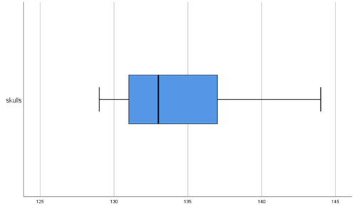
- [ ]	
- [ ]	
- [ ]	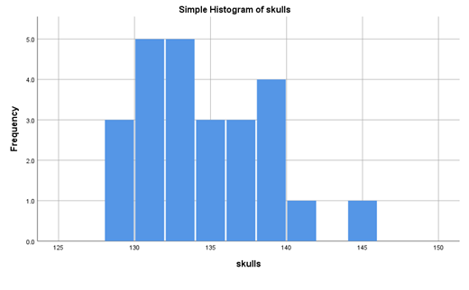
- [ ]	

```{r}
Q9 <- c(131, 136, 132, 135, 141, 131, 125, 131, 119, 136, 138, 139, 125, 131, 134, 129, 134, 126, 132, 141, 131, 135, 132, 139, 132)
hist(Q9, breaks=16)
```


**R Output:**


**Question 10**
Copy the data below into SPSS and use it to produce a boxplot.
Select the option corresponding to your graph.
126, 135, 134, 128, 130, 138, 128, 127, 131, 124, 141, 141, 135, 133, 131, 140, 139, 140, 138, 132, 134, 135, 133, 136, 134


```{r}
Q10 <- c(126, 135, 134, 128, 130, 138, 128, 127, 131, 124, 141, 141, 135, 133, 131, 140, 139, 140, 138, 132, 134, 135, 133, 136, 134)
boxplot(Q10)
```

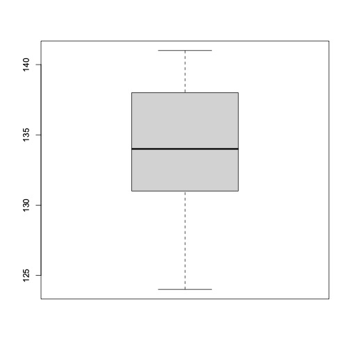


**Question 11**
Histograms and boxplots displaying the height distribution for three groups are shown below.
Match the histogram for each group to the correct boxplot.

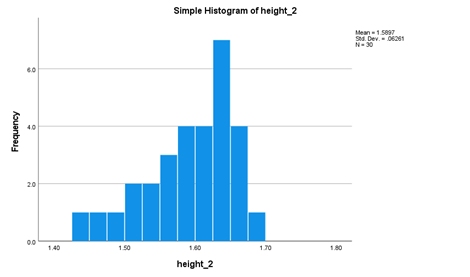


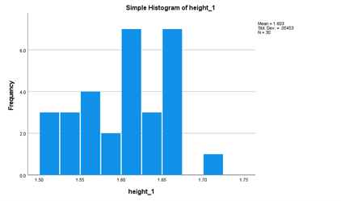


| Histogram         | Boxplot   |
| ----------------- | --------- |
| Group 3 Histogram | Boxplot A |
| Group 2 Histogram | Boxplot B |
| Group 1 Histogram | Boxplot C |

**Question 12**
Copy the data below into SPSS and use it to produce numerical summaries. Select the correct mean and sample standard deviation.
125, 131, 119, 136, 138, 139, 125, 131, 134, 129, 134, 126, 132, 141, 131, 135, 132, 139, 132

- [ ]	$\bar{x} = 129.36$, $s=5.59$
- [ ]	$\bar{x} = 132.05$, $s=1.28$
- [x]	$\bar{x}=132.05$, $s=5.59$
- [ ]	$\bar{x}=132.471$, $s=3.986$
- [ ]	$\bar{x}=132$, $s=7$

```{r}
Q12 <- c(125, 131, 119, 136, 138, 139, 125, 131, 134, 129, 134, 126, 132, 141, 131, 135, 132, 139, 132)
summary(Q12)
```

**Question 13**
Copy the data below into SPSS and use it to produce numerical summaries.
Select the correct quartiles.
Note: there are several different methods for determining quartiles. Pick the closest answer if you have used different technology and have slightly different values.
27.1
38.5
35.2
21.0
24.5
36.3
25.7
32.3
29.7
37.8

- [ ]	Q1=21.0, Q3=38.5
- [x]	Q1=25.7, Q3=36.3
- [ ]	Q1=26.4, Q3=35.2
- [ ]	Q1=25.7, Q3=31.0
- [ ]	Q1=31.0, Q3=36.3

```{r}
Q13 <- c(27.1, 38.5, 35.2, 21.0, 24.5, 36.3, 25.7, 32.3, 29.7, 37.8)
summary(Q13)
```

**Question 14**
Pick the bar chart that displays the same movie classification information as the pie chart.

- [ ] 
- [x]	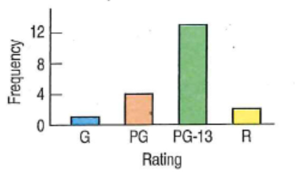
- [ ]	
- [ ]	
- [ ]	

**Question 15**
The following table shows the classification of 348 movies into their genre and by rating.

|                          | G    | PG   | PG-13 | R    | Total |
| ------------------------ | ---- | ---- | ----- | ---- | ----- |
| Action/Adventure         | 3    | 18   | 18    | 14   | 53    |
| Comedy                   | 2    | 18   | 29    | 41   | 90    |
| Documentary              | 4    | 8    | 8     | 9    | 29    |
| Drama                    | 0    | 16   | 36    | 65   | 117   |
| Musical                  | 0    | 2    | 2     | 0    | 4     |
| Suspense/Thriller/Horror | 0    | 1    | 13    | 41   | 55    |
| Total                    | 9    | 63   | 106   | 170  | 348   |

Considering Comedies only, which of the following graphs would be suitable to display the rating distribution?

[Select all that apply]

- [ ]	Stacked bar chart
- [x]	Pie chart
- [ ]	Histogram
- [ ]	Stem and leaf plot
- [ ]	Time-series graph
- [x]	Bar chart

**Question 16**
The following table shows the classification of 348 movies into their genre and by rating.

|                          | G    | PG   | PG-13 | R    | Total |
| ------------------------ | ---- | ---- | ----- | ---- | ----- |
| Action/Adventure         | 3    | 18   | 18    | 14   | 53    |
| Comedy                   | 2    | 18   | 29    | 41   | 90    |
| Documentary              | 4    | 8    | 8     | 9    | 29    |
| Drama                    | 0    | 16   | 36    | 65   | 117   |
| Musical                  | 0    | 2    | 2     | 0    | 4     |
| Suspense/Thriller/Horror | 0    | 1    | 13    | 41   | 55    |
| Total                    | 9    | 63   | 106   | 170  | 348   |

Considering Comedies only, which of the following would be suitable graph(s) that displays the rating distribution of the comedies.

[Select all that apply]

- [ ] 
- [ ]	
- [ ]	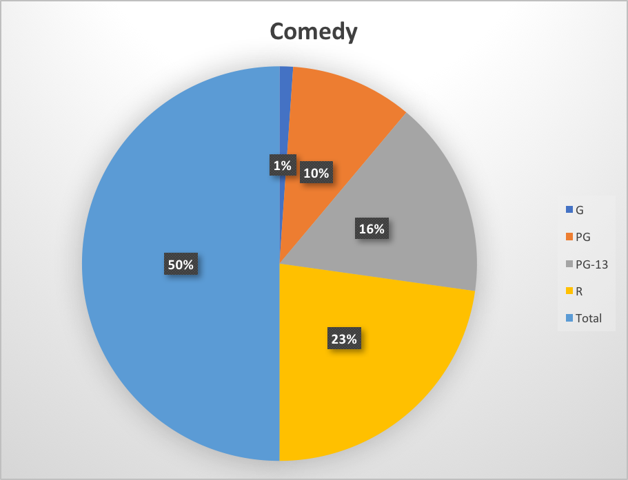
- [x]	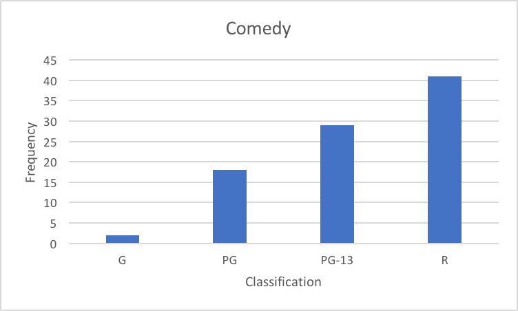
- [ ]	
- [ ]	

## Week 4 Quiz {.well}

**Question 1:**

Suppose for a given country:

23% of the population have type A blood

34% of the population have type B blood

3% of the population have type AB blood

and the rest have type O.


**What is the probability that a person volunteering to donate blood does not have type A blood?**

**Answer:** 0.77


```{r}
a <- 0.23
not_a <- 1 - a
not_a
```

**Question 2:**

Suppose for a given country:

27% of the population have type A blood

33% of the population have type B blood

9% of the population have type AB blood

and the rest have type O.

**Among 4 potential donors, what is the probability that none of them are type O?** _Write as a decimal between 0 and 1 to **three decimal places**, e.g. 45.7812% would be 0.458_

**Answer**: 0.31

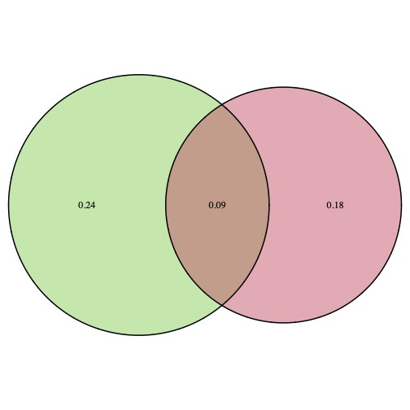

```{r}
a <- 0.27
b <- 0.33
ab <- 0.09
o <- 1 - (a + b + ab)
round(o^4, 3)
```


**Question 3:**

Assume that 41% of households have at least one dog, 27% of households have at least one cat and 15% of households have both animals.

**What is the probability that a randomly selected household has a dog but not a cat?**

[Enter as a decimal between 0 and 1 to **two decimal places**, e.g. for 45% write 0.45]

**Answer:** *0.26*


```{r}
d <- 0.41
c <- 0.27
cd <- 0.15
dog_only <- d - cd
dog_only
```

**Question 4:**

Assume that 29% of households have at least one dog, 18% of households have at least one cat and 12% of households have both animals.

**If a household has a dog, what is the probability that they also have a cat?**

*Enter as a decimal between 0 and 1 to **\*three\* decimal places**, e.g. for 45.123% write 0.451*

**Answer:** 0.12


> It helps to use a Venn diagram to model these. This is an example of conditional probability.  We want to know the probability of a cat, **given** that they have a dog.  
>
> The conditional probability formula is:
> $$
> Pr(A∣B) = \frac{Pr(A\ and\ B)}{Pr(B)}
> $$

```{r}
grid.newpage()
draw.pairwise.venn(area1=0.29, area2=0.18, cross.area=0.12, fill = 2:3)
```


**Question 5:**

Given the Venn Diagram, which of the following can be assumed about events A and B?

- [x] if event A occurs, then B must occur
- [x] events A and B are not mutually exclusive
- [ ] events A and B are mutually exclusive
- [ ] if event B occurs, then A must occur
- [ ] if event A occurs, then B can't occur
- [x] it is possible for both A and B to occur


**Question 6:**

Malaria is a mosquito-borne infectious blood disease of humans and other animals caused by a bite from a female mosquito infected with *Plasmodium*. A number of different species of *Plasmodium* which cause malaria can be found across different geographic regions. The following table shows the number of deaths (in hundreds of thousands) from three different *Plasmodium* species for three continents:

|                        |                   | Continent | Total      |                   |           |
| ---------------------- | ----------------- | --------- | ---------- | ----------------- | --------- |
|                        |                   | **Asia**  | **Africa** | **South America** | **Total** |
| **Plasmodium species** | **P. ovale**      | 30        | 14         | 32                | **76**    |
|                        | **P. vivax**      | 5         | 6          | 53                | **64**    |
|                        | **P. falciparum** | 52        | 44         | 6                 | **102**   |
|                        | **Total**         | **87**    | **64**     | 91                | **242**   |

Event A is that a malaria death was caused by the *P. vivax* species and event B is the malaria death was in Africa.

a) Find the following probabilities:

i) P(A)  (1 mark)

- [x] a. 0.264
- [ ] b. 0.078
- [ ] c. 0.360
- [ ] d. 0.421
- [ ] e. 0.627

ii) P(B)  (1 mark)

- [ ] A.0.360
- [ ] B. 0.395
- [ ] C. 0.025
- [x] D. 0.264
- [ ] E. 0.376

iii) P(A and B)  (1 mark)

- [ ] A. 0.248
- [ ] B. 0.219
- [x] C. 0.025
- [ ] D. 0.124
- [ ] E. 0.070

iv) P(A or B)   (2 marks)

- [ ] A. 0.421
- [ ] B. 0.529
- [ ] C. 0.550
- [ ] D. 0.070
- [x] E. 0.504

b) P(A|B)   (2 marks)

- [ ] A. 1
- [ ] B. 0.025
- [x] C. 0.094
- [ ] D. 0.828
- [ ] E. 0.264

c) Are events A and B mutually exclusive?  (1 mark)

- [ ] A. No, because a death can occur from the *P. vivax* species on only one continent
- [x] B. No, because a death can be caused by the *P. vivax* species and be in Africa
- [ ] C. No, because deaths caused by the *P. vivax* species are more likely to occur in Africa
- [ ] D. Yes, because a death can be caused by the *P. vivax* species and be in Africa
- [ ] E. Yes, because a malaria death is caused by only one of the species


**Question 7:**

Suppose the following probability for the number of units enrolled in, X, for Deakin students.

| X         | 1    | 2    | 3    | 4    | 5    |
| --------- | ---- | ---- | ---- | ---- | ---- |
| $Pr(X=x)$ | 0.07 | 0.18 | 0.37 | 0.33 | 0.05 |

Calculate the mean number of units a student will be enrolled in. _Express correct to **2 decimal places**_

Answer: 3.11

> *The mean of the distribution is calculated as:*
> $$
> \mu = 0.07(1) + 0.18(2) + 0.37(3) + 0.33(4) + 0.05(5)
> 		= 3.11
> $$


**Question 8:**

Suppose the following probability for the number of units enrolled in, X, for Deakin students.

| X         | 1    | 2    | 3    | 4    | 5    |
| --------- | ---- | ---- | ---- | ---- | ---- |
| $Pr(X=x)$ | 0.07 | 0.18 | 0.37 | 0.33 | 0.05 |

Calculate the standard deviation for the number of units a student will be enrolled in. _Express correct to **2 decimal places**_

Answer: 0.99

> Standard deviation from a probability distribution is calculated as:
> $$
> \sigma = \sqrt{\Sigma^n_{i=1}P(x_i)\times(x_i − \mu)^2}\\
> $$
> which in this case is:
> $$
> \sigma = \sqrt{0.07(1−\mu)^2+0.18(2−\mu)^2+0.37(3−\mu)^2+0.33(4−\mu)^2+0.05(5−\mu)^2}
> $$
> 
>
> where $\mu$ is the mean of the distributions:
> $$
> \mu =0.07(1) + 0.18(2) + 0.37(3) + 0.33(4) + 0.05(5) = 3.11
> $$

## Week 5 Quiz {.well}

**Question 1**

Assume in females the length of the fibula bone is normally distributed, with a mean of 35 cm and a standard deviation of 2 cm.

In what interval would you expect the central 99.7% of fibula lengths to be found?
Use the 68-95-99.7% rule only, not z tables or calculations.

[Enter integers/whole numbers only]

*29cm to 41cm*


**Question 2**

A standardised test with normally distributed scores has a mean of 100 and a standard deviation of 15.

About what percentage of participants should have scores above 115?

Use the 68-95-99.7% rule only, not z tables or calculations.

[Enter as a percentage to 1 decimal place, e.g. 45.1, without the % sign]

**Answer:** *16%*


**Question 3**

Assume in males the length of the femur bone is normally distributed, with a mean of 46 cm and a standard deviation of 3 cm.

What percentage of males should have a femur shorter than 41.7 cm?

[Enter as a percentage to 1 decimal place, e.g. 24.8, without the % sign]

**Answer:** *7.6*%

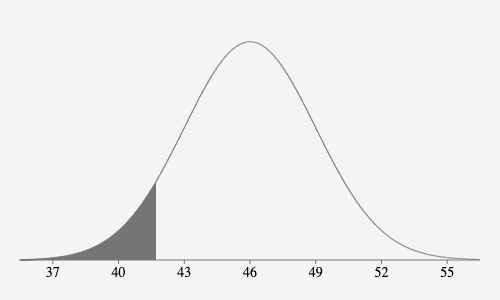

```{r}
round(pnorm(41.7, 46, 3) * 100, 1)
```


**Question 4**

Based on the Normal model *N*(35, 2) describing female fibula length (in cm), what percent of females would you expect to have fibula between 31.3 and 34.7 cm?

[Enter as a percentage to 1 decimal place, e.g. 45.2, without the % sign]

**Answer:** *40.8*%

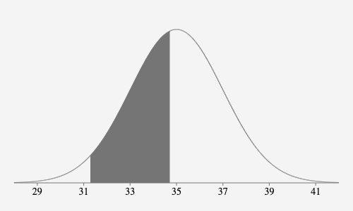


```{r}
upper <- pnorm(34.7, 35, 2)
upper
lower <- pnorm(31.3, 35, 2)
lower
interval <- upper - lower
round(interval * 100, 1)
```

**Question 5**

Based on the Normal model *N*(100, 15) describing IQ scores, what is the cut off IQ score for the lowest 10% of the IQs?

(enter correct to the nearest **whole number**, e.g. 26)

**Answer:**  _81_

```{r}
round(qnorm(0.10, 100, 15))
```


**Question 6**

In a particular rural area of Victoria, 52% of learner drivers pass their driving test on the first attempt.

**If 6 learner drivers are selected, what is the probability of a successful driving test outcome for all 6 drivers (on their first attempts)?**

[Enter your answer correct to 3 decimal places]

**Answer:** 0.020
$$
  p^n = {n \choose n}p^n(1-p)^0\\
      = {6 \choose 6}0.52^6(1 - 0.52)^0\\
      = 1 \times 0.019770609 \times 1\\
$$
```{r}
round(dbinom(6, size=6, prob=0.52), 3)
```


**Question 7**

Suppose 70% of the population have brown eyes, 15% have blue eyes, 6% have hazel eyes, 7% have green eyes and the rest 'other' (including grey).

Among 7 randomly selected people, what is the probability that exactly 4 people have blue eyes?

- [ ] 0.001
- [ ] 0.6
- [x] 0.011
- [ ] 3.11
- [ ] 0.227

```{r}
round(dbinom(4, size=7, prob=0.15), 3)
```


**Question 8**

Suppose 72% of adults have travelled overseas.

**If 6 adults are randomly selected, what is the probability that 3 or 4 of them have travelled overseas?**

[Enter your answer correct to 3 decimal places]

**Answer:** *0.480*

```{r}
round(dbinom(4, size=6, prob=0.72) + dbinom(3, size=6, prob=0.72), 3)
```


**Question 9**

In a particular rural area of Victoria, 80% of learner drivers pass their driving test on the first attempt.

**If 6 learner drivers are selected, what is the probability of a successful driving test outcome for at least 2 drivers?**

[Enter your answer correct to 3 decimal places]

**Answer:** *0.998*

Here it's easier to calculate the probability of none passing, of 1 passing, and then take the complement of this (which includes all outcomes that have 2 or more passing). 

The probability of none passing is

$(1−p)^6$

The probability of exactly 1 passing is

${6 \choose 1}p^1(1−p)^5 = 6p(1−p)^5$

and then subtracting both of these from 1 gives the final answer.

```{r}
1 - (dbinom(0, size=6, prob=0.8) + dbinom(1, size=6, prob=0.8))
```


**Question 10**

For a particular rural area, 81% of learner drivers pass their driving test on the first attempt.  Suppose 130 drivers are randomly sampled from the population.

**How many of the drivers would you expect to pass the test on their first attempt?**

[give your answer to the nearest integer]

**Answer:** *105*

We can assume that each of the drivers selected is close enough to independent and that the number of drivers sampled is less than 10% of the population. Also we have $np > 10$ and $nq > 10$.

Therefore to calculate the mean, we can use $np$.

```{r}
np <- 130 * 0.81
round(np, 0)
```


**Question 11**

A particular airline arrives on schedule 73% of the time.  Suppose an audit which looks at a random 110 flights is conducted.

**Calculate the standard deviation for the number of on-time flights from samples of 110 audited flights?**

[give your answer to 2 decimal places]

**Answer:** *4.66*

$$
  = \sqrt{npq}\\
  = \sqrt{110 \times 0.73 \times 0.27}\\
  = 4.66
$$

```{r}
n <- 110
p <- 0.73
q <- 1 - p
round(sqrt(n*p*q), 2)
```


**Question 12**

A particular airline arrives on schedule 89% of the time.  Suppose an audit which looks at a random 160 flights is conducted. 

**What is the probability that more than 150 of the flights audited would be on time?
Use a _normal approximation_ to the binomial model.**

[give your answer as a decimal to 3 decimal places, e.g. 0.045]

**Answer:** *0.027*

We can assume that each of the flights is close enough to independent and that the number of audited flights is less than 10% of the population. 

Also we have np > 10 and nq > 10.Therefore to calculate the mean, we can use $np$.

$160 \times 0.89 = 142.4$

Then to calculate the standard deviation, we have $\sqrt{npq}
$$
  \sqrt{npq}\\
  160 \times 0.89 \times 0.11\\
  \approx 3.96\\
$$
Then using a normal model, $N(142.4, 3.96)$ we can work out the probability of having a value greater than 150
$$
  z = \frac{150−142.4}{3.96}\\
  ≈1.92
$$


From a z-table, $P(z<1.92) = 0.9726$ and therefore, since we're looking for the probability of **more** than 150 being on time, we calculate $1 - 0.9726 = 0.027$

```{r}
n <- 160
p <- 0.89
q <- 1 - p
sd = sqrt(n*p*q)
testVal <- 150
mean <- n * p
round(1 - pnorm(testVal, mean, sd), 3)
```
## Week 6 Quiz {.well}

**Question 1**

People suffering from sacroiliac joint dysfunction can be given a steroid injection to relieve pain.  
After receiving an injection, 15 out of 34 patients reported a reduction in pain.

Calculate the standard error:

[Give your answer to 3 decimal places]

**Answer**: 0.085
$$
\hat{p} = \frac{15}{34} = 0.44117647\\
\hat{q} = 1 - \hat{p} = 0.55882353\\
SE(\hat{p}) = \sqrt{\frac{\hat{p}\hat{q}}{n}}\\
= \sqrt{\frac{0.441 \times 0.559}{34}}\\
= 0.085
$$

**Question 2**

For a 95% confidence interval, choose the most accurate value of z*.

- [ ] 0.025
- [ ] 2
- [ ] 1.65
- [x] 1.96
- [ ] 2.33

```{r}
round(abs(qnorm(0.05/2)), 2)
```

**Question 3**

People suffering from sacroiliac joint dysfunction can be given a steroid injection to relieve pain.  
After receiving an injection, 11 out of 38 patients reported a reduction in pain.

If you were to create a 90% confidence interval for the true proportion of sufferers of the condition whose symptoms should be improved by the injection, what is the **margin of error?**

[Giver your answer to 3 decimal places]

**Answer:** 0.118

...answer

**Question 4**

In a random sample of 75 Labrador Retriever adult dogs, 60 were found to be overweight. 
The calculated 90% confidence interval from this sample result for the true proportion of adult Labrador Retrievers that are overweight is 0.724 to 0.876.
Are significantly more than 70% of adult Labrador Retrievers overweight?

Select the following statements that are **true.**

- [ ] We can be 95% sure that the percentage of all the sampled adult Labradors that are overweight is between 72.4% and 87.6%.
- [x] A different random sample of adult Labradors will probably result in a different 90% confidence interval.
- [x] Based on this sample, we can be 90% sure that the percentage of all adult Labradors that are overweight is between 72.4% and 87.6%.
- [ ] Since 0.7 (70%) is below the lower bound of the confidence interval, there is evidence that significantly more than 70% of adult Labradors are overweight.
- [ ] Since the sample proportion is 80%, significantly more than 70% of all Labradors must be overweight.

**Question 5**

A random sample of 75 children from a region of rural Victoria found that 50 children consume at least one sugary soft drink per day. 
Construct a 90% confidence interval from this sample result for the true proportion of children consuming at least one sugary soft drink per day.

Choose the correct answer.

- [ ] 0.593 to 0.807
- [ ] 0.560 to 0.774
- [x] 0.578 to 0.757
- [ ] 0.667 to 0.900
- [ ] 0.489 to 0.711


**Question 6**

From a random sample of 80 adult Labrador Retrievers, 55 were found to be overweight.

Is there significant evidence that more than 65% of adult Labrador Retrievers are overweight? 

Select the appropriate hypotheses, where p is the proportion of adult Labrador Retrievers that are overweight.

- [x] $H_0: p = 0.65$
- [ ] $H_0: p ≠ 0.65$
- [x] $H_a: p > 0.65$
- [ ] $H_a: p = 0.65$
- [ ] $H_0: p = 0.6875$
- [ ] $H_a: p \ne 0.65$

**Question 7**

In a random sample of 80 Labrador Retriever adult dogs, 66 were found to be overweight. 
Are more than 70% of adult Labradors overweight?

Calculate the z test statistic required for the hypothesis test.

Choose the closest answer.

- [ ] -1.96
- [ ] 1.95
- [ ] -2.44
- [x] 0.93
- [ ] 2.94

```{r}
p <- 66/80
round(qnorm(p, lower.tail=TRUE), 2)
```

**Question 8**

For a two sided hypothesis test with a calculated z test statistic of 2.31, what is the P-value?

- [ ] 0.05
- [ ] 0.0104
- [x] 0.0208
- [ ] 0.9896
- [ ] 0.0107

```{r}
round(2*pnorm(2.31, lower.tail=FALSE), 4)
```

**Question 9**

In a random sample of children, 65% consumed at least one sugary soft drink per day. Is there evidence that the proportion of children consuming at least one sugary soft drink per day is significantly different to 80%?
Using a calculated test statistic value of z = -2.23 and P-value = 0.0258, choose the most correct conclusion (use α = 0.05).

- [ ] Reject Ha since the P-value > 0.05 – there is no evidence that the proportion of children who consume at least one sugary soft drink per day is different to 80%.
- [ ] Fail to reject H0 since the P-value > 0.01 – there is evidence that the proportion of children who consume at least one sugary soft drink per day is different to 80%.
- [x] Reject H0 since the P-value < 0.05 – there is evidence that the proportion of children who consume at least one sugary soft drink per day is significantly different to 80%.
- [ ] Reject H0 since the P-value > 0.05 – there is evidence that the proportion of children who consume at least one sugary soft drink per day is significantly different to 80%.
- [ ] Fail to reject H0 since the P-value < 0.05 – there is no evidence that the proportion of children who consume at least one sugary soft drink per day is significantly different to 80%.

## Week 7 Quiz {.well}

**Question 1**

Consider the different scenarios below and match with the appropriate statistical test/calculation.  

**A one proportion z-test**	
From a random sample of 195 people from one suburb, it was found that 35 go to the movies at least once a month.  We want to know whether the proportion of movie-goers from this suburb differs significantly from the proportion for the whole city, which is stated to be 15%.

**A two proportion z confidence interval**
A recent study on the diet of athletes reported that 12% of females and 21% of males take protein supplements.
We want to know by how much the proportions of athletes taking protein supplements differs between females and males.  

**A two proportion z-test**
A recent study reported that 9% of women and 6% of men are vegetarians.  We want to know if the difference in the proportions of vegetarians between the genders is statistically significant.

**A one proportion z confidence interval**
In a random sample of 315 children, 251 said they use an iPad every day.  We want to estimate the proportion of all children who use an iPad every day.

**Question 2**

Carpal tunnel syndrome is a painful wrist condition that can be treated with surgery or less invasively with wrist splints. In a study of 180 patients with the condition, half had surgery and half used wrist splints. In the surgery group, 70 patients showed improvement after three months while 42 of those who used wrist splints improved. Is surgery more effective than the use of wrist splints for improving symptoms of the condition?

Calculate a 95% confidence interval for the difference (surgery - wrist splints) in improvement rates.

- [ ] -0.177 to 0.445
- [ ] -0.445 to 0.177
- [ ] 0.233 to 0.542
- [ ] 0.467 to 0.778
- [x] 0.177 to 0.445

```{r}
prop.test(x=c(70,42), n=c(90, 90), alternative="two.sided", correct=FALSE)
```

**Question 3**

A new drug is believed to help in the recovery of stroke patients. A clinical experiment was conducted to test the effects of the new drug against an existing drug. Researchers observed 3154 patients given the new drug and found some improvement of their symptoms in 865 of them. Of the 2016 patients given the existing drug, 509 reported improvement.

A 95% confidence interval was calculated for the difference in the improvement rates

(new drug - existing drug), and is given by [-0.003, 0.046].

Which of the following interpretations is most applicable? 

 

- [ ] Between 0.3% and 4.6% of all the patients reported an improvement in their symptoms.
- [ ] The improvement rate for patients given the new drug was significantly higher than the rate for patients given the existing drug.
- [ ] We are 95% sure that between 0.3% and 4.6% more patients using the new drug showed improvement compared with those on the existing drug.
- [x] The difference in improvement rates between the two drugs was not statistically significant.

```{r}
prop.test(x=c(865,509), n=c(3154, 2016), alternative="two.sided", correct=FALSE)
```

**Question 4**

Carpal tunnel syndrome is a painful wrist condition that can be treated with surgery or less invasively with wrist splints. In a study of 180 patients with the condition, half had surgery and half used wrist splints. In the surgery group, 70 patients showed improvement after three months while 42 of those who used wrist splints improved. Is surgery more effective than the use of wrist splints for improving symptoms of the condition?

Let ps denote the proportion of patients that would show improvement with surgery and pw denote the proportion of patients that would show improvement using wrist splints. 

Select the appropriate hypotheses.

- [ ] $H_a: ps = pw$
- [ ] $H_0: ps \ne pw$
- [x] $H_0: ps = pw$
- [x] $H_a: ps > pw$
- [ ] $H_a: ps \ne pw$
- [ ] $H_0: ps > pw$

**Question 5**

Carpal tunnel syndrome is a painful wrist condition that can be treated with surgery or less invasively with wrist splints. In a study of patients with the condition, 88 had surgery and 76 used wrist splints. In the surgery group, 62 patients showed improvement after three months while 39 of those who used wrist splints improved. Is surgery more effective than the use of wrist splints for improving symptoms of the condition?

Determine the z test statistic value to be used in the hypothesis test.

Answers will vary slightly due to rounding. Select the closest answer, ignoring any negative sign.

- [ ] 0.05
- [x] 2.51
- [ ] 4.89
- [ ] 3.35
- [ ] 2.16

```{r}
prop.test(x=c(62,39), n=c(88,76), alternative="two.sided", correct=FALSE)
```

**Question 6**

Survey results show that 72.3% of men and 58.7% of women have gym memberships. Is the difference in proportions significant? Using a calculated test statistic value of $z = 2.55$ and $P-value = 0.01$, choose the most correct conclusion (use $\alpha = 0.05$).

- [ ] Reject Ha since P-value > 0.05 – there appears to be no significant difference in the proportions of men and women who have gym memberships
- [x] Reject $H_0$ since P-value < 0.05 – there appears to be a significant difference in the proportions of men and women who have gym memberships
- [ ] Reject $H_0$ since the P-value < 0.05 – a significantly greater proportion of women than men have gym memberships
- [ ] Fail to reject $H_0$ since P-value > 0.05 – there appears to be no significant difference in the proportions of men and women who have gym memberships
- [ ] Fail to reject $H_0$ since P-value < 0.05 – there appears to be a significant difference in the proportions of men and women who have gym memberships

**Question 7**

Smarties (sugar coated chocolate confectionary) come in 8 colours – green, yellow, red, orange, pink, purple, blue and brown. You buy a bag containing 120 smarties to investigate the distribution of colours, and count 12 green, 14 yellow, 17 red, 15 orange, 16 pink, 17 purple, 11 blue and 18 brown smarties.

To see if your results are consistent with the colours being equally represented or not, which is the most appropriate test?

- [ ] Chi-square test of independence
- [x] Chi-square goodness-of-fit test
- [ ] One proportion z-test
- [ ] Two proportion z-test

**Question 8**

To determine if there is an association between gender and accident circumstance, 120 people who had been injured in an accident were randomly selected from medical records and categorised by gender and the circumstance. The results are shown below.

|              | **At work  ** | **At home  ** | **Car** | **other   ** | **TOTAL** |
| ------------ | ------------- | ------------- | ------- | ------------ | --------- |
| **Female  ** | 11            | 16            | 11      | 19           | 57        |
| **Male**     | 17            | 8             | 4       | 34           | 63        |
| **TOTAL**    | 28            | 24            | 15      | 53           | 120       |


If gender and accident circumstance are independent, how many males would be expected to be injured at work?

**Choose the correct value.**

- [x] 14.7
- [ ] 17
- [ ] 9.3
- [ ] 15.75
- [ ] 4.0

**Question 9**

The following table shows data on randomly selected crime victims.

|                                  | Homicide | Robbery | Assault |
| -------------------------------- | -------- | ------- | ------- |
| Criminal was a stranger          | 12       | 379     | 727     |
| Criminal was known to the victim | 39       | 106     | 642     |

 

**For a test regarding a possible association between the type of crime and the relationship of the criminal with the victim, what would be the appropriate hypotheses?**

- [ ] $H_a$: There are unequal numbers of each type of crime
- [ ] $H_a$: Robberies are more likely to be committed by strangers than assaults.
- [ ] $H_0$: Type of crime and relationship to victim are related.
- [x] $H_a$: Type of crime and relationship to the victim are not independent.
- [x] $H_0$: Type of crime and relationship to the victim are independent.
- [ ] $H_0$: There are equal numbers of each type of crime.

**Question 10**

Smarties (sugar coated chocolate confectionary) come in 8 colours – green, yellow, red, orange, pink, purple, blue and brown. You buy a bag to investigate the distribution of colours, and count 12 green, 16 yellow, 12 red, 13 orange, 12 pink, 12 purple, 15 blue and 18 brown smarties.

**What is the value of the degrees of freedom for a goodness-of-fit test?
Give the integer (whole number) answer.**

**Answer:** $df = n - 1 = 7$

**Question 11**

Smarties (sugar coated chocolate confectionary) come in 8 colours – green, yellow, red, orange, pink, purple, blue and brown. You buy a bag of 120 smarties to investigate the distribution of colours, and count 16 green, 10 yellow, 16 orange, 16 pink, 16 purple, 16 blue, 12 brown smarties and the remainder red.
Are the colours represented equally?

**Calculate the value of the $\chi^2$ test statistic.**

[Give your answer to 1 decimal place]

**Answer**: 3.2

```{r}
smarties <- c(16, 10, 16, 16, 16, 16, 12, 18)
chisq.test(smarties)
```

**Question 12**

Suppose we were interested in whether the current year's enrolments in the Science faculty differed to previous years in terms of the distribution of students across different areas.  We usually expect a ratio of 3:2:1:1:2:1 across the areas of Ecology, Biology, Chemistry, Engineering, Architecture, IT.  

In conducting a goodness-of-fit test, we obtained a $\chi^2$ value of 9.7.  

**Choose the correct P-value range.
**Note, if you have found an exact value with technology, choose the range that contains your value.

- [ ] 0.005 < P-value < 0.01
- [ ] P-value > 0.3
- [ ] 0.1 < P-value < 0.2
- [ ] P-value < 0.05
- [x] 0.05 < P-value < 0.1

**Question 13**

When someone is charged with a crime, a jury may be required to decide the result in court. One study in a large city compared the ages of jury members with the general population to see if the jury were representative. In the city 35% of residents are less than 30 years old, 32% are aged between 31 to 50 years, 22% are aged 51 to 60 years and 11% are older than 60 years.

A sample of 100 jury members was taken in the city. Below are the observed counts:      

| Age (years)  | Observed Count |
| ------------ | -------------- |
| Less than 30 | 37             |
| 31 - 50      | 28             |
| 51 - 60      | 24             |
| Over 60      | 11             |

Is the age distribution for the jury members consistent with the age distribution for the general population?

A Chi-square Goodness of fit test was conducted with the test statistic calculated as 0.79 and P-value>0.3.

**Using a significance level of 5%, what would you conclude?
(select all that apply)**

- [x] Fail to reject $H_0$ since P-value >0.05  The ages of the sampled jury members seem representative of the population.
- [ ] The over 60s are less represented amongst the jury than the population.
- [x] For each age group, the percentages of the jury members are similar to those for the population.
- [ ] Reject $H_0$ since P-value <0.05 The ages of the sampled jury members do not appear to be representative of the population.
- [ ] $H_a$ is proved.The ages of the sampled jury members are not representative of the population.
- [ ] Fail to reject $H_0$ since P-value >0.05. The jury is independent.

```{r}
age <- c(37,28,24,11)
chisq.test(age, p=c(.35,.32,.22,.11))
```

## Week 8 Quiz {.well}

### Inference for one mean

**Finding t using R**

Finding t* using the qt() function:

a. A confidence level of 90%, and df = 10

```{r}
  sample1 <- qt(p=0.10/2, df=10, lower.tail=FALSE)
  print(round(sample1, 2))
```
b. A confidence level of 98% and n = 15

```{r}
  sample2 <- qt(p=0.02/2, df=14, lower.tail=FALSE)
  print(round(sample2, 2))
```

***

>**Confidence interval example**
>
>  Consumer Reports tested 14 brands of vanilla yoghurt and found the following calories per 200g serving:
>  
>  160  200  220  230  120  180  140  130  170  190  80  120  100  170
>
>1. Create a 95% confidence interval for the average calorie content in 200g of vanilla yoghurt.
>$$
> \begin{aligned}
>    \bar{x} &= 157.86\\
>    s &= 44.75\\
>    \\
>    \bar{x} \pm t^{*}_{df} \times \frac{s}{\sqrt{n}} &= 157.86 \pm 2.16 \times \frac{44.18}{\sqrt{14}}\\
>    &= 157.9 \pm 25.86\\
>    &= 132.0, 183.8\\
>  \end{aligned}
>$$
>    _i.e., we are 95% confident that the average calorie content ($\mu$) of all vanilla yoghurt is between 132.0 and 183.8 calories._
>
>
>2. A diet guide claims that there are 120 calories in a 200g serving of vanilla yoghurt. What does this evidence indicate?
>
>    _Since 120 calories is not contained in the interval (120 is below the lower bound of 132), the evidence indicates that the diet guide is incorrect and a 200g serve of the >        yoghurt has significantly more than 120 calories._

**GUIDED PRACTICE 7.12**

Using the information and results of Guided Practice 7.10 and Example 7.11, compute a 90% confidence interval for the average mercury content of croaker white fish (Pacific).

$$
  \begin{aligned}
    \bar{x} &= 0.287\\
    s &= 0.069\\
    df &= 15 - 1 = 14\\
    \\
    \bar{x} \pm t^{*}_{df} \times \frac{s}{\sqrt{n}} &= 0.287 \pm 1.76 \times \frac{0.069}{\sqrt{15}}\\
    &=  0.287 \pm 0.0314\\
    &= 0.256,\ 0.318\\
  \end{aligned}
$$
  _We are 90% confident that the average mercury content of croaker white fish (Pacific) is between 0.256 and 0.318 ppm._

**GUIDED PRACTICE 7.13**

The 90% confidence interval from Guided Practice 7.12 is 0.256 ppm to 0.318 ppm. Can we say that 90% of croaker white fish (Pacific) have mercury levels between 0.256 and 0.318 ppm?

  _No, a confidence interval only provides a range of plausible values for a population parameter, in this case the population mean. It does not describe what we might observe     for individual observations._
  
**Sample Question 2**

A random sample of 25 people followed a particular diet for 6 weeks. Their average weight loss was 5.6kg with standard deviation 0.8kg. Construct a 95% confidence interval for the average weight loss for this diet.
$$
  \begin{aligned}
    \bar{x} &= 5.6\\
    s &= 0.8\\
    \\
    \bar{x} \pm t^{*}_{df} \times \frac{s}{\sqrt{n}} &= 5.6 \pm 2.06 \times \frac{0.8}{\sqrt{25}}\\
    &=  5.6 \pm 0.3\\
    &= 5.3,\ 5.9\\
  \end{aligned}
$$
  _i.e., we are 95% confident that the average weight loss ($\mu$) for people following this diet is between 5.3 and 5.9 kg._

<details>
<summary>**Inference for paired means**</summary>

  $\bar{x}_d$ denotes the mean difference.
  $s_d$ denotes the standard deviation differences.
  
  **Hypotheses**
  $$
    \begin{aligned}
      H_0: \mu_d &= 0\\
      H_a: \mu_d &< 0\ OR\\
      \mu_d &< 0\ OR\\
      \mu_d &\neq 0\
    \end{aligned}
  $$

**Paired data**

Which of the following situations would result in paired data:

~~Comparing test results for one campus compared with another.~~

$\checkmark$ Comparing individual students' Assignment 1 and 2 results.

$\checkmark$ Investigating blood pressure change from a new drug.

**Assumptions & Conditions**

Differences must be independant of each other.

Population differences ($N$) need to be a normal (distribution) model.

A large sample size ($n$) will help to ensure normality.

Random samples will ensure independence.

**Confidence intervals for the mean difference ($\bar{x}_d$)**
$$
  \begin{aligned}
    point\ estimate\ \pm t^{*}_{df} \times \frac{s_d}{\sqrt{n}}
  \end{aligned}
$$

- $t^{*}_{df}$ will depend on the specified confidence level (i.e. 90%) and on the degrees of freedom ($n - 1$), and can be obtained from:
   - t table
   - qt() function in R
</details>


**t test statistic**

$$
  \begin{aligned}
    t = \frac{\bar{x}-\mu_0}{\frac{s_d}{\sqrt{n}}}
  \end{aligned}
$$

>**Hypotheses**
>
>A new drug designed to lower blood pressure is being trialed. A random sample of patients with high blood pressure took the drug for 6 weeks and their blood pressure was >recorded before taking the drug and at the end of the trial. Did their blood pressure decrease?
>
>Formulate the null and alternative hypotheses.
>$$
  \begin{aligned}
    H_0: \mu_d &= 0\\
    H_a: \mu_d &< 0\ (if\ d = after - before)\ OR\\
    H_a: \mu_d &> 0\ (if\ d = before - after)\\
  \end{aligned}
>$$

**Example**

A group of 9 randomly selected adults were given self defence lessons. Prior to the course, they were tested to determine their self-confidence. After the course they were given the same test. A high score on the test indicates a high degree of self-confidence. The scores and their differences (after – before) are given in the table below.

```{r, echo=FALSE}
  confidence <- matrix(c(6,10,8,6,5,4,3,8,5,8,12,9,6,7,5,4,9,5,2,2,1,0,2,1,1,1,0),ncol=3,byrow=FALSE)
  rownames(confidence) <- c("One","Two","Three","Four","Five","Six","Seven","Eight","Nine")
  colnames(confidence) <- c("Before","After","Difference")
  knitr::kable(confidence)
```

Note: $x_d=1.11$ and $s_d=0.78$

a. Do the results indicate that the course significantly increases the self-confidence of adults? Use $\alpha=0.01$.

$$
  \begin{aligned}
    H_0: \mu_d &= 0\\
    H_a: \mu_d &> 0\\
    \\
    t &= \frac{\bar{x}_d - \mu_0}{\frac{s}{\sqrt{n}}} = \frac{1.11 - 0}{\frac{0.78}{\sqrt{9}}}\\
    &= 4.27
  \end{aligned}
$$
P-value < 0.005

Since P-value $< \alpha$, reject $H_0$.

There is evidence that the self defence lessons significantly increase self-confidence in adults.

b.i. Calculate a 98% confidence for the true mean difference between the scores.

$$
  \begin{aligned}
    \bar{x} &= 1.11\\
    s &= 0.78\\
    \\
    \bar{x} \pm t^{*}_{df} \times \frac{s}{\sqrt{n}} &= 1.11 \pm 2.9 \times \frac{0.78}{\sqrt{9}}\\
    &=  1.11 \pm 0.754\\
    &= 0.36,\ 1.86\\
  \end{aligned}
$$

  _We are 98% sure than the true mean increase in self-confidence is between 0.36 and 1.86._

b.ii. Comment on your result in relation to your conclusion from a).
  _The confidence interval supports the hypothesis test result since 0 (no difference) is not contained in the interval and we rejected the null hypothesis that there was no     difference in self-confidence due to the self defence lessons._

>**Paired data activity**
>
>Complete the following questions with software or by hand.
>
>Twelve males aged between 13 and 16 were asked to self-report their height (in cm). Their heights were then measured. Is there sufficient evidence to support the claim that >there is a difference between self-reported and measured heights for males in this age group?

```{r, echo=FALSE}
  height <- matrix(c(173.0,180.0,160.0,178.0,180.0,152.0,165.0,162.0,137.0,160.0,168.0,183.0,172.5,177.5,164.8,173.5,178.6,153.9,163.8,170.2,141.2,188.5,165.1,179.8),ncol=2,byrow=FALSE)
  colnames(height) <- c("Reported","Mesured")
  knitr::kable(height)
```
>
>Note: $x_d=−2.617$ and $s_d=8.997$ (with d = reported − measured)
>
>a. Carry out a hypothesis test and use a 5% level of significance. 
>
>b. Report a 95% confidence interval to estimate the mean difference between reported heights and measured heights.
>
>c. How does your interval support your decision from the hypothesis test?

## Week 9 Quiz {.well}

**Question 1**

Jimmy wants to test the performance of two different pairs of shoes on his running times. Each time he runs, he flips a coin to determine which pair of shoes he's going to wear and then measures the time (in minutes) it takes him to run 10km. He ran wearing Pair 1 on 11 occasions (mean of 42:03, standard deviation of 3:16) and Pair 2 on 13 occasions (mean of 40:29, standard deviation of 4:23). 

What is the value for the **degrees of freedom** (using $n_1 + n_2 - 2$)?

```{r}
  Pair1 <- 11
  Pair2 <- 13
  df <- Pair1 + Pair2 - 2
  print(df)
```

**Question 2**

Hand span is defined as the maximum distance between the tips of the thumb and little finger. Hand span (cm) was compared for a random sample of 87 boys and 103 girls of the same age. From the results, a 95% confidence interval for the average difference (boys - girls) in hand span between the genders was calculated as 2.06 to 2.98cm.

Choose the most correct interpretation of the interval.

- [x]   We can be 95% confident that average hand span for boys is between 2.06 and 2.98cm larger than the average hand span for girls.
- [ ]   We can be 95% confident that average hand span for girls is between 2.06 and 2.98cm larger than the average hand span for boys.
- [ ]   The average hand span for all boys is between 2.06 smaller and 2.98cm larger than the average hand span for all girls.
- [ ]   We can be 95% confident that average hand span for boys is between 2.06 and 2.98cm.
- [ ]   We can be 95% confident that average hand span for girls is between 2.06 and 2.98cm.

**Question 3**

A researcher wanted to compare whether language makes a difference in recalling sequences of numbers. Each test involved briefly displaying a random sequence of digits and then asking the participant to recall as much of the sequence as they could. The data collected for a sample of English speakers and a sample of Chinese speakers were as follows.  The means given are the average number of digits that could be remembered from the sequence.
 
...answer

Calculate a 95% confidence interval for the difference (English score - Chinese score) in average recall for English and Chinese speakers and choose the correct answer.
Use $df = n_1 + n_2 - 2$.

- [ ]   $-1.85$ to $2.38$
- [ ]   $-1.96$ to $-0.16$
- [ ]   $7.12$ to $8.18$
- [x]   $-2.14$ to $0.02$
- [ ]   $1.339$ to $2.507$

> The confidence interval formula is:
>
> $(\bar{x}_1 − \bar{x}_2) \pm t^*_{df} \times \sqrt{\frac{s_1^2}{n_1} + \frac{s_2^2}{n_2}}$
>
> $df = 36 + 26 - 2 = 60$.
>
>The critical $t-value$ is $2.00$ (reading from the t-table based on a 95% confidence interval).

**Question 4**

Random samples of students from two different prac groups were selected, and their scores for an assessment task (out of 80) recorded.
The summary statistics and SPSS t-test output to test whether the average scores were different between the prac groups is shown.


Assuming variances are not equal, which of the following is a 95% confidence interval for the true mean difference between the groups' scores?

- [ ]   -17.08 to -3.56
- [ ]   58.61 to 65.38
- [x]   -17.08 to 3.56
- [ ]   -6.761 to -1.450
- [ ]   -14.55 to -4.63

**Question 5**

Random samples of male and female dogs of the same large breed were selected, and their weights (in kg) measured.

Use SPSS to calculate a 90% confidence interval for the true mean difference in weights between the genders then select the correct option (correct to one decimal place).

...answer

- [ ]   2.2 to 11.8
- [ ]   3.4 to 10.4
- [x]   3.1 to 10.9
- [ ]   60.4 to 67.4
- [ ]   -3.2 to 10.8

**Question 6**

The length of two different worm species is being compared.

What are the null and alternative hypotheses for a hypothesis test to determine whether the two species are significantly different regarding their average length?

|     |                            |
|-----|----------------------------|
|&#9744;|$H_0: \hat{p}_1 = \hat{p}_2$<br>$H_a: \hat{p}_1 > \hat{p}_2$|
|&#9744;|$H_0: \bar{y}_1 = \bar{y}_2$<br>$H_a: \bar{y}_1 \ne \bar{y}_2$|
|&#9744;|$H_0: \mu_1 = \mu_2$<br>$H_a: \mu_1 > \mu_2$|
|&#9744;|$H_0: \hat{p}_1 = \hat{p}_2$<br>$H_a: \hat{p}_1 \ne \hat{p}_2$|
|&#9745;|$H_0: \mu_1 = \mu_2$<br>$H_a: \mu_1 \ne \mu_2$|

**Question 7**

Random samples of students from two different prac groups were selected, and their scores for an assessment task (out of 80) recorded.
The summary statistics and SPSS t-test output to test whether the average score was higher for group 1 is shown.


Which option shows the test statistic value and the P-value for this test?

- [ ]   t = 4.412 and P-value = 0.05
- [ ]   t = 4.494 and P-value = 0.0005
- [ ]   t = 4.494 and P-value = 0.002
- [x]   t = 4.494 and P-value = 0.001
- [ ]   t = 4.412 and P-value = 0.001

**Question 8**

Random samples of students from two different prac groups were selected, and their scores for an assessment task (out of 80) recorded.
Is the average score lower for group 2?
Use SPSS to perform the hypothesis test then select the option that best corresponds to the test statistic value and P-value.

...answer

- [ ]   t = 4.893 and P-value < 0.001
- [ ]   t = 4.893 and P-value = 0.05
- [ ]   t = 4.893 and P-value = 11.832
- [ ]   t = 11.832 and P-value < 0.001
- [x]   t = 4.893 and P-value < 0.0005

**Question 9**

An experiment was conducted to test the ability of rats to navigate a maze, as measured by the time it takes rats to find food at the end of the maze.
The maze completion times (in minutes) for 25 male and 28 female rats were observed, with the results given below.
 
...answer

If conducting a hypothesis test to see whether the average completion time is significantly different for male and female rats, what is the magnitude of t, the test statistic?

[If you have a negative value then just choose the correct magnitude - i.e. the value as a positive number]

- [x]   1.93
- [ ]   0.59
- [ ]   2.57
- [ ]   0.10
- [ ]   1.82

**Question 10**

A hypothesis test to test if one mean is greater than the other (1-tailed probability) was conducted, with $n_1 = 24$ and $n_2 = 26$ and  

$t = \frac{\bar{x}_1 − \bar{x}_2 − 0}{SE(\bar{x}_1 − \bar{x}_2)} = 1.27$

Select the correct P-value range, using $df = n_1 + n_2 -2$.

- [ ]   $P-value > 0.01$
- [ ]   $P-value > 0.2$
- [ ]   $0.05 < P-value<0.1$
- [x]   $P-value > 0.1$
- [ ]   $P-value < 0.05$

**Question 11**

An experiment was conducted to test the ability of rats to navigate a maze, as measured by the time it takes rats to find food at the end of the maze.
The average maze completion time (in minutes) for 25 male rats was 64.2 minutes and for 28 female rats the average completion time was 59.4 minutes
Is the difference in mean completion times significant?
Using a calculated test statistic value of $t = 4.72$ and $P-value < 0.010$, choose the most correct conclusion (use $\alpha = 0.05$).

- [ ]   Fail to reject $H_0$ since $P-value < 0.05$ – there is evidence that the mean completion time for male rats is longer than that for females
- [ ]   Reject $H_a$ since $P-value < 0.05$ – there is insufficient evidence that the mean completion time for male and female rats is different
- [x]   Reject $H_0$ since the $P-value < 0.05$ – there appears to be a significant difference in the mean completion time for male and female rats
- [ ]   Reject $H_0$ since $P-value > 0.05$ – there appears to be no significant difference in the mean completion time for male and female rats
- [ ]   Fail to reject $H_0 since P-value > 0.05$ – there appears to be no significant difference in the mean completion time for male and female rats

**Question 12**

The average hours of pain relief provided by five different pain relief drugs are to be compared. Patients with post-surgery pain were randomly assigned to one of the drugs and the number of hours of pain relief recorded. Ten patients were assigned to take each drug.
Choose the appropriate null and alternative hypotheses.

- [ ]   $H_a: \mu1 \ne \mu2 \ne \mu3 \ne \mu4 \ne \mu5$ (all five of the groups' averages differ)
- [x]   $H_a$: At least 2 of the drugs provide significantly different average pain relief
- [x]   $H_0: \mu1 = \mu2 = \mu3 = \mu4 = \mu5$ (all drugs have the same average pain relief)
- [ ]   $H_0$: The average pain relief for drug 1 is significantly lower than all other drugs.

**Question 13**

Random samples of adults from three different suburbs were selected, and their weights recorded.
The summary statistics and SPSS ANOVA output to test whether the average weights were different between any of the suburbs is shown.


Which option shows the test statistic value and the P-value for this test?

- [ ]   F = 4.329 and P-value = 0.058
- [ ]   F = 4.329 and P-value = 0.0145
- [ ]   t = 3.558 and P-value = 0.327
- [x]   F = 4.329 and P-value = 0.029
- [ ]   F = 0.629 and P-value = 0.545

**Question 14**

Random samples of 5 students from four different prac groups were selected, and their scores for an assessment task (out of 80) recorded.
Do any of the groups' means differ significantly?
Use SPSS to perform the ANOVA test then select the option that shows the test statistic value and P-value.

...Answer

- [ ]   F = 14.100 and P-value = 0.002
- [x]   F = 7.833 and P-value = 0.002
- [ ]   t = 9.358 and P-value = 0.000
- [ ]   F = 10.470 and P-value = 0.000
- [ ]   F = 7.833 and P-value = 0.001

**Question 15**

An experiment involved hand washing with four different soaps to see what effect the soaps might have on bacteria colonies.
The ANOVA table is shown below.


What are the conclusions you can reach based on the test (use $\alpha = 0.05$)?

[Select all that apply]

- [x]   There are no statistically significant differences between mean bacteria colonies for any of the soaps.
- [x]   Since $p-value > \alpha$, we fail to reject $H_0$.
- [ ]   The average bacteria colonies between at least two of the soaps are significantly different.
- [ ]   Since $p-value < \alpha$, we reject $H_0$.
- [x]   It would be appropriate to perform Bonferroni multiple comparisons to determine which soaps result in significantly different mean bacteria colonies.

**Question 16**

Random samples of students from three different prac groups were selected, and their scores for an assessment task (out of 80) recorded.
The summary statistics and SPSS ANOVA output to test whether the average scores were different between any of the prac groups is shown.


Which option gives the most accurate summary of the Bonferroni Multiple Comparisons, using $\alpha = 0.05$?

- [ ]   The mean for group 3 is significantly higher than the mean for group 1, which is significantly higher than the mean for group 2.
- [ ]   The mean for group 1 is significantly higher than the mean for group 2.
- [ ]   All of the groups' means are significantly different to each other.
- [x]   The mean for group 3 is significantly higher than the means for groups 1 and 2.
- [ ]   None of the groups' means are significantly different to each other.

## Week 10 Quiz {.well}

**Question 1**

Shown are four scatter plots. The calculated correlations are $0.008,\ -0.986,\ 0.671,\ -0.589$. Match the correlations to the correct plot.


**Question 2**

From the SPSS output below, what is the correlation value?


- [ ]    $4.22199$
- [ ]    $87.4%$
- [x]    $0.935$
- [ ]    $0.874$
- [ ]    $0.868$

**Question 3**

For the following data, use SPSS or other technology to calculate the correlation between the variables.


 
- [ ]    $-0.887$
- [ ]    $-887$
- [x]    $-0.867$
- [ ]    $-0.786$
- [ ]    $0.87$

**Question 4**

For a random sample of 15 adults, tibia length and height were recorded with the SPSS linear regression analysis shown below.  Researchers are investigating whether tibia length can be used to predict height.


Which of the following gives the correct linear regression equation?

- [x]    $\hat{height} = −39.619 + 4.983 \times tibia$
- [ ]    $\hat{height} = 39.619−4.983 \times tibia$
- [ ]    $\hat{tibia} = 4.983 \times height − 39.619$
- [ ]    $\hat{height} = −39.619 + 20.203 \times tibia$
- [ ]    $\hat{tibia} = 4.983 + 0.457 \times height$

**Question 5**

Wild bears were caught and anaesthetised so that various measurements could be made. In particular, the usefulness of a bear’s chest circumference to predict its weight was of interest. A random sample of 10 bears was used, with the chest and weight measurements shown below, as well as the linear regression analysis.

...Answer

What can be said about the y-intercept ($-251.948$) in the context of this study? (Select all that apply)

- [x]    The y-intercept would indicate the chest size of a bear with zero weight.
- [ ]    The y-intercept is close to a number of the observed data values and therefore seems reliable.
- [ ]    The y-intercept is meaningful in that it would represent the weight of bears when they are born.
- [ ]    The y-intercept would indicate the weight of a bear with zero chest circumference.  
- [x]    The y-intercept is based on extrapolation and therefore is not reliable.
- [x]    The y-intercept is not meaningful for this data as it would not make sense to have a bear with zero chest size or negative weight. 

**Question 6**

For a random sample of 15 adults, tibia (shinbone) length and height were recorded (in cm) with the SPSS linear regression analysis shown below.  Researchers are investigating whether tibia length can be used to predict height.


Which option is the correct interpretation of the slope of the regression equation?

- [ ]    An increase in tibia length of 1cm corresponds with an increase in height of 4.983cm.
- [x]    An increase in height of 1cm corresponds with an increase in tibia length of 4.983cm.
- [ ]    An increase in tibia length of 1cm corresponds with an increase in height of 39.619cm.
- [ ]    A decrease in tibia length of 39.619cm corresponds with an increase in height of 4.983cm.
- [ ]    An increase in tibia length of 1cm corresponds with a decrease in height of 4.983cm.

**Question 7**

For the following data, use SPSS to calculate the regression equation to predict y from x, then select the correct answer.

...answer

- [ ]    $\hat{y} = −6.283 + 0.533x$
- [x]    $\hat{y} = −4.861 + 1.605x$
- [ ]    $\hat{y} = 1.605 − 4.861x$
- [ ]    $\hat{y} = 12.794 − 1.715x$
- [ ]    $\hat{y} = 4 + 0.577x$

**Question 8**

Information on a number of flights from a particular airport was gathered, including the distance of the flight and how much it cost. Using this data, a scatterplot was generated along with a regression model.

...answer

Based on this, indicate your answers to the following questions. 

a.    The explanatory variable is

- [x]    Distance
- [ ]    Cost

b.    The response variable is

- [ ]    Distance
- [x]    Cost

c.    Based on the scatterplot, is the relationship:

- [x]    positive
- [ ]    negative 

d.    Give the correlation of distance with cost. (give your answer to 3 decimal places, e.g. $0.453\ or\ -0.453$ if the relationship is negative)

...answer

e.    What is the $R^2$ value? (give your answer as a percentage to 1 decimal place, e.g. 23.1, without the % sign)

- [x]   54.6

f.    The linear equation you would use to estimate the cost from distance is $\hat{y} = a + bx$ where:

- [ ]   $a$ is 0.739 and $b$ is 0.564
- [ ]   $a$ is 185.874 and $b$ is 16.811
- [x]   $a$ is 185.874 and $b$ is 0.075
- [ ]   $a$ is 35.16288 and $b$ is 185.874

g.    Use the equation to predict the cost of a flight that is 800km. (give your answer to 2 decimal places without the $ sign)

$$
  \begin{aligned}
    \hat{y} &= a + bx\\
    &= 185.874 + 0.075 \times 800\\
    &= 245.87
  \end{aligned}
$$

h.    Is this answer:

- [x]    reliable because it is not based on extrapolation or
- [ ]    unreliable because it is based on extrapolation?

**Question 9**

For a random sample of 15 adults, tibia (shinbone) length and height were recorded with the SPSS linear regression analysis given below.  Researchers are investigating whether tibia length can be used to predict height.

  

Is the relationship between tibia length and height significant using $\alpha = 0.01$?
Select the correct option. 

- [ ]    $t = 11.198\ and\ P = 0.000$ so the relationship is significant
- [x]    $t = 11.198\ and\ P = 0.000$ so the relationship is not significant
- [ ]    $t = 11.198\ and\ P = 0.024$ so the relationship is not significant
- [ ]    $t = -2.461\ and\ P = 0.024$ so the relationship is not significant
- [ ]    $t = -2.461\ and\ P = 0.012$ so the relationship is significant

**Question 10**

For the following data, use SPSS to obtain the regression output to predict y from x.

...answer

Is there a significant relationship between the variables at $\alpha = 0.05$?
From your output, select the test statistic value and P for this hypothesis test.

- [ ]    $t = 3.246\ and\ P = 0.012$ (significant relationship)
- [ ]    $t = -1.861\ and\ P = 0.100$ (no significant relationship)
- [ ]    $t = 10.066\ and\ P = 0.100$ (no significant relationship)
- [ ]    $t = 10.066\ and\ P = 0.05$ (no significant relationship)
- [x]    $t = 10.066\ and\ P < 0.001$ (significant relationship)
## Formulae {.well}

| Confidence Interval | Test statistic | Hypothesis Testing |
|---|---|---|
| **1 Prop** | $$\hat{p} \pm z^* \times \sqrt{\frac{\hat{p}\hat{q}}{n}}$$<br><br>`prop.test(x=12, n=79, p=0.14, alternative=“greater”, correct=FALSE)` | $$z = \frac{\hat{p}-p_0}{\sqrt{\frac{p_0q_0}{n}}}\\\\H_0: p = p_0\\H_a: p \ne p_0\ or\ p > p_0\ or\ p < p_0$$ |
| **1 Mean** | $$\bar{x} \pm t^*_{n-1} \times \frac{s}{\sqrt{n}}$$<br><br>`t.test(vlt$prize, mu=13.13, alternative="less”, conf.level=0.90)` | $$t = \frac{\bar{x}-\mu_0}{\frac{s}{\sqrt{n}}}\\\\H_0: \mu=\mu_0\\H_a: \mu \ne \mu_0\ or\ \mu > \mu_0\ or\ \mu < \mu_0$$ |
| **2 Prop** | $$(p_1 - p_2) \pm z^* \times \sqrt{\frac{\hat{p}_1\hat{q}_1}{n_1} + \frac{\hat{p}_2\hat{q}_2}{n_2}}$$<br><br>`prop.test(x=c(467, 407), n=c(667, 558), alternative="two.sided", correct=FALSE)` | $$z = \frac{p_1 - p_2}{\sqrt{\frac{\hat{p}_{pooled}\hat{q}_{pooled}}{n_1}}+\frac{\hat{p}_{pooled}\hat{q}_{pooled}}{n_2}}\\\\H_0: p_1 =p_2\ or\ p_1 - p_2=0\\H_a: p_1\ne p_2\ or\ p_1>p_2\ or\ p_1$$ |
| **2 Means** | $$(\bar{x}_1-\bar{x}_2) \pm t^*_{n_1+n_2-2} \times \sqrt{\frac{s_1^2}{n_1}+\frac{s_2^2}{n_2}}$$<br><br>`t.test(Moore$conformity[Moore$partner.status=="high"], Moore$conformity[Moore$partner.status=="low"], alternative="greater", var.equal=TRUE)` | $$t = \frac{\bar{x}_1-\bar{x}_2}{\sqrt{\frac{s_1^2}{n_1}+\frac{s_2^2}{n_2}}}\\\\H_0: \mu_1 = \mu_2\ or\ \mu_1 - \mu_2 =0\\H_a: \mu_1 \ne \mu_2\ or\ \mu_1>\mu_2\ or\ \mu_1 < \mu_2$$ |
| **Paired Means** | $$\bar{d} \pm t^*_{n-1} \times \frac{s_d}{\sqrt{n}}$$<br><br>`t.test(x=sleep$extra[sleep$group==1], y=sleep$extra[sleep$group==2], alternative="two.sided", paired=TRUE)` | $$t = \frac{\bar{d}}{\frac{s_d}{\sqrt{n}}}\\\\H_0: \mu_d=0\\H_a:\mu_d \ne0\ or\ \mu_d >0\ or\ \mu_d <0$$ |